<p align="center">
  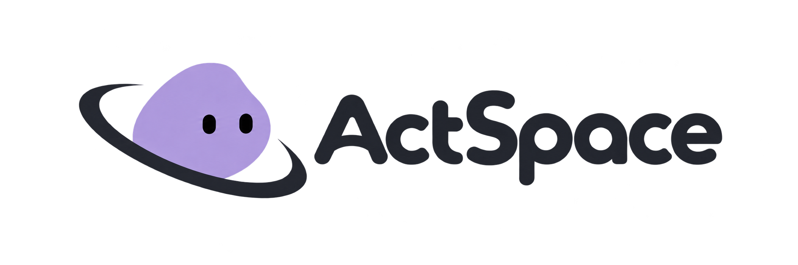
</p>

<p align="center">
  为 DeepSeek 打造的本地 Agent 桌面工作台
</p>

<p align="center">
  <a href="#开始使用">开始使用</a> ·
  <a href="#架构设计">架构设计</a> ·
  <a href="docs/design-docs/index.md">设计文档</a> ·
  <a href="#许可证">MIT</a>
</p>

<p align="center">
  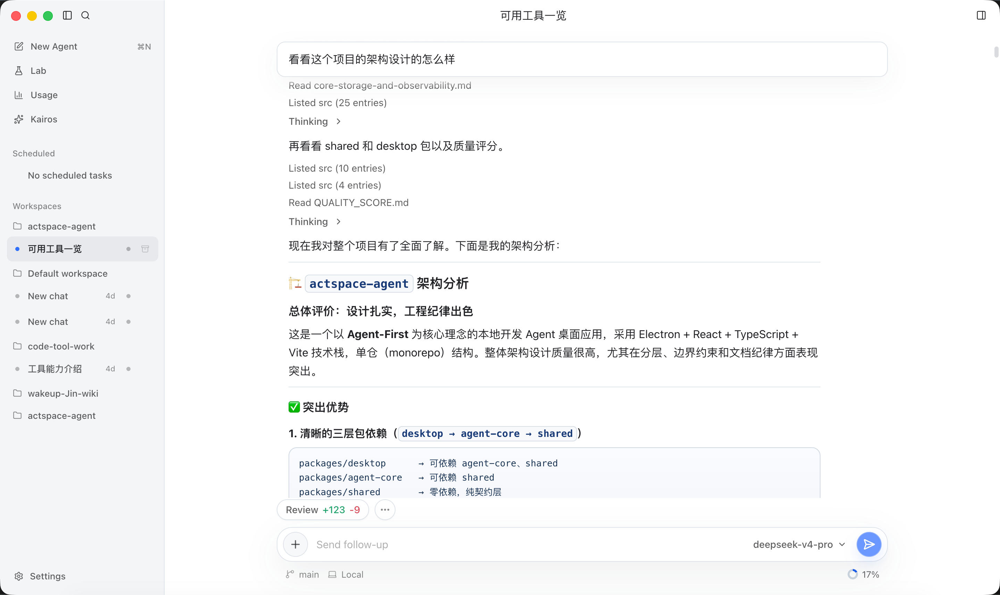
</p>

## 什么是 Actspace

Actspace 是一个为适配 DeepSeek 打造的本地 Agent 桌面应用。其构建了一套Agent Harness，目的是让DeepSeek能够获取更多的上下文，做更多的事情

它遵循三条原则：**简约优雅 · 上下文的绝对控制 · 为 DeepSeek 适配**（尤其是缓存利用，降低成本）。

## 核心特性

- **被动与主动，两种 Agent**——New Agent 被动响应你的指令；Kairos 主动自治运行，拥有独立 prompt、短期记忆、tick 调度和专属监控页。
- **上下文绝对控制**——token usage、context snapshot、每会话 `context-state.json`，你随时知道模型的上下文里有什么、花了多少、缓存命中了多少。
- **为 DeepSeek 而生**——上下文管线围绕 DeepSeek 的缓存机制设计，最大化缓存命中、最小化成本；Kimi 可作为联网搜索与多模态的辅助能力。
- **执行可视化**——每个工具调用都有独立预览：文件 diff、Bash 输出、权限审批、运行状态，不靠日志猜。
- **工具：被添加，也能自构建**——内置文件读写、Grep / Glob、Bash 等开发者添加的工具；Agent 也能依托 Lab 实验台，根据实际任务自己构建工具。
- **用 Agent 改造它自己**——借助 harness 工程，项目的全部上下文（功能设计规范、开发历史、执行计划、设计原则）都以文档沉淀在 `docs/`。你可以直接用 Codex / Claude Code 按自己的想法改造源码，自定义性和开放性都很强。
- **本地优先**——会话、记忆、事件流全部以 jsonl 落盘，可迁移、可审计、可追溯。

## 开始使用

```sh
git clone https://github.com/WakeUp-Jin/actspace-agent.git
cd actspace-agent
pnpm install
cp .env.example .env   # 填入 DEEPSEEK_API_KEY（可选 KIMI_API_KEY）
pnpm dev
```

打包当前平台的桌面应用：

```sh
pnpm package:desktop   # 产物输出到 dist/
```

## 截图

<table>
  <tr>
    <td align="center">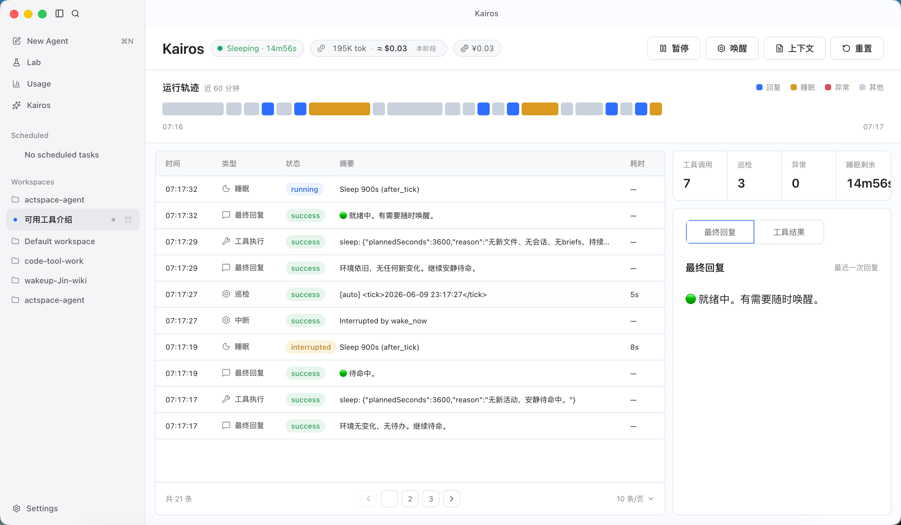<br><sub>Kairos 自治监控</sub></td>
    <td align="center">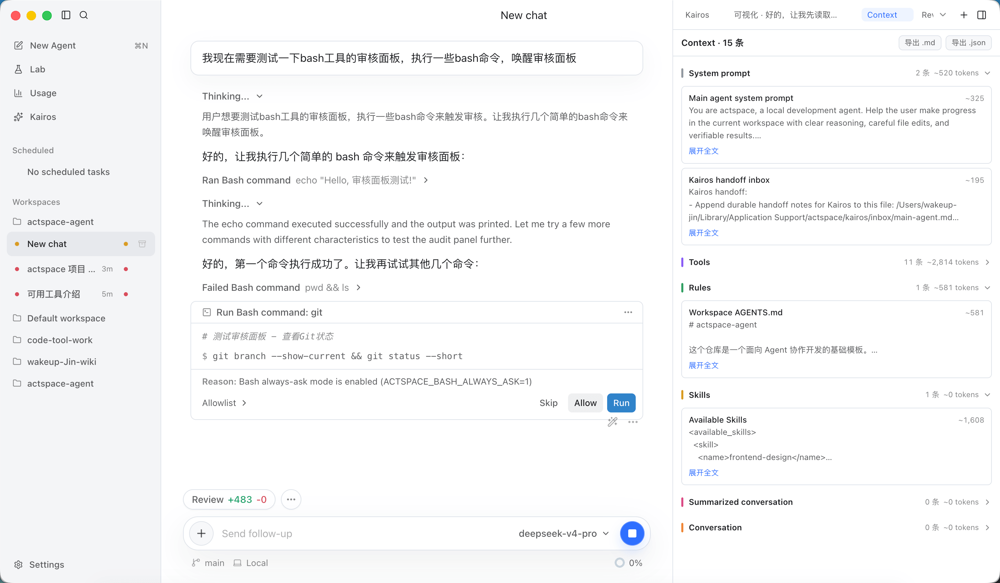<br><sub>工具执行与审批</sub></td>
  </tr>
  <tr>
    <td align="center">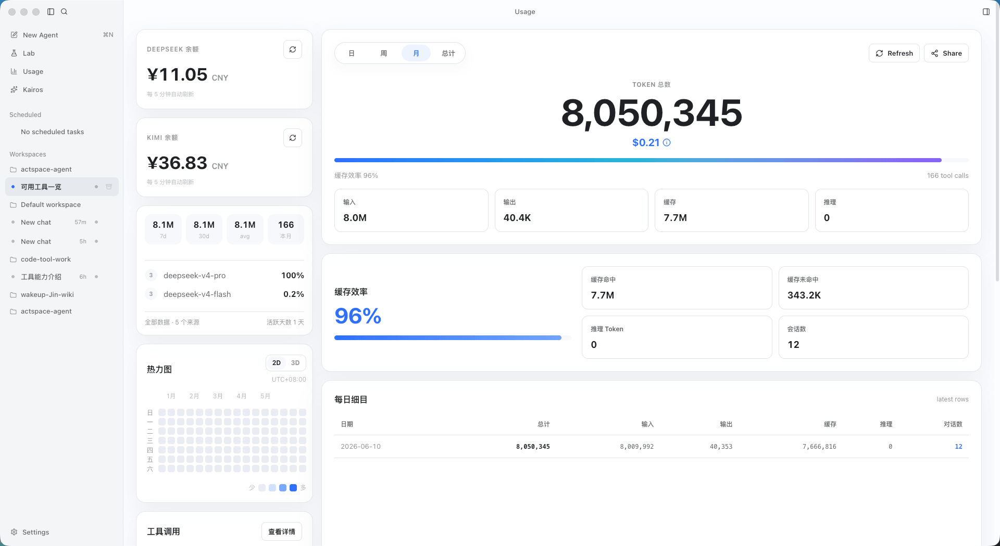<br><sub>Usage 与缓存统计</sub></td>
    <td align="center">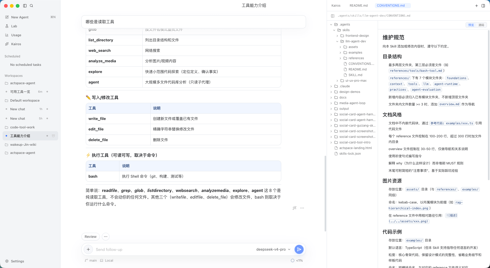<br><sub>文件预览</sub></td>
  </tr>
  <tr>
    <td align="center">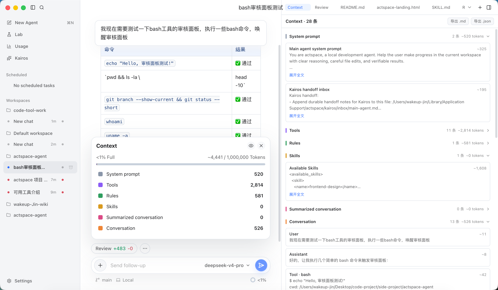<br><sub>上下文控制与可视化</sub></td>
    <td align="center">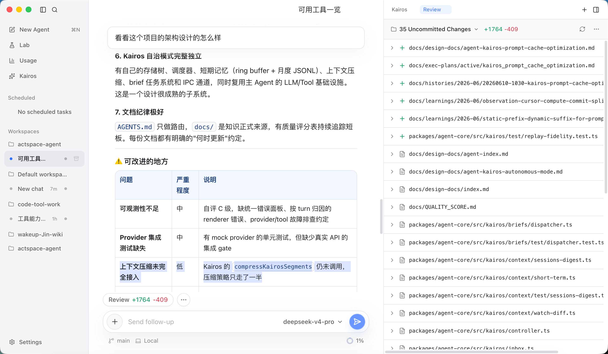<br><sub>Review</sub></td>
  </tr>
</table>

## 架构设计

<p align="center">
  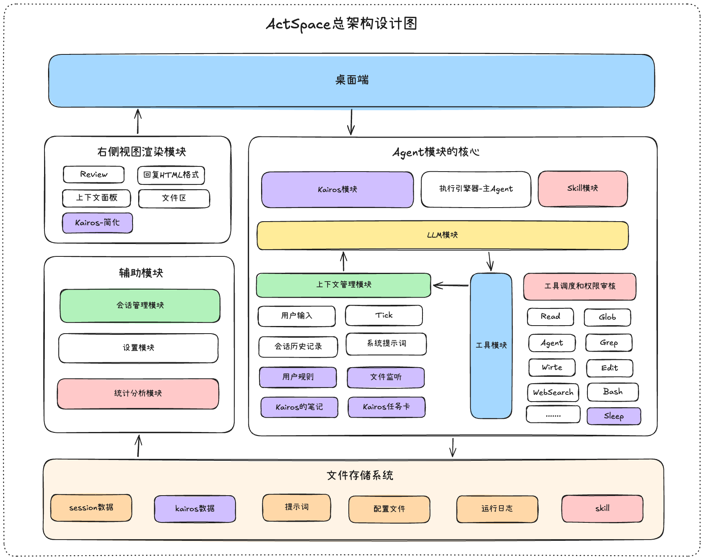
</p>

<table>
  <tr>
    <td align="center">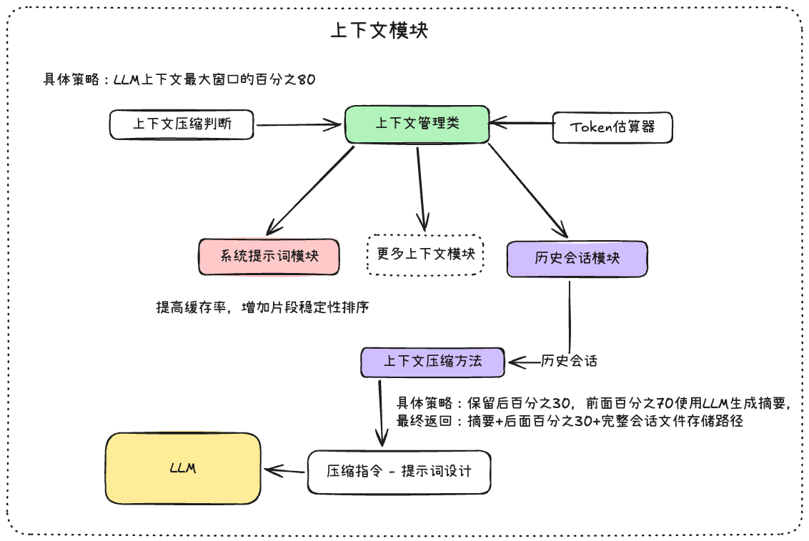</td>
    <td align="center">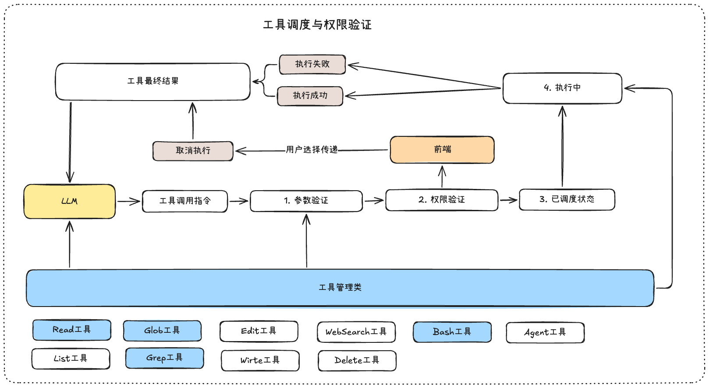</td>
  </tr>
  <tr>
    <td align="center">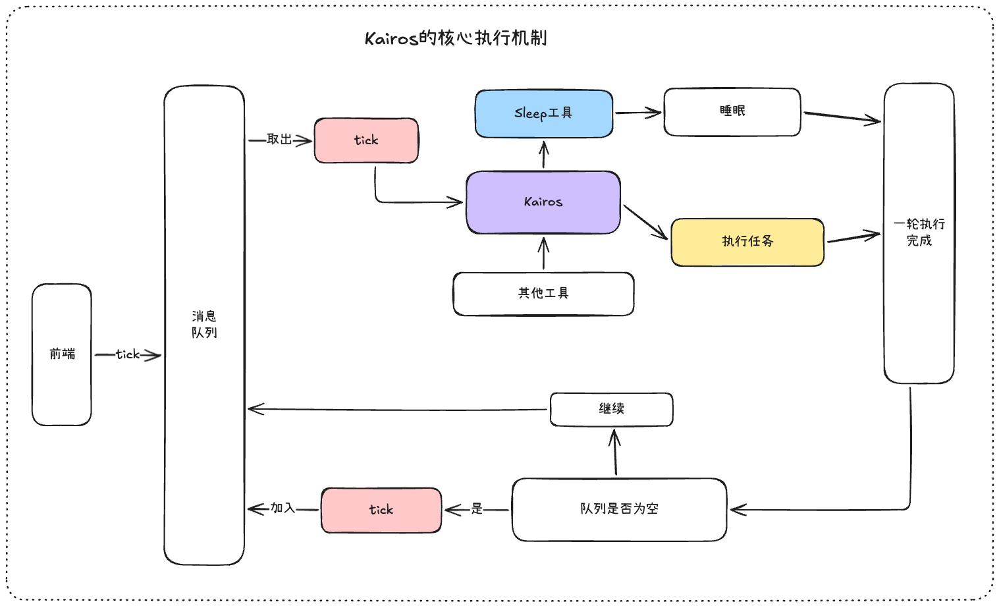</td>
    <td align="center">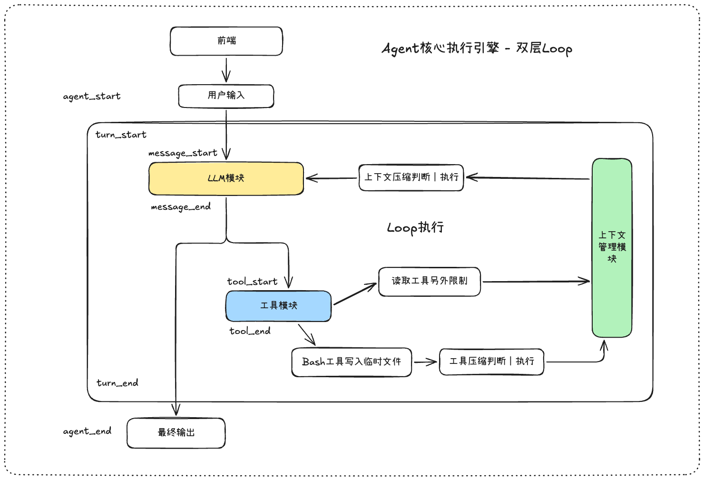</td>
  </tr>
</table>


所有架构事实与设计决策都以文档形式版本化在仓库里：

- [架构总览](docs/ARCHITECTURE.md)——包边界、依赖方向和阅读路线。
- [KAIROS模式](https://github.com/WakeUp-Jin/Practical-Guide-to-Context-Engineering/blob/main/docs/Agent%E8%BF%90%E8%A1%8C%E7%A9%BA%E9%97%B4/%E8%AE%A9Agent%E4%BB%8E%E8%A2%AB%E5%8A%A8%E5%8F%98%E4%B8%BA%E4%B8%BB%E5%8A%A8%EF%BC%9A%E5%AE%9A%E6%97%B6%E4%BB%BB%E5%8A%A1%E5%92%8CKAIROS%E6%A8%A1%E5%BC%8F.md)——定时任务和KAIROS模式
- [设计文档索引](docs/design-docs/index.md)——全部 core / agent / front / lab 专题。
- [LLM模块的设计](https://github.com/WakeUp-Jin/Practical-Guide-to-Context-Engineering/blob/main/docs/LLM%E6%A8%A1%E5%9D%97/%E5%AD%A6%E4%B9%A0%E5%92%8C%E6%95%B4%E7%90%86PI%E7%9A%84LLM%E6%A8%A1%E5%9D%97.md)——学习和整理Pi的LLM模块设计
- [工具调度的设计](https://github.com/WakeUp-Jin/Practical-Guide-to-Context-Engineering/blob/main/docs/%E5%B7%A5%E5%85%B7%E7%AE%A1%E7%90%86%E6%A8%A1%E5%9D%97/%E5%B7%A5%E5%85%B7%E8%B0%83%E5%BA%A6%E4%B8%8E%E6%9D%83%E9%99%90%E6%A8%A1%E5%9D%97%E7%9A%84%E5%BC%80%E5%8F%91.md)——参数验证、权限验证、工具调度、工具执行、已取消、执行成功、执行失败
- [为你的 Agent 集成 Skill 系统](https://github.com/WakeUp-Jin/Practical-Guide-to-Context-Engineering/blob/main/docs/%E5%B7%A5%E5%85%B7%E7%AE%A1%E7%90%86%E6%A8%A1%E5%9D%97/%E4%B8%BA%E4%BD%A0%E7%9A%84Agent%E9%9B%86%E6%88%90Skill%E7%B3%BB%E7%BB%9F.md)——开发的核心步骤：发现、解析、使用、管理
- [上下文管理](https://github.com/WakeUp-Jin/Practical-Guide-to-Context-Engineering/blob/main/docs/%E4%B8%8A%E4%B8%8B%E6%96%87%E7%AE%A1%E7%90%86/%E4%B8%8A%E4%B8%8B%E6%96%87%E5%8E%8B%E7%BC%A9%E8%B0%83%E5%BA%A6%EF%BC%9A%E5%B7%A5%E5%85%B7%E8%A3%81%E5%89%AA%E4%B8%8E%E5%8E%86%E5%8F%B2%E8%AE%B0%E5%BD%95%E5%8E%8B%E7%BC%A9.md)——目前的压缩机制主要是两种策略：工具输出的结果裁剪和压缩、会话历史记录的压缩

## 一些闲谈
<p align="center">
  
</p>

我很喜欢市面上的很多 Agent 产品，想法和设计都很棒。真心感谢每一个在背后付出的团队和开发者。

大模型应用还在快速发展，我特别希望有一个能够按照我自己想法构建的东西。

DeepSeek 的成本很低并且理念很好，让我可以放心地围绕模型去构建应用，而不必担心模型的成本、真实性和可靠性。让我这个工程师很安心，不用担心源头，而专注于这种力量的应用构建。
   
这个应用有很多的不足，但是我相信随着日常的使用，许多bug会被修复，许多新功能会产生，会完善，无论应用如何变化，我希望可以为这个应用保持**简约优雅，执行可视化，上下文可控性**

<hr/>

<p align="center">「不诱于誉，不恐于诽，率道而行，端然正己。」</p>

## 致谢

- [上下文工程与运行空间实践指南](https://github.com/WakeUp-Jin/Practical-Guide-to-Context-Engineering)——本项目的方法论参考。
- [agent-harness-dev](https://github.com/WakeUp-Jin/agent-harness-dev) -- 一份指导开发者如何无框架从0构建 Agent 后端的架构规范的skill
- [code-develop-harness-init](https://github.com/WakeUp-Jin/code-develop-harness-init)--面向 Agent-first 开发的基础模板
- [Linux.Do 社区](https://linux.do/latest) (真诚 、友善 、团结 、专业)
- Linux.Do社区佬友们的公益站大力支持和帮助，充足的Token得以让该项目可以实现Agent原生开发，并且快速构建


## 许可证

[MIT](LICENSE)
