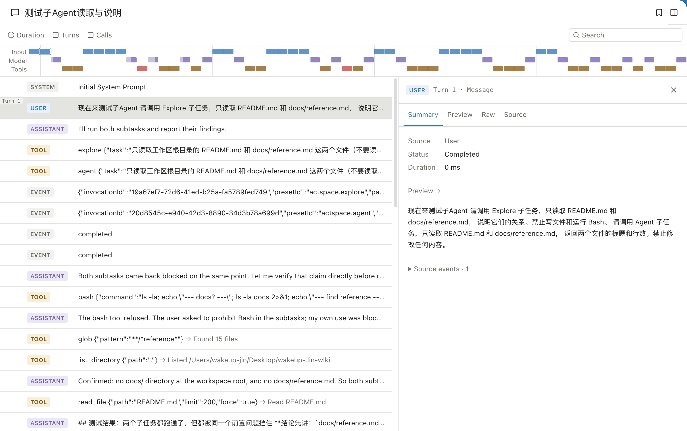

一次用户任务可能包含多次模型请求：模型先读取已有上下文，决定调用工具，拿到结果后再继续推理，直到给出最终答复、失败或停止。

## 从输入开始

桌面界面收集文字、附件、工作区、模式和模型选择，通过主进程交给运行时。主进程负责本机能力和凭据，界面不直接访问文件系统。

运行时将用户输入写入会话记录，构建模型实际使用的上下文，再发起请求。每次请求都可能有独立的用量和上下文快照，便于事后检查。

## 工具如何进入循环

1. 模型提出工具调用。
2. 工具系统校验参数、权限和工作区范围。
3. 需要审批时暂停，等待用户决定。
4. 执行后将成功、失败或取消结果记录并交回模型。
5. 模型依据结果继续，或结束本次任务。

工具返回失败是执行事实的一部分。最终回复是否解决了问题，需要结合工具结果、文件差异和测试记录判断。

## 记录与观察

Session Journal 保存可恢复的运行事实，界面据此呈现消息、工具、用量和上下文。压缩会替换后续请求使用的部分历史摘要，但保留原始 Journal。

在会话顶部切换到 Trajectory，可以沿时间线搜索执行记录，选中工具后检查参数与结果。切回 Chat 后继续原任务。

用户需要检查任务时，可以看工具详情、[上下文](../context/)和[审阅](../review/)。开发者继续追踪实现，可从仓库的 `docs/ARCHITECTURE.md` 和 Agent Run 分层文档进入。

*会话时间线、执行记录与选中的用户消息详情。*

## 停止与恢复的边界

停止会阻止当前任务继续推进，但不会撤销已经产生的效果。应用恢复会话记录也不等于恢复之前所有活跃进程，终端与后台命令应单独确认状态。
