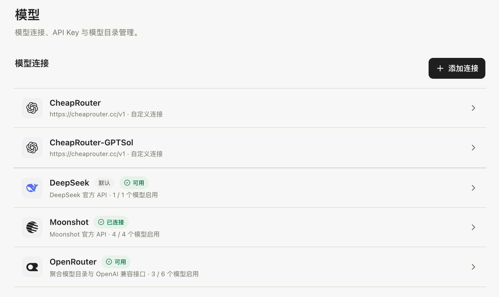

ActSpace 使用你配置的模型服务。桌面应用的连接参数在设置中管理，CLI 使用自己的启动环境；两者的配置入口不同。

## 添加服务商连接

1. 打开“设置 → 模型”，进入连接管理，点击“添加连接”。
2. 选择服务商，填写 API Key；需要兼容接口时同时确认接入地址。
3. 如果该服务商需要代理，配置它自己的代理地址并启用。
4. 保存后添加或启用模型，回到聊天输入框选择它。

可用连接和模型以当前设置界面的目录为准。DeepSeek、Kimi、OpenRouter 等连接各有凭据，连接成功不代表所有模型都已启用。

*模型连接列表与连接状态。*

## 添加与启用模型

模型目录用于发现候选模型。添加后确认模型处于启用状态，并绑定了可用的连接；聊天选择器只显示适用于当前用途的候选项。自定义模型 ID 需要与服务商接受的 ID 一致。

应用区分默认对话模型、辅助任务模型和子任务模型。设置完成后继续阅读[模型选择与思考设置](../model-selection/)。

## 连不上时检查什么

- 候选列表为空：检查是否已经添加、启用模型，以及连接是否可用。
- 认证失败：检查 API Key、连接和服务商账户权限。
- 模型不存在：核对模型 ID 和接入地址是否属于同一套服务。
- 超时或连接失败：检查网络及该连接自己的代理配置。

## 凭据保存在哪里

桌面应用由主进程将凭据写入应用数据目录中的 `secrets.json`，文件权限为 `0600`。它是本机明文凭据文件，不要加入 Git 或作为排障附件上传。模型密钥不会写入聊天记录；桌面应用不读取仓库 `.env` 中的 provider Key。

移除服务商会清理连接参数和密钥，但保留已添加模型、历史会话及用量记录。相关模型在重新配置连接前会不可用。
