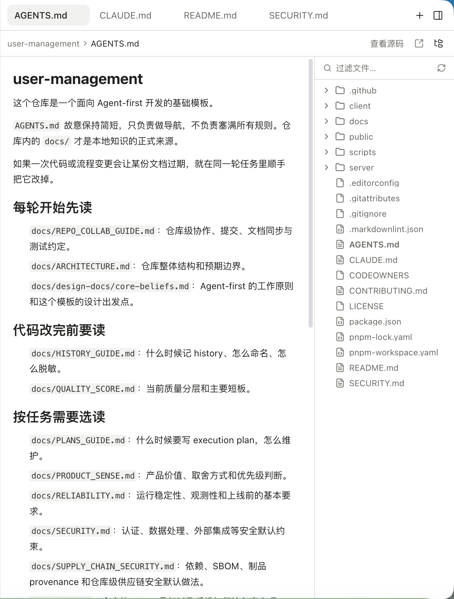

右侧工作台用标签页承载文件、代码审阅、终端和上下文等对象。你可以从工具记录或文件树打开内容，边看结果边继续对话。

## 打开文件

展开右侧面板，从工作区文件入口浏览目录并选择文件。Read、Write、Edit 等工具记录里的文件入口也可以直接打开对应对象。

再次打开同一个对象时，优先回到已有标签页，便于保留当前阅读位置。面板宽度可以按工作需要调整。

## 支持的预览

源码文件以代码形式查看，Markdown 用排版后的文档阅读，图片直接预览；HTML 可以在受隔离的预览环境中展示。生成的图片和其他会话产物也能从消息入口打开。

HTML 预览并不等同于完整开发服务器。页面依赖应用服务、外部网络或特殊权限时，仍可能需要启动项目并在浏览器中检查。

*文件页签、Markdown 预览与工作区文件树。*

## 预览与审阅

文件预览用于阅读当前内容，检查修改前后差异请进入[代码审阅](../review/)。手动执行命令则打开[交互式终端](../terminal/)。

如果文件未找到，确认当前会话的实际目录。Worktree 与原仓库是不同的文件夹，同名文件也可能内容不同。
