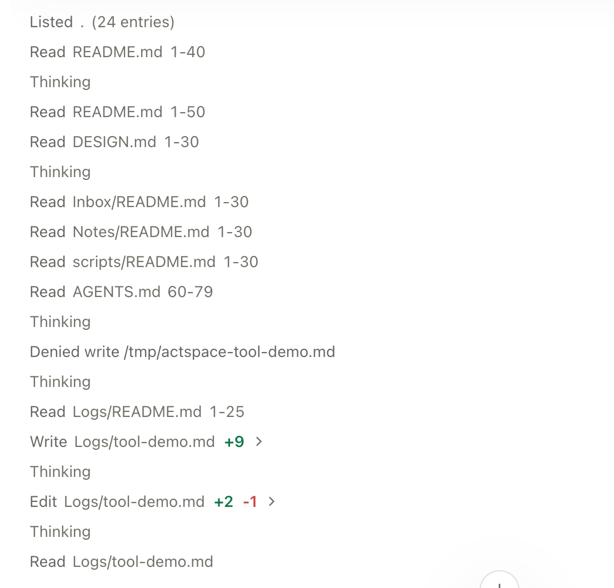

先完成[模型连接](../configure-a-model/)，准备一个示例项目。第一项任务可以只读，确认工作区和模型都可用后再让 Agent 修改文件。

## 先了解项目

新建会话，确认输入框下方的工作区目录和模型，选择 Plan 模式，输入：

> 阅读 README 和项目配置，告诉我这个项目如何启动、测试，以及主要目录各自负责什么。先给出结论，不修改文件。

发送后可以展开读取、检索等工具记录，检查它实际访问了哪些文件。模型只凭已有对话回答和实际读取项目是两种不同的过程，工具记录能帮助你确认依据。

## 再完成一个小改动

切换到 Agent 模式，说明具体目标和验收标准。例如：

> 根据刚才的启动方式，补充 README 中缺失的本地测试说明。只修改 README，完成后给出修改摘要。

如果出现审批请求，检查工具名称、路径和命令，再决定允许还是拒绝。拒绝后可以补充新的约束，或让 Agent 换一种方法。

*读取、写入与编辑记录，以及一次被拒绝的写入。*

## 检查结果

点击工具记录中的文件入口，或从右侧打开[代码审阅](../review/)。检查差异是否符合任务范围；需要运行测试时，可继续交给 Agent，或自己打开[终端](../terminal/)。最终回复中的“已完成”不代替你对文件和测试结果的检查。

任务仍在运行时可以停止。停止会结束当前执行，但不会自动撤销已经写入的文件。要尝试另一种方向，可以[分支会话](../sessions/)，并按需要使用独立 Worktree 隔离后续文件改动。

<figure class="product-shot screenshot-placeholder" data-screenshot="review-diff.png">
<figcaption>待补实拍 · 04<strong>Review 文件差异</strong><code>review-diff.png</code>
完成小修改后打开右侧 Review，选择有实际差异的范围
</figcaption>
</figure>
