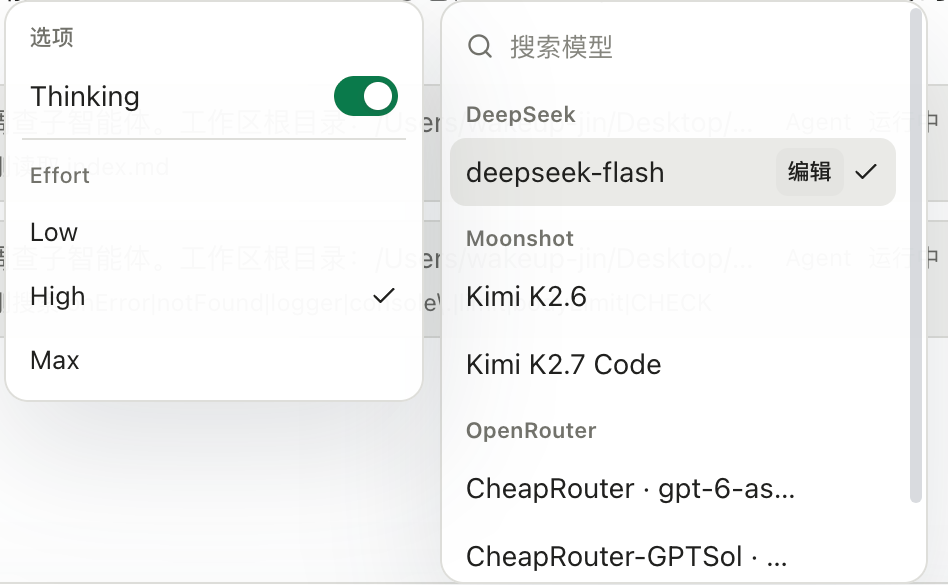
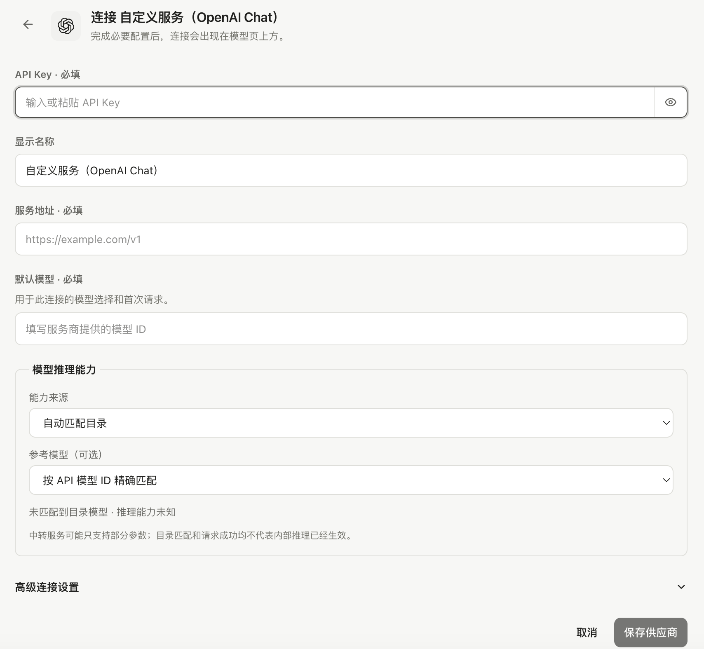

服务商连接决定请求从哪里发出，模型选择决定这次请求使用哪个模型。先完成[配置模型](../configure-a-model/)，再根据任务调整。

## 当前对话与默认模型

输入框中的模型选择作用于当前会话的后续请求。要改变新会话的默认选择，在“设置 → 通用”中修改默认对话模型。临时切换当前模型不会自动覆盖全局默认值，也不会重新生成已完成的历史回复。

一个模型是否出现，取决于它是否已安装、启用、具备当前用途所需能力，以及绑定的连接是否可用。

*当前模型及 Thinking、Effort 菜单。*

## 思考开关和档位

支持推理配置的模型会显示相应的 Thinking 或 Effort 选项。可选值由模型能力决定，不同服务商未必提供相同档位；没有出现某个控件，不应理解为应用会自动替你开启它。

更高的思考档位可能增加等待时间和用量。调整后用一个明确的小任务观察结果，再通过[使用统计](../usage/)查看实际请求。

## 自定义模型的推理配置

在模型连接详情中编辑自定义模型，可以参考已知模型的能力，或手动设置推理支持、可选档位、默认值和关闭方式。保存后回到输入框检查可选档位；实际支持范围以所连接服务为准。

*自定义连接表单中的模型推理能力配置入口（尚未填写）。*

## 辅助任务和子任务

标题、摘要、上下文压缩等辅助工作可以使用单独的模型用途配置。子 Agent 的模型在对应设置中管理，不能仅从主会话选择器判断所有请求用了什么模型。

查看具体请求时，以使用统计和上下文快照中的记录为准。旧请求的模型和费用记录不会因为你今天修改了默认模型而重写。
