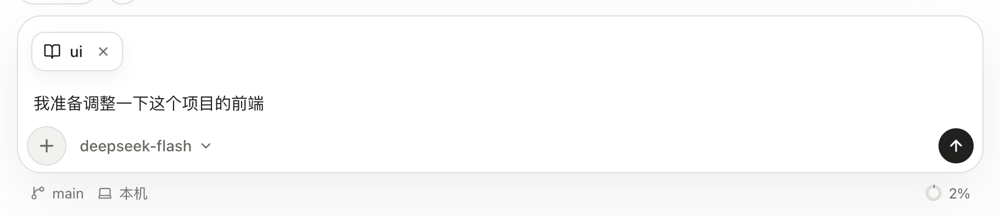

输入框把任务描述、模型、模式和附件放在一起。发送之前，先确认工作区和模式符合这次任务。

## 三种模式

| 模式 | 适合的任务 | 工具范围 |
| --- | --- | --- |
| Chat | 根据已有对话讨论、解释和改写 | 不向模型开放执行工具 |
| Plan | 阅读项目、定位问题、制定修改方案 | 使用只读工具 |
| Agent | 修改文件、执行命令、完成任务 | 在权限检查和审批约束下执行 |

这些模式决定本轮可用能力。Plan 模式下写一句“请直接改文件”，不会因此获得写入工具；要执行方案，需要切换到 Agent。

## 附件和 Skill

将文件拖入输入框，或使用附件入口。图片会显示缩略图，其他文件显示文件项；发送前可以移除。附件的可用方式取决于文件类型和模型能力，图片的具体路径见[图片理解与生成](../images/)。

需要按既有流程处理任务时，可以选择 [Skill](../skills/)。仍建议在正文里说清楚这次要处理的对象和预期结果。

*在输入框选择 ui Skill 并准备任务。*

## 命令、历史和草稿

在输入框输入 `/` 打开命令菜单。`/compact` 用于压缩当前会话上下文，具体见[上下文与压缩](../context/)，不需要把它作为普通任务再解释一遍。

输入框为空时，方向键上可以找回已发送的文字，方向键下往回浏览。输入历史只复用文字，不会重新绑定原来的附件。不同会话的未发送草稿在应用运行期间分别保留；需要长期保存的内容请写到文件里。
