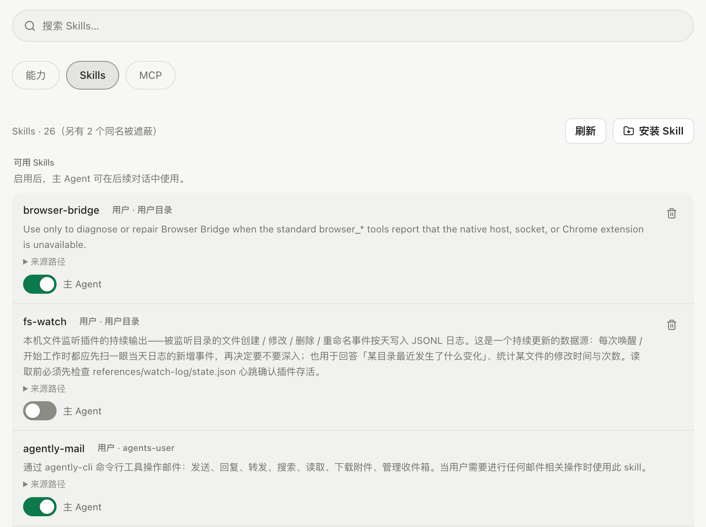

Skill 是一个包含 `SKILL.md` 的目录，用来保存任务说明、参考材料和脚本。适合复用团队约定、报告格式或重复操作流程。

## 创建一个项目 Skill

在工作区中创建 `.agents/skills/project-guide/SKILL.md`：

```markdown
---
name: project-guide
description: 阅读项目结构并整理启动与测试方法时使用。
---

先读取 README 和项目配置。
列出启动命令、测试命令和主要目录。
无法从文件确认的内容直接标明，不猜测。
```

`name` 和 `description` 是发现 Skill 所需的信息。较长的材料可以放入相邻 `references/`，脚本放入 `scripts/`，由说明文件指出何时读取或执行。

## 放在哪个目录

项目目录支持 `.actspace/skills/`、`.agents/skills/` 和 `.claude/skills/`。用户级目录还包括应用数据目录下的 `skills/`、`.actspace/skills/`，以及用户主目录下的 `.agents/skills/`、`.claude/skills/`。

同名 Skill 按扫描优先级保留一个版本，项目级优先于用户级。每个 Skill 应直接放在扫描根的一级子目录中，避免额外嵌套导致无法发现。



*Skills 搜索、安装入口与启用开关。*

## 在任务中使用

在输入框选择 Skill，或在任务中明确指出要使用的 Skill 和处理对象。Agent 先看到简短描述，需要时才读取完整说明和参考材料，避免每次请求都带入所有内容。

Skill 中写出的要求不会自动扩大工具权限。脚本仍要通过工具执行，受[模式与审批](../tools-and-approvals/)约束。找不到 Skill 时，检查目录层级、文件名和 frontmatter，确认当前会话使用的是正确工作区。


*在输入框选择 ui Skill 并准备任务。*
