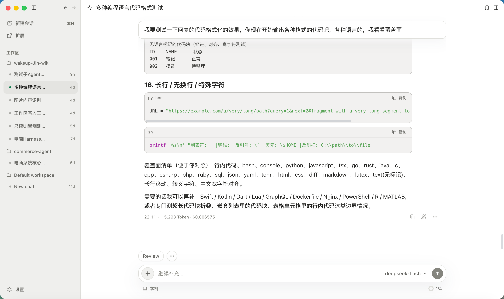

ActSpace 是一个桌面 Agent 应用。选定本地目录、连接模型后，你可以让它理解项目、修改文件、执行命令，再回到工作台检查结果。会话记录保存在本机；模型请求会发送到你配置的服务商。

## 从第一项任务开始

1. 按[快速开始](../getting-started/)启动应用。
2. 在[模型设置](../configure-a-model/)中连接服务商，并启用一个对话模型。
3. 打开工作区，新建会话，描述想完成的任务。
4. 查看工具执行过程，在需要时批准操作，并检查生成的文件或代码差异。

第一次可以从“读一下这个项目，说明启动方式和主要目录”开始。具体操作见[完成第一个任务](../first-task/)。

*工作区、会话列表与代码回复。*

## 按任务查找功能

| 你想做什么 | 阅读入口 |
| --- | --- |
| 选择目录、隔离代码改动、继续之前的任务 | [工作区与 Worktree](../workspaces/)、[会话管理](../sessions/) |
| 切换模型、了解上下文和费用 | [模型选择](../model-selection/)、[上下文与压缩](../context/)、[使用统计](../usage/) |
| 读写文件、运行测试、收集网络资料 | [文件工具](../files-and-search/)、[Bash](../bash/)、[联网工具](../web-tools/) |
| 审阅变更、预览文件、手动运行命令 | [代码审阅](../review/)、[文件预览](../file-preview/)、[交互式终端](../terminal/) |
| 复用工作流程、委派研究、练习英语 | [Skills](../skills/)、[子 Agent](../subagents/)、[英语辅助学习](../english-learning/) |

## 当前能力范围

当前文档介绍 v2 桌面应用和 CLI。内置子 Agent 用于只读检索与分析；博客中的 Agent Team、Agent Room、Kairos、记忆和评估模块文章包含历史探索或独立项目设计，不表示这些能力已成为桌面应用入口。

遇到连接或执行问题时，先看[常见问题](../troubleshooting/)。需要修改 ActSpace 本身，进入[开发与贡献](../contributing/)。
