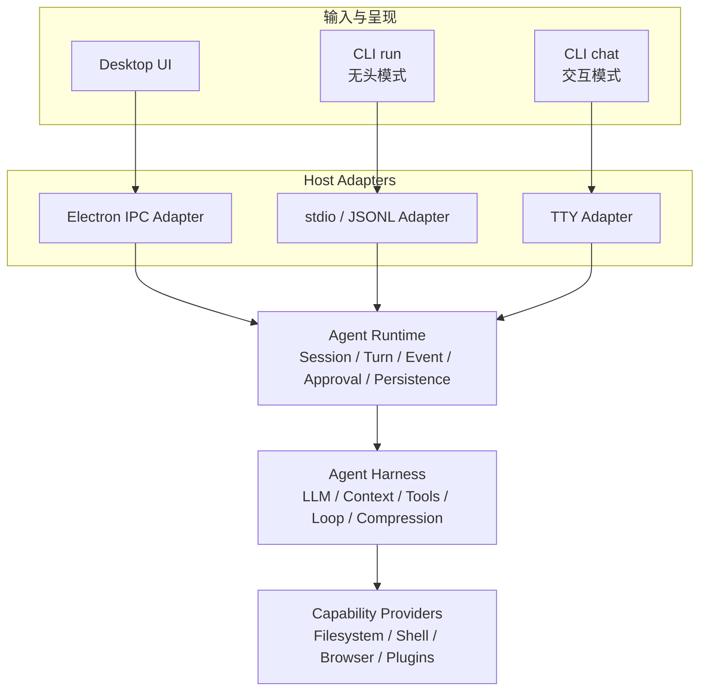

# Agent 宿主无关 Runtime 与 Desktop / CLI 设计规范

状态：已实现（2026-07-31）；Web / Voice Adapter 仍为后续范围

最后更新：2026-07-31

## 1. 文档目的

这份文档定义 ActSpace Agent 如何从当前以 Desktop Main 为主要生产宿主的形态，演进为“一套 Agent 后端、多个输入与呈现端”的架构。

当前阶段只把以下两个客户端作为一等实现目标：

- Desktop：保留现有 Electron 产品体验。
- CLI：同时提供无头 `run` 模式和交互式 `chat` 模式。

Web 暂不进入本轮实现。设计只保留未来接入所需的宿主无关边界，不提前定义 HTTP、WebSocket、认证、远程 Runner 或多用户协议。

## 2. 背景与现状

`packages/agent-core` 已经包含可复用的 Agent Harness：LLM 服务、Context、Tools、Agent Loop、压缩、持久化基础和事件转换，并且不依赖 Electron。

当前缺失的是一层明确的宿主无关 Agent Runtime。生产级 Turn 编排主要集中在 `packages/desktop/src/main/agent-turn.ts`，包括：

- session 恢复和本轮输入落盘；
- runtime context、AGENTS.md、Skills、模式和 Browser Bridge 装配；
- 动态模型与凭据解析；
- workspace / worktree 准备及失败回滚；
- 审批等待、Abort 和活动 Turn 注册；
- 流式事件转发；
- Turn 结果、Context State 和标题持久化；
- ToolManager 清理与运行日志。

原有 `packages/agent-cli` 曾直接构造 `Agent` 并执行一次 `Agent.run()`。当前 `run` 与 `chat` 都经 `createAgentHostRuntime()` 执行；CLI Adapter 只负责进程、TTY、输出、审批和数据根映射。

因此，这次演进不是重写 Agent Harness，也不是为 CLI 新建第二套 Agent 引擎，而是把 Desktop 中已经验证过的 Runtime 原型提取成可被不同 Host Adapter 复用的正式边界。

## 3. 设计目标

### 3.1 核心目标

1. Desktop 与 CLI 使用同一个 Agent Harness 和同一个 Turn Runtime。
2. 宿主差异只通过显式 Adapter 和 Port 表达，不通过 Runtime 内的 `if electron` / `if cli` 分支表达。
3. `run`、`chat` 和 Desktop 对同一输入采用一致的 Context、Tool、模型与事件语义；差异必须来自显式 Runtime Profile。
4. CLI 无头模式形成稳定的机器接口，可被脚本、CI 和外部评估框架当作黑盒 Agent 调用。
5. 保持 Desktop 现有行为，采用渐进式迁移，不进行大爆炸式替换。
6. 为未来 Web、Voice、Plugin UI 留出接入边界，但不为未确认产品形态预建网络层。
7. 在 `run` 和 `chat` 契约稳定后，为每个目标平台交付一个不要求用户预装 Node.js 或 pnpm 的 CLI 可执行文件。

### 3.2 非目标

- 不重写 `Agent`、`runAgentLoop()`、ToolScheduler 或 LLM provider。
- 不重新设计 Desktop Renderer UI。
- 不在第一版 CLI 中实现全屏 TUI。
- 不把外部评估框架、数据集或评分器逻辑放入 `agent-core`。
- 不把 `actspace-agent-eval` 合并回主仓库。
- 不实现云端 Runner、远程会话、多用户、Web Gateway 或 Voice。
- 不在边界尚未稳定前拆出大量新 package。
- 不承诺“零系统依赖”；Shell、Git、系统沙箱和其他外部能力仍按平台探测并明确报告。

## 4. 目标架构



目标依赖方向：

```text
packages/desktop   ----┐
                       ├──> packages/agent-core/runtime
packages/agent-cli ----┘                  |
                                           v
                              packages/agent-core/harness
                                           |
                                           v
                                  packages/shared
```

`packages/shared` 继续只承载跨包、跨进程需要共享的稳定数据契约，不承载运行逻辑。`packages/agent-core` 不得导入 Electron、TTY 或任意外部评估框架。

## 5. 分层职责

### 5.1 Client

Client 只负责用户输入和状态呈现：

- Desktop Renderer 呈现消息、工具、审批和会话。
- CLI `run` 接收一次任务，输出最终结果或结构化事件。
- CLI `chat` 维护终端交互循环，呈现流式内容和审批问题。

Client 不直接创建 LLM、不恢复 Agent Context、不执行工具，也不决定持久化成功与否。

### 5.2 Host Adapter

Adapter 把宿主能力翻译成 Runtime Port：

- 输入解析和 Runtime Request 构造；
- 模型、凭据和本机配置解析；
- 流式事件投递；
- 审批交互；
- 进程或应用生命周期信号；
- Runtime 结果到 IPC、stdout、stderr 或终端组件的呈现。

Adapter 可以拥有宿主专属能力，例如 Electron `BrowserWindow`、Node `process.stdin` 或 TTY readline，但这些对象不能进入 `agent-core`。

### 5.3 Agent Runtime

Runtime 是这次新增的一等应用层，负责完成一轮可运行、可取消、可持久化的 Agent Turn：

1. 校验 Request 和活动 Turn 约束。
2. 解析本轮 workspace 和执行环境。
3. 恢复持久会话，或创建临时会话上下文。
4. 调用 Context Provider 和 Model Resolver 装配 Harness。
5. 注册审批、Abort、运行日志和流式事件出口。
6. 在需要时先持久化用户输入和 workspace preparation 事实。
7. 调用现有 Harness 执行本轮。
8. 按持久化策略提交结果。
9. 只在提交成功后发出成功终态事件。
10. 清理审批、活动 Turn、工具和子进程资源。

Runtime 不负责如何画 UI、如何读取 Electron Settings，也不判断评估 Task 是否通过。

### 5.4 Agent Harness

Harness 是 Agent 的能力内核，继续由现有模块构成：

- LLM Service / Registry；
- System Prompt 和 Context Manager；
- ToolManager / ToolScheduler / ApprovalGate；
- `Agent` 和 `runAgentLoop()`；
- Context Compression、Usage 和 Cache Audit；
- `runTurnWithAgent()` 对内部事件与产品 Turn 结果的映射。

Harness 接收已经解析好的依赖和策略，不知道当前调用来自 Desktop 还是 CLI。

### 5.5 Capability Provider

Filesystem、Shell、Browser Bridge、图片、Web Search、Plugins 等能力由运行环境提供。某个 Host 没有对应能力时，应通过 Runtime Profile 明确不暴露，而不是注册一个注定失败的伪工具。

例如一个没有用户真实 Chrome 的 CLI 执行环境不应暴露依赖本机 Browser Bridge 的工具；这不影响 Filesystem 和 Shell 工具继续工作。

## 6. Runtime 核心契约

### 6.1 Runtime 实例

第一版在 `packages/agent-core/src/runtime/` 内提供实例化 Runtime，而不是新增 package。概念接口如下，最终命名可在实现阶段按现有导出风格微调，但职责不得漂移：

```ts
interface AgentRuntime {
  runTurn(request: RuntimeTurnRequest): Promise<AgentTurnResult>;
  abortTurn(ref: { sessionId: string; turnId: string }): boolean;
  isSessionActive(sessionId: string): boolean;
  dispose(): Promise<void>;
}
```

Runtime 必须是实例级状态。活动 Turn、AbortController 和清理句柄不能继续使用跨实例的模块全局 Map，否则 Desktop、CLI 测试和未来多个 Runtime Host 会互相污染。

### 6.2 Runtime Request

Request 复用现有 `RunTurnInput` 中已稳定的会话、输入、模型、附件、模式和 workspace execution context，不复制第二套字段。Runtime 额外接收以下运行策略：

```ts
type RuntimePersistenceMode = "persistent" | "ephemeral";

type RuntimeInteractionMode =
  | "desktop"
  | "cli-headless"
  | "cli-interactive";

```

- `persistent`：Desktop 和 CLI `chat` 使用 JSONL session store，可恢复历史。
- `ephemeral`：CLI `run` 使用，只在内存中完成本轮；除非显式 `--out`，不写产品会话或评估产物。
- `interactionMode` 只描述 Adapter 能力，不在 Harness 中触发 UI 分支。

### 6.3 Runtime Ports

只为当前真实宿主差异引入以下 Port：

| Port | 责任 | Desktop 实现 | CLI 实现 |
|---|---|---|---|
| `RuntimeContextProvider` | 组装 prompt、AGENTS、Skills、模式和可用能力 | 读取 Electron data root/settings | 读取 CLI config、workspace 和显式环境 |
| `RuntimeModelResolver` | 返回 main / utility / explore 模型与运行配置 | 包装 `ModelRuntimeService` | 环境变量与 CLI 配置解析器 |
| `RuntimeEventSink` | 顺序消费 `RuntimeStreamEvent` | `webContents.send` | text / JSONL / terminal renderer |
| `RuntimeApprovalBroker` | 等待、决策、超时和 Turn 终止 | 包装 `PendingApprovalRegistry` | headless policy 或 TTY broker |
| `WorkspaceExecutionProvider` | 准备或回滚 worktree 等执行上下文 | 复用 Desktop 服务 | CLI V1 只支持直接 workspace |

JSONL session store、Agent run logger 和 Harness 组装已经属于 `agent-core`，第一版直接复用，不为“理论可替换”再包一层空接口。

### 6.4 Context 一致性

当前 `loadMainAgentRuntimeContext()` 的通用装配逻辑应下沉到 `agent-core/runtime`：

- 主系统提示词内容由 Host 注入，不由 core 猜 Electron 路径。
- workspace / user `AGENTS.md`、Skills catalog、selected Skills 和 Agent / Chat / Plan 模式规则由同一个 loader 处理。
- Browser Bridge socket、disabled tools、disabled skills 和额外可写根由 Host Profile 提供。
- Desktop、CLI `run` 和 CLI `chat` 的差异必须能从输入 Profile 中直接解释。

“CLI 调用了同一个 `Agent` 类”不等于运行语义一致。只有 Context、Tools、权限、模型解析和终态行为都经过同一 Runtime，才算真正复用。

## 7. 事件与持久化语义

### 7.1 三类数据

- `AgentEvent`：Harness 内部执行事件，不直接作为外部稳定协议。
- `RuntimeStreamEvent`：Turn 运行中的临时事件，用于 Desktop IPC 和 CLI JSONL；不写入 `session.jsonl`。
- `SessionEvent`：已经提交的持久事实，用于会话恢复和长期投影。

第一版继续复用现有类型，不为了未来 Web 立即增加网络协议 envelope。未来 Gateway 必须在 `RuntimeStreamEvent` 外增加版本和重放 envelope，而不是修改 Harness 事件。

### 7.2 终态提交规则

Runtime 必须保证：

```text
Harness 结束
  -> persistent 模式提交 SessionEvent / transcript / meta / context state
  -> 提交成功
  -> emit turn_finished 或 turn_aborted
```

如果持久化失败：

- 不得报告 `turn_finished`；
- 产生稳定的 `PERSISTENCE_ERROR`；
- 发出 `turn_failed`；
- 保留可诊断日志；
- 返回失败结果或抛出 Runtime Error，Adapter 只能按统一规则映射，不能静默吞掉。

这意味着当前 `runTurnWithAgent()` 中过早产生终态事件的职责需要迁移到 Runtime，且 `writeSessionResult()` 的 `WriteResult` 必须被检查。

### 7.3 事件顺序

单个 Turn 的事件必须保持调用顺序。`RuntimeEventSink` 失败不得改变 Harness 结果，但必须被记录；不能让一个 Renderer 或 stdout 写入失败导致工具重复执行。

## 8. 审批与安全边界

### 8.1 审批 Broker

`ApprovalGate` 继续是 ToolScheduler 的最小接口。Runtime 额外需要显式的 Turn 生命周期能力，以便在 Abort、超时和 dispose 时解决所有 pending Promise。

Desktop Broker 继续通过 IPC 收到用户决策。CLI Interactive Broker 在 TTY 中展示工具、原因、风险和命令，并支持现有决策：`approve_once`、`allow_similar` 和 `deny`；超时与 Abort 由 Broker 生成，不让 ToolScheduler 永久等待。

### 8.2 Headless 权限

无头模式不能假装存在用户审批：

- `yolo`：显式自动审批模式，继续执行 workspace、密钥、网络和工具级硬约束。
- `default` / `trusted`：遇到必须询问的动作时，返回 `APPROVAL_REQUIRED`，不能悬挂，也不能静默批准。

权限模式和隔离环境是两个概念。`yolo` 只决定是否自动审批，不证明命令运行在沙箱中。macOS Host 可以复用现有 Seatbelt；Linux 直接 Host 当前执行在真实环境时，CLI 必须在 stderr 和结构化结果中如实标记，不能描述为 sandbox。需要强隔离的调用方应在容器或其他外层沙箱中启动 CLI。

### 8.3 凭据

- Desktop 继续由 Electron Main 管理凭据：当前使用 main-only `0600` 明文文件，`safeStorage` 仅用于迁移旧版密文。
- CLI 只读取显式配置或允许名单内的环境变量，不扫描、复制或挂载宿主 `.env`。
- 自动化调用方通过显式环境变量注入所需 Key；CLI 只读取模型所需的允许名单。
- Key 不进入 stdout、JSONL、session、trace 或最终回复。

## 9. CLI 产品契约

### 9.1 `actspace-agent run`

`run` 是稳定的无头机器接口，一次进程执行一个任务：

```bash
actspace-agent run \
  --input-file task.md \
  --workspace /workspace \
  --permission-mode yolo
```

输入规则：

- `--input <text>` 与 `--input-file <path>` 互斥；两者都未提供时，非 TTY stdin 才作为默认输入。显式输入不得为探测空 pipe 而等待 stdin EOF。
- `--workspace` 省略时使用启动 CLI 进程时的当前目录，并立即解析为绝对路径；显式提供时仍严格校验可访问目录。当前目录或显式路径都会成为工具和安全策略的根边界。自动化与评估环境建议显式传入，避免调用方工作目录漂移。
- 非 TTY stdin 有内容时可作为默认输入；TTY 下缺输入直接报 usage error。

输出规则：

- 默认：stdout 只输出最终回复，诊断信息写 stderr。
- `--json`：stdout 只输出一个最终结果 JSON。
- `--jsonl`：stdout 按行输出 Runtime Event，最后一行是 `run_result`。
- `--json` 与 `--jsonl` 互斥。
- 只有显式 `--out` 才写 `result.json`、`trace.jsonl`、`final-response.md` 和 context snapshots。
- 非 TTY 或结构化输出下禁止 ANSI 和进度动画。

进程退出码只描述 Agent Runtime 是否正常完成，不代表外部任务测试或评分是否通过：

| 退出码 | 含义 |
|---|---|
| `0` | Runtime 正常完成，Agent 得到正常终止回复 |
| `1` | Agent Turn 以 failed 状态结束 |
| `2` | CLI 参数或配置错误 |
| `3` | 模型、持久化、工具初始化等 Runtime 基础设施错误 |
| `4` | Headless 模式遇到无法自动决策的审批 |
| `130` | 收到 SIGINT 并完成中止 |

首次 SIGINT 请求 Runtime abort 并等待清理；再次 SIGINT 才允许强制退出。无头进程退出前必须终止或回收本 Turn 创建的后台子进程，不能污染调用方的后续任务。

### 9.2 `actspace-agent chat`

`chat` 是同一 Runtime 的交互式 Terminal Adapter：

```bash
actspace-agent chat \
  --workspace /workspace \
  --permission-mode default
```

CLI 命令名 `chat` 表示“进入多轮终端交互”，不等于现有 `ComposerMode = "chat"`。V1 默认运行 `agent` mode，保留完整工具能力并通过 TTY 审批；不能因为命令叫 `chat` 就自动切到无工具 Composer Chat mode。

V1 使用可靠的行式交互，不引入全屏 TUI。必须具备：

- stdin 和 stdout 都是 TTY；非 TTY 调用应提示使用 `run`；
- assistant text 保持流式呈现；连续 thinking delta 由 Terminal Adapter 聚合成一个语义块，在工具、正式回复或 Turn 终态边界刷新；tool 状态按生命周期呈现；
- TTY 审批；
- Ctrl-C 中止当前 Turn，空闲时退出；
- Ctrl-D / `/exit` 正常关闭；
- `/new` 创建会话；
- `/sessions` 列出可恢复会话；
- `/resume <session-id>` 恢复会话；
- stdout/stderr 与终端状态恢复，异常退出后不能留下 raw mode。

`chat` 使用 persistent session。它不能维护一份与 Desktop 不兼容的私有消息格式。
`chat` 与 `run` 共享 workspace 解析规则：省略 `--workspace` 时使用启动进程的当前目录。

### 9.3 Session 数据根与所有权

Desktop 与 CLI 共享 session schema 和恢复逻辑，但 V1 默认不共享同一个实时数据目录：

- Desktop 继续使用 Electron `userData`。
- CLI 使用 `--data-dir`，其次读取 `ACTSPACE_DATA_DIR`，都未提供时使用 `~/.actspace`。
- CLI session 位于 `<data-dir>/sessions/`。
- `--data-dir` 是 `run` / `chat` 的公共 Host 选项；ephemeral `run` 不创建 session，但单文件制品可使用 `<data-dir>/runtime/` 保存版本化运行时资产。
- `chat` 打开 session 后必须持有该 session 的进程级独占锁；另一个 CLI 进程恢复同一 session 时明确失败，不能并发 append 同一 JSONL。
- 进程正常退出时释放锁；发现锁文件但记录的本机 PID 已不存在时，允许按受测规则回收 stale lock。

“共享格式”不等于“允许多个进程无协调地共享写权限”。未来若需要 Desktop 和 CLI 同时操作同一实时 session，应引入单一 Runtime daemon 或可靠的跨进程租约，不能让两个 Host 直接竞争文件。

### 9.4 单文件二进制分发

CLI 的最终分发单位是“每个目标平台一个可执行文件”。用户下载后可直接运行 `actspace-agent run` 和 `actspace-agent chat`，不需要额外安装 Node.js、pnpm 或 workspace package。第一版目标矩阵为：

- `darwin-arm64`
- `darwin-x64`
- `linux-x64`
- `linux-arm64`
- `win32-x64.exe`

不同平台和 CPU 架构仍是不同制品；“单文件”不是一个文件跨所有平台运行。

第一版选择 Node.js Single Executable Applications（SEA）作为基线，以保留现有 Node.js CommonJS、SDK 和进程模型语义。Bun `--compile` 可以作为后续对照实验，但在 provider SDK、动态加载和子进程行为完成兼容验证前，不作为正式发布链路。

构建链路固定为：

```text
TypeScript packages
  -> bundle 为一个 standalone CommonJS entry
  -> 注入目标平台 Node SEA executable
  -> 注入目标平台 runtime assets
  -> 平台签名与 smoke test
  -> actspace-agent[.exe]
```

SEA 中的注入入口不能依赖普通 Node.js 安装目录或在运行时从 workspace 加载 package。因此：

- `agent-cli`、`agent-core`、`shared` 和第三方 JavaScript 依赖必须先 bundle；Node built-ins 保持 external。
- 禁止用 `__dirname` 推导仓库根、配置根或用户数据根。workspace、`--data-dir`、显式环境变量和 `process.cwd()` 才是 Host 路径来源。
- session、日志、用户配置和评估产物仍写入外部数据目录，不嵌入或回写可执行文件。

`@vscode/ripgrep` 含有目标平台原生二进制，不能仅靠 JavaScript bundle 保留。构建时把对应平台的 `rg` 作为 SEA asset；CLI 启动时按以下规则解析：

1. 显式 `ACTSPACE_RG_PATH`。
2. 从 SEA 资产原子释放到 `<data-dir>/runtime/<cli-version>/<platform>-<arch>/rg[.exe]` 的受控缓存。
3. 系统 `PATH` 中的 `rg` 作为降级路径。

释放过程必须校验内容哈希、设置可执行权限、用临时文件加原子 rename，且能安全处理两个 CLI 进程首次同时启动。缓存损坏时只重建对应版本资产，不删除 session 或用户配置。显式路径不存在时直接报配置错误；内嵌资产无法释放时记录诊断并尝试系统 `PATH`，所有候选都不可用时才将 Grep / Glob 能力标记为不可用。

单文件分发不把 Bash、Git 或 `/usr/bin/sandbox-exec` 等系统能力打包进可执行文件。Runtime Profile 必须探测实际能力；能力缺失时给出稳定错误或不暴露对应 Tool，不能把“内置 Node.js”描述为“完整自包含操作系统环境”。

制品在匹配的原生 CI runner 上构建和测试，避免跨平台 snapshot、code cache 和原生资产不一致。macOS 本地 smoke 可以使用 ad-hoc 签名，公开发布制品必须完成 Developer ID 签名和 notarization；签名凭据不进入仓库。正式发布前，每个制品至少验证 `--version`、`run` 的 text / JSON / JSONL、`chat` 启动、`ripgrep` 工具和无外部 Node.js 环境运行。

## 10. Desktop Adapter 迁移

Desktop Renderer 和 preload 契约第一阶段保持不变。`packages/desktop/src/main/agent-turn.ts` 收敛为薄 Adapter：

- 从 IPC 输入构造 Runtime Request；
- 注入 Electron roots、Settings、Model Resolver、Approval Broker 和 Event Sink；
- 把 Runtime Event 发送到 `agent:stream`；
- 把错误映射为现有 IPC Result。

以下能力进入 Runtime 或 Runtime Port：会话恢复、活动 Turn、Abort、结果提交、工具清理和终态事件。以下能力仍归 Desktop：Electron 生命周期、BrowserWindow、凭据文件与旧密文迁移、Settings 文件位置和 UI 通知。

迁移期间保留 `runAndPersistTurn()` 兼容入口作为 Adapter wrapper，直到 Desktop characterization tests 和真实 Electron 验收均通过，再决定是否重命名或删除。

## 11. 外部自动化兼容边界

外部 CI、评估框架或未来宿主应把 `actspace-agent run` 当作普通黑盒进程：提供输入、workspace、权限模式、模型配置和环境变量，然后读取 stdout、退出码与可选 `--out` 产物。交互用户使用 `chat`；自动化不得借用其 TTY 审批协议。

外部适配器的安装生命周期、任务格式、轨迹标准和评分方式不进入本轮设计。CLI 契约稳定后，它们应通过薄适配层自然接入，而不是要求 Runtime 感知某个框架。

## 12. 验证原则

### 12.1 跨宿主契约测试

使用确定性 Mock LLM 和临时 workspace，对 Desktop Adapter 与 CLI Adapter 输入同一请求，比较：

- Context segment IDs 与顺序；
- exposed tool definitions；
- permission decision；
- RuntimeStreamEvent 类型顺序；
- AgentTurnResult status、SessionEvent 和 usage；
- Abort、失败和清理结果。

模型生成文本只在 Mock fixture 下做精确比较；真实 provider 只做人工 smoke，不用非确定文本断言架构一致性。

### 12.2 分层验证

- `agent-core`：Runtime 生命周期、提交顺序、Abort、审批和 ephemeral / persistent 测试。
- Desktop：现有 IPC、流式、审批、session 恢复测试和真实 Electron 验收。
- CLI：参数、stdin/stdout、JSONL、退出码、信号、Terminal Broker 和 session resume 测试。
- 跨进程 smoke：从构建产物启动真实 CLI 进程，验证 stdin/stdout、退出码、信号和产物边界。
- 二进制制品：在目标平台验证无 Node.js / pnpm 环境启动、内嵌原生资产释放、并发首次启动、签名和基本 Tool 能力。

自动化通过不等于 Desktop UI 或真实 provider 已验收，交付说明必须分别报告。

## 13. 风险与控制

| 风险 | 控制方式 |
|---|---|
| 提取 Runtime 导致 Desktop 行为回退 | 先写 characterization tests；保留兼容 wrapper；逐段迁移 |
| CLI 与 Desktop Context 漂移 | 下沉统一 Context loader；比较 segment/tool profile fixture |
| 持久化失败但前端显示完成 | Runtime 拥有终态事件；检查每次 `WriteResult` |
| Headless 等待审批永久挂起 | 无 TTY Broker 时 fail fast；调用方显式选择权限模式 |
| Linux Host 误以为已有沙箱 | 输出真实 execution environment；权限模式不冒充隔离边界 |
| Adapter 反向污染 core | package 边界检查；agent-core 禁止 Electron/TTY/评估框架 import |
| 一次拆太多 package 扩大迁移面 | 先在 `agent-core/src/runtime` 落边界，稳定后再评估拆包 |
| SEA 内动态加载在开发环境正常、制品中失败 | 先 bundle 全部 JavaScript 依赖；对动态 `require` 和文件系统资源做构建产物 smoke |
| `ripgrep` 原生资产与目标平台不匹配或缓存损坏 | 原生 runner 取目标资产；按平台和版本隔离；校验哈希并原子重建 |
| 把单文件误解为零系统依赖 | 显式列出外部能力；启动时探测；缺失能力不注册或稳定失败 |
| macOS 制品无法直接运行 | 本地 ad-hoc 签名；公开制品使用仓库外 Developer ID 凭据签名和 notarize |

## 14. 未来扩展约束

未来加入 Web 或 Voice 时，应该新增 Adapter，不修改 Harness：

```text
Web Client -> HTTP/WebSocket Gateway -> Agent Runtime
Voice Client -> STT/TTS Adapter -> Agent Runtime
```

但网络 Host 还需要认证、会话所有权、事件重放、顺序号、租约、心跳和远程隔离。这些问题必须在 Web 产品形态明确后单独设计，不能从本地 IPC/stdio 契约直接推断。

## 15. 审核决策

进入实现前需要确认以下设计决定：

1. Runtime 第一版留在 `packages/agent-core/src/runtime/`，不新增 runtime package。
2. Desktop 和 CLI 共用 Runtime；不创建第二套 Agent engine。
3. CLI 先交付稳定的 `run`，再交付行式 `chat`，全屏 TUI 延后。
4. `yolo` 只表达自动审批，不冒充 sandbox；外层强隔离由 CLI 调用方负责。
5. 外部评估适配器、Web、Voice 和远程 Runner 不进入本轮。
6. `run` 和 `chat` 稳定后，以 Node SEA 为第一版单文件分发基线；每个平台独立构建，`ripgrep` 作为受校验的目标平台资产释放到 CLI 数据目录。
