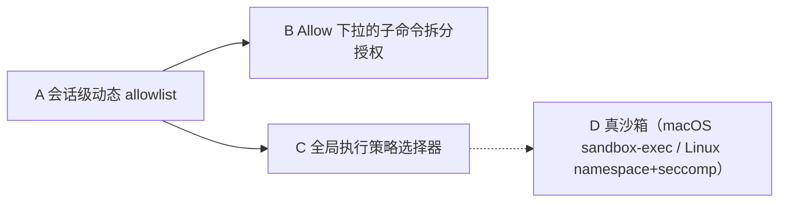

# Bash 全局策略 + 动态 allowlist 设计

## 当前状态

状态：草案。本设计是 `docs/design-docs/agent-权限设计规则和原则.md` 在 Bash 工具上的具体落地，回答"用户点 Allow 之后究竟发生了什么"以及"如何借鉴 Cursor 的全局策略和子命令拆分授权"。

相关实施计划：

- `docs/exec-plans/active/Bash工具和工具权限调度开发计划/actspace-bash-session-allowlist-plan.md`（Phase 1，A + B）
- Phase 2、Phase 3 尚未单独立项，参见 `docs/TODOLIST.md` 的"未来"段落。

## 设计目标

让"Allow"按钮兑现承诺，让用户在审核面板上做出窄、可见、可撤销的授权决定，并为未来引入全局执行策略和真沙箱预留架构空间。

设计落点：

- 会话级动态 allowlist（A）：用户授权过的命令前缀在本会话内自动放行。
- Allow 子命令拆分授权（B）：复合命令拆段，用户细选哪些前缀加入 allowlist。
- 全局执行策略选择器（C）：决定整个 Agent 的工具执行模式，Phase 2。
- 真沙箱（D）：进程级安全隔离，Phase 3，单独立项。

## 三块能力的关系



A 是数据地基；B 是 A 的精细化用户入口；C 影响"是否走到 ask"这个判断；D 与 C 中"Sandbox"选项绑定。

## 现状分析

下列事实来自本设计起草时（2026-05-26）的仓库代码，作为本设计的输入。

### 1. `allow_similar` 当前是空头支票

`packages/agent-core/src/tools/scheduler.ts:174` 把 `approve_once` 与 `allow_similar` 合并到同一分支，都只执行一次，**从不写入任何动态 allowlist**。前端 `BashApprovalBlock` 的 "Allow" 按钮文案与实际行为不符。

### 2. 命令分段已有基础，但不可用作 Cursor 风格 UI

`packages/agent-core/src/tools/tools/bash/permissions.ts` 中：

- `splitCommandSegments`（第 129 行）已能用 `&&` / `;` 把复合命令拆段。
- `UNSUPPORTED_SHELL_SYNTAX_RE = /[|<>`$(){}]/`（第 18 行）直接拒绝管道、重定向、子 shell、命令替换、进程替换等语法。
- 后果：`pnpm test | tail -15` 这种典型开发命令在当前实现下**进不到审核流程**，被 hard reject。
- 影响：Cursor 风格的子命令拆分授权需要先决定是否放开 `|`。本设计给出明确选择，见下文"关键决策"。

### 3. allowlist 是硬编码

`packages/agent-core/src/tools/tools/bash/permissions.ts:208-220` 的 `isAllowedDevelopmentCommand` 写死了一组命令前缀，不可数据驱动。要做"会话级动态 allowlist"，需要在 `classifyCommand` 里先查动态 store，再回退到硬编码 preset。

### 4. 全局执行策略字段不存在

`packages/agent-core/src/env.ts`、`packages/shared/src/session.ts`、session.jsonl 任何一层都没有 `BashExecutionPolicy` 这种枚举。

### 5. 沙箱完全没有

`packages/agent-core/src/tools/tools/bash/executor.ts` 直接调用 `runProcess` spawn，没有 macOS sandbox-exec / Linux namespace 等任何安全隔离。Cursor 的 "with Sandbox" 是真的进程级沙箱。

## 核心数据模型（共享契约）

下列类型放在 `packages/shared/src/session.ts`，作为 main / agent-core / renderer 共享契约。

```ts
export interface BashAllowlistEntry {
  prefix: string;
  scope: "session" | "user";
  source: "preset" | "user_decision";
  addedAt: number;
  sessionId?: string;
}

export type BashExecutionPolicy = "autorun" | "allowlist" | "run_everything";

export interface BashAllowlistStore {
  matches(segment: string): boolean;
  add(entry: BashAllowlistEntry): void;
  promote(prefix: string): void;
  listSession(sessionId: string): BashAllowlistEntry[];
  listUser(): BashAllowlistEntry[];
}
```

### 字段说明

- `prefix`：用作前缀匹配的命令片段。例如 `"pnpm --filter"` 匹配 `pnpm --filter foo run test`；`"git status"` 匹配 `git status --short`。
- `scope`：`session` 仅在当前会话内有效；`user` 持久化到 `~/.actspace/bash-allowlist.json`，跨会话生效。
- `source`：`preset` 是项目内置（取代当前硬编码 allowlist）；`user_decision` 来自审核面板上的用户授权。
- `addedAt` / `sessionId`：用于审计、撤销与 replay。

### `BashExecutionPolicy` 取值

- `autorun`：跳过所有 `ask`，hard reject 仍生效。等价于"我信任 Agent，请自动跑"。
- `allowlist`（默认）：当前行为，preset + 动态 allowlist 内自动放行，其它走 ask。
- `run_everything`：所有 ask 都自动放行，hard reject 仍生效。最危险，仅用于受控环境。
- **Sandbox 选项不在 Phase 2 中提供**，避免"看起来在隔离实际没隔离"的安全错觉。Sandbox 走 Phase 3，与策略选择器联动后才解锁。

## 架构改造点

### 调度层

`packages/agent-core/src/tools/scheduler.ts` 当前 `allow_similar` 与 `approve_once` 合并，需要拆开。`allow_similar` 决策携带 `allowPrefixes: string[]` 时，调用 store 写入。

### 权限检查

`packages/agent-core/src/tools/tools/bash/permissions.ts` 的 `bashCheckPermissions` 改为接收 `store` 与 `policy` 两个依赖（通过工厂注入），`classifyCommand` 查询顺序：

```
hard reject  ->  policy=autorun?  ->  store.matches?  ->  preset.matches?  ->  policy=run_everything?  ->  ask
```

### 协议（shared/ipc.ts）

- `ApprovalDecideInput` 升级：`allow_similar` 允许携带 `allowPrefixes: string[]`。
- `ToolApprovalRequest` 新增 `prefixOptions: string[]`，由 `splitForAuthorization` 计算。

### 审核登记（main）

`packages/desktop/src/main/approval-registry.ts` 的 `decide` 透传 `allowPrefixes`，并把整个 `ToolApprovalDecision` 还给调度器。

### 前端 UI

`packages/desktop/src/renderer/components/messages/BashRunBlock.tsx` 的 `BashApprovalBlock`：

- "Allow" 按钮升级为 dropdown：列出 `prefixOptions` 每个 prefix 一个 checkbox（默认全选），按"Add to Allowlist and Run"提交 `{ decision: "allow_similar", allowPrefixes }`。
- "Run"、"Skip" 保持不变。
- "升级到用户配置"在右上角 `MoreHorizontal` 菜单下作为二级菜单出现，触发 `promote(prefix)`。

### 持久化

- `session` 作用域：通过 session.jsonl 的一个事件类型 `bash_allowlist_added` 写入；session 加载时 replay 重建内存 store。
- `user` 作用域：写 `~/.actspace/bash-allowlist.json`，结构 `{ version: 1, entries: BashAllowlistEntry[] }`。

## 阶段路线

| Phase | 范围 | 触发条件 |
| --- | --- | --- |
| Phase 1 | A 会话级 allowlist + B 子命令拆分授权 + 升级按钮 | 当前 |
| Phase 2 | C 全局策略选择器（Autorun / Allowlist / Run Everything，无 Sandbox） | Phase 1 合并并通过手动验收后启动 |
| Phase 3 | D 真沙箱（macOS sandbox-exec / Linux namespace+seccomp） | 单独立项；需要安全调研与跨平台抽象 |

Phase 2、Phase 3 不在本次实现范围。Phase 2 待 Phase 1 落地后再起 exec-plan；Phase 3 在 `docs/TODOLIST.md` 的"未来"段落登记。

## 关键决策

本设计文档明确以下决策，避免下游 plan 出现 TBD。

### D1：放开 `|` 进入 `splitForAuthorization`

`UNSUPPORTED_SHELL_SYNTAX_RE` 当前拒绝 `|`，导致 `pnpm test | tail` 走不到审核。Phase 1 决定：

- 放开 `|`：管道命令允许进入审核流程，按管道左右两侧分段做拆分。
- 仍然拒绝：`<` `>` `` ` `` `$(` `)` `{` `}`。理由：
  - `<` / `>`：文件重定向，可绕过权限检查写文件。
  - `` ` `` / `$()`：命令替换，等价于动态 `eval`。
  - `{` / `}`：包含变量展开和 brace expansion，目前不做完整解析。
- `splitForAuthorization` 输入示例 `pnpm --filter foo run test | tail -15`，输出 `["pnpm --filter", "tail"]`。

### D2：升级到用户配置的入口形态

`BashApprovalBlock` 主操作区只保留 Skip / Allow / Run，避免拥挤。"升级到用户配置"放在右上角 `MoreHorizontal` (`⋯`) 菜单里，作为单独 menu item，文案"添加到用户 allowlist"。

### D3：用户配置 JSON 结构

```json
{
  "version": 1,
  "entries": [
    {
      "prefix": "pnpm --filter",
      "scope": "user",
      "source": "user_decision",
      "addedAt": 1730000000000
    }
  ]
}
```

- 顶层 `version` 字段预留迁移。
- 仅持久化 `scope=user` 的条目。
- 不写 `sessionId`，避免泄露会话 ID 到磁盘。

### D4：preset 与 store 的关系

`isAllowedDevelopmentCommand` 不删除，而是迁移为 store 在初始化时灌入的一组 `source: "preset"` 条目。这样运行时只看 store，硬编码 preset 仍以源码形式保留，便于审计变更。

### D5：scope=session 的事件流

`session.jsonl` 新增一种事件 `{ type: "bash_allowlist_added", entry: BashAllowlistEntry }`。Replay 时按事件顺序灌入 session store。会话级条目**不写到用户配置文件**，关闭会话即丢弃。

## 验收标准

### 用户视角

- 用户点 Allow 后选择保留的 prefix → 同一会话内"以该 prefix 起头的命令"不再触发审核。
- 用户再开一个新会话 → 上一会话的 allowlist 不出现。
- 用户在 `⋯` 菜单选"添加到用户 allowlist" → 重启应用后该 prefix 仍生效。
- Skip 按钮行为不变（deny 本次）。
- Run 按钮行为不变（仅本次）。
- Allow 按钮主提交动作（"Add to Allowlist and Run"）等价于"加入 allowlist + 立即执行"。

### 系统视角

- `scheduler.ts` 在 `allow_similar` 决策且 `allowPrefixes` 非空时调用 `store.add(...)`。
- `permissions.ts` 的查询顺序遵守上文"权限检查"小节定义。
- session.jsonl 的 `bash_allowlist_added` 事件可被 replay 恢复。
- `~/.actspace/bash-allowlist.json` 结构遵守 D3。
- renderer 不直接读写 `~/.actspace/bash-allowlist.json`，所有 promote 通过 main 进程 IPC。

## 被排除的方案

- 不在前端组件里直接持有 allowlist 数据；store 在 main / agent-core，renderer 通过 IPC 查询。
- 不做永久全局自动学习。即使是 user 作用域也由用户显式触发。
- 不在 Phase 2 提供 Sandbox 选项（避免错觉）。
- 不允许"通配符 prefix"（例如 `pnpm *`），prefix 必须是字面前缀。
- 不在 Phase 1 放开 `<` `>` `` ` `` `$()`，理由见 D1。
- 不让 renderer 直接执行 Bash，所有授权流程仍由 main / agent-core 主导。

## 从本设计派生计划的规则

任何派生 plan 必须写清：

- 消费本设计中的哪些决策（D1-D5）。
- 是否引入新的 shared 契约（包括协议字段）。
- 持久化文件路径与 schema 版本。
- 用户可执行的审核动作完整集合。
- 如何验证 renderer 不能绕过 main 访问磁盘。
