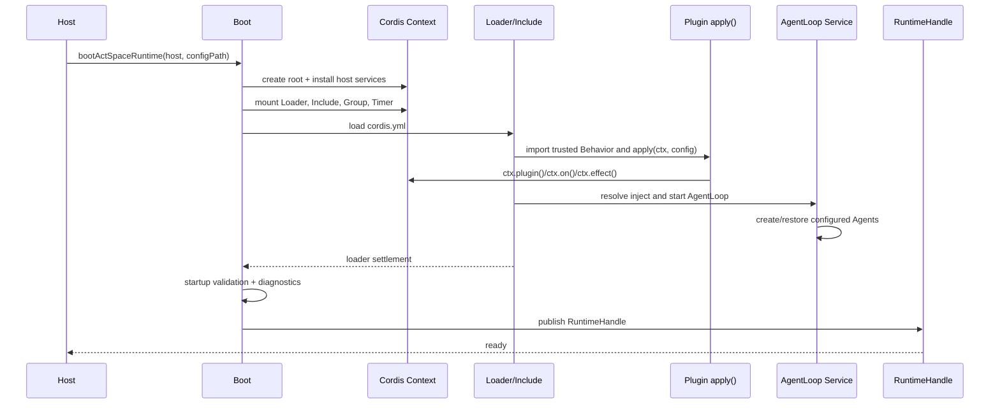

# ActSpace DSH-native 插件组装与 Agent Loop 启动规范

> 文档等级：historical-decision。以下保留 v2 演进时的决策上下文；RuntimeHandle、CLI chat、旧 configPath 与阶段状态均属于当时方案，不是当前接口要求。当前实现先读[总体架构](agent-target-overall-architecture.md)和 [Runtime 与 Composition](agent-target-runtime-architecture.md)。

> 状态：历史迁移决策，已被 [Profile-first Runtime 决策](./agent-decision-profile-first-headless-desktop.md) superseded；Cordis-native 组装方向已实现，真实宿主门禁仍待执行。
>
> 本文是对当前 ActSpace v2 插件启动方案的变更提案。实现切换完成前，现有 `agent-spec-plugin-runtime-abi.md`、`agent-target-runtime-architecture.md` 和对应 active plan 仍描述当前代码事实；切换完成后，本规范将成为插件启动与 Agent Loop 组装的优先约束。Session 的 durable event 格式和实现不在本规范内。
>
> 2026-08-29 事件/核心重构说明：本文的 Boot、Cordis-native plugin 和 AgentLoop Service 方向继续有效，但 Session durable event、9 个干预点、5 个主要通知和 Tool Runtime 内核/外壳边界以 [DSH 风格 Session 事件模型](./agent-spec-dsh-event-model.md)、[Agent Loop Cordis 插入面与通知面](./agent-spec-agent-loop-cordis-surface.md) 和 [Tool Runtime 内核与外壳边界](./agent-spec-tool-runtime-boundary.md) 为准。本文第 8–9 节中“Session 本轮不改”和“legacy 回退”仅保留为历史草案，不得作为本轮实施约束。
>
> 参考实现：`tmp/deepseek-harness` 固定源码快照（Cordis `Context`、`Loader`、`Include`、`Service`、Agent Loop 与 headless driver）。DSH 是机制参考，不直接复用 DSH 的领域包或 Host 入口。

## 1. 决策摘要

ActSpace 后端采用 **DSH-native Plugin Runtime + ActSpace RuntimeHandle + ActSpace 领域语义**：

1. `cordis.yml` 是运行时插件组合的唯一声明入口；不再由 ActSpace 自己定义独立的 `activate()` 协议。
2. 根启动由 Cordis `Context`、`Loader`、`Include`、`Group` 和 `Timer` 负责；插件通过真实 `Context` 激活。
3. Behavior 入口导出 `apply(ctx, config)`，可以在其中调用 `ctx.plugin()`、`ctx.on()`、`ctx.emit()`、`ctx.effect()`；有状态能力优先实现为 Cordis `Service`。
4. `AgentLoop` 是 Cordis Service。它在 Service 启动阶段创建或恢复配置中的 Agent；每个 Agent 拥有 scoped Context、durable inbox 和自己的 driver。
5. 用户输入调用 `agent.followup()`，先写入 durable inbox，再由 Agent driver claim 并运行 turn；CLI 只等待 Agent/Runtime 的 quiescent 结果，不直接驱动旧的 Loop class。
6. Host 仍只持有 `RuntimeHandle`，不直接持有 Cordis root、Session writer 或 AgentLoop class。
7. 当前插件假设是“明确安装且完全信任的同进程代码”。不做不可信插件的签名、沙箱、市场、URL 加载或运行时下载；未来若需要，另立安全架构。
8. Static Manifest 不再是运行时激活前置协议。包的 `package.json` / `exports`、Cordis 配置和构建 provenance 保留身份信息；启动所需事实由 Loader settlement、Context 服务和脱敏 diagnostics 产生。

## 2. 范围与明确不做

### 2.1 本规范覆盖

- CLI run 的单次无头启动、一次输入、等待完成和有界关闭；
- Desktop、CLI run、CLI chat 共享的 RuntimeHandle/Boot 边界；
- `cordis.yml` 的加载、Include 递归、插件 `apply(ctx, config)` 和 Service 生命周期；
- AgentLoop Service、Agent 创建/恢复、durable inbox、follow-up 和 driver 调度；
- Agent Loop 的 Cordis 插入事件、通知事件、错误隔离和 shutdown 顺序；
- 从当前 `plugins.json`/Static Manifest activation 到 DSH-native boot 的切换、回滚和验证门禁。

### 2.2 本规范不覆盖

- Session 包的 13 种 durable event、JSONL writer、replay、repair、fork 或 compaction 实现；
- Session `append()`、`session/event` firehose、flush 语义的代码改造；这些由独立 Session 计划负责，本规范只声明消费边界；
- Tool executor、LLM provider、Prompt contributor 的领域字段设计；它们作为 Context Service 被组装；
- renderer 插件化、浏览器扩展、签名/公证、远程插件市场或跨进程插件沙箱；
- CLI chat 交互 UX。它只要求与 CLI run 使用同一个 Runtime boot 契约，具体交互另立任务。

## 3. 为什么可以移除 Static Manifest 激活协议

当前 Static Manifest 解决的是“不先执行代码就完成来源、capability、codec 和 required/optional 检查”。这对半可信或可扩展市场插件很有价值，但它也把 ActSpace 运行时拆成一套与 DSH 不同的 admission/activation 协议：Manifest 先行、Behavior 再由适配器调用，Behavior 拿不到真实 Cordis Context。

本轮已确认插件完全信任，因此改为：

| 责任 | DSH-native ActSpace 方案 |
|---|---|
| 组合来源 | `cordis.yml` 的显式 Include/插件树；不扫描目录、不自动执行未知代码 |
| 代码身份 | 受控 workspace package、精确版本、`package.json` exports 与构建 provenance |
| capability | Host 在 root Context 注入 capability services；插件 activation 时读取并按 required/optional 语义失败或降级 |
| codec | 由 Session/codec 轨道独立发现和校验；不依赖 Behavior activation；实现属于 Session 计划 |
| 生命周期 | Cordis Loader settlement、Fiber state、Service inject 和 Effect disposer |
| 诊断 | Loader/Context 生成脱敏 boot facts；RuntimeHandle 暴露只读 diagnostics |
| 不可信代码防护 | 不属于当前承诺；未来引入进程隔离、签名和最小权限协议时另立设计 |

因此，**可以完全重构为 DSH-native 方式**。保留 `package.json` 等静态身份信息并不等于保留 Static Manifest activation protocol；前者是包和发布元数据，后者是本轮明确删除的运行时前置层。

## 4. 目标模块边界

```mermaid
flowchart LR
  H[Host Adapter\nCLI / Desktop] -->|prepare host services| B[ActSpace Boot]
  B -->|create root| C[Cordis Context]
  C --> L[Loader + Include]
  L --> Y[cordis.yml]
  Y --> P[Trusted plugin apply(ctx, config)]
  P --> S[Domain Services]
  S --> A[AgentLoop Service]
  A --> R[RuntimeHandle]
  R --> H
```

### 4.1 Host Adapter

Host 负责进程级输入输出和能力准备：cwd、data root、credential resolver、approval broker、TTY/IPC、signal 和 stdout/stderr。Host 不负责：

- 解析插件目录或调用第二套 Loader；
- 手工 new AgentLoop、Session writer 或 ToolManager；
- 将 Cordis Context 传入 renderer/IPC；
- 每个 turn 重建 root Context。

Host 的唯一运行入口是 `bootActSpaceRuntime({ host, configPath, invocation })`，返回 `RuntimeHandle`。`configPath` 由 Host 明确选择，默认 CLI 配置放在 `apps/cli/cordis.yml`；未来 Desktop 可以传入自己的同语义配置文件，不改变 Boot ABI。

### 4.2 Boot

Boot 只做 root 级编排：创建 Context、注入受信任 Host services、挂载 Cordis Loader 基础设施、加载 `cordis.yml`、等待 settlement、执行 startup validation、发布 RuntimeHandle，并在失败时按逆序 dispose。

Boot 不拥有 Agent 的业务循环，也不把插件列表转换成 ActSpace 自有的 `activate()` 回调表。

### 4.3 Domain Service

Session、LLM、Prompt、Tools、Approval、Agent Registry、AgentLoop、Compaction 等均作为 Context 可注入的领域 Service 或其组合插件。Service 通过 `static inject` 声明依赖；运行资源只能在构造/启动的 Effect 生命周期内取得，并由对应 Context 自动回收。

## 5. `cordis.yml` 与插件入口规范

### 5.1 组合文件是唯一启动真相

`cordis.yml` 表示有序、显式、可审阅的插件树。它可以 Include 其他 YAML 或包导出的配置，但不能从任意目录扫描插件，也不能根据日志中的 plugin id 自动 import。

配置合并采用 DSH Loader 语义：Include 顺序决定父子关系和装载顺序；同一个 Entry 的覆盖、禁用和依赖关系通过稳定 entry id 表达；配置变更采用 restart-only，不对已运行 root 做在线 reconcile。

当前过渡期允许保留旧 `runtime-v2/plugins.json` 和 Static Manifest 文件作为诊断/回滚材料，但它们不得同时参与一次正常 boot。切换完成后，从 CLI/desktop boot path 删除其读取和 `activateBehavior()` 调用。

### 5.2 Behavior Entry

插件包的运行入口遵循 DSH 体验：

- `apply(ctx, config)` 是组合入口；它可以同步调用 `ctx.plugin(ChildPlugin, childConfig)` 继续组装；
- `ctx.on(event, listener)` 注册事件监听，返回 disposer；
- `ctx.emit(event, payload)` 发布通知或驱动领域事件；
- `ctx.effect(setup)` 绑定 timer、watcher、subprocess、socket、listener、lease 等资源的清理；
- 有状态、可注入的能力使用 `Service`，由 Cordis Loader 根据 `static inject` 解析依赖和生命周期；
- module 顶层禁止启动进程、开 socket、创建 timer/watcher、注册全局监听器或写外部状态。

### 5.3 插件失败语义

- `apply()` 抛错或返回失败：Loader settlement 失败，Boot 不发布 RuntimeHandle；
- required Service 缺失或依赖环：Loader/Startup Validation 失败，输出 entry、plugin 和依赖链；
- optional 插件的 capability 不满足：跳过该 Entry，保留结构化诊断；
- 已激活插件的 disposer 抛错：记录 quiescence failure，继续等待其他 disposer，并使 Runtime 以非健康关闭结果结束；
- 任一插件不能通过 `ctx` 取得 Host 未提供的 capability。这里是受信任插件的 API ceiling，不是 OS 安全沙箱。

## 6. Boot 顺序与失败边界



Boot 的发布点必须晚于 Loader settlement、required Provider 检查和 AgentLoop Service ready。失败时顺序相反：停止接受工作 → 取消/中止 active turn → flush Session（调用既有 Session API）→ quiesce Agent/Tool/LLM → dispose root Context → 向 Host 报告失败。

## 7. AgentLoop Service 与 Agent 生命周期

### 7.1 Service 启动

AgentLoop 的依赖由 Context 注入，至少包括 Agent Registry、Session Store、LLM Service、Tool Runtime、Prompt/System Prompt 和 Host policy。Service 启动时读取 `cordis.yml` 中的 Agent preset/descriptor：

1. 为每个 configured Agent 创建或恢复 Session；
2. 创建 Agent scoped Context，并绑定该 Agent 的注册、inbox、status 与 driver；
3. 发布 `agent/created`；
4. 对需要开始生命周期的 Agent 发布 `agent/session-start`；
5. Agent 进入 `idle`，等待 inbox 中的 durable follow-up。

AgentLoop 不在 `RuntimeHandle.runTurn()` 中临时 new Agent。RuntimeHandle 只查找已发布 Agent，并调用其公共方法。

### 7.2 输入路径

```mermaid
flowchart TD
  U[用户输入] --> H[CLI run Host]
  H --> RH[RuntimeHandle]
  RH --> AG[Agent.followup(message)]
  AG --> DI[durable inbox append/splice]
  DI --> NI[agent/inbox/inserted]
  NI --> DR[Agent driver wake]
  DR --> CL[claim inbox message]
  CL --> NC[agent/inbox/claimed]
  NC --> PS[agent/pre-step]
  PS --> ST[step/start durable event\n由 Session 轨道负责]
  ST --> REQ[agent/request]
  REQ --> LLM[llm/stream]
  LLM --> OUT[assistant/tool durable events\n由 Session 轨道负责]
  OUT --> STOP[agent/turn-stopping]
  STOP --> END[turn/end + agent/status idle]
  END --> FL[Runtime/Session flush]
```

`followup()` 的返回值表示消息已经进入 durable inbox 或明确失败，不表示模型已经完成。CLI run 必须随后等待 Agent status 回到 idle、in-flight tool/LLM lease 清零，并执行一次有界 flush。

### 7.3 单次无头 CLI run

```mermaid
sequenceDiagram
  participant CLI
  participant RH as RuntimeHandle
  participant AG as Main Agent
  participant IN as Durable Inbox
  participant LOOP as AgentLoop
  participant OUT as JSONL/Event sink

  CLI->>RH: boot once
  RH-->>CLI: ready
  CLI->>RH: create/resume session
  CLI->>AG: followup(user input)
  AG->>IN: persist message
  AG-->>OUT: agent/inbox/inserted
  LOOP->>IN: claim message
  LOOP-->>OUT: agent/inbox/claimed
  LOOP-->>OUT: agent/pre-step / agent/request
  LOOP-->>OUT: llm/stream + tool hooks
  LOOP-->>OUT: agent/turn-stopping
  LOOP-->>OUT: status idle / error
  CLI->>RH: waitForIdle + flush
  CLI->>RH: quiesce + dispose
  CLI-->>OUT: final run_result / exit code
```

`--jsonl` 的 live event 适配器订阅 Context 事件；它不重新解释或重建 Session durable event。`session/event` 完整 firehose 的采集由 Session 轨道提供，本轮只预留订阅接点。

## 8. Cordis 事件契约

### 8.1 Agent Loop 的 9 个可插入点

下列 9 个事件是本规范固定的扩展面。前四个属于 Agent 决策边界，后五个属于 Prompt/LLM/Tools 管线；全部由真实 Agent scoped Context 发出，不能改回普通回调参数：

| 事件 | 模式 | 作用 |
|---|---|---|
| `agent/pre-step` | waterfall | 检查、拒绝或替换本次 step 将消费的 inbox messages |
| `agent/request` | waterfall | 替换本次模型请求配置；不得绕过已记录的 request/context 语义 |
| `agent/request-error` | waterfall | 在 retry/terminal 决策前处理规范化的 LLM failure |
| `agent/turn-stopping` | serial | turn 关闭前允许插件追加 steering；Loop 必须重新检查 inbox |
| `system-prompt/assemble` | waterfall/assemble | 追加或修改本次请求的系统提示贡献 |
| `llm/stream` | stream observer | 观察/投影模型流；不得伪造 durable assistant message |
| `tools/pre-execute` | waterfall | 在工具执行前做 allow/deny/approval 决策 |
| `tools/execute` | waterfall | 统一调用 prepared executor，并传递 abort/lease |
| `tools/post-execute` | waterfall | 规范化工具结果、摘要和结束 turn 的数据决定 |

Hook 的 listener 失败必须按事件模式处理：waterfall/serial 失败可以阻断当前动作并进入 Agent error policy；stream observer 失败不得回滚已经提交的 Session 事实，但必须进入 diagnostics。

### 8.2 主要通知面

本轮采用附加材料中整理的 5 个“主链相关通知”，它们全部是 emit 观察面，不替代 Journal，也不允许 listener 改写已经提交的事实：

| 通知 | 语义 |
|---|---|
| `agent/session-start` | Agent 绑定或恢复 Session 后，生命周期开始 |
| `agent/status` | Agent 进入 `running` 或 `idle` |
| `agent/error` | Agent Loop 的 Step/Turn 错误进入错误收束 |
| `tools/result` | Tools Service 产出一次可消费的最终结果 |
| `session/event` | 一条持久 SessionEvent 已经提交并广播 |

DSH 还提供 `agent/created`、`agent/disposed`、`agent/inbox/inserted`、`agent/inbox/claimed`、`agent/inbox/discarded` 等生命周期通知；它们保留为可订阅事件，但不计入上述 5 个主链通知。Session 本身的 `session/created`、`session/disposed`、`session/flush` 和 13 种 durable event 属于独立 Session 轨道，本规范不修改其实现。

## 9. Durable Session 轨道的集成边界

本轮不重构 Session，但插件 Runtime 必须预留两个单向接点：

- Agent/Tool/LLM 领域只调用 Session 的 append/flush 公共 API，不直接写 JSONL；
- 事件采集插件在 root Context 上订阅 `session/event`，将它作为完整 Session event stream 投影到 CLI JSONL、Desktop live projection 或 diagnostics sink。

Session 轨道未来提供 DSH 对齐的 13 种 durable event（`turn/start`、`turn/end`、`step/start`、`step/end`、`user/message`、`assistant/chunk`、`assistant/message`、`tool/call`、`tool/result`、`todo/write`、`request/header`、`request/context`、`session/end-seed`）。在该轨道完成前，AgentLoop 计划不得自行发明第二套事件类型来替代它。

## 10. 当前代码到目标代码的迁移映射

| 当前路径/机制 | 目标处理 |
|---|---|
| `apps/cli/src/runtime-v2/host-adapter.ts` 读取 `runtime-v2/plugins.json` | 改为解析 Host 指定的 `cordis.yml`，只调用统一 Boot |
| `apps/desktop/src/main/runtime-v2/desktop-host-adapter.ts` 手工组装 composition | 与 CLI 共用 Boot ABI，仅注入 Desktop Host services |
| `packages/runtime/src/profiles/composition.ts` `createDefaultComposition()` | 过渡期可生成等价 YAML/config dump；切换后不再是运行时插件激活入口 |
| `packages/runtime/src/runtime/boot.ts` 手工 `root.mount` + `activateBehavior` | 替换为 Loader/Include settlement；保留 RuntimeHandle 和 shutdown 外观 |
| `packages/cordis-adapter/src/behavior-loader.ts` `BehaviorModule.activate()` | 降为兼容/迁移层，最终从正常 boot path 移除 |
| `packages/cordis-adapter/src/manifest.ts`、`source-loader.ts` | 不再作为激活前置；切换完成后只保留历史迁移/诊断所需的最小代码，或移入 legacy |
| `packages/core/agent-loop/src/loop.ts` plain class | 改为 Cordis Service + Agent driver，入口由 Context 注入依赖 |
| `packages/core/agent/src/inbox.ts` 非 DSH durable inbox 事件 | 对齐 Agent scoped inbox/follow-up contract；Session 事件写入仍由 Session 轨道负责 |
| `apps/cli/src/runtime-v2/run.ts` `handle.runTurn()` | 改为 `agent.followup()` → wait idle/quiescent → flush；保留 signal/exit code 语义 |
| `LiveProgressHub` 与 CLI live event | 变为 Context event sink；`session/event` 和 Agent/Hook 事件按 projection allowlist 输出 |

## 11. 不可信插件的未来扩展边界

当前不做以下能力：插件签名链、作者身份、远程下载、权限沙箱、Worker/子进程隔离、Host capability syscall 代理、恶意代码审计和市场安装器。

未来若要支持不可信插件，不能只恢复 Static Manifest；至少需要重新设计：

- 进程/权限隔离和 IPC ABI；
- Manifest 与实际制品的签名、integrity、撤销和更新策略；
- codec 纯度证明与资源访问代理；
- crash/restart、超时、内存和网络配额；
- plugin event 的跨进程序列化和 backpressure。

这些约束与本轮“完全信任、同进程、重启生效”的设计不是同一安全等级。

## 12. 验收标准

设计实施完成后，必须由自动化和手工证据共同证明：

1. CLI run 只创建一次 root Context；一次输入通过 durable inbox 进入 Agent，返回 idle 后才结束进程；
2. 同一 `cordis.yml` 能在 CLI run 与 Desktop Host 注入不同 capability 后启动，Host 不需要第二套插件协议；
3. 一个 fixture plugin 能在 `apply(ctx)` 中嵌套 `ctx.plugin()`、订阅/发布事件并通过 Effect 回收资源；
4. AgentLoop Service 能创建新 Agent、恢复 Agent，并发出 scoped lifecycle/Hook 事件；
5. 9 个插入点的 waterfall/serial/stream 失败语义有 fixture 覆盖；
6. `session/event` 订阅能收到完整 Session 事件流，且插件 Runtime 不复制 Session writer；
7. Loader settlement、required Service 缺失、optional capability 缺失、listener failure 和 shutdown quiescence failure 均有结构化诊断；
8. 旧 `plugins.json`/Static Manifest 不再被默认 boot 读取；显式 legacy 回退仍可在切换窗口内恢复；
9. 未实现不可信插件防护时，不在文档、CLI 帮助或 diagnostics 中声称已提供沙箱或签名安全。

## 13. 相关文档与执行计划

- 当前 v2 插件 ABI（切换前事实）：[`agent-spec-plugin-runtime-abi.md`](./agent-spec-plugin-runtime-abi.md)
- 当前 Runtime/Host 边界：[`agent-target-runtime-architecture.md`](./agent-target-runtime-architecture.md)
- Agent Core 领域契约：[`agent-target-agent-core.md`](./agent-target-agent-core.md)
- DSH 机制研究：[`agent-research-dsh-architecture.md`](./agent-research-dsh-architecture.md)
- Session 格式（本轮不改）：[`agent-spec-session-format-v1.md`](./agent-spec-session-format-v1.md)
- 分阶段执行计划：[`../../exec-plans/completed/20260829-actspace-dsh-core-rebuild/README.md`](../../exec-plans/completed/20260829-actspace-dsh-core-rebuild/README.md)
