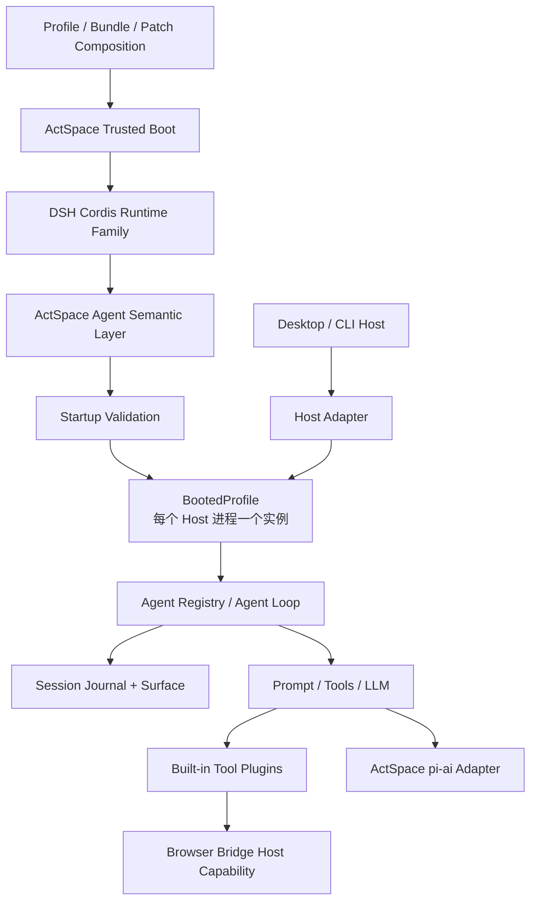

# ActSpace v2 插件化 Runtime 已确认决策

> 状态：已确认的设计基线。
>
> 本文登记已经确认的产品范围、架构方向和条件采用项。D1-D8 已于 2026-08-22 收口；它不是 execution plan，不授权开始重写代码。
>
> 确认日期：2026-08-22。
>
> 2026-08-30 补充：其中 RuntimeHandle、三 Host（含 CLI chat）和通用 Runtime facade 的历史表述已被 [Profile-first Runtime 决策](./agent-decision-profile-first-headless-desktop.md) superseded；当前实现只保留 headless/desktop Profile 与各自 App Bundle Service。

## 1. 决策状态

本专题使用三种状态，后续文档不得混用：

| 状态 | 含义 | 对实现的约束 |
|---|---|---|
| 已确认 | 方向和所有权已经确定 | execution plan 不得重新发明相反方案 |
| 有条件确认 | 方向确定，但依赖兼容性或制品验证必须通过 | 验证失败时回到本专题评审，不得用私有 API 绕过 |
| 待评审 | 当前只有问题和约束，没有最终选择 | 不得写成默认值、公共 API 或迁移承诺 |

研究稿中的“判断”和本文件中的“已确认”不是同一等级。研究稿继续保留证据和推理，本文件才是当前 v2 设计基线。

## 2. 已确认的总方向

| 主题 | 决策 | 状态 | 专题 |
|---|---|---|---|
| 插件运行时 | 采用 DSH 维护发布的 `@deepseek-ai/cordis` 系列，不使用旧上游 Cordis，不自行 fork | 有条件确认 | [Cordis 采用决策](./agent-decision-cordis-adoption.md) |
| Agent Core | 不直接依赖 DSH Agent Core 包；以其行为、不变量和测试为参考，自行实现 ActSpace Core | 已确认 | [Agent Core 目标边界](./agent-target-agent-core.md) |
| Session | 删除旧双真相模型，采用 append-only Journal + Surface；格式和升级权归 ActSpace | 已确认 | [Session 与 Context 目标设计](./agent-target-session-and-context.md) |
| v1 数据 | v2 不读取、不迁移、也不继续写入 v1 Session；开发阶段直接重新创建数据 | 已确认 | [Session 与 Context 目标设计](./agent-target-session-and-context.md) |
| LLM | 采用 `pi-ai` 作为 Provider wire/catalog engine，但只能位于 ActSpace LLM Adapter 之后 | 有条件确认 | [LLM Adapter 目标设计](./agent-target-llm-adapter.md) |
| Runtime | Profile / Bundle / Patch 组合后端能力；Desktop 与 CLI run 各自选择 `desktop` / `headless` Profile，每个 Host 进程只 boot 一个 `BootedProfile`，应用操作由对应 App Bundle Service 提供 | 已确认 | [Profile-first Runtime 决策](./agent-decision-profile-first-headless-desktop.md) |
| 一致性边界 | 不设计全局 Composition Generation；由 Loader、Preset、Session、LLM、Tools 和 Prompt 分别拥有所需版本或 snapshot | 已确认 | [Runtime 与 Composition 目标设计](./agent-target-runtime-architecture.md#7-各领域自己拥有一致性边界) |
| Host | 保留 Host Adapter 思路；Desktop、TTY、stdout、审批 UI 和进程退出不进入 Agent Core | 已确认 | [Runtime 与 Composition 目标设计](./agent-target-runtime-architecture.md) |
| 前端 | v2 不插件化；renderer 不执行后端插件携带的前端代码 | 已确认 | [Runtime 与 Composition 目标设计](./agent-target-runtime-architecture.md) |
| 工具 | 保留已验证的 executor、协议、安全检查和行为测试；替换旧注册、调度、结果和 UI 耦合 | 已确认 | [Agent Core 目标边界](./agent-target-agent-core.md) |
| Kairos | 从 v2 产品、Core、Shared、IPC 和 Renderer 中删除，不作为候选插件迁移 | 已确认 | [能力去留研究](./agent-research-capability-disposition.md) |
| fs-watch | 删除 Rust 插件、专用 service、IPC、设置和 Skill 集成，不迁移到 v2 | 已确认 | [能力去留研究](./agent-research-capability-disposition.md) |
| Browser Bridge | 保留 Go Bridge、协议和命令资产，通过新的 Host capability / tool plugin 适配 | 已确认 | [能力去留研究](./agent-research-capability-disposition.md) |
| 交付方式 | v2 只做一次完整产品切换；execution plan 可以拆成可验证任务，但在范围内能力全部完成前不交付半成品 v2 | 已确认 | [v2 总体架构](./agent-target-overall-architecture.md) |
| 插件信任 | v2 只支持受信任、同进程、显式安装的后端插件；内置、local path 和 managed plugin directory 的 exact package 是允许来源 | 已确认 | [插件 Runtime ABI](./agent-spec-plugin-runtime-abi.md) |
| Agent 产品范围 | 完整交付 main Agent 与 durable Inbox、现有 Agent / Explore 重写、统一 one-shot Subagent seam、静态 Preset、Todo durable events、Skills、Compaction、保留工具、Browser Bridge 与多 Host | 已确认 | [Agent 与 Subagent 公共契约](./agent-spec-agent-and-subagent.md) |
| Session 物理格式 | v2 只使用文件 raw JSONL；不实现 zstd、SQLite 或 packed-chunk 物理优化 | 已确认 | [Session 格式公共契约](./agent-spec-session-format-v1.md) |
| CLI | 主分发采用 managed ESM runtime；CLI run 默认 ephemeral、显式选择才持久化；CLI chat 不属于当前生产入口 | 已确认 | [Profile-first Runtime 决策](./agent-decision-profile-first-headless-desktop.md) |
| 配置更新 | v2 生产基线为 restart-only；检测到配置或代码变化只报告 `restartRequired` | 已确认 | [Runtime 与 Composition 目标设计](./agent-target-runtime-architecture.md) |
| 前端兼容 | `frontend.required=true` 且 Host 不支持时不激活后端；required capability 使 Boot 失败，optional entry 跳过并诊断 | 已确认 | [Runtime Projection 公共契约](./agent-spec-runtime-projection.md) |
| Prompt / Context | 保留必要动态上下文并迁入确定性 Contributor；旧 conversation 和 Kairos handoff 删除，Compaction 只通过 Journal replacement 工作 | 已确认 | [Prompt 与 Context Contributor 公共契约](./agent-spec-prompt-context-contributors.md) |
| Tool 展示 | 固定前端使用稳定 generic projection 和构建时 renderer allowlist；未知 renderer 必须 fallback | 已确认 | [Runtime Projection 公共契约](./agent-spec-runtime-projection.md) |
| DSH 事件核心 | Session 采用 DSH 13 种核心事件，并允许 DSH 扩展目录；旧 ActSpace 事件不兼容、不迁移 | 已确认 | [DSH 风格 Session 事件模型](./agent-spec-dsh-event-model.md) |
| Agent Loop 插入面 | 对齐 DSH 9 个 Cordis 干预点与 5 个主要通知；干预不直接写 Journal，通知只在 commit 后观察 | 已确认 | [Agent Loop Cordis 插入面与通知面](./agent-spec-agent-loop-cordis-surface.md) |
| Tool Runtime 边界 | 保留 ActSpace 具体工具 definition/executor/body 与行为测试；重写权限、审批、事件、进度和 Host 外壳 | 已确认 | [Tool Runtime 内核与外壳边界](./agent-spec-tool-runtime-boundary.md) |

## 3. 目标分层

这里的 Trusted Boot 是不可由普通业务插件替换的小边界，只拥有：

- 插件 ABI 和契约版本；
- root Context 的创建和释放；
- Profile / Bundle / Patch 解析入口；
- 只读 `ResolvedComposition` / `BootManifest`；
- Loader settlement、Startup Validation、诊断和关闭；
- 对 Host 暴露当前 Profile 的 `BootedProfile`；Session/Agent 操作由对应 App Bundle Service 提供。

Session format、Event Codec、Prompt、Tools、LLM、Agent Registry 和 Agent Loop 都属于 ActSpace Agent 语义层，并以 ActSpace 领域契约组织成可替换 Provider。可替换不等于可以缺失：Base Profile 必须提供其声明的必需能力，缺失时 Startup Validation 拒绝启动。

ActSpace 不创建全局 `CompositionGenerationManager`。`ResolvedComposition` 只记录解析结果和 provenance；插件实例切换由 Cordis / Loader 管，跨更新仍需保留旧实例的能力才在 Preset、Session、LLM、Tools 或 Prompt 各自领域内维护版本、registration 或 snapshot。

## 4. 明确不做

- 不把旧 `AgentRuntime` 外面包一层动态 `import()` 就称为插件化。
- 不让 Cordis Context、pi-ai 类型或 DSH Core 类型穿过 IPC、Session 和固定前端契约。
- 不复用 `@deepseek-ai/dsh-app-boot`、DSH Web Client 或 DSH headless 产品包。
- 不启用 Electron 生产代码 HMR。
- 不把 Cordis isolate 描述成权限沙箱或进程隔离。
- 不支持插件向 renderer 注入任意 JavaScript、React component 或 CSS。
- 不支持 URL 直接加载、插件市场、签名分发、自动更新或不可信插件执行。
- 不保留 Kairos、fs-watch 或 v1 Session 的兼容壳。
- 不在 v2 中实现 generic Workflow engine、continuable subagent、Preset StandingMount 或 live preset reload。
- 不在 v2 中实现在线 plugin/config reconcile；需要刷新时重启当前进程内 Runtime。
- 不把严格 standalone SEA 当作可安装 ESM 插件的主分发形态。
- 不实现 Session zstd、SQLite、多 backend 或 packed-chunk 物理优化。

## 5. 已关闭的原开放问题

原 `OPEN-01` 至 `OPEN-10` 已按以下结论关闭。后续 execution plan 不得重新把它们当成产品选择：

| 原编号 | 已确认结论 | 后续落点 |
|---|---|---|
| OPEN-01 | v2 只支持受信任同进程插件；市场、签名、升级和不可信隔离是非目标 | Plugin ABI spec |
| OPEN-02 | `frontend.required=true` 不兼容时不激活后端；required capability 使 Boot 失败，optional entry 跳过并诊断 | Plugin ABI / Projection spec |
| OPEN-03 | Session 只采用 raw JSONL 文件 | Session Format spec |
| OPEN-04 | Core codecs 内建；插件 codec module 在 behavior activation 与 Session decode 前加载；事件只有 required / ignorable | Session Format spec |
| OPEN-05 | pi-ai 必须通过 scoped proxy、结构化错误和 packaged runtime 门禁；公共 API 不满足时保留 legacy transport 双 backend | LLM compatibility proof |
| OPEN-06 | 主分发是 managed ESM runtime；strict SEA 不进入 v2 主产品 | Runtime target |
| OPEN-07 | v2 restart-only；不实现在线 reconcile 或全局 generation | Runtime target |
| OPEN-08 | 使用稳定 generic Tool projection、构建时 renderer allowlist 和 fallback | Tool / Projection spec |
| OPEN-09 | 先在一个 ESM Runtime Core 内按模块组织，包名和最终拆包数量属于 execution plan 的机械选择 | execution plan |
| OPEN-10 | 使用确定性 Prompt / Context Contributors；conversation 归 Session Surface，Kairos context 删除 | Prompt / Context spec |

## 6. 仍需通过的兼容性门禁

当前没有尚未选择的产品范围问题，但两个“有条件确认”依赖仍需在实现前通过 compatibility proof：

- Cordis 发布族：fresh install、exports/types/peer、Node/Electron 生命周期、Loader/Include、packaged Desktop、单实例和资源静止；
- pi-ai：三条 route、reasoning/tool/image/abort/replay、usage/cost、关闭 SDK retry、结构化错误、scoped proxy、secret redaction 和 activation lease/drain。

这些是证据门禁，不是让用户再次选择“采用还是不采用”。失败时按对应 ADR 的回退条件重开评审，不能使用私有 deep import、修改 `node_modules` 或全局代理污染来伪造通过。

BootedProfile 与各 App Bundle Service 的精确 TypeScript 方法名、leaf package 的最终 npm scope/name、package exports 字段、lease timeout、raw JSONL 的平台级 fsync/lock 机制、compaction 阈值和 cache 算法可以在 execution plan 中细化；领域分组和真实 Plugin Entry 边界以 [包结构与真实插件包规范](./agent-spec-package-layout-and-plugin-packaging.md) 为准，不得退回单一 Runtime 包。

## 7. 完整交付的含义

“完整交付”约束产品切换点，不禁止工程上拆分任务：

- execution plan 必须覆盖全部已确认范围；
- 内部任务、验证、提交和兼容性 proof 可以按依赖顺序独立完成；
- v1 继续作为可运行基线，直到 v2 的完整验收矩阵通过；
- 不把缺少 Desktop、CLI、Session recovery、全部保留工具或 Agent / Explore 的中间状态称为已交付 v2；
- 最终只做一次默认 Runtime 切换和 v1 后端删除，不长期维护两套产品内核。

## 8. 变更这些决策的条件

只有以下证据足以重开已经确认的方向：

- DSH Cordis 发布包无法 fresh install、无法在 ActSpace 的 Node/Electron 制品中运行，或出现无法隔离的生命周期缺陷；
- pi-ai 无法通过代理、结构化错误、usage、取消或 packaged Electron 门禁，且双 backend 也不能保留现有能力；
- Session golden contract 证明 append-only Journal + Surface 无法表达 ActSpace 必需行为；
- 固定前端约束导致核心产品工作流无法完成，而不是仅缺少专用视觉组件；
- 删除 Kairos 或 fs-watch 会移除一个已经确认的 v2 核心用户需求。

出现这些证据时，应新增或更新 ADR，并记录替代方案、数据影响和回退路径，不在 execution plan 中静默改向。
