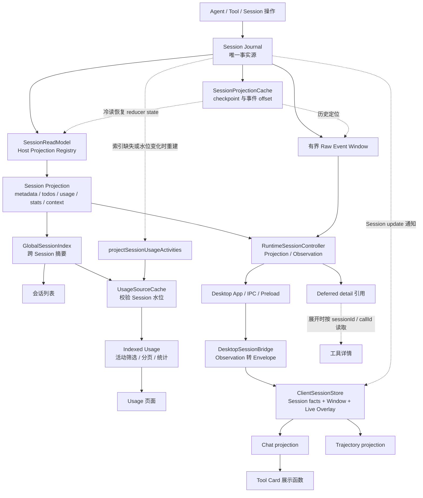

# Session 三类读模型设计规范

状态：已落地（2026-09-22）。本文基于当前源码，替代早期以 BrowseIndex、Main renderer projector 和旧 cache helper 为前提的设计；Electron/UI 外部门禁仍单独记录。

## 1. 目标与分层

ActSpace 使用一个 Session Journal，提供三种查询范围不同的读模型：

```text
Session Journal
├─ Global Aggregate
│  └─ 跨 Session 的列表、筛选和统计
├─ Session Projection
│  └─ 一个 Session 的完整当前状态
└─ Window Presentation
   └─ 一个 Session 的有界历史窗口
      ├─ Chat
      ├─ Trajectory
      └─ Tool Card
```

三种模式不是三份事实，也不是必须串行调用的三层服务。它们都从 Journal 派生，但完整性范围不同：

| 模式 | 输入范围 | 可以回答 | 不能回答 |
| --- | --- | --- | --- |
| Global Aggregate | 多个 Session 的摘要贡献 | 列表、筛选、总量、统计 | 单 Session 的完整历史细节 |
| Session Projection | 一个 Session 的完整 Journal prefix | title、todo、usage、activity、delegation、inbox、context facts | 当前窗口如何排版 |
| Window Presentation | 一个 Session 的有界事件区间 | Chat、Trajectory、Tool Card、搜索和定位 | 全 Session 累计状态 |

Live stream、草稿、展开状态、搜索条件和滚动位置属于 Live Overlay 或 Client UI State。

### 规范视图

```text
Session Event Journal
├─ Global Aggregate
│  └─ 跨 Session 查询、列表、Usage 索引
├─ Session Projection
│  └─ title、todo、sessionStats、tokenUsage、goal 等可复用事实
└─ Window Presentation
   └─ Chat、Trajectory、Tool Card 各自解释
```

这张图表达的是三种读模型的职责和完整性边界。它不表示 Global、Session、Window 必须按树的顺序串行调用，也不表示每个索引都直接扫描 Journal。

### 当前实现数据流



虚线表示恢复、索引重建、定位或通知路径。实现中 Global Session Index 的摘要来自 Session Projection；Usage Index 的 activity rows 在缓存失效时从 Journal 重建。Window 使用同一次读取中的 Session Projection snapshot 和 Journal window。Registry 当前没有 Goal producer；Tool Card 的展示函数独立于 Chat 定义，但当前由 Chat 组装调用。Session update 的实际传输仍经过 Desktop IPC。

Usage 仅保留 `projectSessionUsageActivities → UsageSourceCache → projectIndexedUsageActivity / projectIndexedUsageStatistics` 一条统计路径。`chat.ts` 中旧的 `projectUsageActivity`、`projectUsageStatistics` 和专用聚合 helper 已删除；Journal 到 activity rows 的构建函数继续保留，供索引重建使用。当前仍在调用的 Session envelope 适配不属于本次 Usage 清理范围。

## 2. 当前实现基线与缺口

当前已存在：

- `packages/session/journal`：append-only Journal、codec、Surface 和关系验证；
- `packages/session/persistence`：accepted prefix、durable barrier 和 recovery；
- `SessionReadModel`：Registry facts、Surface、tools、workspace 和 requestContext；
- `packages/session/projection-cache/src/journal-cache.ts`：checkpoint、Journal offset、Turn/Request/call 索引；
- `packages/client/src/sessions/`：Chat、Trajectory、Tool Card 和 usage selector。

本轮实现修正了以下边界和语义：

1. `todo/write.items[]` 按 `todoId + item revision` 增量合并，Host 与 TodoService 共用 canonical reducer。
2. shared contract 增加 Global summary、Session observation、Window support/deferred refs 和独立水位。
3. Global Session Index 与 Global Usage Index 持久化摘要/活动行；缺失、损坏或水位变化时按 Session 重建。
4. Window 受事件数与 JSON 字节数上限约束，工具 args/result/detail/artifacts 使用 deferred detail。
5. Client 对 equal-seq same-value 幂等、equal-seq conflict 触发 resync；Chat、Trajectory、Tool View 继续独立消费。

## 3. Journal 与水位

Journal 是唯一事实源。Projection、Global Index、Window Index 和 Client store 都必须可删除、可重建，不能参与 Agent resume 或 canonical export。

每个读模型显式携带自己的水位，Runtime observation 已通过 Desktop IPC 暴露：

```text
acceptedThroughSeq   当前进程已接受的 Journal prefix
durableThroughSeq    Persistence barrier 已确认的 prefix
projectionThroughSeq Session Projection 覆盖的 prefix
  windowThroughSeq     当前 Window observation 的尾部
indexGeneration      Global Index 自身的发布代次
```

accepted 与 durable 不合并。对外宣称“已持久化”的 API 必须经过 flush barrier。

## 4. Global Aggregate

Global Index 保存每个 Session 的摘要贡献，并用新水位替换旧贡献。它不保存完整消息，也不作为 Agent resume 输入。Usage Index 保存按 Session 水位校验的 `UsageActivityRow[]`，统计页从这些行聚合，缺失时才回到 Journal replay。

```ts
type GlobalSessionSummary = {
  sessionId: string
  throughJournalSeq: number
  summaryVersion: number
  createdAt: string
  updatedAt: string
  workspaceRoot: string | null
  profileId: string
  title: string | null
  pinned: boolean
  archived: boolean
  completedTurnCount: number
  usage: RuntimeV2UsageSummary
  accessState: SessionAccessState
}
```

Usage 页面还需要按日、模型、请求状态的活动 bucket；不能只保存 total token/cost。未知费用、币种和失败请求必须保留。

规则：

- 每条摘要独立保存 `throughJournalSeq`；
- 同一 Session 只接受更高水位或更高 `summaryVersion`；
- 缺失、损坏、版本不匹配时只重建该 Session；
- Index 写入失败不阻止 Journal append 或 recovery；
- 删除 Index 后从 Session Projection 重建；
- Global Query 不直接读取全部 Journal。

## 5. Session Projection

Host Registry 是完整 Session Projection 的唯一生产驱动器。领域只注册纯 definition，不自行维护第二份完整状态。

当前 keys：

| Key | 来源 | 用途 |
| --- | --- | --- |
| `metadata` | title、pinned、archived | Global、Client |
| `todos` | `todo/write` | Client |
| `sessionStats` | turn、step、compaction | Client |
| `providerUsage` | request/assistant/step usage | Global、Client |
| `pendingInbox` | Inbox enqueue/claim/discard | Client |
| `delegations` | delegation lifecycle | Client |
| `surface`、`tools` | Journal Surface、tool lifecycle | Window support |
| `requestContext` | request header/context/compaction | Client |

Goal 不预建空 key。没有 producer 和 Journal event 时，Goal 是能力缺失，不是空值。

每个领域状态只有一个 canonical reducer。Todo 必须按 todoId 合并 `items[]`，使用每个 item 的 revision，保留未出现在本次写入中的 Todo 和 cancelled 状态。

Definition 必须满足：

- `init/apply/view` 同步、确定性、JSON-safe；
- 不相关事件返回相同 state reference；
- reducer 不原地修改已提交 state；
- `stateVersion` 变化使旧 checkpoint 失效；
- view 是 detached、脱敏、不可变的公开值；
- full replay 与 incremental apply 结果一致。

## 6. Window Presentation

Host 提供有界 raw event window，Client 为 Chat、Trajectory、Tool Card 分别建立展示投影：

```ts
type SessionEventWindow = {
  sessionId: string
  fromSeq: number
  throughSeq: number
  journalThroughSeq: number
  beforeSeq: number | null
  events: readonly SessionEventEnvelopeV1[]
  deferredDetails: readonly DeferredDetailRef[]
  support: readonly WindowSupportFact[]
}
```

Window 规则：

- 默认按完整 Turn 分页（每页 20 个 Turn），同时受事件数（默认 2000，调用方可降低）和 JSON 字节数（默认约 2 MB）限制；
- 历史页（非 `afterSeq`、非 `includeToolDetails`）先剔除展示用不到的负载再计上限：已有 `assistant/message` 定稿的消息不再携带其 `assistant/chunk` 流式增量；窗口内只保留最新一份完整 `request/context`，其余超过 24,000 字符的收敛为 `deferredDetail` 身份字段（request/turn/step id、`prepared.model/route/contextWindow`、`requestOptions`）。2026-09-26 本机 59 个会话统计：chunk 占 journal 事件约 97%，request/context 占字节约 22%，精简前 55/59 个会话首页装不下一轮完整 Turn；
- 超大 Turn 可以在 Turn 内续页；
- Surface replacement、跨页工具关联和请求关系进入 support；
- 大型 args/result/detail/artifact 返回 `DeferredDetailRef`，详情必须按 `sessionId + callId/artifactId` 读取并重新执行 redaction；
- prepend、append、replace 按 seq 和 message/call identity 去重；
- 加载历史页不能修改 Session Projection 的 title、todo、usage 或 activity。

Chat 读取 Surface 和 Host facts；Trajectory 保留 raw events、source、surface 和绝对 seq；Tool Card 读取结构化 args/result/detail，不解析模型文字推断后台任务。

## 7. Observation 与缓存

Host 已提供一次性 observation，避免 Desktop 先读 snapshot、再读 events、最后自行猜测一致性：

```ts
type SessionObservation = {
  sessionId: string
  acceptedThroughSeq: number
  durableThroughSeq: number | null
  projection: SessionProjectionSnapshot
  window?: SessionEventWindow
}
```

兼容性的 `RuntimeV2DesktopSessionProjection` 仍可被旧 UI 调用，但由同一次 observation 生成；renderer 不得再自行组合完整 snapshot 与独立事件读取。

Projection 和 window 必须来自同一读取切面。并发 append 时整体重试或明确进入下一次 observation。

Session Projection Cache 保存 reducer state、stateVersion、checkpoint seq、pending transaction 和 Journal offsets。Global Index 保存 summary 与统计 bucket。Window Index 保存 Turn boundary、event offset、call detail offset。三者都可删除，删除后回到 Journal 重建。

## 8. 非目标与完成定义

不引入第二事实源、双写 Journal、renderer-owned history、旧 BrowseIndex、Main fixed renderer projection、旧 cursor fallback 或无 producer 的 Goal 空 projection。不在本规范中改造工具执行器、Browser Bridge 或 Electron 视觉布局。

完成条件：

1. 每个完整 Session 领域状态只有一个 canonical fold；
2. Global Query 和 Usage 正常冷读不逐个扫描所有 Journal；索引删除后才进入重建路径；
3. Session Projection 与 Window Presentation 使用不同 DTO；
4. Observation 能证明 projection 与 window 的读取切面；
5. 删除缓存后结果与完整 replay 等价；
6. Chat、Trajectory、Tool Card 可以独立更新；
7. 旧 SessionRecord/Main projector 不再是生产事实解释入口。
