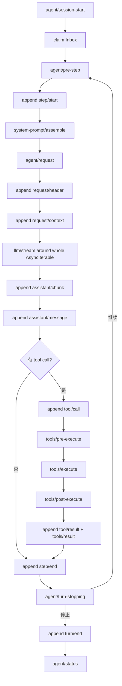

# Agent Loop Cordis 插入面与通知面

> 状态：已确认目标设计；事件 ABI 清理与 EventHub 退役由 [Cordis 原生事件 ABI 与 EventHub 退役规范](./agent-spec-cordis-event-abi-and-eventhub-retirement.md) 负责
>
> 日期：2026-08-29

本文规定 Agent Loop 如何向 Cordis 暴露可插入的运行时边界，以及如何向 Host/UI 发布低延迟通知。它与 [DSH 风格 Session 事件模型](./agent-spec-dsh-event-model.md) 配套：Session 是可重放事实，Cordis 是运行中可干预的控制面，通知是提交后的观察面。

## 1. 9 个 Agent Loop 干预点

这 9 个名称、调用阶段和组合方式固定对齐 DSH。事件 ABI 使用真实 Cordis Context；本文件不再定义自定义 EventHub 的替代语义。

| 插入点 | 模式 | 所在阶段 | 输入/输出 | 失败语义 |
|---|---|---|---|---|
| `system-prompt/assemble` | Waterfall | 每次 request 构建前 | 当前 prompt parts → 修改后的 parts | reject 该 request |
| `agent/pre-step` | Waterfall | `step/start` 后、request 前 | step context → 修改后的 context | 可跳过/改写 step |
| `agent/request` | Waterfall | 请求提交前 | request snapshot → 修改后的 snapshot | reject 该 request |
| `llm/stream` | Waterfall | 整个 LLM stream dispatch 时 | stream context → wrapped/replaced stream | 中止或替换该 request |
| `agent/request-error` | Waterfall | LLM 请求抛错后 | error context → recovery decision | retry / abort / escalate |
| `tools/pre-execute` | Waterfall | tool call 落盘后、执行前 | prepared tool call → policy/args patch | deny 或改写参数 |
| `tools/execute` | Waterfall | 权限通过后 | execution context → execution result | 可包裹/替换外壳执行 |
| `tools/post-execute` | Waterfall | executor 完成、result commit 前 | result → 脱敏/补充后的 result | result 标为失败 |
| `agent/turn-stopping` | Serial | 一轮即将结束 | stop reason + pending inbox → stop/continue | 可继续一轮或确认停止 |

Waterfall 是 around-middleware：handler 的最后一个参数是 `next()`，调用 `await next()` 才会进入下游 listener，最后进入内建行为；handler 可以在 `next()` 前后包装或改写结果，也可以不调用 `next()` 来短路。Serial handler 按顺序逐个执行，在首个非 `null`、非 `false`、非 `undefined` 返回值处停止并返回该值。干预点本身不产生 Session 事实，只有其最终效果通过 `[S]` 事件体现。完整 ABI、错误隔离与删除 EventHub 的范围见 [Cordis 原生事件 ABI 与 EventHub 退役规范](./agent-spec-cordis-event-abi-and-eventhub-retirement.md)。

## 2. 五个主要通知事件

通知事件不替代 Journal，也不参与恢复；其中 `session/event` 是 Journal commit 后的统一 fire-and-forget 广播。

| 通知 | 发送时机 | 载荷 | 订阅者 |
|---|---|---|---|
| `agent/session-start` | Agent 绑定/恢复 Session 后 | `agentId`, `sessionId`, `resumedFromSeq?` | Host、UI、插件 |
| `agent/status` | 状态发生变化 | `agentId`, `status`, `turnId?`, `stepId?`, `reason?` | Host、UI |
| `agent/error` | 不可恢复错误或重试耗尽 | `agentId`, `phase`, `error`, `recoverable` | Host、UI、诊断 |
| `tools/result` | 工具外壳产生可消费结果后 | `agentId`, `toolCallId`, `status`, `outputSummary`, `artifacts` | Host、UI、观测 |
| `session/event` | 任意 `[S]` 事件成功 append+flush 后 | 完整 Event Envelope | Journal 订阅者、投影器 |

DSH 还存在生命周期通知 `agent/created`、`agent/disposed`、`agent/inbox/inserted`、`agent/inbox/claimed`、`agent/inbox/discarded`。它们属于 Agent Registry/Inbox 的宿主生命周期，不计入上述五个主要通知，但必须保留为可订阅事件。

## 3. 其他生命周期通知

Runtime 与插件加载过程使用以下通知，便于诊断和确定性清理：

```text
runtime/booting
plugin/codec-discovered
entry/inserting
entry/inserted
entry/activation-failed
entry/disposed
runtime/ready
runtime/quiescing
runtime/disposed
session/created
session/disposed
session/flush
agent/created
agent/disposed
agent/inbox/inserted
agent/inbox/claimed
agent/inbox/discarded
```

这些通知不写入 Session JSONL；若某个动作需要在恢复时保留，必须另外写入对应 `[S]` 扩展事件（例如 `agent/inbox/spliced` 或 `subagent/descriptor`）。

## 4. Agent Loop 主链



每个 append 成功后才允许其相应通知进入订阅总线。`agent/status` 可以在多个事实之间出现，但它不能被用作恢复依据。

## 5. Subject 与作用域

Dispatcher 必须支持按 subject 隔离：

- `runtime`：只作用于 Runtime 生命周期；
- `session:<sessionId>`：只作用于一个 Session；
- `agent:<agentId>`：只作用于一个 Agent；
- `tool:<toolCallId>`：只作用于一次工具调用。

Agent Loop 的 9 个插入点默认 subject 为 `agent:<agentId>`。订阅者必须显式声明 scope；不允许插件通过全局单例监听所有 Agent 并修改别人的 request。跨 Agent 的只读观测可以订阅 runtime/session，但写入仍需回到目标 subject 的干预点。

## 6. 插件激活契约

Behavior activation 拿到真实 Cordis `Context` 和配置；事件 handler 通过 `ctx.on()` 注册，不再通过 EventHub-shaped context 转译：

```ts
apply(ctx, config)
```

插件通过 `ctx.get()`/注入的 Service、`ctx.on()`、`ctx.emit()`、`ctx.parallel()`、`ctx.serial()`、`ctx.waterfall()` 和 `ctx.effect()` 获得能力。插件不能直接写 JSONL、分配 `seq`、绕过 ToolRuntime policy 或持有未声明的 Agent scope。Service 和 listener 的清理由其 owning fiber 负责。

## 7. 发布事务与清理顺序

### 7.1 事件发布

1. Agent Loop 构造并校验 `[S]` Event Envelope；
2. Journal append、flush 并确认 `seq`；
3. 通过 contained `ctx.emit('session/event', ...)` 发布通知；
4. 更新 LiveProgress/Host projection；
5. 发送必要的 `agent/status` 或 `tools/result`。

任何第 3–5 步失败都只能记诊断，不得撤销第 2 步。对于高频 `assistant/chunk`，通知总线允许背压、采样或丢弃，但 Journal 不得丢 chunk。

### 7.2 Runtime dispose

```text
agent/status(stopping)
→ quiesce new turn/inbox claims
→ await active waterfall/serial/tool settlement
→ session/flush
→ agent/disposed
→ entry/disposed
→ session/disposed
→ runtime/disposed
```

正在执行的工具由 ToolRuntime 的 cancellation/lease 规则收束；不得在 dispose 时强行删除其结果或留下未释放的 approval waiter。

## 8. 错误与取消

- handler 抛错：由插入点定义是否可恢复；Waterfall 默认中止当前阶段，`agent/request-error` 可以决定 retry；Serial stop handler 出错则按 fail-safe 停止。
- handler 返回取消：传播 `AbortSignal`，停止后续 LLM/tool 工作；已提交 Session 事实保持不变。
- 订阅者抛错：隔离到通知总线，记录 diagnostics，不影响 Agent Loop 和 Journal。
- 插件 activation 失败：发送 `entry/activation-failed`，整个 composition fail closed；不加载半个 plugin。

## 9. CLI run 边界

本设计首先服务单次无头 `cli run`：一次进程 boot 一个 Runtime，创建或恢复一个 Session，执行一个 `runTurn`，等待所有 handler/tool settlement，flush 后退出。CLI `chat` 需要交互式 Inbox、长连接通知和 UI projection，留到后续计划；本轮不为 chat 引入额外语义。

## 10. 验收门

1. 九个干预点均可注册、按声明顺序执行、可取消并有独立 contract test；
2. 五个主要通知在正确时机发布，`session/event` 证明为 post-commit；
3. plugin scope 不能跨 Agent 写入，dispose 后无 handler 泄漏；
4. Waterfall 可改写 prompt/request/tool args，改写结果能在对应 `[S]` 事件和 provenance 中追溯；
5. CLI run 在无工具、含工具、重试、错误、取消场景下都能完整 flush 并以稳定 exit code 结束。
