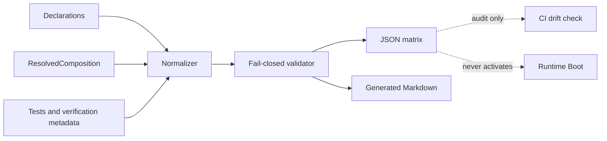

# Agent Contract Matrix 自动生成规范

> 状态：目标设计已确认；P2 generator、双产物与 `--check` 已实施，完整全仓 G2 仍待执行。
>
> 本规范定义 P2 的只读审计产物：从插件 manifest、Service Definition、Session Codec、Agent Loop surface、Profile/Bundle/Patch 和 package exports 生成契约矩阵。矩阵用于发现漂移和审查覆盖，不成为 Runtime 的第二套配置或运行时事实源。

## 1. 决策摘要

契约矩阵由声明和解析结果生成，不由人工维护。生成器必须在同一输入上同时产出机器可读 JSON 和人可读 Markdown：

```text
manifest / definitions / codecs / loop surface / composition / exports
                              ↓
                    normalize + validate
                              ↓
                artifacts/agent-contract-matrix.json
                              ↓
          docs/.../agent-contract-matrix.generated.md
```

生成器是 P2 的审计工具，不负责加载插件、创建 Provider、打开 Session、执行工具或改变 Boot 行为。`ResolvedComposition/BootManifest` 仍是唯一的激活事实源。

## 2. 产物和可重复性

固定产物路径：

- `artifacts/agent-contract-matrix.json`：供 CI、脚本和下游检查读取的规范化数据。
- `docs/design-docs/agent-plugin-runtime/agent-contract-matrix.generated.md`：供人审阅的生成文档，文件头必须标注“generated; edit source declarations instead”。

JSON 不写入当前时间、随机 id 或本机绝对路径。顶层使用 `sourceDigest` 标识输入快照；同一源码和配置输入必须得到字节稳定的 JSON/Markdown。若工具需要记录版本，使用固定的 generator version，不使用运行机器信息。

## 3. 输入边界

生成器只读取以下已声明入口：

| 输入 | 读取内容 | 目的 |
| --- | --- | --- |
| Plugin manifests / Entry metadata | plugin id、Entry id、provides、injects、events、capabilities、codec owner | 检查插件 admission 和依赖声明 |
| Service Definitions / Providers / Consumers | Service ID、ABI、scope、required、owner、provider、consumer | 检查三层 Service contract |
| Session Journal registry | 13 个核心事件、扩展事件、Codec、Surface、producer status | 检查 durable event 覆盖和恢复边界 |
| Agent Loop surface | 9 个 Cordis 插入事件、5 个通知事件、顺序、scope、containment | 检查插件干预和通知 contract |
| Profile / Bundle / Patch result | ordered entries、patch result、Host ceiling、digest | 检查组合输入和最终 admission |
| package exports / dependency metadata | public exports、package owner、依赖方向 | 检查 Consumer 是否绕过 Definition |
| verification metadata | contract test、golden、process smoke、manual gate | 关联每条契约的证据状态 |

读取入口必须是显式 allowlist；不能扫描整个仓库后凭文件名猜测业务含义，也不能读取 Session 数据、凭据、`.env`、用户 workspace 或外部网络。

## 4. 数据模型

顶层结构固定为：

```ts
interface AgentContractMatrixV1 {
  schemaVersion: 1
  generatorVersion: string
  sourceDigest: string
  services: readonly ServiceContractRow[]
  events: readonly EventContractRow[]
  sessions: readonly SessionContractRow[]
  capabilities: readonly CapabilityContractRow[]
  plugins: readonly PluginContractRow[]
  packages: readonly PackageContractRow[]
  verification: readonly VerificationRow[]
  diagnostics: readonly MatrixDiagnostic[]
}
```

每一行都必须带稳定 `id`、`kind`、`owner`、`sourceRefs` 和 `status`；契约行按 `kind`、再按 `id` 排序。公共字段的语义如下：

| 字段 | 约束 |
| --- | --- |
| `kind` | `service`、`event`、`session`、`capability`、`plugin`、`package`、`verification` |
| `status` | `active`、`optional`、`missing`、`degraded`、`deprecated`、`unimplemented` |
| `owner` | 声明该契约的 package/plugin id，不允许空值 |
| `producerStatus` | `present`、`none`、`not-implemented`；专用于事件和 Session codec 行 |
| `required` | admission 或恢复是否必须满足 |
| `tests` | 稳定测试 id 列表，不放机器绝对路径 |
| `sourceRefs` | 仓库相对路径 + symbol/anchor，供审阅回溯 |

事件行必须区分“codec 已存在”和“当前没有 producer”。因此 `goal/*`、`schedule/*` 等未来事件可以显示 `producerStatus: not-implemented`，不能被误报为已支持。13 个 Session 核心事件、9 个 Loop 插入事件和 5 个通知事件必须各自拥有固定分类和 scope 字段。

## 5. 归一化和校验规则

生成器在写产物前执行以下 fail-closed 检查：

1. 重复 plugin id、Entry id、Service ID、Event id 或 Codec namespace。
2. manifest 的 `provides/injects` 与 Service Definition、`ctx.provide`、`static inject` 结果不一致。
3. required Service 没有唯一 Provider，或存在两个 active Provider。
4. Consumer 直接依赖 Provider 私有 class、未导出的 symbol 或禁止的反向 package 边。
5. durable Event 缺少 codec、owner、scope、顺序元数据或测试证据。
6. Loop 插入事件缺少 `next()`/waterfall、serial bail、parallel 或 containment 语义；通知事件被错误标记为可 veto。
7. Profile/Bundle/Patch 的最终 entries 与 `ResolvedComposition` digest 不一致，或 Host ceiling 被 Patch 扩大。
8. package public export 缺少矩阵中声明的 Definition、Provider、Consumer 或 Codec。
9. sourceRef 指向不存在的相对路径或稳定 symbol。
10. 生成输入含有绝对路径、credential、Session 内容或非确定性字段。

诊断分为 `error`、`warning`、`info`。任何 `error` 都使生成命令失败并禁止更新产物；只有 `warning/info` 时才允许写入。`--check` 模式不写文件，只比较工作区产物与重新生成结果。

## 6. CI 和开发命令

P2 引入一个明确命令（脚本名可在实施时落到根 `package.json`，语义不可变）：

```bash
pnpm run gen:contract-matrix
pnpm run gen:contract-matrix --check
```

CI 至少执行 `--check`、`pnpm run check:packages`、`pnpm run check:current-docs` 和相关 package contract tests。开发者修改 manifest、Definition、Codec、Loop surface 或 Profile/Bundle/Patch 后，必须重新生成并审阅 JSON diff；不得手改 generated Markdown 来消除失败。

## 7. 与运行时的关系



矩阵可以被 review、release gate 和 Agent evaluator 消费，但不能被 Runtime 反向读取来决定要加载哪些插件或 Service。若矩阵与 BootManifest 冲突，先修正声明/Composer，再重新生成；不能在生成器里添加例外映射。

## 8. 验收标准

1. 同一输入重复生成得到相同 `sourceDigest`、JSON 和 Markdown。
2. 13 个 Session 核心事件、9 个 Loop 插入事件、5 个通知事件全部出现，并带正确分类、scope、producer/codec 状态。
3. `goal/*`、`schedule/*` 等未实现事件明确显示 `unimplemented/not-implemented`，不会伪装成 active。
4. Service Definition/Provider/Consumer、Profile/Bundle/Patch、Host ceiling 和 package export 的漂移能被 fixture 触发并 fail closed。
5. 生成文档包含每行的 owner、sourceRefs 和测试证据，且不泄露凭据或绝对路径。
6. `--check` 能检测手工篡改 JSON/Markdown、漏提交生成产物和输入变化。
7. 生成器不改变 Runtime、Session、Tool executor、Cordis Loader 或 CLI run 的行为。

## 9. 回退和非目标

P2 只新增生成器、schema、产物和 CI 检查；回退时删除生成脚本和 generated artifacts 即可，不触碰 Session 数据或运行时服务。它不实现 goal/schedule、在线插件发现、远程 registry、代码生成 TypeScript、自动修复声明或 CLI chat。

## 10. 参考

- [Session Core 与 Persistence Provider 分离规范](./agent-spec-session-core-persistence-separation.md)
- [Service Definition / Provider / Consumer 分层规范](./agent-spec-service-definition-provider-consumer.md)
- [Profile / Bundle / Patch 分层规范](./agent-spec-profile-bundle-patch-layering.md)
- [DSH 风格 Session 事件模型](./agent-spec-dsh-event-model.md)
- [Agent Loop Cordis 插入面与通知面](./agent-spec-agent-loop-cordis-surface.md)
- [插件 Runtime ABI](./agent-spec-plugin-runtime-abi.md)
- `tmp/deepseek-harness/packages/core/session/src/types.ts`
- `tmp/deepseek-harness/packages/session/session-persistence/src/index.ts`
