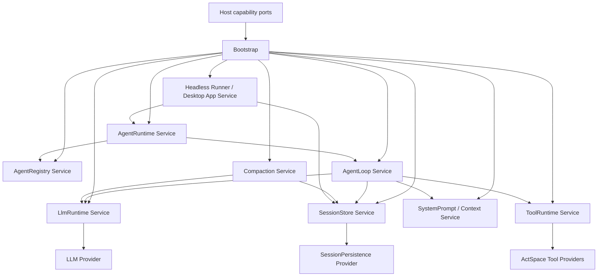

# 核心 Cordis Service 化与能力 seam 规范

> 状态：P0 已实现；P1-B Service Definition / Provider / Consumer contract 仍按独立计划收口。启动与应用职责已按当前 Profile-first 校准；基础 BootedProfile 与生产 BootedRuntimeProfile 的区别见 [Runtime 文档](agent-target-runtime-architecture.md)。
>
> 本文承接 ActSpace 已完成的 DSH-native Boot、`cordis.yml`、`apply(ctx, config)`、Session 事件和 AgentLoop 启动工作，专门规定下一轮“核心运行时能力 Service 化”的边界。本文是设计规范，不授权开始代码实施；对应执行步骤见 [核心 Cordis Service 化计划](../../exec-plans/completed/20260829-actspace-core-cordis-services/README.md)。

> 阅读分工（2026-09-09）：本文保留 P0 Service 化的领域职责和历史设计推导；当前三层 ABI、Service ID、ownership 与剩余实施差距统一维护在 [Service Definition / Provider / Consumer](agent-spec-service-definition-provider-consumer.md)。以下迁移措辞和 append 示意属于当时设计，不应覆盖当前 SessionPersistenceDriver 与 write-behind 实现。

## 1. 决策摘要

ActSpace 采用 DSH 的核心原则：长期存在的运行时能力由 Cordis Service 创建、注入、观测和释放，Bootstrap 负责启动插件树；生产入口返回 `BootedRuntimeProfile`，产品操作由 Profile App Bundle Service 提供。

这里的“Service 化”不是把所有 class 都改成 `extends Service`，而是把拥有运行时状态、外部资源、事件注册或可替换能力的对象纳入 Cordis 生命周期；纯数据对象、事件值、codec 和具体工具 executor 仍保持普通领域实现。

目标结构：

```text
Host capability ports
        ↓
固定 Bootstrap 创建 Cordis root
        ↓
cordis.yml / Bundle / Patch
        ↓
Cordis Service graph
        ↓
Headless Runner / Desktop App Service
        ↓
CLI / Desktop Host
```

Runtime 不再通过 `new SessionStore()`、`new LlmService()`、`new ToolRuntime()`、`new AgentLoop()` 拼装业务内核，也不再通过 `serviceValues` 或 `activate()` service map 承担第二套服务容器。

## 2. 范围与非目标

### 2.1 包含

- `SessionStore`、`SessionPersistence`、`LlmRuntime`、`ToolRuntime`、`SystemPrompt`、`AgentRegistry`、`AgentLoop`、`Compaction`、`AgentRuntime` 的 Service 所有权和依赖边界；
- Service Definition / Provider / Consumer 三层能力 seam；
- `static inject`、`static Config`、`ctx.effect`、错误和 dispose 契约；
- Session live log 与持久化后端分离；
- Agent、Subagent、Tool execution 的作用域和资源归属；
- Runtime Boot、Profile 生命周期与 Host capability 的收缩边界；
- 13 个核心 Session 事件、9 个 Agent Loop 干预事件、5 个主要通知在新 Service 图中的位置；
- 保留 ActSpace 具体工具 executor 的参数、路径、安全和结果行为。

### 2.2 不包含

- 不重写 `read`、`list`、`grep`、`edit`、`write`、`bash` 或 Browser Bridge 的具体执行函数；
- 不实现 CLI chat UX、Goal/Schedule producer、在线 HMR 或配置热替换；
- 不引入不可信插件的签名、市场、远程下载或进程沙箱；
- 不改变 13 个核心 Session 事件的名字、顺序和恢复语义；
- 不将同进程 Context、Session writer 或 Service 实例序列化到 IPC 或 renderer；
- 不在本规范中承诺 SQLite、远程 Session 或其他未来 Provider 已经实现。

## 3. 核心概念

| 概念 | 责任 | 是否由 Cordis 创建 |
|---|---|---:|
| Domain object | 纯数据、值对象、一次调用的 prepared state | 否 |
| Service Definition | 稳定接口、类型、事件和错误契约 | 通常否，作为公共包导出 |
| Service Provider | 一个可替换实现，例如 JSONL、pi-ai、本地工具执行器 | 是 |
| Consumer | 使用 Definition 的 AgentLoop、CLI、Projection 或工具 schema | 是或由同进程 Host 消费应用 Service |
| Runtime Service | 拥有长期状态、注册表、监听器和异步资源的服务实例 | 是 |
| Bootstrap | 创建 root、安装 Loader、注入 Host、等待 settlement、关闭 root | 固定启动代码，不是业务 Service |
| Profile 启动结果 | Context、manifest、诊断与 shutdown；业务操作属于 App Service | 由 Bootstrap 在 settlement 后发布 |

一个能力只有在 Definition、Provider、Consumer 三者边界足够独立时才称为 seam。一个包可以暂时承担多个角色，但 Consumer 不得依赖 Provider 的私有 class。

## 4. Service 所有权矩阵

| 能力 | Canonical Service | Definition | Provider / 注册贡献 | 主要 Consumer |
|---|---|---|---|---|
| Session live log | `SessionStore` | Session、SessionEvent、append、surface、replay | Session plugin | AgentLoop、Projection、UI adapter |
| Session durability | `SessionPersistence` | locate/create/append/flush/load/recovery | JSONL；未来 SQLite | SessionStore adapter、resume、CLI |
| LLM | `LlmRuntime` | route、model、PreparedCall、stream、failure | pi-ai/provider adapters | AgentLoop、Compaction、title |
| Prompt / Context | `SystemPrompt` / `ContextAssembler` | contributor、request snapshot、tool schema | prompt/context contributors | AgentLoop、CLI inspect |
| Tools | `ToolRuntime` | definition、prepared execution、policy、result | core-tools、browser-tools、future providers | AgentLoop、Subagent |
| Agent | `AgentRegistry` | Agent、scope、inbox、lifecycle | main/subagent registrations | AgentLoop、App Service |
| Loop | `AgentLoop` | turn/step/request contract、9 intervention events | default loop driver | AgentRuntime、Headless runner |
| Compaction | `Compaction` | policy、region、summary、recovery | basic summarizer/provider | AgentLoop event consumer |
| Run orchestration | `AgentRuntime` | run/followup/abort/idle facade | headless/subagent drivers | App Service、Headless runner |

### 4.1 不应 Service 化的对象

以下对象保持纯实现：

- Session event envelope、Message、ToolCall、ToolResult、Request snapshot；
- codec、schema validator、surface fold、replay projector；
- 一次 LLM `PreparedCall` 和一次 Tool `PreparedExecution`；
- 具体工具 executor body 和 Browser Bridge 协议转换函数；
- policy 的纯判断函数、compaction region 选择函数、序列化函数。

这些对象可以被 Service 持有或调用，但不应拥有 Context、全局注册表或独立 dispose。

## 5. 依赖图与禁止环



必须保持以下方向：

```text
AgentRuntime → AgentRegistry
AgentRuntime → AgentLoop
AgentLoop → Session / LLM / Prompt / Tools
Compaction → Session / LLM，并通过事件介入 Loop
SessionStore → SessionPersistence adapter
```

禁止出现：

- `SessionPersistence → SessionStore` 的反向业务依赖；
- `AgentRegistry → AgentRuntime` 或 `AgentRegistry → App Service`；
- Tool executor 直接依赖 Runtime、写 Journal 或写 CLI stdout；
- Runtime 读取 Service 私有字段、绕过 Definition 取得 Provider；
- Service 之间通过模块级可变 singleton 共享状态。

## 6. Service ABI

### 6.1 最低契约

每个运行时 Service 必须满足：

1. 由 `apply(ctx, config)` 或 Cordis Loader 创建；
2. 依赖通过 `static inject`、Context service 或明确 Host port 获取；
3. 配置通过 `static Config` 或等价的 schema 校验；
4. listener、timer、watcher、subprocess、socket、lease 和后台任务由 `ctx.effect()` 绑定；
5. disposer 幂等、可等待，并覆盖已启动的异步工作；
6. required 依赖缺失时 fail closed；optional 能力缺失时明确降级并产生 diagnostics；
7. Service 不把 Context、Fiber 或私有实现对象暴露给 Host/IPC。

### 6.2 生命周期

```text
import / validate
    → apply(ctx, config)
    → resolve inject
    → construct Service
    → register contributions and effects
    → ACTIVE
    → quiescing: reject new work
    → drain in-flight work
    → flush owned durability
    → dispose effects
    → DISPOSED
```

Service 激活失败必须让 Loader settlement 失败，并释放已建立的 Effect。不得发布一个缺少 required provider 的半初始化 Profile 启动结果。

## 7. 各 Service 的边界

### 7.1 `SessionStore`

`SessionStore` 是 Session live log 的唯一入口：创建/恢复 Session、append、surface/replay 查询和 Session lifecycle。它只产生已提交的 `session/event`，不直接知道 JSONL 文件布局。

Session append 的推荐语义：

```text
validate → append in-memory → update surface → emit session/event
                                      ↓
                              persistence subscriber
                                      ↓
                              session/flush
```

现有的 13 个核心事件、扩展事件 codec、连续 seq、recovery 和 `session/end-seed` 保持不变。

### 7.2 `SessionPersistence`

`SessionPersistence` 是抽象 Definition/Service，不是某个 JSONL class 的别名。它负责 locate/create/append/load/inspect/list、durability checkpoint、interrupted tail repair 和恢复平衡，以及 raw artifact 与 Session header 的存储边界。

JSONL provider 继续复用 ActSpace 当前 writer/recovery 算法。未来替换 provider 时，SessionStore、AgentLoop 和 UI 不改。

### 7.3 `LlmRuntime`

`LlmRuntime` 拥有 route/provider registry、模型解析、默认参数、retry policy 和 one-shot PreparedCall。Provider adapter 只负责 wire/protocol，不能被 AgentLoop 直接导入。

每次请求必须捕获本次 route registration 和配置快照；provider replacement 不得改变已经开始的 stream。

### 7.4 `SystemPrompt` 与 `ContextAssembler`

System prompt、tool schema、workspace facts、skills 和 context contributor 通过 Definition 注册。每次模型请求生成不可变 request snapshot，并由 Session 事实证明模型看到的内容。

`ContextAssembler` 是纯组装逻辑；拥有 contributor registry、缓存或监听器的部分由 Service 承担。

### 7.5 `ToolRuntime`

`ToolRuntime` 是权限、审批、hook、调度、lease、result 和事件的 Service。具体工具执行器作为 Provider 注册：

```text
ToolRuntime Definition
  ├── core-tools Provider → read/list/edit/write/bash
  ├── browser-tools Provider → Browser Bridge
  └── future Provider → remote/sandbox executor
```

工具 executor 不得改变以下既有行为：参数、路径边界、排序、截断、编码、错误、artifact、redaction 和可观察副作用。

### 7.6 `AgentRegistry`

`AgentRegistry` 拥有 Agent 实例、稳定 Agent id、Agent scope、inbox 和生命周期事务。每个 Agent 的 subject 与 scope carrier 必须绑定，不能用共享 descriptor id 代替实例作用域。

创建事务应遵循：

```text
prepare → create child scope → setup listeners/contributions
        → enter registry → announce agent/created
```

announce 失败时，创建的 Agent、scope 和 Effect 必须回滚。

### 7.7 `AgentLoop`

`AgentLoop` 是唯一的 turn/step driver，注入 Session、LLM、Prompt、Tools、AgentRegistry、Scope 和可选 Compaction。9 个干预点通过 Context 事件进入，不能再由 Runtime 传入任意 EventHub 作为主 ABI。

Loop 只执行 Agent 语义，不负责选择 JSONL backend、解析 CLI argv 或写 stdout。

### 7.8 `Compaction`

Compaction 是可选 Service/Provider，通过 `agent/pre-step` 和 `agent/request-error` 介入。它拥有 policy、region selection、summarizer 和 compaction events，但不成为 AgentLoop 的硬编码分支。

没有 Compaction provider 时，AgentLoop 仍可运行；如果 profile 将其声明为 required，Boot 必须拒绝启动。

### 7.9 `AgentRuntime`

`AgentRuntime` 是薄的运行编排 Service：管理 main/subagent、RunController、followup、abort、idle/quiescence 和 Host facade 所需查询。它不重新实现 Session、Loop、Tool 或 LLM。

应用 Service 通过已注入的领域契约执行任务；Host 不将内部 assembly、writer 或 Service 实例传入 IPC/renderer。

## 8. 事件与持久化边界

事件分为四类：

| 类别 | 例子 | 是否持久化 | 调度 |
|---|---|---:|---|
| Session facts | `turn/start`、`assistant/message`、`tool/result` | 是 | append + `session/event` |
| Loop interventions | `agent/pre-step`、`agent/request`、`tools/execute` | 否 | waterfall/serial |
| Runtime notifications | `agent/status`、`agent/error`、`tools/result` | 否 | non-blocking emit |
| Durability checkpoint | `session/flush` | 否 | awaited parallel |

`session/event` 表示事实已被 Session 接受并提交；`session/flush` 表示持久化 subscriber 已完成 durable checkpoint。两者不能混成一个含义。

Waterfall 必须支持真实 `next()` around middleware：listener 可以修改输入、调用下游、修改结果或短路。通知 emit 必须逐 listener 隔离同步 throw 和异步 rejection，不能让一个观察者阻断 Agent Loop。

## 9. Runtime 收缩规则

### Bootstrap 保留

- 创建一个 Cordis root；
- 安装 Loader/Include/Group/Timer；
- 注入 Host capability ceiling；
- 加载 `cordis.yml` / Bundle / Patch；
- 等待 settlement 和 required Service validation；
- 发布生产 BootedRuntimeProfile；
- 执行 quiesce、flush、dispose 和错误边界。

### Runtime 不再保留

- 手工 `new` 核心 Service；
- `serviceValues` 作为第二套依赖容器；
- 通过 `activate()` 返回 service map 作为默认激活协议；
- 读取 `plugins.json` 决定默认生产插件；
- 直接构造 AgentLoop、Inbox、Session writer；
- 读取 Provider 私有字段或执行具体工具；
- 让 CLI/Desktop 维护第二套 Agent Loop。

## 10. 失败、回退与观测

### 启动失败

```text
import/config/inject/app/settlement failure
    → 不发布可用的 Profile 启动结果
    → dispose partial Context
    → diagnostics 包含 entry、plugin、service 和依赖链
```

### 运行失败

- Service 自己记录结构化 diagnostics；
- Session facts 仍按已提交边界可重放；
- observer failure 不改变已提交事实；
- 工具/LLM lease 在 dispose 前必须 settle 或协作取消；
- 第二次强制退出可以放弃未完成 flush，但必须报告未完成项。

### 回退

本计划不删除用户 Session 数据、不改变工具 executor、不做双写。实现阶段如遇 Service 化回归，只回退对应 Service seam 或 provider 适配；不得重新引入默认双 Runtime 或隐式 legacy fallback。

## 11. 验收标准

完成后必须能证明：

1. 默认 Boot 只加载 Cordis plugin tree，核心 Service 没有 Runtime 手工实例化路径；
2. `SessionStore` 不直接依赖 JSONL/SQLite provider，`session/event` 与 `session/flush` 语义可独立测试；
3. LLM provider 替换不改 AgentLoop；Tool provider 替换不改 AgentLoop 和工具 schema；
4. AgentLoop、AgentRegistry、AgentRuntime 不形成生命周期环；
5. 每个 Service 的 `inject`、Config、Effect cleanup、缺失依赖和重复 dispose 有 contract tests；
6. 两个 Agent 的 scoped events 不串线，父 scope/child scope 的可见性有测试；
7. 13 核心事件、9 干预事件、5 通知事件和工具行为 parity 全部保持；
8. CLI 单次 run 仍然满足 boot → followup → inbox → turn → flush → end-seed → dispose；
9. Context 只供受信任的同进程调用方消费；Fiber、Session writer、Provider class 和具体 AgentLoop 实例不进入 IPC/renderer；
10. `pnpm -r typecheck`、`pnpm -r test`、文档/包边界/legacy removal 检查通过。

## 12. 选择与排除

选择 Service Graph，而不是继续扩充 Runtime central registry，原因是依赖、生命周期和可替换 provider 可以局部验证和卸载；中心注册表会继续放大 Runtime 的 privileged core。

不照搬 DSH 的极端包粒度：ActSpace 只拆真正有替换价值的 seam。也不照搬 DSH 工具 executor：保留 ActSpace 具体工具实现，把 DSH 的 Service Definition、事件和权限外壳吸收进来。

本规范的脆弱假设是：ActSpace 当前使用的 Cordis 版本足以表达 typed Service、inject、Effect 和真实 waterfall。如果该假设不成立，只允许在 `packages/cordis-adapter` 增加薄适配，不把自定义 EventHub 再次升级成业务公共 ABI。
