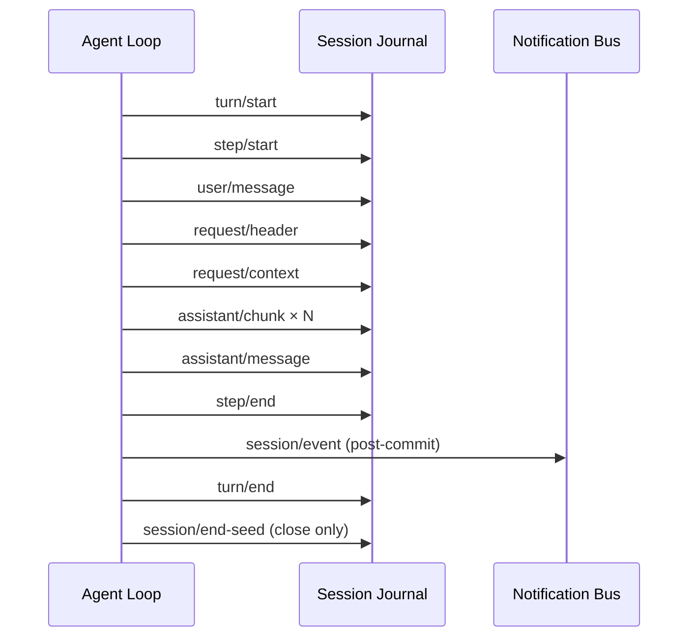
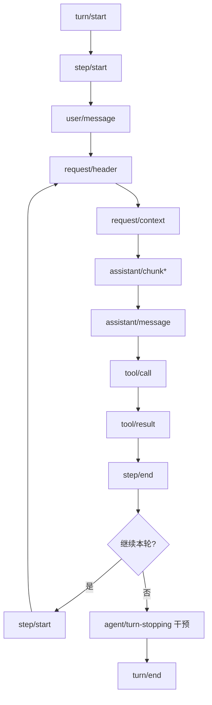

# DSH 风格 Session 事件模型

> 状态：13 个核心事件与默认 Loop 已实现；最终 CLI retry/error 验收仍待完成。2026-09-09 按 ActSpace 当前 codec / Session Format v1 校准 seq 描述。
>
> 日期：2026-08-29

本文定义 ActSpace 重构后的 Session 事实流。目标是把 DeepSeek Harness（DSH）已经验证的事件分层、顺序和可重放语义作为新的核心模型；不保留旧 ActSpace 事件名称或兼容分支。当前 CLI 只实现一次无头 `run`，`chat` 不在本轮范围内。

## 1. 依据与边界

当前事件词汇与 envelope 以 ActSpace `packages/session/journal/src/core-codecs.ts`、默认 Agent Loop 和 [Session Format v1](agent-spec-session-format-v1.md)为准。以下保留 2026-08-29 设计时的参考资料顺序，不覆盖当前实现：

1. `tmp/deepseek-harness/packages/core/session/src/types.ts` 与 `tmp/deepseek-harness/packages/core/agent-loop/src/agent.ts` 的源码行为；
2. `tmp/deepseek-harness/docs/persistence-catalog.md` 的持久化目录；
3. `/Users/wakeup-jin/Downloads/session/干预主链和相关通知.md` 的三平面整理；
4. 当前 ActSpace 工具执行器的行为测试和实现。

本文只规定 Session 事件、重放和事件到 UI/通知的投影。Cordis 插入点见 [Agent Loop Cordis Surface](./agent-spec-agent-loop-cordis-surface.md)，工具内核与可替换外壳见 [Tool Runtime Boundary](./agent-spec-tool-runtime-boundary.md)。

## 2. 三个事件平面

| 平面 | 标记 | 目的 | 是否进入 Session JSONL |
|---|---|---|---|
| 持久化事实 | `[S]` | 可重放、可恢复、可审计的唯一事实源 | 是，按 `seq` 追加 |
| Agent Loop 干预 | `[I]` | Cordis waterfall/serial 的运行时插入点 | 否；干预结果通过 `[S]` 事实体现 |
| 通知 | `[N]` | 低延迟 UI、宿主和观测订阅 | 通常否；`session/event` 只是在提交后广播 `[S]` |

`[I]` 事件不能悄悄改变已提交事实；任何改变都必须在后续持久化事件中可见。`[N]` 事件丢失不影响 Session 恢复，通知消费者必须能从 `[S]` 重建状态。

## 3. 13 种核心持久化事件

以下 13 种来自 DSH `SessionEventMap`，是 Agent Loop 的最小持久化核心，名称和语义固定：

| 事件 | 写入时机 | 关键数据 | Surface |
|---|---|---|---|
| `turn/start` | 一轮开始 | `turnId`, `agentId`, `inputMessageId` | internal |
| `turn/end` | 一轮结束 | `turnId`, `status`, `reason`, `usage` | internal |
| `step/start` | 每个模型/工具步骤开始 | `turnId`, `stepId`, `attempt` | internal |
| `step/end` | 步骤完成或失败 | `stepId`, `status`, `reason`, `usage` | internal |
| `user/message` | 用户输入或 Agent 注入的用户消息 | `messageId`, `content`, `source` | user |
| `assistant/chunk` | LLM 流式增量到达 | `messageId`, `chunkIndex`, `delta`, `finishReason?`, `usage?` | assistant |
| `assistant/message` | 一条 Assistant 消息收束 | `messageId`, `content`, `sourceEventSeqs`, `usage`, `finishReason` | assistant |
| `tool/call` | 模型请求执行工具 | `toolCallId`, `name`, `arguments`, `stepId` | internal |
| `tool/result` | 工具执行完成 | `toolCallId`, `status`, `output`, `artifacts`, `error?` | tool-result |
| `todo/write` | Todo 状态写入 | `items`, `revision`, `source` | internal |
| `request/header` | 请求头部快照 | `requestId`, `model`, `provider`, `headers`（已脱敏） | internal |
| `request/context` | 发送给模型的上下文 | `requestId`, `messages`, `system`, `tools`, `sourceRefs` | internal |
| `session/end-seed` | Session 关闭前的确定性收尾种子 | `sessionId`, `lastSeq`, `reason` | internal |

### 3.1 正常无工具顺序



`user/message` 必须位于 `turn/start` 之后；根 Agent 的外部输入也先进入同一条 Inbox/消息入口，不允许绕过事件模型。

### 3.2 含工具的多步骤顺序



一次模型请求对应一个 `step`。工具调用完成后，如果模型需要继续生成，则开启新的 `step`；重试仍属于同一 `step`，通过扩展事件记录，而不是伪造新的 `turn`。

## 4. Event Envelope

所有 `[S]` 记录使用统一 Envelope，JSONL 每行一个完整对象：

```text
recordKind   = "session-event"
seq          = 从 0 开始严格连续的 session 内序号；Header 不占 seq
type         = 上述事件名
eventVersion = 事件 codec 版本，当前从 1 开始
criticality  = "core" | "extension"
time         = RFC3339 UTC 时间
source       = { agentId, turnId?, stepId?, runtimeInstanceId }
data         = 事件 payload，禁止把 UI 临时字段塞入此处
surface      = "internal" | "user" | "assistant" | "tool-result"
provenance   = { sourceEventSeqs?, parentSeq?, generatedBy? }
```

`seq` 只由 Journal 分配，调用方不得自行生成。2026-09-09 按当前 codec、Journal 和 [Session Format v1](agent-spec-session-format-v1.md) 校准起点；此前从 1 开始的描述是文档错误，本次不修改任何事件或用户数据。`provenance.sourceEventSeqs` 用于把收束后的 `assistant/message` 链回它所聚合的 chunk；任何 projection 都可以依此去重和重建。

Journal 的 append 是唯一提交点：先校验 codec 和序号，再写入文件并完成 flush/同步，最后异步发布 `session/event` 通知。通知失败不得回滚已提交事实。

## 5. DSH 持久化扩展目录

13 种事件是核心，不代表持久化目录只有 13 种。ActSpace 预留并实现 codec/replay 的扩展分类如下：

| 分类 | 事件 |
|---|---|
| LLM 重试 | `llm/retry`, `llm/retry-started` |
| 压缩 | `compaction/start`, `compaction/summary`, `compaction/prune`, `compaction/end` |
| 审批与权限 | `approval/asked`, `approval/decided`, `approval/policy`, `permission/preset` |
| Hook 与命令 | `hook/invoked`, `hook/result`, `command/run`, `command/done` |
| 工具工作流 | `tool-workflow/agent-start`, `tool-workflow/agent-end`, `tool-workflow/run-start`, `tool-workflow/run-end`, `tool/code-dispatch-start`, `tool/code-dispatch` |
| Agent 与协作 | `agent/inbox/spliced`, `subagent/descriptor`, `agent-preset/selected` |
| 计划与运行模式 | `plan/mode`, `sandbox/mode`, `goal/change`, `schedule/change` |
| Session 与用户反馈 | `session/title`, `session/title-llm-request`, `feedback/record` |
| 外部请求 | `web/deepseek-search-llm-request` |

`goal/change` 和 `schedule/change` 本轮只建立 codec、replay 和未知事件治理；当前没有 Goal/Schedule producer，不因提前建模而虚构运行时能力。扩展事件不能改变 13 种核心事件的顺序和含义。

### 5.1 明确删除的旧事件

以下旧 ActSpace 名称不再存在，也不提供兼容读取：

- `turn/started`, `turn/completed`, `step/started`, `step/completed`；
- `request/snapshot`；
- `llm/chunk`, `llm/usage`, `llm/error`, `llm/aborted`；
- 任何把工具权限、审批或 UI 临时状态冒充核心事件的旧名称。

usage、finish、error、abort 都分别归入 `assistant/chunk`、`assistant/message`、`step/end`/`turn/end` 的结构化字段；重试用 `llm/retry*` 扩展事件表达。

## 6. 错误、取消与恢复

- Codec 缺失、Envelope 非法或 `seq` 断裂：fail closed，Journal 不提交该记录并报告结构化诊断。
- LLM 请求错误：在同一 `step` 内先写 `llm/retry-started`，重试结果写 `llm/retry`；重试耗尽后写 `step/end(status=error)` 和 `turn/end(status=error)`，通知面发 `agent/error`。
- 用户取消或 Host abort：停止流式消费，保留已写入 chunk，写收束的 `assistant/message`（如可形成）及 `step/end/turn/end(reason=aborted)`。
- 进程崩溃：恢复器以最后一个完整 JSONL 记录为边界，依据 `turn/start`、`step/start`、`tool/call` 与 `tool/result` 判定未闭合步骤；不重写历史，只从新 `step` 继续。
- `session/end-seed` 只在正常 flush/dispose 路径写入，不能作为业务成功标志。

## 7. 表面投影

`surface` 是最小、稳定的 UI/Host 投影分类：

- `user`：用户可见输入消息；
- `assistant`：增量和收束后的 Assistant 输出；
- `tool-result`：脱敏后的工具结果和 artifact 摘要；
- `internal`：turn/step/request/todo 等只供恢复、诊断和开发者观测。

默认 CLI `run` 输出 JSONL 只发布 `assistant`、`tool-result` 与最终状态；完整 `[S]` 事件仍写入 Session 文件，诊断走 stderr。任何 Host 都可以从 Journal replay 重新生成投影，不依赖 live 通知是否到达。

## 8. 非目标与验收门

本轮不做：Session 数据迁移、旧事件兼容、CLI chat、Goal/Schedule 业务 producer、工具具体 executor 重写。

设计完成的验收条件：

1. 13 种核心事件有唯一 codec、schema、golden JSONL 和 replay 测试；
2. 无工具、含工具、重试、错误、取消五种顺序都能由 `seq` 重放；
3. 扩展目录中的 codec 不影响核心事件，未知扩展按策略记录诊断或 fail closed；
4. `session/event` 只能在 append commit 后触发，通知丢失不会破坏恢复；
5. 任意 projection 只依赖 `surface` 和已提交事件，不读取 Agent Loop 私有状态；
6. 新格式从空 Session 开始，旧 Session 文件明确视为不可读。
