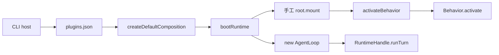
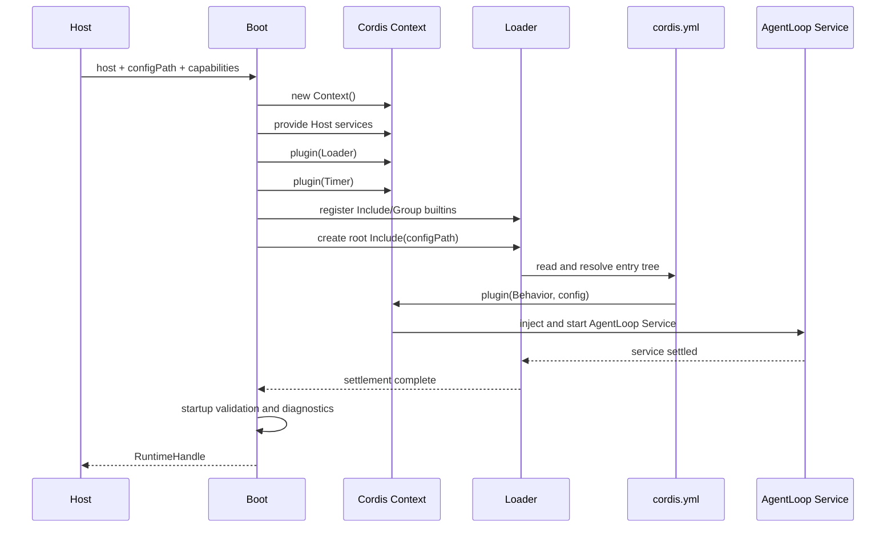
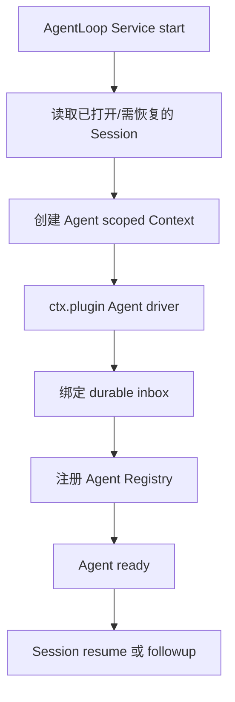
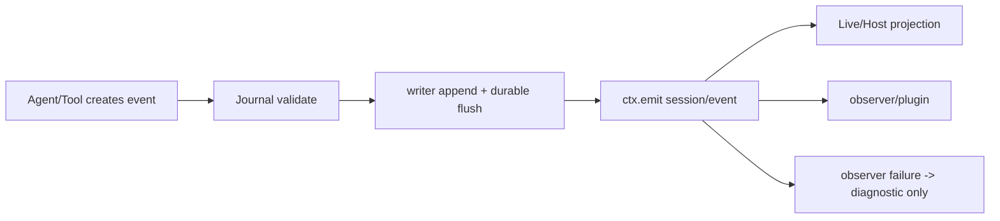

# DSH 风格插件组装与 Agent 启动规范

> 状态：已实现并通过自动化验证；真实 Provider、Electron/Chrome 与发行制品门禁仍待外部环境。本规范中的 RuntimeHandle 术语由 Profile-first 决策中的 `BootedProfile` / App Bundle Service 替代。
>
> 本文是 ActSpace 插件组装、Runtime Boot、AgentLoop Service 和 CLI 单次 run 的实施规范。它不修改或覆盖现有 P00/P04 计划；新建的执行计划负责本规范的实现，完成后再统一回写旧计划状态。
>
> 参考实现：`tmp/deepseek-harness` 固定源码快照中的 Cordis `Context`、`Loader`、`Include`、`Service`、`ctx.plugin()`、`ctx.on()`、`ctx.emit()` 和 headless boot。ActSpace 保留自身 Session、Tool、LLM 和 Host 语义，不直接复用 DSH 领域包。

## 1. 决策摘要

ActSpace 的默认插件启动路径改为 DSH-native 的可信同进程模型：

1. `cordis.yml` 是一次 Runtime 组合的唯一启动声明；默认路径不读取 `runtime-v2/plugins.json`。
2. Boot 创建真实 Cordis root `Context`，安装 Loader、Include、Group 和 Timer，然后由 Include 加载 `cordis.yml`。
3. 插件 Behavior 统一导出 `apply(ctx, config)`，拿到真实 Cordis `Context`，可以继续调用 `ctx.plugin()`、`ctx.on()`、`ctx.emit()` 和 `ctx.effect()`。
4. 有状态能力通过 Cordis Service 暴露。`AgentLoop` 是 Service，不由 Runtime 手工 `new`；它在 Session 创建或恢复时组装 Agent。
5. 用户输入调用 `agent.followup()`，先写入 durable inbox，再由 Agent driver claim 并调用 AgentLoop 执行 turn。
6. `session/event` 是 Journal append 成功后的通知事件，插件使用 `ctx.on('session/event')` 订阅；通知失败不得影响已提交事实。
7. Static Manifest、`activate()` 和 `activateBehavior()` 不属于默认激活协议。现有文件在迁移完成前只能作为 provenance、codec 资料或显式 legacy 入口，不得被默认 Boot 隐式调用。
8. 本轮只处理完全信任的同进程插件；不引入签名、沙箱、远程下载或市场安装。

## 2. 目标与非目标

### 2.1 目标

- CLI run 和 Desktop 使用同一个 Host-neutral Boot ABI；Host 只准备能力并取得 `RuntimeHandle`。
- 插件树、依赖、资源清理和 settlement 由 Cordis Loader/Fiber/Effect 管理。
- Agent、Session、Tool、LLM、Prompt、Compaction 和诊断能力都能作为 Context Service 注入。
- 每个 Agent 使用独立的 scoped Context 和 Agent id；不同 Session 的事件不会串线。
- 单次 headless run 可观测、可恢复、可有界关闭，并维持已经落地的 13 种核心持久化事件、9 个 Loop 插入点和 5 个通知事件。

### 2.2 非目标

- 不重写 Session JSONL、replay、recovery、fork 或 compaction 算法。
- 不重写 read/list/edit/write/bash/Browser 的具体 executor 和行为语义。
- 不实现 CLI chat 的交互 UX；chat 只共享新的 Boot ABI。
- 不实现 Goal/Schedule producer、实时 HMR、在线配置 reconcile 或不可信插件隔离。
- 不在本计划中修改旧 P00/P04 计划文件；其状态在本实现完成后统一处理。

## 3. 当前问题与切换边界

当前代码仍存在以下旧链路：



目标链路为：

```mermaid
flowchart LR
  A[CLI/Desktop Host] --> B[bootActSpaceRuntime]
  B --> C[真实 Cordis Context]
  C --> D[Loader + Include + Group + Timer]
  D --> E[cordis.yml]
  E --> F[Behavior.apply(ctx, config)]
  F --> G[Domain Services]
  G --> H[AgentLoop Service]
  H --> I[RuntimeHandle]
  I --> J[agent.followup]
  J --> K[durable inbox]
  K --> L[Agent driver claim]
  L --> M[AgentLoop turn]
```

默认生产调用链完成后，不得再通过 `loadConfiguredPlugins()`、`createDefaultComposition()`、`activateBehavior()` 或 Runtime 内部的 `new AgentLoop()` 组装主 Agent。

## 4. Host、Boot 与 Loader 契约

### 4.1 Host 责任

CLI/Desktop Host 只负责：

- cwd、workspace、data root 和 invocation metadata；
- credential resolver、LLM provider、approval broker、TTY/IPC、signal；
- Host capability services 和 artifact/output sink；
- 选择明确的 `configPath`，默认 CLI 使用 `apps/cli/cordis.yml`。

Host 不负责解析插件目录、拼接插件列表、手工创建 AgentLoop、写 Session Journal 或把 Cordis Context 穿过 IPC。

### 4.2 Boot 公开入口

Runtime 提供 Host-neutral 入口：

```ts
bootActSpaceRuntime({
  host,
  configPath,
  dataRoot,
  services,
  onLiveEvent,
}): Promise<RuntimeHandle>
```

`RuntimeHandle` 只暴露 Session、Agent、run、abort、flush、diagnostics 和 shutdown 所需的稳定方法；root Context、Fiber、Session writer 和具体 Service 实例不穿过 Host/IPC 边界。

### 4.3 固定启动顺序



Boot 只有在 Loader settlement、required Service 检查和启动诊断完成后才返回 `RuntimeHandle`。任一 Behavior 抛错、依赖缺失、依赖环或 settlement 超时都必须释放 root Context，不发布半成品 Handle。

## 5. `cordis.yml` 与 Behavior ABI

### 5.1 配置格式

配置采用 DSH Loader 的显式 Entry 列表。每个 Entry 至少包含稳定 `id` 和 `name`，可以包含 `config`、`inject`、`disabled` 或 Include 递归项：

```yaml
- id: session-journal
  name: '@actspace/session-journal/plugin'

- id: agent-loop
  name: '@actspace/core-agent-loop/plugin'
  config:
    maxSteps: 32
```

配置只表达组合和参数，不承担 Host secret。密钥通过 Context service 或 credential reference 注入。

### 5.2 Behavior 导出

新的插件入口契约为：

```ts
export type ActSpaceBehavior = {
  readonly inject?: readonly string[]
  readonly apply: (
    ctx: ActSpaceContext,
    config: Readonly<Record<string, unknown>>,
  ) => void | (() => void | Promise<void>) | Promise<void | (() => void | Promise<void>)>
}
```

模块可以导出 `apply` 函数，或导出带 `inject` 和 `apply` 的默认对象。适配器只负责把配置绑定到 Cordis plugin；传给 Behavior 的必须是真实 Context，而不是 `{ pluginId, entryId, config }` 的自定义对象。

Behavior 可以：

- `ctx.plugin(ChildPlugin, childConfig)` 继续组装子插件；
- `ctx.on(event, listener)` 注册随 Fiber 自动注销的监听；
- `ctx.emit(event, payload)` 发布通知或领域事件；
- `ctx.effect(setup, label)` 绑定 timer、watcher、subprocess、lease 等资源的清理；
- 通过注入 Service 获取 Session、Tool、LLM、Prompt、Agent 和 Host capability。

Behavior 顶层模块评估不得启动进程、创建 timer/watcher、注册全局 listener、写 Session 或修改外部状态。

### 5.3 Service 规则

- Service 依赖通过 Cordis `inject`/`static inject` 声明；不得从 Runtime 全局 Map 偷取隐式依赖。
- Service 的资源只能在 Context/Fiber 生命周期内持有，并由 Effect/dispose 回收。
- required Service 缺失时 Boot fail closed；optional capability 缺失时由插件明确降级并产生诊断。
- 插件不得扩大 Host capability ceiling；Context 只能提供 Host 已声明的能力。

## 6. AgentLoop Service 与 Agent 组装

### 6.1 Service 所有权

`AgentLoopService` 负责 Agent 的创建、恢复、查找、driver 调度和关闭；它不把 Agent 运行状态放在 Runtime 模块级单例中。

它注入：

- Session store/persistence 和已有 codec registry；
- LLM、Prompt/Request assembler、Tool Runtime、Approval；
- Compaction、Agent Registry、Scope factory；
- Cordis Context 和 Agent/Session 事件能力；
- Host-neutral runtime metadata。

### 6.2 Agent 实例

每个 Session 对应一个稳定 Agent 实例：

```ts
export interface Agent {
  readonly agentId: string
  readonly sessionId: string
  readonly scope: AgentScope
  followup(content: RuntimeV2JsonValue, options?: FollowupOptions): Promise<RunTurnResult>
  abort(reason?: string): boolean
  waitForIdle(): Promise<void>
  dispose(): Promise<void>
}
```

Agent scope 必须使用实例化后的 Agent id，例如 `main:<sessionId>`，不能使用所有主 Agent 共用的 descriptor id `actspace.main`。

### 6.3 Agent 创建/恢复



Agent 创建只发生在 Service/driver 生命周期内。RuntimeHandle 通过 Agent Service 查找 Agent，不直接实例化 Loop 或 Inbox。

## 7. `agent.followup()` 与 durable inbox

`followup()` 的顺序是强约束：

1. 校验 Agent/Session 仍接受工作；
2. append `agent/inbox/spliced` 的 enqueue 事实并等待其 durable 提交；
3. 发出 `agent/inbox/inserted` 通知；
4. driver claim `next-step` 或 `next-turn`；
5. claim 成功后才创建 Turn 并进入 AgentLoop；
6. Turn 结束后返回结果，或在 abort/error 时写入对应终止事实。

```mermaid
sequenceDiagram
  participant Caller
  participant Agent
  participant Session
  participant Driver
  participant Loop as AgentLoop

  Caller->>Agent: followup(content)
  Agent->>Session: append inbox enqueue
  Session-->>Agent: durable seq
  Agent->>Agent: emit agent/inbox/inserted
  Agent->>Driver: schedule pending item
  Driver->>Session: claim inbox item
  Driver->>Loop: runTurn(claimed input)
  Loop->>Session: append turn/step/request/message facts
  Loop-->>Driver: RunTurnResult
  Driver-->>Agent: completion
  Agent-->>Caller: RunTurnResult
```

`RuntimeHandle.runTurn()` 在新默认路径中不再是用户输入入口；如果保留该方法，只能作为对 `agent.followup()` 的 Host-neutral facade，不得绕过 inbox。

## 8. 事件接入与作用域

### 8.1 事件平面

- `[S]` Session durable facts：已有 13 种核心事件和扩展事件；由 Journal append/flush 保证恢复依据。
- `[I]` Agent Loop interventions：9 个 Cordis 插入点，使用真实 `ctx` 的 waterfall/serial 语义。
- `[N]` notifications：5 个主要通知，使用 `ctx.emit()`，丢失或失败只记诊断。

### 8.2 post-commit 规则



`session/event` 不能在 append 前发出，也不能成为恢复依据。高频 `assistant/chunk` 可以在通知面背压或丢弃，但不能丢 Journal 事实。

### 8.3 Cordis 事件语义

插件层不再依赖自定义 `EventHub` 作为默认 API。9 个插入点必须映射到 Cordis 的真实事件模式；EventHub 的迁移清理和最终删除由 [Cordis 原生事件 ABI 与 EventHub 退役规范](./agent-spec-cordis-event-abi-and-eventhub-retirement.md) 负责：

- waterfall：`system-prompt/assemble`、`agent/pre-step`、`agent/request`、`llm/stream`、`agent/request-error`、`tools/pre-execute`、`tools/execute`、`tools/post-execute`；
- serial：`agent/turn-stopping`；
- notification：`agent/session-start`、`agent/status`、`agent/error`、`tools/result`、`session/event`。

Waterfall 必须传递真实 Cordis `next()` continuation；不能用“上一个 listener 的返回值作为下一个 listener 输入”的顺序变换器替代。`llm/stream` 包围完整 `AsyncIterable`，`agent/request-error` 返回 retry/abort/escalate decision；两者都不能降级为 serial observer。

每个 Agent 使用自己的 child Context；监听器随 Fiber dispose 自动注销。跨 Agent 只读观测必须显式订阅 runtime/session scope，不能默认修改其他 Agent 的 request。

## 9. CLI 单次无头任务

```mermaid
flowchart TD
  A[argv/stdin] --> B[Host resolve workspace + shared ActSpace dataRoot]
  B --> C[bootActSpaceRuntime configPath=apps/cli/cordis.yml]
  C --> D[AgentLoop Service ready]
  D --> E[resolve main Agent]
  E --> F[agent.followup(input)]
  F --> G[inbox durable append]
  G --> H[driver claim]
  H --> I[AgentLoop turn]
  I --> J[Journal append + post-commit events]
  J --> K[turn completed/failed/aborted]
  K --> L[flush + session/end-seed]
  L --> M[stable JSON/JSONL output]
  M --> N[quiesce + dispose root]
```

CLI `run` 的职责是输入、输出、信号和退出码。它不解析插件来源，不创建 AgentLoop，不直接操作 Session writer。`--mock` 只替换 LLM/Host adapter，不改变 Boot、Agent、inbox 和事件顺序。

## 10. 失败、关闭与回退

- Config 文件不存在、解析失败、模块缺失、Behavior 抛错、依赖环或 required Service 缺失：Boot 失败并 dispose root，不返回 RuntimeHandle。
- `followup()` 在 Agent quiescing 或 Session lease 丢失时拒绝新输入；已入 inbox 的内容按既有 recovery 语义保留或显式 discard。
- 关闭顺序为：停止接受新 follow-up → 等待 driver/Loop/Tool/事件 handler → flush Session → append `session/end-seed` → dispose Agent/Service/Fiber → 返回 shutdown 结果。
- 新路径失败时只允许 Host 明确选择 legacy boot 进行诊断或回退；默认路径不能隐式 fallback 到 `plugins.json`。
- 回退不删除 Session 数据、不修改工具 executor、不跨进程执行插件代码。

## 11. 验收标准

必须同时满足以下条件才可把本规范标记为实现完成：

1. CLI 默认启动只传 `host + configPath`，不读取 `runtime-v2/plugins.json`。
2. 仓库存在可运行的 `cordis.yml` fixture，并由 Include/Loader 真实加载。
3. fixture Behavior 在 `apply(ctx)` 中成功调用 `ctx.plugin()`、`ctx.on()`、`ctx.emit()`、`ctx.effect()` 并在 dispose 时清理资源。
4. 默认插件模块不再导出或依赖 `activate()` 作为激活协议。
5. `AgentLoopService` 通过 Cordis 注入启动，Runtime 不手工 `new AgentLoop()`。
6. `agent.followup()` 的第一条事实是 durable inbox enqueue，之后才出现 claim/turn 事件。
7. 两个 Session 的 Agent notification/intervention scope 不互相匹配。
8. `session/event` 只在 Journal append 成功后触发；观察者失败不影响任务结果。
9. CLI mock 单次 run、abort、LLM error、tool denial 和 resume 测试通过。
10. 现有 Session golden、Tool Runtime 行为测试、全仓 typecheck/test 和文档门禁通过。

## 12. 相关文档

- [DSH 风格 Session 事件模型](./agent-spec-dsh-event-model.md)
- [Agent Loop Cordis 插入面与通知面](./agent-spec-agent-loop-cordis-surface.md)
- [Tool Runtime 内核与外壳边界](./agent-spec-tool-runtime-boundary.md)
- [Agent 与 Subagent 公共契约](./agent-spec-agent-and-subagent.md)
- [DSH 架构研究](./agent-research-dsh-architecture.md)
- [本规范的执行计划](../../exec-plans/active/20260829-actspace-dsh-plugin-assembly-and-agent-startup/README.md)
