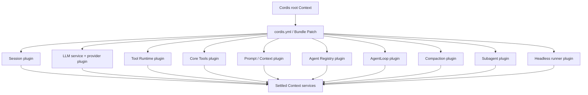
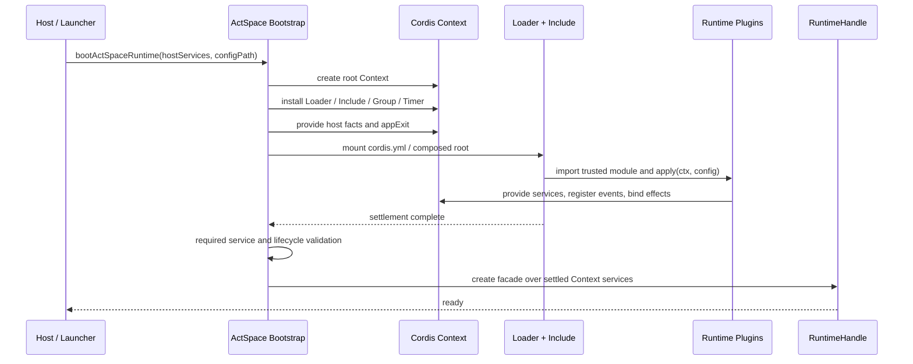
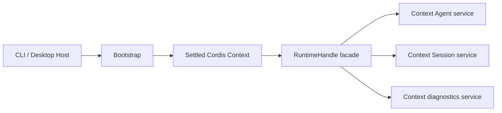
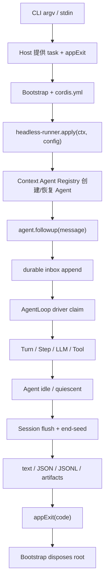

# DSH 风格 Runtime 插件组装规范

> 状态：已批准；Phase 1–6 自动化实施完成，真实 Provider、Electron/Chrome 和发行宿主门禁待验收。本文件定义从当前“局部 Cordis 接入 + Runtime 手工组装”迁移到“Runtime 能力由 Cordis 插件树组装”的目标规范。
>
> 本规范不重新定义 Session 事件、Agent Loop 插入事件或 Tool Runtime 内核。它保留迁移前 Host、Bootstrap、RuntimeHandle 和插件边界的推导；当前实现以 `BootedProfile` 与各 Profile App Bundle Service 为准。

## 1. 目标

ActSpace 的最终运行时应当与 DeepSeek Harness 的核心组装方式一致：

```text
Host capability / launcher facts
        ↓
固定 Bootstrap 创建 Cordis root
        ↓
Include cordis.yml / Bundle patch
        ↓
Cordis Loader 激活 apply(ctx, config)
        ↓
Session、LLM、Tools、Prompt、Agent、AgentLoop、Headless 等 Service
        ↓
RuntimeHandle facade / Host output
```

“Runtime 本身就是插件组装结果”在本文中有精确定义：

- Session、LLM、Prompt、Context、Tool Runtime、具体工具注册、Agent Registry、AgentLoop、Compaction、Subagent 和 Headless Run 的运行实例，必须由 Cordis Behavior/Service 创建并由 Cordis Context 拥有生命周期；
- `cordis.yml`、Bundle 和 Patch 是这些能力的组合真源；
- Runtime Boot 不再通过 `new DomainService()`、`serviceValues` 或 `activate()` 回调表拼装业务服务；
- Host 仍然负责操作系统和产品外壳能力；
- Bootstrap 仍然负责启动插件系统本身；
- RuntimeHandle 仍然是 Host-facing 的稳定 facade，但不拥有领域实现。

这不是“所有代码都必须是插件”。它是 DSH 同样采用的三层结构：固定启动边界、可组合 Runtime 插件树、固定 Host 外壳。

## 2. DSH 依据与 ActSpace 解释

DSH 保留以下固定边界：

| DSH 部分 | 是否是普通 Runtime 插件 | 职责 |
|---|---:|---|
| `apps/cli/src/bin.ts` | 否 | 解析 launcher 自己的参数，选择 profile，交给 profile boot |
| `packages/boot/app-boot` | 否 | 创建 `Context`，安装 Loader/Include，注入 Host facts，等待 settlement，关闭 root |
| `packages/boot/cmdline` | 是基础能力插件/Host seam | 将 `cmdlineArgs`、`appExit` 作为 Host 提供的 Context service 暴露给应用树 |
| `packages/bundle/base/cordis.patch.yml` | 组合配置 | 声明 LLM、Session、Approval、Sandbox、Tools、Agent 等插件行 |
| `packages/bundle/headless/cordis.patch.yml` | 组合配置 | 声明 `headless-startup` 和 `headless-runner` |
| `packages/bundle/headless/src/index.ts` | 是 | 从 Context 取得 Agent/Session/exit，驱动一次任务并请求退出 |

因此 DSH 并没有把 `Context`、Loader、进程信号、stdout/stderr 或 app boot 也塞进普通 Bundle。它把业务运行时交给插件，把“如何启动插件系统”保留在固定 Boot。

ActSpace 应复制这个边界，而不是把所有固定 Host 代码都改造成伪插件。ActSpace 的差异只在于保留自己的 `RuntimeHandle` facade，以便 Desktop、CLI run 和 CLI chat 共享 Host-facing API；该 facade 不得重新拥有领域服务。

## 3. 三层边界

### 3.1 Launcher / Host 外壳

Host 负责：

- argv、stdin、TTY、stdout/stderr；
- Electron 生命周期和 IPC；
- workspace root、data root 和临时目录；
- credential resolver；
- Approval Broker；
- Browser Bridge 等外部 Host capability；
- SIGINT/SIGTERM 和进程级退出请求；
- 为 root Context 提供 `appExit`、command-line snapshot 和 Host capability services。

Host 不负责：

- 创建 AgentLoop、Session writer、LLM Service 或 Tool Runtime；
- 解析插件目录或执行第二套插件 Loader；
- 直接调用具体 AgentLoop class；
- 将 Cordis Context、Session writer 或插件代码暴露给 renderer；
- 为每个 Turn 重建 root。

### 3.2 Bootstrap / App Boot

Bootstrap 是必要且固定的启动内核，不是业务插件。它只做：

1. 创建一个 Cordis root `Context`；
2. 安装 Loader、Include、Group、Timer 等 Loader 基础设施；
3. 注入 Host preparation facts；
4. 挂载 Host 选择的 `cordis.yml` 或已解析的 Bundle/Patch root；
5. 等待 Loader settlement；
6. 执行 required Service / lifecycle validation；
7. 从已 settled Context 取得 Runtime facade，发布给 Host；
8. 按固定顺序停止接收工作、flush、quiesce 并 dispose root。

Bootstrap 不得：

- new Session、LLM、ToolRuntime、Prompt、Compaction、AgentLoop 或 Subagent 实例；
- 将 `activate()` service map 作为默认激活协议；
- 让 `createDefaultComposition()` 成为默认运行时激活入口；
- 读取 `runtime-v2/plugins.json` 作为默认配置；
- 在 Loader tree 外再挂载一套平行的 Runtime 服务树。

### 3.3 Cordis Runtime Plugin Tree

这是 Runtime 的业务主体，由 `cordis.yml`、Bundle/Patch 和 `apply(ctx, config)` 组成。插件负责创建自己的 Service、注册事件和 Effect，并从 Context 取得依赖。



## 4. 目标启动流程



启动失败时：

```text
apply/import/依赖失败
    → Loader settlement reject
    → 不发布 RuntimeHandle
    → dispose partial Context
    → 输出 entry/plugin/依赖链诊断
```

启动成功的判定不是“某个插件函数返回了 service map”，而是：Loader settlement 完成、required Service 已发布、没有 Fiber 处于 `FAILED`/`PENDING`、Host capability ceiling 已满足。

## 5. Runtime Service 所有权

### 5.1 目标所有权表

| 能力 | 目标拥有者 | Host 只提供 |
|---|---|---|
| Session Store / Journal / Projection / Recovery | Session plugin | `dataRoot`、文件系统 capability |
| Event Codec registry | Session codec plugin / pure codec discovery | 已安装包解析能力 |
| LLM route registry / service | LLM plugin | credential resolver、网络 capability、provider config |
| Provider wire adapter | Provider plugin | key、base URL、proxy 和网络 |
| Tool Runtime / registry / scheduler | Tool Runtime plugin | workspace、process、approval、artifact capability |
| read/list/edit/write/bash/web 注册 | Core Tools plugin | 具体 executor ports 和 Host capability |
| Browser tools | Browser Tools plugin | Browser Bridge capability |
| Prompt / Context assembly | Prompt/Context plugin | instructions、skills、workspace facts |
| Agent Registry / main Agent | Agent plugin | Session service、Host descriptor |
| AgentLoop / Agent driver | AgentLoop plugin | Agent、Session、LLM、Tools、Prompt service |
| Compaction | Compaction plugin | LLM service、Session service |
| One-shot Subagent | Subagent plugin | AgentLoop、Session、Tools service |
| 单次 headless run | Headless runner plugin | task args、stdout/stderr、`appExit` |
| RuntimeHandle | Bootstrap 创建的 facade | 不适用；它不创建领域实例 |

### 5.2 Service 创建规则

每个 Runtime Behavior 必须遵守：

- 入口为 `apply(ctx, config)`；
- 依赖通过 `inject` 或 Context service 获取；
- 服务实例在 Behavior activation 内创建；
- timer、watcher、listener、subprocess、lease 和异步任务通过 `ctx.effect()` 绑定；
- dispose 由 Cordis Context 负责，且必须幂等；
- module 顶层不得启动进程、开 socket、注册全局 listener 或写外部状态；
- 插件不能取得 Host 未提供的 capability；
- 插件不能直接写 Session JSONL，必须调用 Session service 公共 API。

## 6. Host 与 RuntimeHandle 边界

ActSpace 保留 RuntimeHandle，但将其限定为 facade：



RuntimeHandle 可以提供：

- create/resume/list/inspect Session；
- 查找已发布的 main Agent；
- 提交 `agent.followup()`、abort、waitForIdle 和 flush；
- 暴露只读 BootManifest、diagnostics 和 projection；
- stop accepting work 和 dispose。

RuntimeHandle 不可以：

- new 任何领域 Runtime 实例；
- 持有第二份 Agent registry、Session writer 或 Tool registry；
- 直接调用 `new AgentLoop()`；
- 直接写 durable event；
- 让 Host 绕过 Context service 访问具体插件实现。

## 7. 单次无头任务

Headless runner 必须像 DSH `headless-runner` 一样是 Runtime plugin，而不是 CLI 内部的第二套 Agent driver。



`apps/cli` 最终只负责：

1. 解析属于 CLI launcher 的外层参数；
2. 准备 Host services 和 `appExit`；
3. 启动指定 `cordis.yml`；
4. 将 task 交给 headless runner；
5. 接收插件产生的输出和退出请求。

CLI 不再直接调用 `handle.runTurn()` 作为默认单次任务驱动，也不直接取得 `Session writer` 或 `AgentLoop class`。

## 8. 事件和 Session 集成

本规范复用已经确认的三类事件面：

- Session 持久化事件：由 Session 轨道负责 13 种核心事件和扩展事件；
- AgentLoop Cordis 插入点：由 AgentLoop scoped Context 发出 9 个 waterfall/serial/stream 面；
- Session/Agent 通知：由 Context event sink 发出 5 个主要通知和生命周期通知。

插件组装迁移必须保持以下不变量：

1. Agent/Tool/LLM 只调用 Session service 的 `append`/`flush` 公共 API；
2. `session/event` 只在 Journal append 成功后发出；
3. 通知观察者失败不回滚已提交事实；
4. `agent.followup()` 的 durable inbox enqueue 早于 claim、`turn/start` 和模型调用；
5. CLI `--jsonl` 只订阅 Context event sink，不复制或重解释 Journal writer；
6. 两个 Agent 的 scoped event listener 不得互相收到对方的通知。

## 9. 配置真源与 Static Manifest 处理

最终运行时组合真源是：

```text
cordis.yml / cordis.patch.yml / Bundle patch layers
```

Static Manifest 不再承担默认 Behavior 激活协议。完全信任同进程插件的前提下：

- `package.json`、`exports`、lockfile 和 build provenance 保留包身份与安装事实；
- Event Codec 仍可在 Session 轨道中独立发现和校验；
- `manifest.ts` 可以在迁移期保留为诊断、包契约和未来安全扩展材料；
- 默认 Boot 不读取 `runtime-v2/plugins.json`，不扫描插件目录，不调用 `activateBehavior()`；
- `activate()` 只允许存在于显式 legacy/迁移测试路径，不能成为正常 Loader ABI；
- 不可信插件的签名、沙箱、远程下载和市场安装另立安全设计。

## 10. 旧路径迁移规则

### 10.1 必须移出默认启动路径

- `packages/runtime/src/runtime/boot.ts` 中的领域实例化和 `serviceValues` 激活表；
- `createDefaultComposition()` 作为默认业务插件激活入口的职责；
- `activateLegacy()` 和正常路径的 `activateBehavior()`；
- CLI/桌面 Host 对 `new LlmService()`、`new ToolRuntime()`、`registerCoreTools()`、`new RuntimeSessionController()` 的直接拥有；
- `runV2Command()` 对 `handle.runTurn()` 的默认直接驱动；
- Desktop 默认读取 `runtime-v2/plugins.json`。

### 10.2 可以保留但必须隔离

- `ResolvedComposition` / BootManifest 的只读诊断和 provenance；
- Static Manifest 类型和显式 legacy loader；
- `createDefaultComposition()` 的离线 config dump 或回滚诊断能力；
- 当前 RuntimeHandle API，只要它变成 Context service facade；
- 工具 executor、Browser Bridge、Session 13 事件实现和既有行为测试。

## 11. 关闭和失败语义

### 正常关闭

```text
停止接受 followup / resume
    → abort 或等待 active Agent turn
    → 解决 pending approval
    → flush Session
    → 写入 session/end-seed
    → quiesce Agent / Tool / LLM
    → dispose Cordis root / Effects
    → Host 退出
```

### 失败关闭

- import、`apply()`、依赖或 required Service 失败：不发布 RuntimeHandle，dispose partial root；
- Tool/LLM/Agent 运行失败：进入既有 Agent error policy，保持 Session 事实完整；
- observer 失败：进入 diagnostics，不阻断 durable append；
- disposer 失败：记录 quiescence failure，继续清理其他 disposer，并以非健康关闭结果结束；
- 新路径失败时只能由 Host 显式选择 legacy 诊断入口，不允许 Boot 自动双跑或静默 fallback。

## 12. 明确不做

本规范不包含：

- 重新设计 13 种 Session 事件或 JSONL 物理格式；
- 重新设计 9 个 AgentLoop 插入点和 5 个主要通知的名称；
- 重写 read/list/edit/write/bash/web/Browser executor 的具体行为；
- renderer 插件化或执行插件携带的 JS/CSS/HTML；
- CLI chat 的交互 UX 改造；
- Goal/Schedule producer；
- 在线 HMR/reconcile；
- 不可信插件的签名、沙箱、市场和远程下载；
- v1 Session 数据迁移。

## 13. 验收标准

只有同时满足以下条件，才能把本规范标记为实现完成：

1. CLI run 和 Desktop 都由 Host 提供 capability/configPath，Boot 创建一个 root 并等待 Loader settlement；
2. 完整 Runtime 服务树由 `cordis.yml` / Bundle patch 声明，默认路径不读取 `plugins.json`；
3. Runtime Boot 和 Host Adapter 不再创建 Session、LLM、ToolRuntime、Prompt、Compaction、AgentLoop 或 Subagent 实例；
4. 所有默认 Behavior 使用 `apply(ctx, config)`，没有正常路径的 `activateBehavior()`；
5. 每个领域插件的资源通过 Effect/Context lifecycle 清理，dispose 幂等；
6. AgentLoop plugin 负责 Agent 创建/恢复、scoped Context、durable inbox、driver、idle 和 abort；
7. Headless runner plugin 负责单次任务驱动、等待 idle、flush、输出和 `appExit`；
8. `agent.followup()`、Session 13 事件、9 个插入点、5 个通知和 `session/event` 的既有不变量全部保持；
9. RuntimeHandle 只作为 facade，Host 不可取得 raw Context、Session writer 或 AgentLoop class；
10. required Service 缺失、optional capability 缺失、apply error、observer error、abort 和 shutdown quiescence failure 有测试和结构化诊断；
11. 全仓 typecheck/test、package boundary、docs 和 legacy-removal 检查通过；
12. 真实 Provider、Electron/Chrome、签名/公证仍需按独立发布门禁单独验收，不得被本规范的自动化通过替代。

## 14. 相关文档

- [DSH 风格插件组装与 Agent 启动规范](./agent-spec-dsh-plugin-assembly-and-agent-startup.md)：已完成的局部 Cordis/AgentLoop 迁移边界。
- [DSH-native 启动决策](./agent-decision-dsh-native-plugin-runtime.md)：完全信任同进程插件前提下移除 Static Manifest 激活协议的决策背景。
- [DSH 风格 Session 事件模型](./agent-spec-dsh-event-model.md)：持久化事件和三平面。
- [Agent Loop Cordis 插入面与通知面](./agent-spec-agent-loop-cordis-surface.md)：9 个插入点、5 个主要通知和 scope 语义。
- [Tool Runtime 内核与外壳边界](./agent-spec-tool-runtime-boundary.md)：工具 executor 保留与外壳迁移边界。
- [Runtime 与 Composition 目标设计](./agent-target-runtime-architecture.md)：RuntimeHandle、Host、Profile/Bundle/Patch 和关闭语义。
- [本规范的执行计划](../../exec-plans/completed/20260829-actspace-dsh-runtime-full-plugin-composition/README.md)。
