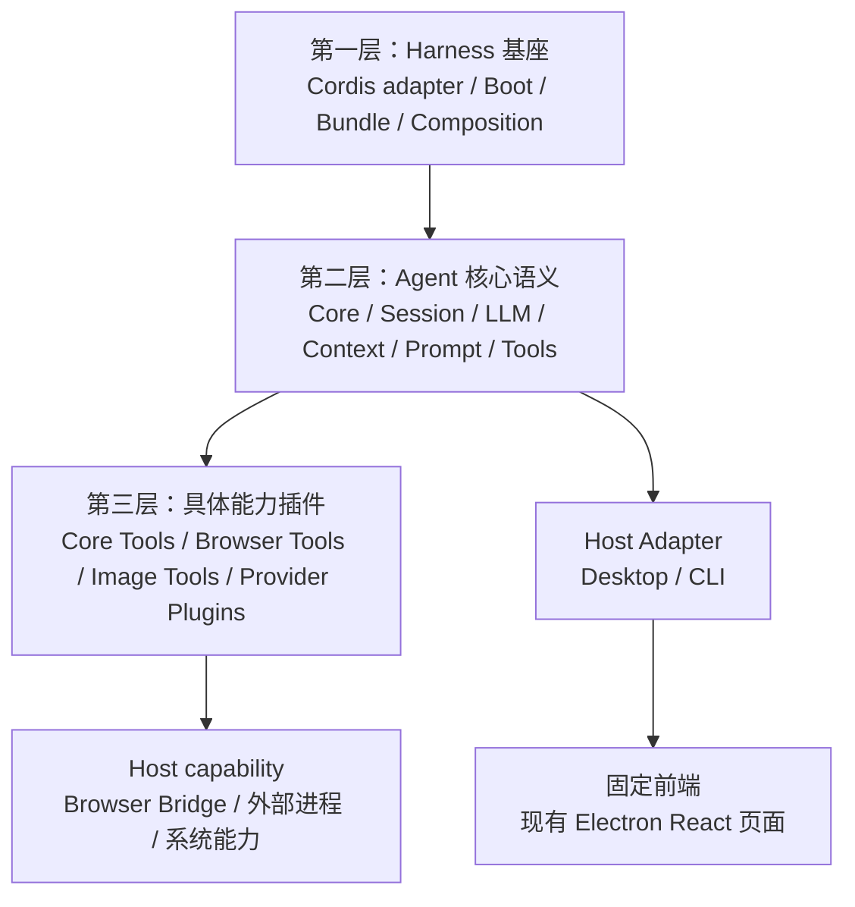
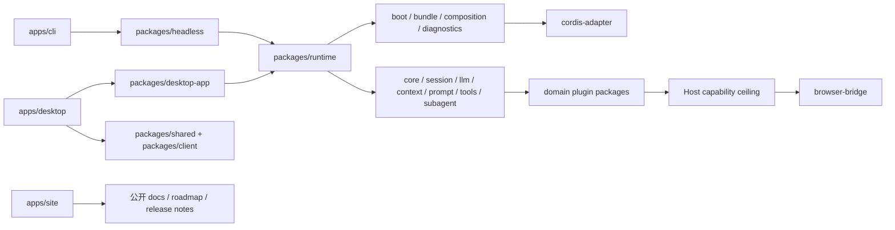

# ActSpace v2 包结构与真实插件包规范

> 状态：已实现并通过 workspace、应用构建与 package boundary 验证（2026-08-30）。Profile-first Runtime 决策已替代早期通用 Runtime facade / `@actspace/host` 目标。
>
> 本文解决两个容易混淆的问题：ActSpace v2 的源码如何按 DSH 的方式分组，以及“插件”如何成为真正可装载、可诊断、可卸载的独立包，而不是一个巨大 ESM 包里的内部目录。

## 1. 决策摘要

ActSpace v2 采用 DSH 风格的领域包结构，但不复制 DSH 的 `vendor/`，也不建立一个承载所有代码的 `harness/` 或 `plugins/` 总目录。

固定规则如下：

1. `vendor/` 不进入 ActSpace v2。Cordis 使用精确锁定的 DSH 发布包；只有未来明确维护 fork 时才允许引入 `vendor/`。
2. `harness` 是架构概念，不是源码目录。Harness 基座的职责平铺到 `cordis-adapter`、`boot`、`bundle`、`composition`、`diagnostics` 和 Profile bootstrap；应用操作由各自 App Bundle Service 提供。
3. 不建立通用 `plugins/` 目录。插件是 Runtime ABI 中的身份、manifest、behavior entry、codec entry 和生命周期，不是文件夹名称。
4. 采用 DSH 的领域分组：`core`、`session`、`llm`、`context`、`prompt`、`tools`、`subagent`、`compaction`、`desktop-app` 和 `client`。
5. 每个可装载、可替换或可独立验证的领域包都必须拥有自己的 package boundary 和 Cordis Plugin Entry。Session、LLM、Prompt、Agent Loop 不是“插件之外的特殊代码”，而是默认 Profile 中的核心语义插件。
6. 具体能力插件按领域放置，例如 `packages/tools/core-tools`、`packages/tools/browser-tools`，不放入一个含义模糊的 `packages/plugins`。
7. Browser Bridge 是独立的 Go + Chrome Extension Host capability，顶层目录使用 `browser-bridge/`，不伪装成同进程 TypeScript 插件，也不放入通用 `plugins/`。
8. Desktop 的页面、样式、布局和现有固定前端信息架构不改变。只允许调整 Host、IPC、投影和 Runtime 加载边界。
9. 可运行、打包或部署的产品入口统一进入 `apps/desktop`、`apps/cli`、`apps/site`；`packages/` 只保留可复用库、领域包、Plugin ABI package 和共享契约，且不得反向依赖 `apps/`。

## 2. 三层架构与目录的关系

目录分组与运行时插件身份是两套正交分类：



第一层决定插件如何被发现、校验、装载和关闭；第二层提供 Agent 的产品语义；第三层提供可选的具体能力；Host capability 由 Host 适配器管理，不能被同进程插件 ABI 偷换成安全沙箱。

“一切皆插件”表达的是第二层和第三层都通过统一生命周期进入 Runtime，而不是要求所有源码都位于 `plugins/` 目录。

## 3. 目标目录

```text
actspace-agent/
├── apps/
│   ├── desktop/                         # Electron 应用入口
│   ├── cli/                             # CLI headless run 入口
│   └── site/                            # Astro 静态官网与公开内容
│
├── packages/
│   ├── runtime/                         # Profile bootstrap、BootedRuntimeProfile 与 shutdown 边界
│   ├── cordis-adapter/                  # ActSpace 对 DSH Cordis 的边界封装
│   ├── boot/                            # Trusted Boot、Startup Validation、shutdown
│   ├── bundle/                          # Profile / Bundle / Patch schema 与 composer
│   ├── composition/                     # Loader / Include / Group 组合适配
│   ├── diagnostics/                     # Boot、插件、Fiber、lease 与资源诊断
│
│   ├── core/                            # 核心语义插件组
│   │   ├── scope/                       # Agent Scope 原语
│   │   ├── agent/                       # Agent Registry、Inbox、状态
│   │   └── agent-loop/                  # 默认 Turn / Step Loop
│
│   ├── session/                         # Session 核心语义插件组
│   │   ├── journal/                     # append-only Journal、Surface、事件不变量
│   │   ├── persistence/                 # persistence capability 与协调器
│   │   ├── jsonl/                       # raw UTF-8 journal.jsonl 后端
│   │   └── projection/                  # Journal 到模型/Host 投影
│
│   ├── llm/                             # LLM 核心语义插件组
│   │   ├── service/                     # Message、Stream、Failure、Usage、PreparedCall
│   │   ├── pi-ai/                       # pi-ai Provider Adapter
│   │   └── legacy-transport/            # 仅在 pi-ai proxy 门禁要求时保留
│
│   ├── context/                         # Context Contributor 与 Request Assembly 输入
│   ├── prompt/                          # Prompt section 组装
│   ├── tools/                           # Tool Runtime 与具体工具插件组
│   │   ├── runtime/                     # definition、prepared execution、调度
│   │   ├── approval/                    # Host approval seam
│   │   ├── core-tools/                  # 文件、搜索、Shell、图片等内置工具
│   │   └── browser-tools/               # Browser Tool Adapter
│   ├── subagent/                        # one-shot Subagent、Agent、Explore descriptor
│   ├── compaction/                      # append-only Surface compaction
│
│   ├── desktop-app/                     # Desktop App Bundle 与 DesktopAppService
│   ├── client/                          # 固定前端 IPC 投影与 renderer DTO
│   ├── shared/                          # 跨进程共享契约
│   ├── test-support/                    # 测试基础设施
│   └── util/                            # 无领域所有权的通用小工具
│
├── browser-bridge/                      # Go CLI、Chrome Extension、协议层
├── examples/
├── docs/
├── scripts/
├── patches/
└── python/
```

这里的“平铺”指不再人为增加 `harness/` 和 `plugins/` 两层总目录；领域组仍保留两级结构，因为它能让开发者先按职责找到代码，再看到该领域的独立插件包。

## 4. 什么是一个真实插件包

每个需要被 Loader 装载的包必须是独立 workspace package，而不是 `@actspace/runtime` 内部的一个目录。它至少拥有：

```text
packages/<domain>/<package>/
├── package.json                  # 独立版本、exports、依赖和 plugin metadata
├── src/
│   ├── manifest.ts               # JSON-safe Static Manifest
│   ├── plugin.ts                 # Behavior Entry，只有 activation 时产生副作用
│   ├── codec.ts                  # 需要 durable event 时提供纯 Codec Entry
│   └── index.ts                  # 领域公共 API，不暴露裸 Cordis Context
└── tests/
    ├── contract.spec.ts
    └── lifecycle.spec.ts
```

实际文件名可以在实现计划中统一，但职责不能合并：

| 入口 | 作用 | 约束 |
|---|---|---|
| Static Manifest | 身份、版本、runtime contract、Host/frontend requirements、Entry 与 codec 声明 | 不执行行为代码，不包含 secret 或函数 |
| Codec Entry | Session event schema、criticality、decode、project、migration | 纯函数，不启动资源，不注册行为 Service |
| Behavior Entry | 注册 Service、Tool、Prompt、LLM、Agent 或其他贡献 | 只能在 activation Effect 中获取资源和注册贡献 |
| Public API | 供其他领域包消费稳定契约 | 不导出 Fiber、Context、插件私有对象 |

核心语义包和具体能力包都遵循同一 ABI。区别只在默认组合中的 required/optional 状态和可替换级别：

- `packages/session/journal` 是 required core plugin；
- `packages/llm/pi-ai` 是可替换 Provider plugin；
- `packages/tools/browser-tools` 是 optional capability plugin；
- `browser-bridge/` 是由 Browser Tools Provider 管理的外部 Host capability，不是第二套 Loader。

## 5. 依赖边界



约束如下：

- 只有 `cordis-adapter`、`boot`、`composition` 和 Runtime 装配层直接接触 DSH Cordis Context/Loader 类型。
- Agent 领域包依赖 ActSpace 自有契约，不依赖 DSH Agent Core 包。
- 具体工具包依赖 `tools/runtime`，不能直接写入 Session 或访问 renderer。
- Desktop App Bundle / Headless Bundle 只依赖 `runtime` 与领域包的公开 exports；Electron/CLI Host 仍只负责能力、进程和输出边界。
- `apps/` 可以消费公开 package exports；任何 `packages/` manifest 都不得依赖应用 package，应用之间也不通过 sibling `src/` 耦合。
- `client` 只消费固定 Projection DTO；后端插件不携带 React、CSS、HTML 或 renderer JavaScript。
- `browser-bridge` 不进入 pnpm 的 TypeScript Agent package 图；它通过 Host capability 和协议适配接入。

## 6. 包版本与插件版本

包版本和插件身份必须同时存在，但不能互相替代：

- npm/package version 描述发布制品的版本；
- `plugin id` 描述 durable event namespace、Entry identity 和诊断身份；
- `runtimeContract` 描述与 ActSpace Plugin ABI 的兼容范围；
- `event schema version` 描述 durable event 数据版本；
- Cordis version 描述生命周期基础设施版本。

一个 package 可以只提供公共库，不成为可装载插件；一个可装载插件包则必须同时提供 Static Manifest 和 Behavior Entry。不能通过“所有 workspace package 都自动当插件”降低准入边界。

## 7. 已完成的单包结构迁移映射

迁移前 `packages/agent-runtime/src/` 的职责已按下面的规则拆分；本表用于追溯来源，不表示该旧目录仍存在：

| 迁移前路径 | 当前目标包 | 迁移原则 |
|---|---|---|
| `src/plugin/` | `packages/cordis-adapter/`、`packages/composition/`、`packages/boot/` | 将 ABI、来源和生命周期基础设施拆开，不保留大一统 plugin 目录 |
| `src/composition/`、`src/profiles/` | `packages/bundle/`、`packages/composition/` | Profile/Bundle/Patch 仍共用 composer，但不拥有领域插件实现 |
| `src/session/`、`src/projection/` | `packages/session/*` | Journal、raw JSONL、projection 成为独立 Session plugin packages |
| `src/llm/` | `packages/llm/*` | Service、pi-ai 和 fallback transport 分离 |
| `src/prompt/`、`src/scope/`、`src/skills/` | `packages/prompt/`、`packages/context/`、`packages/core/scope/` | Context 与 Prompt 所有权分开 |
| `src/tools/`、`src/plugins/core-tools/` | `packages/tools/runtime/`、`packages/tools/core-tools/` | Tool Runtime 契约和具体 executor 分开 |
| `src/plugins/browser-tools/` | `packages/tools/browser-tools/` | Browser 具体工具成为领域插件，不使用通用 plugins 目录 |
| `src/agent/` | `packages/core/agent/`、`packages/core/agent-loop/`、`packages/subagent/` | Registry、Loop、Subagent 按独立替换边界拆分 |
| `src/runtime/`、`src/boot/` | `packages/runtime/`、`packages/boot/` | Runtime 提供生产 BootedRuntimeProfile，App Bundle 拥有产品操作；基础 BootedProfile 由 packages/boot 提供，二者字段和 shutdown 结果不同 |
| `browser-bridge/` | `browser-bridge/` | 顶层使用产品能力名称，保留独立 Go/Extension 构建边界 |

旧 v1 Session 只保留一份迁移参考数据，不由新 Runtime 读取或导入。新格式只使用 `sessions-v2/<id>/journal.jsonl`。

## 8. 前端边界

这次包结构调整不改变现有前端视觉产品：

- 不改页面布局、颜色、组件样式、交互信息架构或现有工作台的固定壳；
- 允许修改 Desktop main/preload 的 Runtime 加载、IPC adapter 和 Projection DTO；
- 后端插件的 `frontend.required=true` 在固定前端中拒绝激活，optional frontend contribution 只记录诊断并忽略；
- 前端产品概念使用“扩展”时，文档可以称为 Extension；它不等同于后端 Plugin ABI，也不允许后端插件注入前端代码。

## 9. 明确排除

- 不复制 DSH Agent Core 包；
- 不引入 `vendor/` 源码镜像；
- 不保留单一大 `@actspace/agent-runtime` 承载全部领域实现；
- 不建立通用 `packages/plugins/` 目录；
- 不把 Browser Bridge 当作同进程安全沙箱；
- 不通过包拆分引入前端插件加载、HMR、在线 reconcile、插件市场、签名和不可信代码隔离；
- 不在这次重构中修改现有前端样式和布局。

## 10. 验收标准

完成这次结构重构后，以下事实必须可以由仓库和测试证明：

1. `pnpm-workspace.yaml` 能发现每个领域插件 package，且没有一个包通过相对路径读取另一个包的 `src/`。
2. 每个 required core plugin 都能单独运行 manifest、codec（如有）和 behavior contract tests。
3. Loader 只通过 Static Manifest 发现候选，Behavior Entry 激活由 Cordis Effect 管理，dispose 后没有残留 timer、watcher、subprocess、lease 或 registry contribution。
4. Session、LLM、Prompt、Tools、Agent Loop 都可以在 Base Profile 中作为独立 Entry 诊断、禁用、替换或恢复；缺少 required provider 时 Boot fail-closed。
5. Desktop 与 CLI run 使用 Profile Boot 和各自的 App Service / runner，不实现第二套 Agent Loop 或 Session writer。
6. `browser-bridge` 的 Go/Extension 构建仍可独立验证，并通过 Browser Tools Adapter 接入，不依赖前端插件加载。
7. 旧单包内部路径、通用 `plugins/` 代码入口和废弃 Kairos/fs-watch/eval 可达路径在源码、构建产物和 workspace manifest 中消失。
8. 现有前端页面截图在浅色、深色和普通工作流下与重构前布局和样式一致；这属于接入验收，不允许用 UI 重设计替代。

详细执行顺序、文件所有权、验证命令和回滚规则见 [包拆分与真实插件包化执行计划](../../exec-plans/completed/20260824-actspace-v2-package-layout-and-plugin-packaging/README.md)。
