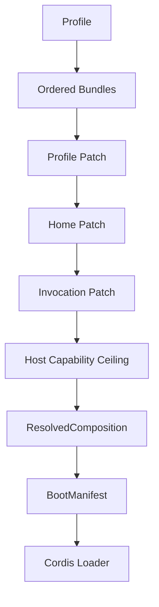

# Profile / Bundle / Patch 分层规范

> 状态：目标设计已确认；P1-C schema、digest 与 loader transport parity 已实施，restart/one-shot 收口仍待 G1。
>
> 本规范把 DSH 的组合思想落到 ActSpace v2：Profile 选择能力配方，Bundle 提供可分发 Entry，Patch 做稳定 id 覆盖，最终生成唯一的 immutable `ResolvedComposition / BootManifest`。它不支持在线热替换，也不改变 Agent、Session 或 Tool 的领域语义。

## 1. 决策摘要

```text
Profile
  → Ordered Bundles
  → Profile Patch
  → Home Patch
  → Invocation Patch
  → Host Capability Ceiling
  → ResolvedComposition
  → BootManifest
  → Cordis Loader
```

`ResolvedComposition / BootManifest` 是唯一的激活事实源。`cordis.yml` 是组合输入或 Loader transport，不是另一份独立的插件清单。任何 Host、Runtime 或测试 fixture 都不得同时维护第二套生产激活列表。

## 2. 解决的问题

当前仓库已经有 `@actspace/bundle`、`@actspace/composition` 和 `createDefaultComposition()`，但 Boot 同时看 `ResolvedComposition` 和静态 `cordis.yml`。这会产生“digest、diagnostics 和实际 Loader tree 不一致”的风险，也让 Patch 无法完整表达最终启动事实。

P1-C 的目标不是再加一个配置层，而是把现有 Profile/Bundle/Patch 收敛成唯一解析过程，并让所有 Host 消费同一份结果。

## 3. 三层定义

### 3.1 Profile

Profile 是命名的运行配方，只选择顺序和覆盖策略：

```ts
interface Profile {
  id: string
  runtimeContract: "actspace.runtime.v2"
  orderedBundleIds: readonly string[]
  patch?: Patch
  requiredCapabilities?: readonly string[]
}
```

Profile 不包含已激活的 Service 实例，不保存 Host credential，不直接执行模块。

### 3.2 Bundle

Bundle 是可审计、可分发的 Entry/Manifest 集合：

```ts
interface Bundle {
  id: string
  version: string
  manifests: readonly PluginManifest[]
  provenance: string
}
```

Bundle 只描述默认代码、Codec、Behavior、Service、事件、Host capability 和默认 config。一个 Bundle 不能隐式读取另一个 Bundle 的私有配置。

### 3.3 Patch

Patch 只按稳定 Entry id 操作：

```ts
type PatchOperation =
  | { kind: "insert"; entry: CompositionEntry; after?: string; optional?: boolean }
  | { kind: "replace-config"; target: string; config: JsonValue; optional?: boolean }
  | { kind: "disable" | "remove"; target: string; optional?: boolean }
```

Patch 不做隐式 deep merge，不按 package version、数组位置或 module path 猜目标。required target 缺失直接失败；optional target 缺失记录 skipped diagnostic。

## 4. 唯一解析结果

```ts
interface ResolvedComposition {
  schemaVersion: 1
  profileId: string
  bundles: readonly BundleIdentity[]
  entries: readonly CompositionEntry[]
  services: readonly ServiceAdmission[]
  codecs: readonly CodecAdmission[]
  hostCapabilities: readonly string[]
  patchResults: readonly PatchOperationResult[]
  warnings: readonly Diagnostic[]
  digest: string
}

interface BootManifest extends ResolvedComposition {
  readonly loaderConfig: JsonValue
  readonly startupRequirements: readonly string[]
}
```

`digest` 必须覆盖 Profile、Bundle identity、Manifest/Entry、Patch results、Service/Codec admission、Host capability ceiling 和最终 Loader config。只读结果创建后不可修改，也不能在 Boot 中重新解析同一输入得到另一份配置。

## 5. 组合顺序和单调性



固定顺序：

1. 读取 Profile 并展开 `orderedBundleIds`。
2. 校验 plugin id、Entry id、manifest schema 和 Bundle provenance。
3. 依次应用 Profile、home、invocation Patch。
4. 应用 Host capability ceiling；只能减少能力，不能创造 Host capability。
5. 检查 required Entry/Service/Codec、inject cycle、frontend required 和冲突。
6. 生成 `ResolvedComposition`、脱敏 diagnostics 和 digest。
7. 将同一结果交给 Trusted Boot 和 Cordis Loader。

禁止：

- Loader 再读取一份未经过 composer 的生产插件列表；
- Host 根据自己的数组顺序补装 core plugin；
- Patch 绕过 required capability 或 frontend ceiling；
- 运行中替换 Entry、Provider、Codec 或 Service；
- 为 CLI、Desktop、测试各维护不同的默认 Profile 事实。

## 6. `cordis.yml` 的定位

`cordis.yml` 有两种允许用途：

1. **Authoring source**：作为 Profile/Bundle 的声明输入，被 Composer 解析成 `ResolvedComposition`。
2. **Loader transport**：当 Cordis Loader 只接受文件路径时，由 Boot 根据已解析结果生成一次受控的、不可变的 Loader config，再通过同一个 Loader 加载。

它不再是独立的运行时真源。`apps/cli/cordis.yml`、`packages/runtime/cordis.yml` 和测试 fixture 必须明确标注其角色；默认 CLI 不得出现“Composition digest 来自 A、Loader entries 来自 B”的组合。

## 7. Host capability ceiling

Host 先声明 capability ceiling，再由 Composer 做 admission：

```text
required capability 缺失 → required Entry 启动失败
optional capability 缺失 → Entry skipped + diagnostic
frontend.required=true   → 固定 renderer 不支持时启动失败
frontend.required=false  → 忽略并告警，不执行插件前端代码
```

Host ceiling 是单调上界：Invocation Patch 可以禁用能力，不能添加 `browser`、`credential`、`filesystem.write` 或 renderer 等 Host 未提供的能力。

## 8. Service / Codec admission

Composer 不创建 Service 或 Codec 实例，但必须产出 admission 证据：

- 每个 required Service 有唯一 Provider；
- `provides/injects` 与 Service Definition 一致；
- Durable Codec 在 Behavior activation 前可被发现；
- Codec owner、criticality、version 和 namespace 合法；
- required provider 缺失时 Boot fail closed；
- optional provider 缺失时记录 degraded/skipped 状态。

这样 Session decode 不依赖一个尚未激活、但可能需要读取 Session 的 Behavior 插件。

## 9. Runtime / Host 边界

```text
Host Adapter
  ├─ 准备 Host ports 和 capability ceiling
  ├─ 选择 Profile / Patch 输入
  └─ 调用 Runtime Boot

Runtime Boot
  ├─ resolve Profile / Bundle / Patch
  ├─ 生成 BootManifest
  ├─ 创建 Cordis root 和 Loader
  ├─ 等待 settlement / startup validation
  └─ 发布 RuntimeHandle

RuntimeHandle
  └─ 只代理 Session、run、followup、abort、flush、diagnostics
```

RuntimeHandle 不暴露 `ResolvedComposition.entries` 的可变引用、Cordis Context、Fiber、Provider class 或 Loader handle；只提供只读 manifest/diagnostics 快照。

## 10. Restart-only

Profile、Bundle、Patch、插件代码或 Service Provider 变化都通过完整 restart 生效：

1. 当前 Runtime 停止接受新任务。
2. Abort/drain active turn、tool lease 和 approval。
3. Flush Session。
4. Dispose Cordis root。
5. 用新输入重新 compose、validate、boot。

不实现在线 reconcile、HMR、旧 Entry 与新 Entry 的零中断切换，也不承诺外部副作用可回滚。

## 11. 验收标准

1. CLI run、Desktop 和 fixture Boot 均从同一 `ResolvedComposition/BootManifest` 进入 Loader。
2. `digest` 能检测 Profile、Bundle、Patch、Host ceiling 或 loader config 的任一变化。
3. required/optional capability、frontend、Service conflict、Codec discovery 和 Patch target 行为有测试。
4. 生产默认路径不使用 `serviceValues`、手工 core activation 或第二份插件列表。
5. `cordis.yml` 的 authoring/transport 角色在文件和 diagnostics 中可识别。
6. restart-only、失败清理、旧 Runtime 不被破坏和 RuntimeHandle 单实例有 contract tests。
7. CLI 单次无头 `run` 的 boot → followup → flush → dispose 回归通过。

## 12. 回退和非目标

P1-C 不迁移 Session 数据、不改 Tool executor、不实现 CLI chat、不增加动态插件沙箱或远程下载。若 Loader 暂时只能接收文件路径，回退到 Boot 生成受控 transport 文件；不能回退到第二套 `activate()` 业务激活协议。

## 13. 参考

- [DSH 风格 Runtime 插件组装规范](./agent-spec-dsh-runtime-as-plugin-composition.md)
- [插件 Runtime ABI](./agent-spec-plugin-runtime-abi.md)
- [核心 Service 分层规范](./agent-spec-service-definition-provider-consumer.md)
- `packages/bundle/src/index.ts`
- `packages/composition/src/compose.ts`
- `packages/runtime/src/profiles/composition.ts`
- `packages/runtime/src/runtime/boot.ts`
- `apps/cli/src/runtime-v2/host-adapter.ts`
