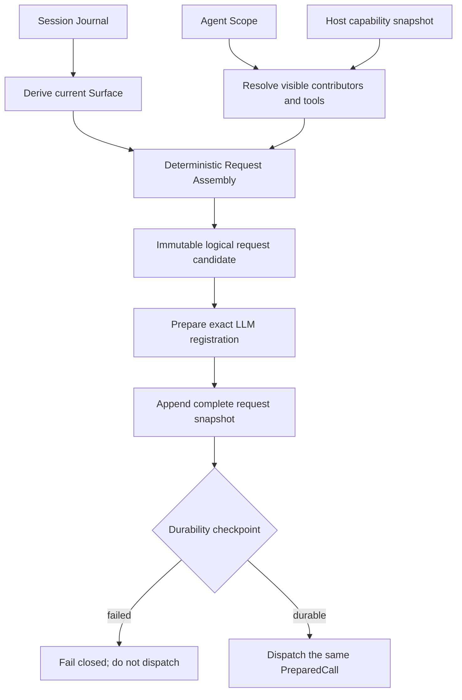

# ActSpace v2 Prompt 与 Context Contributor 公共契约

> 状态：v2 公共契约基线。
>
> 本文固定模型请求组装的所有权、输入来源、确定性顺序、生命周期和持久化边界。精确 TypeScript 类型名可以在 execution plan 中调整，但不得改变本文行为语义。
>
> 确认日期：2026-08-22。

## 1. 一句话结论

ActSpace v2 不迁移旧的可变 `ContextManager`。模型请求由一次性的 `Request Assembly` 从 Session Surface、Prompt Contributors、Tool definitions、Agent Scope 和 Host facts 中确定性构造，并把模型实际可见的完整逻辑输入写入 Session request snapshot。

这意味着：

- Session Journal 是对话与 Agent 运行事实的唯一持久来源；
- Contributor 负责提供当前请求需要的说明或事实，不拥有 conversation；
- 每次请求重新解析当前可见贡献，得到不可变候选；
- 影响模型行为的最终渲染结果必须可从 request snapshot 审计；
- API key、代理对象、文件句柄和 Cordis Context 不得进入 Session。

## 2. 三种 Context 必须分开

| 名称 | 作用 | 所有者 | 是否持久化 |
|---|---|---|---|
| Cordis Context | 插件生命周期、Service 可见域和 effect ownership | Cordis Runtime | 否 |
| Agent Scope | Agent 身份、父子能力继承和贡献可见范围 | ActSpace Agent Core | 只持久化稳定身份与 lineage，不持久化运行对象 |
| Model request context | 某个 Step 真正交给模型的 Prompt、Surface、Tools 和动态事实 | Request Assembly | 以 logical request snapshot 持久化 |

旧 `ContextManager` 同时承担 conversation、Prompt、Tools、压缩和动态上下文，形成了第二份可变真相。v2 把这些职责分别交给 Session、Request Assembly、Tool Runtime 和 Compaction。

## 3. Request Assembly 的输入

一次模型请求只能从以下来源组装：

| 输入 | 典型内容 | 约束 |
|---|---|---|
| Session Surface | user、assistant、tool result，以及 compaction replacement 后的当前模型历史 | 必须完全从 Journal 派生，不能被 Contributor 直接修改 |
| Core Prompt | 产品身份、基础行为规则、不可绕过的安全边界 | 由 Base Profile 提供，普通插件不能删除 |
| User / Workspace Instructions | 用户级指令、workspace 内 `AGENTS.md` 及同类项目规则 | 记录来源路径、内容摘要和最终渲染值 |
| Agent Descriptor | main、Agent、Explore 的 persona、mode、目标和工具限制 | 来自当前静态 Preset 与 Agent Scope |
| Skills | Skill catalog 与本次已选择 Skill 的完整内容 | catalog 与 selected body 分开贡献，并记录版本或内容摘要 |
| Workspace Facts | cwd、项目根、平台、时间等模型确实需要的稳定事实 | 由 Host 提供 snapshot，不把活对象传给 Contributor |
| Host Capability Facts | sandbox、approval、renderer、browser bridge 等本进程实际能力 | 只能陈述 Boot 已授予的能力，不能靠 Prompt 扩权 |
| Plugin Contributors | 可选领域说明、动态事实或额外 Prompt section | 受 Scope 可见性、稳定 id 和生命周期约束 |
| Tool Definitions | 本次可见工具的 name、description 和 input schema | 由 Tool Runtime 解析 exact registrations 后提供 |
| LLM Request Options | logical model route、reasoning、sampling 等模型可见请求选择 | 不包含 credential、transport 或 Provider 私有对象 |

Kairos handoff、tick state 和 autonomous Prompt 不迁移。旧 conversation 数组不作为输入来源；它被 Session Surface 完全替代。

## 4. Contributor 的最小语义

每项 Contributor 至少表达：

| 字段语义 | 要求 |
|---|---|
| `id` | 全局稳定的 contributor id；推荐 `plugin-id/contribution-name` |
| `owner` | 拥有它的 plugin registration；用于诊断和卸载 |
| `scope` | 所属 Agent Scope；决定父子可见性和 shadow |
| `kind` | `prompt-section`、`model-fact` 或 `request-fact`；不能直接伪造 Session message |
| `layer` | 组合层，例如 core、profile、host、agent、plugin |
| `order` | 同一层中的显式整数顺序 |
| `criticality` | `required` 或 `optional` |
| `resolve` | 接收只读 assembly input，返回 JSON-safe 的渲染结果与 provenance |
| `dispose` | Contributor 所属 registration 的可等待撤销语义 |

Contributor 不得：

- append、replace 或删除 Session event；
- 直接获得可写 Cordis root、Host credential store 或 renderer 对象；
- 在 `resolve` 中执行工具副作用；
- 返回无法序列化的 class instance、function、stream 或 native handle；
- 通过 Prompt 声明 Host 没有授予的 capability；
- 依赖全局注册顺序或 JavaScript module import 顺序决定输出。

### 4.1 模型事实与审计事实

`model-fact` 与 `request-fact` 必须分开：

- `model-fact` 是模型确实需要看见、且适合进入稳定 system prompt 前缀的事实，例如 Agent descriptor、稳定 capability 描述与 Agent 形态下的 workspace facts；
- `request-fact` 是用于审计、诊断和重放解释的动态事实，例如 `agentRunId`、Host invocation identity 与单次 request identity；它进入 snapshot 的 `facts`，但不进入 system prompt；
- snapshot schema v2 同时保存 `facts` 和 `modelFacts`。读取 schema v1 时可将旧 `facts` 作为历史模型事实解释，不能修改已落盘 Journal。

模型需要的逐轮动态事实不得重新塞回 system prompt。Agent 的 `plan/agent` 模式作为持久化 `runtime-context` 内容块追加在当前 `user/message` 末尾，使现场请求和后续 Surface 重放看到同一份动态尾部。Chat 形态固定，不写该块。renderer、标题和自然语言 Compaction 摘要必须隐藏它，但 Context token estimate 仍计算它。

需要网络、文件或外部进程的动态能力应先由拥有它的 Service 产生受约束事实 snapshot，再由 Contributor 读取该 snapshot。Request Assembly 不是隐藏的工具执行器。

## 5. 确定性排序与冲突

Contributor 的总顺序固定为：

```text
composition layer
  -> numeric order
  -> stable contributor id
```

具体规则：

1. `core` 层先于 profile、host、agent 和普通 plugin 层。
2. 同层按 `order` 从小到大排列。
3. `layer` 和 `order` 相同时按稳定 `id` 排列，不能依赖注册时机。
4. 同一个可见 Scope 中出现重复 `id` 时启动或 Agent 构造失败，不做 last-write-wins。
5. 子 Scope 可以按 Scope 规则 shadow 父 Scope 的同一领域 registration，但必须保留双方 provenance；普通 Contributor 不能用相同 `id` 偷换 Core Prompt。
6. 必需 Contributor 解析失败时本次请求 fail closed；可选 Contributor 失败时跳过，并产生结构化 diagnostic。

Prompt section 的最终拼接顺序和 Tool definition 的展示顺序都必须稳定。相同 Journal、Composition、Agent Descriptor、Host facts 与 Contributor 输出应产生相同 logical request snapshot。

## 6. 一次模型请求的构造流程



顺序不能颠倒：

1. 从 Journal 派生当前 Surface。
2. 根据 Agent Scope 解析当前可见 Contributor 与 Tool registrations。
3. 对 Contributor 做确定性排序并解析 JSON-safe 输出。
4. 构造不可变 logical request candidate。
5. LLM Service 准备 exact route、Adapter registration、defaults 和 retry policy。
6. 把最终模型可见输入和已解析 logical route 写入 request snapshot。
7. flush 成功后才能 dispatch 同一个 PreparedCall。

在第 2 步之后注册或卸载的新 Contributor 不得改变本次 candidate；它只影响下一次 Request Assembly。

## 7. Logical Request Snapshot

每次发送模型请求前，Session 必须持久化一个完整 snapshot，而不是增量 patch。snapshot 至少包含：

- 对应的 Session、Turn 和 Step identity；
- 当前 Surface 中模型可见的完整 messages；
- 最终渲染后的 system Prompt sections；
- 每个 section / fact 的 contributor id、owner、顺序和 provenance；
- 本次暴露给模型的完整 Tool definitions 与 registration identity；
- logical model route、model id、reasoning 和其他可重放的请求选项；
- request schema version；
- composition digest、Agent Descriptor id/version 和 Host capability digest；
- attachment 的 durable references；
- Adapter 需要回放的版本化私有状态引用或 JSON-safe 内容。

snapshot 不包含：

- API key、access token、cookie 或 credential 明文；
- ProxyAgent、HTTP client、AbortController、Cordis Context 或 Fiber；
- Provider 最终 wire payload 的秘密 headers；
- renderer component、React props function 或任意可执行代码；
- 未经 redaction 的环境变量和任意全量进程状态。

“可重建”指可以解释模型为什么看到了这些逻辑内容，并可用兼容 Adapter 构造等价请求；不要求永久保存第三方 SDK 的内部对象。

## 8. Core Prompt 与普通插件的权限

Core Prompt 至少拥有以下不可被普通插件绕过的 section：

- ActSpace 基础身份与 Agent Loop 约束；
- 工具调用与结果的基本协议；
- Host 已授予的 sandbox / approval 边界；
- Session 与持久化事实的约束；
- 用户和 workspace 指令的解释顺序。

普通插件可以追加或替换自己拥有的 section，但不能：

- 删除 Core Prompt；
- 把 optional Host capability 描述成已经授予；
- 让 Prompt hook 覆盖 Tool approval、durability checkpoint 或 Session invariant；
- 在 request snapshot 中隐藏它贡献的模型可见文本。

如果未来允许产品级 Prompt Provider 完整替换 Base Prompt，它必须作为 Base Profile 的显式必需 Provider，通过独立兼容性契约和 Startup Validation；不能由普通 waterfall hook 偷换。

## 9. Skills 的迁移方式

现有 Skills 资产保留，但加载方式适配为两个 Contributor：

| Contributor | 内容 | 生命周期 |
|---|---|---|
| Skill catalog | 当前 Scope 可见 Skill 的 name、description 和 location；不含逐轮 selected 状态 | 随 Skill registry registration 撤销 |
| Selected Skill body | 本次已选择 Skill 的完整指令、必要 references 和来源摘要 | 只属于当前 Agent / Turn 的 assembly snapshot |

Skill discovery、选择和内容读取仍由 Skill Service 负责。Prompt Contributor 只接收经过校验的结果，不自己扫描任意路径。Skill 内容影响了模型输入时，最终渲染值或稳定内容引用必须进入 request snapshot。

## 10. Host 与 Browser Context

Host 只提供一份受限、JSON-safe 的 capability snapshot，例如：

- Host surface：Desktop 或 CLI run；
- workspace root 与当前 cwd；
- sandbox mode 与允许写入的 roots；
- approval mode 和可用审批交互；
- renderer 是否存在；
- Browser Bridge 是否 active，以及允许的协议能力；
- 当前平台与必要的时间事实。

Browser Bridge 子进程、socket、Chrome session 和 credential 不进入 Prompt Contributor。Browser Tool Adapter 使用这些 Host capabilities 执行工具；模型只看到完成决策所需的能力说明和工具 schema。

## 11. Compaction 的边界

Compaction 是 persistent Profile 中默认启用、但可替换的内置插件。它不修改 Contributor registry，也不维护另一份 conversation。

Compaction 只能：

1. 从 Journal 与当前 Surface 选择待压缩区域；
2. 生成摘要；
3. 追加带 source provenance 的 Surface replacement 事件；
4. 让后续 Request Assembly 看到 replacement 后的 Surface。

原始 Journal 不删除。压缩阈值、摘要 route 和缓存是实现策略，可以在 execution plan 中细化；append-only 与 replacement provenance 不是可选项。

## 12. 生命周期、缓存与并发

- Contributor registration 必须归属于一个 Cordis effect，并提供可等待 disposer。
- Agent Scope dispose 后，属于该 Scope 的 Contributor 不再对新 assembly 可见。
- 已开始的 assembly 使用已经解析的 immutable values，不因 registration 卸载而改变。
- Contributor cache 只能是优化；cache key 必须覆盖影响输出的稳定输入与 contributor version。
- cache miss、进程重启或 cache 丢失不能改变语义输出。
- Runtime 进入 quiescing 后拒绝新的 assembly，并等待已准备的 LLM / Tool leases 结束或协作取消。

v2.0 配置和插件代码变更采用 restart-only。运行中检测到变化只产生 `restartRequired` diagnostic，不设计 Prompt generation manager 或在线 Contributor rebind。

## 13. 失败与诊断

Request Assembly 的结构化诊断至少区分：

- duplicate contributor id；
- required contributor missing；
- contributor resolve failed；
- non-JSON-safe output；
- invalid provenance；
- Host capability claim exceeds ceiling；
- Tool definition conflict；
- request snapshot append failed；
- durability checkpoint failed；
- prepared LLM registration unavailable or disposed。

诊断可以投影给 Host，但 debug stack、路径和环境变量必须经过 redaction。失败不能通过省略 request snapshot 后继续发送模型请求来“降级”。

## 14. 验收不变量

1. 同一输入集合重复 assembly 得到相同 section 和 Tool 顺序。
2. 重复 contributor id fail fast，不出现静默覆盖。
3. required Contributor 失败时不 dispatch LLM；optional Contributor 失败时有 diagnostic。
4. request snapshot 包含模型实际可见的完整 Prompt、Surface 和 Tool definitions。
5. snapshot 或 checkpoint 失败时 wire request 数量为零。
6. Credential、ProxyAgent、Cordis Context 和 renderer code 不进入 Session。
7. 插件或 Agent Scope dispose 后，新请求看不到其 Contributor；已准备请求保持不变。
8. Skill catalog 与 selected body 有清晰 provenance，不能读取未授权路径。
9. Compaction 只通过 Journal replacement 改变后续 Surface，原始历史仍可审计。
10. Desktop 与 CLI run 对相同 Composition 使用同一套 assembly 语义。

## 15. 与其他规范的关系

- Session request snapshot、Event Codec 和物理 JSONL 见 [Session 格式公共契约](./agent-spec-session-format-v1.md)。
- Tool definitions、prepared execution 与审批顺序见 [Tool Runtime 公共契约](./agent-spec-tool-runtime-abi.md)。
- Agent Scope、静态 Preset 和 one-shot Subagent 见 [Agent 与 Subagent 公共契约](./agent-spec-agent-and-subagent.md)。
- 插件 identity、manifest、Host ceiling 和 lifecycle 见 [插件 Runtime ABI](./agent-spec-plugin-runtime-abi.md)。
- 固定 Host / Renderer 消费的 DTO 见 [Runtime Projection 公共契约](./agent-spec-runtime-projection.md)。
- 总体控制流见 [ActSpace v2 总体架构](./agent-target-overall-architecture.md)。
