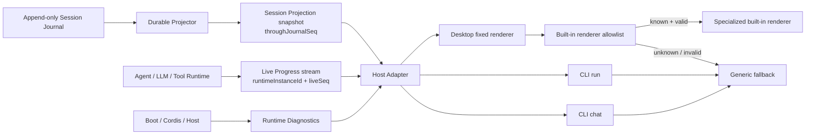
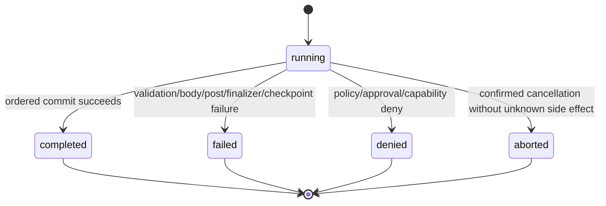

# ActSpace v2 Runtime Projection 规范

> 状态：v2 公共契约基线。
>
> 本文定义 Runtime 如何把 Session 与工具运行事实投影给固定 Desktop、CLI run 和 CLI chat。它收口 durable Session projection、live progress、runtime diagnostics、generic tool DTO 和 allowlisted renderer 的边界。实现可以调整 IPC channel、类名和缓存结构，但不得把三个平面重新混成一个事件流。

上位插件与固定前端兼容策略见 [插件 Runtime ABI](./agent-spec-plugin-runtime-abi.md)；工具执行顺序、lease 和 ordered commit 见 [Tool Runtime ABI](./agent-spec-tool-runtime-abi.md)。

## 1. 决策

ActSpace v2 前端不插件化。后端插件不能向 Desktop renderer 或 CLI Host 注入、安装或执行 JavaScript、React component、CSS、HTML、模板、动态 import URL 或本地模块路径。

三个 Host 共享同一套 Runtime Projection 语义：

```text
Session Journal --------------> Durable Session Projection
In-process execution ---------> Live Progress
Boot / Cordis / Host runtime --> Runtime Diagnostics

                                      |
                                      v
                           Desktop / CLI Host Adapter
                                      |
                    generic rendering + built-in allowlist
```

固定前端必须能只依赖 generic DTO 完成所有核心工作流。专用 renderer 是可选增强，不是插件正确运行的前提。

## 2. 三个投影平面

### 2.1 Durable Session Projection

Durable Session Projection 是从已接纳的 Session Journal 前缀派生的可恢复视图。它服务：

- Session 列表和历史浏览；
- 对话时间线和工具终态；
- Desktop reload、CLI resume 和冷启动；
- main Agent Inbox 的 pending / claimed / discarded 状态与 target；
- canonical export、审计和测试；
- live stream 断线后的重新同步。

它必须满足：

- 唯一事实来源是 Journal，不从 renderer state、内存 Tool object 或 diagnostics 反推；
- 相同 format / codec 集合和相同 Journal 前缀产生相同 generic projection；
- 每个 snapshot 声明 `throughJournalSeq`；
- terminal tool state 只在 ordered Journal commit 后出现；
- projection cache 可以删除并重建，不是第二份 Session 真相；
- 未知 required event、非法 payload 或 invariant failure 按 Session 兼容策略 fail-closed，不能静默跳过后继续执行。

Durable Projection 可以显示一个尚未终结的 call，因为 Journal 已经记录 tool call、approval 或 dispatch boundary；冷恢复必须再根据 durable facts 追加 repair，不能永远把历史尾部留成“正在运行”。

### 2.2 Live Progress

Live Progress 是当前 Runtime instance 的有界、可丢失、可合并事件流，用于：

- streaming text / reasoning；
- 工具 validation、approval wait、queue、body 和 finalizing 阶段；
- 百分比、计数器和简短状态文本；
- 当前 run 的响应式 UI。

Live Progress 不是 Session 事实：

- 不承诺跨进程重启恢复；
- 不能让模型看到新内容；
- 不能把 running 直接提升为 terminal truth；
- 可以 coalesce 或 drop 高频中间更新；
- 不得携带 credential、原始敏感 args、任意文件路径或未校验插件 payload；
- 每个事件带 `runtimeInstanceId`、递增 `liveSeq` 和最近观察到的 `throughJournalSeq`。

Host 发现 `runtimeInstanceId` 变化、`liveSeq` 缺口或 buffer overflow 时，必须丢弃推测状态并重新读取 Durable Session Projection。

### 2.3 Runtime Diagnostics

Runtime Diagnostics 描述产品运行环境，而不是 Session 对话事实，包括：

- Profile / Bundle / Patch 解析和 provenance；
- Loader / Fiber activation、startup settlement 和 shutdown recovery；
- ignored frontend contribution；
- unsupported renderer hint 或 renderer props 校验失败；
- registration draining、lease timeout 和 forced shutdown 风险；
- Host capability 缺失、projection gap 和 observability sink failure；
- ephemeral Session、degraded codec 和 storage health。

Diagnostics：

- 不进入模型 Context；
- 不作为 Session resume 的替代事实；
- 不混入 CLI `--json` 的业务结果；
- Desktop 可在诊断页展示，CLI 写 stderr 或显式 diagnostics 命令；
- 必须在进入日志、IPC 或 crash report 前统一脱敏。

## 3. 数据流与所有权



Plugin 只能贡献后端定义、执行结果和可选的 JSON-safe renderer hint。Host Adapter 负责传输和展示适配，不重新判断 Tool policy、不修补 Session、不改变 terminal state。

## 4. Generic Tool DTO

### 4.1 顶层合同

所有工具都必须能投影为 `ToolProjectionV1`。字段名称和状态值是稳定 Host ABI。

```ts
type ToolProjectionStateV1 =
  | "running"
  | "completed"
  | "failed"
  | "denied"
  | "aborted";

type ToolRunningPhaseV1 =
  | "validating"
  | "policy"
  | "awaiting-approval"
  | "queued"
  | "executing"
  | "finalizing"
  | "committing";

interface ToolProjectionV1 {
  kind: "tool";
  schemaVersion: 1;

  sessionId: string;
  agentRunId: string;
  turnId: string;
  stepId: string;
  pluginId: string;
  name: string;
  callId: string;

  state: ToolProjectionStateV1;
  phase: ToolRunningPhaseV1 | null;
  startedAt: string;
  finishedAt: string | null;
  durationMs: number | null;

  argsSummary: ToolArgsSummaryV1;
  modelOutput: readonly ToolModelOutputBlockV1[] | null;
  summary: string;
  detail: readonly ToolDetailBlockV1[];
  artifacts: readonly ToolArtifactProjectionV1[];
  failure: ToolFailureProjectionV1 | null;

  renderer: ToolRendererHintV1 | null;
}
```

Normative rules：

- `schemaVersion` 固定描述 generic DTO schema，不复用插件版本或 definition version；
- `pluginId + name + callId` 在所有更新中保持不变；`agentRunId` 标识当前 Agent run，不是 Runtime process id；
- `running` 时 `phase` 必须非空，terminal state 时必须为 `null`；
- `running` 时 `finishedAt`、`durationMs` 和 `modelOutput` 为 `null`；
- terminal state 必须有 `finishedAt`、非负整数 `durationMs` 和非空 `modelOutput`；
- `summary` 在所有状态都存在，必须是短、已脱敏、可直接 generic 展示的文本；
- `detail` 和 `artifacts` 使用空数组而不是 `undefined`；
- `failed`、`denied`、`aborted` 必须有 `failure`；`completed` 的 `failure` 必须为 `null`；
- `renderer` 永远可删除；删除后 generic DTO 仍必须完整可用。

### 4.2 Duration

`startedAt` 是 Core 接纳 call lifecycle 的 wall-clock 时间。`durationMs` 使用 Runtime monotonic clock 从接纳到 terminal candidate ordered commit 计算，持久化后不再根据 `startedAt / finishedAt` 重算。

Running UI 可以用本地时间显示临时 elapsed，但不能把它写回 DTO。系统休眠、wall clock 回拨和跨进程恢复不得产生负 duration。

### 4.3 Args summary

```ts
interface ToolArgsSummaryV1 {
  text: string;
  fields: readonly {
    name: string;
    value: string;
    redacted: boolean;
  }[];
}
```

`argsSummary` 由 Core 根据已校验 args、definition schema 和 redaction 并集确定性生成。插件可以提供字段 label 和额外敏感路径，但不能直接提交未经验证的最终摘要。

规则：

- secret 值替换为固定占位文本，不保留长度、前后缀或 hash；
- workspace 路径优先变成 workspace-relative 展示，Host-only 绝对路径不进入 DTO；
- 长文本、命令和 pattern 使用固定上限截断并明确标记；
- fields 顺序按 definition 的参数顺序，再按 key 稳定排序；
- summary 不用于恢复 executor args，也不能作为审计原始输入。

### 4.4 Model output

```ts
type ToolModelOutputBlockV1 =
  | { type: "text"; text: string }
  | { type: "artifact-ref"; artifactId: string; mimeType: string; alt: string };
```

`modelOutput` 是该 call 最终进入 Session Surface、供下一次模型请求看到的 Tool result。它在 Core result normalization 和 secret redaction 后生成，因此 Durable Projection 与模型历史引用同一个值，不维护第二份“UI 版结果”。

大文件、图片和二进制不以内联 base64 进入 DTO；使用 `artifact-ref`。Host 是否允许模型读取 artifact 由 Context / attachment policy 决定，renderer 打开 artifact 则由 Host artifact API 单独授权。

Denied、aborted 和 failed call 仍必须产生稳定、简短的 model output，避免下一次模型请求出现 dangling tool call。

### 4.5 Summary 与 detail

```ts
type ToolDetailBlockV1 =
  | { type: "text"; text: string }
  | { type: "code"; language: string | null; text: string }
  | { type: "key-value"; items: readonly { label: string; value: string }[] }
  | { type: "list"; items: readonly string[] };
```

Generic renderer 必须原生支持全部 detail block。这里故意不允许任意 HTML、Markdown execution、style、callback、command 或嵌套 component tree。

`summary/detail` 是展示数据，不得影响 Agent Loop 的 model output 或工具成功判定。Detail 校验失败时丢弃非法 block、记录 diagnostic，并继续使用 summary/model output 的 generic fallback；不能因此重写已经提交的 Tool terminal state。

### 4.6 Artifacts

```ts
interface ToolArtifactProjectionV1 {
  artifactId: string;
  kind: "file" | "image" | "diff" | "json" | "archive" | "other";
  label: string;
  mimeType: string;
  sizeBytes: number | null;
  digest: string | null;
}
```

Artifact 由 Session-owned artifact store 管理。DTO 只暴露 opaque `artifactId` 和安全 metadata：

- 不暴露绝对路径、`file://` URL、可执行 command 或任意下载 URL；
- Desktop 通过 preload/main 的受控 artifact API 打开；
- CLI 通过显式 export/open 命令处理；
- artifact 缺失不改变历史 tool state，展示为 unavailable 并产生 diagnostic；
- digest 用于完整性，不作为 secret 的可逆替代；敏感 artifact 可以省略 digest。

### 4.7 Failure

```ts
interface ToolFailureProjectionV1 {
  code: string;
  message: string;
  retryable: boolean;
  outcomeUnknown: boolean;
}
```

`message` 是已脱敏的用户可见说明。原始 Error、stack、cause 和 stderr 不进入 generic DTO；它们只能进入受控、脱敏 diagnostics。

`outcomeUnknown: true` 时 `state` 必须是 `failed`，不能标成 `aborted`。UI 必须明确避免自动重试提示；用户显式重做会创建新 `callId`。

## 5. Tool 状态机



状态只能单调前进：

- terminal state 不得回到 `running`；
- terminal state 之间不得互相改写；
- live body settle 仍保持 `running/finalizing` 或 `running/committing`，直到 ordered Journal commit 成功；
- specialized renderer 不得拥有独立状态机；
- 迟到 progress、重复 terminal 和低于当前 Journal seq 的更新被忽略并产生有界 diagnostic。

Invalid arguments 可以从第一个可观察 snapshot 直接显示为 `failed`；实现不必为了动画先发一个 `running` frame。语义上它仍经过同一个 call lifecycle 和有序 terminal slot。

## 6. Live Progress 合同

```ts
interface ToolLiveProgressV1 {
  kind: "tool-progress";
  schemaVersion: 1;
  runtimeInstanceId: string;
  liveSeq: number;
  throughJournalSeq: number;
  sessionId: string;
  pluginId: string;
  name: string;
  callId: string;
  phase: ToolRunningPhaseV1;
  message: string | null;
  current: number | null;
  total: number | null;
}
```

规则：

- `current/total` 只有在二者均为有限非负数且 `current <= total` 时出现；
- message 经过固定长度上限和 redaction；
- executor 只能更新自己的 `callId`；
- Core 对频率和总字节数限流，丢弃中间 progress 不影响执行；
- approval 状态由 Core / Host Broker 投影，插件不能伪造 `awaiting-approval`；
- final terminal 通过 Durable Projection 或带 Journal cursor 的 committed upsert 发布，不由 progress event 宣布；
- runtime restart 后 `liveSeq` 从新 instance 重新开始，Host 必须按 `runtimeInstanceId` 区分。

### 6.1 无丢失握手

Host 打开 Session 投影流时，Runtime 必须在逻辑上原子完成：

1. 捕获一个 live cursor；
2. 返回 `throughJournalSeq` 明确的 Durable snapshot；
3. 回放 cursor 之后仍在 buffer 中的 live events；
4. 继续实时订阅。

实现可以使用锁、单线程队列或 sequence barrier，但不得采用“先异步读 snapshot，再随便订阅”的竞态路径。无法覆盖 gap 时返回 `resync-required`，Host 重新执行完整握手。

## 7. Runtime Diagnostic DTO

```ts
type RuntimeDiagnosticSeverityV1 = "info" | "warning" | "error" | "fatal";

interface RuntimeDiagnosticV1 {
  kind: "runtime-diagnostic";
  schemaVersion: 1;
  runtimeInstanceId: string;
  diagnosticId: string;
  occurredAt: string;
  severity: RuntimeDiagnosticSeverityV1;
  code: string;
  source: "boot" | "composition" | "cordis" | "session" | "llm" | "tool" | "host" | "projection";
  message: string;
  pluginId: string | null;
  name: string | null;
  callId: string | null;
  details: Readonly<Record<string, JsonValue>>;
}
```

Diagnostics code 必须稳定，message 可以本地化。`details` 经过 key allowlist、深度/大小上限和 secret scanner；原始插件 config、credential、环境变量、完整 stack 和任意 Error object 不得跨 Host 边界。

同一重复问题应按 code + source + identity 做有界聚合，避免 renderer 或 stderr 被高频警告淹没。

## 8. Allowlisted renderer

### 8.1 Renderer hint 只是数据

```ts
interface ToolRendererHintV1 {
  id: string;
  schemaVersion: number;
  props: JsonValue;
}
```

插件可以在 terminal candidate 中提供 renderer hint。Projection Service 只有在以下条件全部满足时才把它放入 Host DTO：

1. `id` 存在于当前产品构建的 renderer allowlist；
2. 该 id 支持声明的 `schemaVersion`；
3. props 通过该 renderer 的构建时 JSON Schema；
4. props 通过平台 redaction、深度、key、数组长度和总字节上限；
5. 当前 Host 声明支持该 renderer capability。

失败时：

- `renderer` 设为 `null`；
- generic DTO 其他字段保持不变；
- 记录 `UNSUPPORTED_TOOL_RENDERER` 或 `INVALID_TOOL_RENDERER_PROPS` diagnostic；
- 工具插件、Session resume 和 Agent Loop 不因此失败。

### 8.2 构建时 allowlist

Allowlist 由 ActSpace 产品代码拥有，逻辑形态为：

```ts
interface BuiltInToolRendererRegistration {
  id: string;
  supportedSchemaVersions: readonly number[];
  validate(props: JsonValue, schemaVersion: number): boolean;
  component: BuiltInReactComponent;
}
```

`component` 永不来自插件包、Session、Profile、Bundle、Patch、网络或用户目录。插件不能通过 props 传函数、事件 handler、HTML、CSS、模块地址、命令或协议 handler。

### 8.3 Generic fallback 是主合同

Generic fallback 至少展示：

- tool label / `name` 和当前 state；
- redacted args summary；
- running phase 或 terminal duration；
- summary 和 detail blocks；
- model output；
- artifact 列表；
- failure message 和 `outcomeUnknown` 警示。

Specialized renderer 可以改善布局、diff、图片、Todo 或 Browser 展示，但必须保留相同 state、failure 和 artifact 语义。它不能隐藏 denied / failed / aborted，也不能触发未经 Host API 审批的副作用。

### 8.4 Tool renderer 不存在 required 模式

Tool renderer hint 永远是 optional enhancement，不能声明 required。一个后端工具若离开专用 renderer 就无法正确使用，说明其 generic result contract 不完整，不得进入 v2 Tool ABI。

插件 manifest 仍可按上位插件 Runtime ABI 声明 `frontend.required=true`；固定前端 Host 会把该插件判为不兼容，并按 Entry required / optional 规则拒绝 Boot 或跳过整项行为激活。这个声明不会让 Host 装载插件前端代码，也不能把某个 renderer hint 提升成 required。

任何 renderer module、script、style 或 HTML contribution 都不属于 Tool Projection ABI。

## 9. Host 映射

### 9.1 Desktop

- Electron main 持有 BootedProfile、Desktop App Service 和 projection subscription；
- preload 暴露 typed、窄化、可取消的 snapshot / stream IPC；
- renderer 不接触 Cordis Context、Session 文件、artifact 路径或 executor；
- renderer reload 执行 snapshot + cursor 握手，不依赖旧 React state 恢复；
- allowlisted component crash 时 Error Boundary 回退 generic renderer，并上报 diagnostic。

### 9.2 CLI run

- 默认 stdout 仍只输出最终 Agent 文本；
- `--json` 输出 invocation final result，可以包含最终 durable tool projections，但不混入 diagnostics；
- `--jsonl` 使用有 `kind + schemaVersion` 的 envelope 输出 live projection 与最终结果；
- diagnostics 写 stderr；
- 非 TTY 环境不输出 spinner、颜色控制字符或未结构化 progress。

### 9.3 CLI chat

- TTY 使用 generic tool line 展示 state、summary 和 duration；
- approval 通过 Host Broker 单独交互，不能由 renderer hint 定义；
- `/resume` 先读取 Durable Projection，再接新 live stream；
- TTY 不支持专用 renderer 时直接使用 generic fallback，不把插件视为 degraded。

三种 Host 可以有不同排版，不能改变 DTO 状态、failure code、model output、Journal cursor 或是否允许执行。

## 10. 失败、取消、卸载与恢复

### 10.1 Projection failure

| 失败 | 行为 |
|---|---|
| specialized renderer 未知或 props 非法 | generic fallback + diagnostic；Session 与工具结果保持有效。 |
| live progress 丢失或乱序 | 丢弃推测状态，重新 snapshot；不修改 Journal。 |
| generic projector 遇到 unknown ignorable event | 保留 raw event、标记 degraded、跳过该 event 的扩展 projection。 |
| generic projector 遇到 unknown required event | 允许 raw browse/export，阻止 resume / 新写入。 |
| known core event 无法形成合法 generic DTO | 标记 corruption / Core invariant failure，阻止继续执行。 |
| artifact 缺失 | DTO 保持原 artifact ref，Host 显示 unavailable，记录 diagnostic。 |

### 10.2 取消

- body 前确认取消：terminal `aborted`；
- body 中 executor 确认安全停止：terminal `aborted`；
- body 是否产生外部结果无法确认：terminal `failed` 且 `outcomeUnknown=true`；
- terminal commit 后的取消不改变 projection；
- approval deny 使用 `denied`，不是 `aborted`；
- Runtime shutdown 导致的 cooperative cancel 使用同一规则，不引入 Host 特例。

### 10.3 插件卸载与 Runtime restart

- registration draining 不删除已提交的 durable projection；
- in-flight call 继续显示原 `pluginId/name/callId`，并由 captured lease 使用旧 executor；
- 新 Runtime instance 的 registration 不接管旧 call，也不能发送旧 call 的 progress；旧 call 必须先由原 Runtime settle，或在 cold recovery 中追加保守终态；
- 卸载后历史 Session 仍可 generic browse，因为 DTO 和 Journal codec 不依赖 React plugin；
- 若 required Event Codec 缺失，按 Session codec 规则阻止 resume，但 generic raw browse 仍可用；
- lease timeout 是 Runtime diagnostic，不把工具伪装成 `aborted`。只有执行结果可确认时才提交 terminal state。

### 10.4 Cold recovery

Runtime 重启后不恢复旧 live progress。Session repair 根据 Journal：

- call 尚未越过 dispatch boundary：追加 `aborted/not-started` 终态；
- 已越过 dispatch boundary 但无 terminal result：追加 `failed/OUTCOME_UNKNOWN`；
- 已有 terminal event：保持原状态，不重复提交；
- repair 后重新生成 Durable Projection，再允许 Host resume。

## 11. Redaction 合同

三个平面都执行 fail-closed redaction，但来源不同：

| 平面 | 允许内容 | 禁止内容 |
|---|---|---|
| Durable Session Projection | Core-redacted model output、args summary、safe detail、artifact ref | credential、Host handle、绝对 secret path、原始 Error object |
| Live Progress | 简短 phase/message/counter | raw args、stdout dump、环境变量、任意插件 JSON |
| Runtime Diagnostics | allowlisted structured details、稳定 code | secret config、完整 credential ref resolution、未经清洗 stack/cause |

强制规则：

- renderer props 再次经过与 generic DTO 相同或更严格的 redaction；
- specialized renderer 不能请求 raw args 或 raw executor result；
- diagnostic message 不得通过字符串拼接带入插件 config 或 Error dump；
- artifact 内容不随 DTO 自动读取，必须经过 Host artifact authorization；
- redaction 失败时丢弃可选 detail/progress/renderer props；若失败字段属于 model output 或核心 terminal identity，则 terminal commit fail-closed。

## 12. 示例

### 12.1 Generic completed tool

```json
{
  "kind": "tool",
  "schemaVersion": 1,
  "sessionId": "ses_01",
  "agentRunId": "run_01",
  "turnId": "turn_01",
  "stepId": "step_02",
  "pluginId": "@actspace/core-tools",
  "name": "read_file",
  "callId": "call_07",
  "state": "completed",
  "phase": null,
  "startedAt": "2026-08-22T10:00:00.000Z",
  "finishedAt": "2026-08-22T10:00:00.014Z",
  "durationMs": 14,
  "argsSummary": {
    "text": "Read packages/runtime/src/index.ts",
    "fields": [
      { "name": "path", "value": "packages/runtime/src/index.ts", "redacted": false }
    ]
  },
  "modelOutput": [
    { "type": "text", "text": "1: export * from './runtime';" }
  ],
  "summary": "Read 1 line",
  "detail": [
    { "type": "key-value", "items": [{ "label": "Encoding", "value": "utf-8" }] }
  ],
  "artifacts": [],
  "failure": null,
  "renderer": null
}
```

### 12.2 Allowlisted renderer hint with generic fallback

```json
{
  "kind": "tool",
  "schemaVersion": 1,
  "sessionId": "ses_01",
  "agentRunId": "run_01",
  "turnId": "turn_02",
  "stepId": "step_03",
  "pluginId": "@actspace/core-tools",
  "name": "write_file",
  "callId": "call_11",
  "state": "completed",
  "phase": null,
  "startedAt": "2026-08-22T10:01:00.000Z",
  "finishedAt": "2026-08-22T10:01:00.042Z",
  "durationMs": 42,
  "argsSummary": {
    "text": "Update src/config.ts",
    "fields": [{ "name": "path", "value": "src/config.ts", "redacted": false }]
  },
  "modelOutput": [{ "type": "text", "text": "Updated src/config.ts" }],
  "summary": "Updated 3 lines",
  "detail": [{ "type": "text", "text": "The file was written atomically." }],
  "artifacts": [
    {
      "artifactId": "artifact_diff_11",
      "kind": "diff",
      "label": "src/config.ts diff",
      "mimeType": "text/x-diff",
      "sizeBytes": 412,
      "digest": "sha256:example"
    }
  ],
  "failure": null,
  "renderer": {
    "id": "actspace.diff",
    "schemaVersion": 1,
    "props": { "artifactId": "artifact_diff_11" }
  }
}
```

如果当前 Host 不支持 `actspace.diff`、schemaVersion 不匹配或 props 非法，只删除 `renderer` 并展示其余 generic 字段。工具结果本身不变化。

### 12.3 Outcome unknown

```json
{
  "kind": "tool",
  "schemaVersion": 1,
  "sessionId": "ses_01",
  "agentRunId": "run_01",
  "turnId": "turn_03",
  "stepId": "step_01",
  "pluginId": "@actspace/core-tools",
  "name": "bash",
  "callId": "call_19",
  "state": "failed",
  "phase": null,
  "startedAt": "2026-08-22T10:02:00.000Z",
  "finishedAt": "2026-08-22T10:02:05.000Z",
  "durationMs": 5000,
  "argsSummary": {
    "text": "Run command [redacted]",
    "fields": [{ "name": "command", "value": "[redacted]", "redacted": true }]
  },
  "modelOutput": [
    { "type": "text", "text": "The command outcome could not be confirmed after runtime interruption." }
  ],
  "summary": "Command outcome is unknown",
  "detail": [],
  "artifacts": [],
  "failure": {
    "code": "OUTCOME_UNKNOWN",
    "message": "The runtime stopped after the side-effect boundary.",
    "retryable": false,
    "outcomeUnknown": true
  },
  "renderer": null
}
```

## 13. 必须通过的合同测试

### 13.1 Durable Projection

- 同一 Journal prefix 重建得到 byte-stable generic DTO；
- 删除 projection cache 后可完整重建；
- terminal state 在 ordered Journal commit 前不可见；
- unknown required / ignorable event 分别执行正确降级；
- cold repair 不修改既有 event，只追加保守终态。
- Inbox projection 按 enqueue seq 稳定重建，claimed / discarded message 不再显示为 pending。

### 13.2 Live Progress

- snapshot + cursor 握手不丢失 snapshot 期间发生的更新；
- live gap、overflow 和 runtime instance 切换触发 resync；
- 高频 progress 可合并且不改变 terminal result；
- terminal 后迟到 progress 被忽略；
- plugin 不能为其他 `callId` 发送 progress。

### 13.3 Generic DTO 与状态机

- 五种 state、phase/nullability、duration 和 failure 组合通过 schema 验证；
- body 先完成但未轮到 ordered commit 时仍显示 running/finalizing；
- denied、aborted、failed 都生成非 dangling model output；
- `OUTCOME_UNKNOWN` 永远是 failed 且不提供自动重试；
- Desktop、CLI run 和 CLI chat 对相同 Journal facts 输出相同语义字段。

### 13.4 Renderer allowlist

- known id + supported schema + valid props 使用内置 renderer；
- unknown id、版本不支持、props 超限或非法全部回退 generic；
- specialized component throw 时 Error Boundary 回退 generic；
- Profile、Session 或插件目录不能引入 executable renderer code；
- `frontend.required=true` 按上位插件 ABI 使固定 Host 判定插件不兼容；script/style/module contribution 永不执行。

### 13.5 Redaction 与 artifact

- credential 和敏感 args 不出现在三个平面；
- renderer props 不能恢复 generic DTO 已删除的 secret；
- artifact DTO 不包含绝对路径或 `file://` URL；
- artifact 读取必须经过 Host authorization；
- 原始 Error stack / cause 不跨 IPC 或 stdout JSON。

### 13.6 卸载与恢复

- draining registration 的历史 DTO 不消失；
- 新 Runtime instance 无法更新旧 `callId`，只能在 Session repair 后开始新 call；
- lease timeout 只产生 diagnostic，不伪造 terminal state；
- restart 后不重放旧 live progress；
- dispatch boundary 后缺 terminal 的 repair 投影为 failed / outcome unknown。

## 14. 实施时仍需确定的机械细节

以下项目可以在 execution plan 中确定，不改变本文合同：

- Projection Core、shared DTO 和 Host transport 的最终 package / 文件位置；
- Desktop IPC channel、CLI JSONL envelope 的具体名称；
- live buffer、progress rate、summary/detail/props 大小和深度上限；
- `runtimeInstanceId`、`liveSeq` 和 snapshot cursor 的具体编码；
- projection cache 的物理格式和失效实现；
- 首批 built-in renderer allowlist 条目和 React component 文件名；
- artifact API 的 IPC 方法名、缩略图策略和缓存参数；
- diagnostics 聚合窗口、日志采样和 metrics 名称。

这些机械选择不得引入插件前端代码、第二份 renderer-only tool state、未脱敏 live payload 或绕过 Journal 的 terminal 更新路径。
