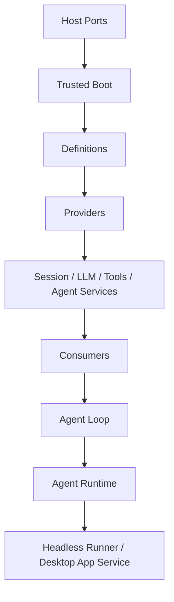

# Service Definition / Provider / Consumer 分层规范

> 状态：目标设计已确认；P1-B contract slice 已实施，核心 Provider 全量迁移仍由后续阶段收口。应用 Service 与 Profile 启动结果分离；精确 API 见 [Runtime 文档](agent-target-runtime-architecture.md)。
>
> 本规范把当前已经存在的 Cordis Service 和 `service-contract.ts` 雏形提升为所有核心能力共同遵守的 ABI。它不要求所有 class 都继承 `Service`，也不改变具体工具 executor 的实现逻辑。

## 1. 决策摘要

ActSpace 采用 DSH 的三层能力模型：

```text
Definition  —— 稳定能力合同
    ↓
Provider    —— 一个可替换实现及其资源所有权
    ↓
Consumer    —— 只依赖 Definition 的使用方
```

Cordis Context 负责把 Provider 实例注入 Consumer，并负责 Fiber/Effect 生命周期；Runtime 只提供 Host port、Boot、Profile 诊断和 shutdown 边界。

三层不是三个必然独立的 npm package：一个领域包可以同时导出 Definition 和默认 Provider，但公共类型、manifest、测试和依赖方向必须能区分三种角色。

## 2. 术语与边界

| 角色 | 必须拥有 | 不得拥有 |
| --- | --- | --- |
| Definition | 稳定 id、类型、配置 schema、错误/生命周期语义、事件和 capability 约束 | 具体文件、凭据、全局 singleton、执行函数 |
| Provider | Definition 的一个实现、注册/lease、listener/timer/task/外部资源和 disposer | 修改 Definition、绕过 Host ceiling、把私有 class 暴露给 Consumer |
| Consumer | 明确的 Definition 依赖和最小调用面 | 导入 Provider 私有 class、直接读取 Context/Fiber、创建第二份状态 |
| Runtime Service | 长期状态、registry、协调和生命周期 | 重新实现领域语义或成为中央 service map |
| Host Port | credential、filesystem、process、browser、approval、TTY 等外部能力 | Agent Loop、Session writer、工具 registry、Provider 私有状态 |

## 3. 当前实现与剩余边界

2026-09-09 按源码复核：`packages/cordis-adapter/src/service-contract.ts` 已提供 Definition/Provider/Consumer 类型、14 个核心 role metadata，以及 Definition、Service graph、manifest consistency 校验。`SessionHandle` 已通过 `SessionPersistenceDriver` 访问后端；默认生产 Boot 的 Profile-first 入口见 Runtime 文档。

不能把实施前的 `serviceValues` 手工组装或缺少 metadata 校验继续描述成当前默认路径。也不能把 metadata 已存在等同于全部 Consumer 完成窄接口迁移：例如 Session Persistence 插件仍导出 `session.persistence.types` 的具体类和 `activate()` 兼容入口，这些要按生产可达性与 Consumer 实际依赖继续核对。

当前 live-log Service ID 是 `session.store`；`session.core` 是分层设计中的目标称呼，并非当前 `ACTSPACE_SERVICE_IDS` 中已注册的同名 ID。接线须使用真实声明，不能从概念表格推断可调用接口。

本文集中维护当前三层契约与后续约束。[核心 Cordis Service 文档](agent-spec-core-cordis-services.md)保留 P0 Service 化的设计背景和各领域职责推导；重复术语、ownership、生命周期和验收以本文为当前入口。G1 和未完成迁移仍由 [P1-B](../../exec-plans/active/20260829-actspace-p1-service-roles/README.md)及总计划跟踪。

## 4. Definition contract

以下是概念示意；精确泛型、owner/publicSurface、可选 type marker、Provider/Consumer identity 与返回类型以 `service-contract.ts` 的公开类型为准。每个可替换能力至少声明：

```ts
interface ServiceDefinition<TService, TConfig> {
  kind: "actspace.service-definition"
  id: ServiceId
  abiVersion: number
  description: string
  scope: "root" | "agent" | "session" | "invocation"
  required: boolean
  configSchema: JsonSchema
  service: TService
  errors: readonly string[]
}
```

实际 TypeScript 类型可以拆分为 type-only declarations 和 runtime metadata，但以下字段必须可以被生成器读取：

- 唯一 `ServiceId`；
- ABI 版本和 owner package；
- Provider 能力是否 required；
- Context scope；
- Config validator；
- public methods/fields 的类型入口；
- 可观测错误类别和 dispose 语义。

Definition 必须是冻结、JSON-safe、可 hash 的纯数据。它不持有 Context、Fiber、凭据或函数实例。

## 5. Provider contract

Provider 可以是 Cordis `Service` class 或 `apply(ctx, config)` Behavior，但必须具备同样的生命周期：

```ts
interface ServiceProvider<TService, TConfig> {
  definition: ServiceDefinition<TService, TConfig>
  apply(ctx: CordisContext, config: TConfig): Promise<ProviderHandle<TService>> | ProviderHandle<TService>
}

interface ProviderHandle<TService> {
  service: TService
  dispose(): Promise<void>
}
```

Provider 必须：

1. 在 `apply` 完成前校验 Config 和 required dependencies。
2. 只通过 `static inject`、Context lookup 或 Host port 获取依赖。
3. 用 `ctx.effect()` 绑定 listener、timer、watcher、lease、subprocess 和后台任务。
4. 发布前完成 registry/service 的原子注册；不得先发布 definition 再补 executor/provider。
5. 进入 draining 后拒绝新工作，等待已有 lease 或任务收束。
6. disposer 幂等、可等待，且释放失败必须可诊断。
7. 不将 Cordis Context、Fiber 或 Provider class 传出 Host/IPC。

## 6. Consumer contract

Consumer 只依赖 Definition：

```ts
interface ServiceConsumer<TService> {
  definition: ServiceDefinition<TService, unknown>
  requires: readonly ServiceId[]
  consume(service: TService, ctx: ServiceLookupContext): void | Promise<void>
}
```

在领域代码中，Consumer 的推荐形式是：

- `static inject = ["session.store", "llm.service", "tools.runtime"]`；
- 从 Context 获取 Definition 对应的窄接口；
- 不能用 `instanceof JsonlSessionPersistenceService` 决定业务路径；
- 不能读取 `service.provider`、`service.runtime` 等 Provider 私有字段，除非该字段本身属于 Definition。

## 7. 核心 Service ownership

| Service ID | Definition owner | 默认 Provider | 主要 Consumer |
| --- | --- | --- | --- |
| `session.store`（逻辑 Session Core） | Session Core | Session Core Service | Agent Runtime、Loop、Projection |
| `session.persistence` | Session Persistence | JSONL Provider | Session Core |
| `session.journal` | Session Journal | Core Codec/Journal Service | Session Core、Projection |
| `llm.service` | LLM Service | pi-ai adapter | Agent Loop、Compaction |
| `prompt.runtime` / `context.assembly` | Prompt/Context | default contributors | Agent Loop |
| `tools.runtime` | Tool Runtime | ActSpace Tool shell | Agent Loop、Subagent |
| `agent.registry` | Agent Core | Agent Registry | Agent Runtime、Loop |
| `agent.loop` | Agent Loop | default loop driver | Agent Runtime、Headless |
| `compaction.runtime` | Compaction | default summarizer | Agent Loop |
| `agent.runtime` | Runtime orchestration | RunController bridge | Desktop App Service、Headless runner |

逻辑 Session Core（当前 `session.store`）和 `session.persistence` 必须是不同的 Definition。`session.jsonl` 是 Provider/codec package，不是 Session Core 的替代名称。

## 8. 依赖方向与禁止环



允许的方向：

```text
AgentRuntime → AgentRegistry / AgentLoop
AgentLoop → SessionCore / LLM / Prompt / ToolRuntime / Compaction
SessionCore → SessionPersistence Definition
JSONL Provider → Session Journal + detached Session types
Host → Profile Boot / App Service / Host ports
```

禁止：

- `SessionPersistence → SessionStore` 的业务反向依赖；
- `AgentRegistry → AgentRuntime` 或 `AgentRegistry → App Service`；
- Tool executor → Runtime、Journal writer、CLI stdout；
- Consumer → Provider private class；
- Provider → 模块级可变 singleton；
- Runtime → 第二套 `serviceValues` 容器；
- 两个 active Provider 同时占用同一个 Service ID。

## 9. 工具 Service 特殊规则

Tool Runtime 仍是一个 Service shell，工具实现是 Provider contribution：

```text
tools.runtime Definition
  ├─ core-tools Provider       → read/list/grep/edit/write/delete/bash/web
  ├─ browser-tools Provider    → Browser Bridge adapter
  └─ future Provider            → 其他受信任 capability
```

Provider contribution 必须同时提交：

- frozen Tool Definition；
- executor function；
- policy/approval metadata；
- capability effects；
- registration disposer。

P1-B 不修改 `read`、`list`、`grep`、`edit`、`write`、`bash` 或 Browser Bridge 的执行主体，只将它们接入新的 Definition/Provider/Consumer 和 Tool Runtime shell。

## 10. Manifest 与 Service 一致性

每个 Behavior Entry 的以下三份声明必须一致：

```text
manifest.provides / manifest.injects
  = Service Definition metadata
  = ctx.provide / static inject 的实际结果
```

启动验证必须拒绝：

- manifest 声明提供但 Behavior 未提供；
- Behavior 提供未声明的 Service；
- required Service 缺失；
- inject cycle；
- 同一 Context 中重复 active Provider；
- disposed/pending/failed Fiber 的 Service 被 Consumer 取得。

## 11. 生命周期和错误

```text
manifest admission
  → config validation
  → dependency resolution
  → Provider apply
  → publish Service
  → Consumer activation
  → ACTIVE
  → quiescing
  → drain leases/tasks
  → dispose effects
  → DISPOSED
```

Provider apply、Config、inject 或 Consumer activation 失败时，不发布可用的 Profile 启动结果；已启动的 Provider 按逆序释放。运行时错误记录结构化 diagnostics，Session 已提交事实仍可 replay。

## 12. 验收标准

1. 每个核心 Service 都有 Definition、默认 Provider、Consumer 清单和 public export。
2. Consumer 测试只使用 Definition/fake Provider，不依赖 JSONL、pi-ai 或具体工具 class。
3. manifest、`static inject`、`ctx.provide` 和 Definition metadata 有自动一致性测试。
4. 缺失 required、重复 Provider、循环依赖、配置非法、Fiber dispose 和 provider failure 都 fail closed。
5. Tool executor parity fixtures 继续通过，且 executor 不写 stdout、不直接写 Journal。
6. Context 与 App Service 只在受信任的本进程边界消费，Fiber、writer、Provider class 或 AgentLoop 实例不进入 IPC/renderer。
7. Cordis lifecycle、Session、Loop、Tool、CLI run 和全仓 typecheck/test 通过。

## 13. 回退和非目标

本计划不引入第二个 Agent 引擎、不迁移 Session 数据、不做 online HMR、不添加不可信插件沙箱、不实现 CLI chat。若某个 Provider seam 失败，回退到对应 Provider adapter；不得重新建立中央 service registry 或让 Runtime 重新拥有领域状态。

## 14. 参考

- [核心 Cordis Service 化与能力 seam](./agent-spec-core-cordis-services.md)
- [插件 Runtime ABI](./agent-spec-plugin-runtime-abi.md)
- [Tool Runtime 内核与外壳边界](./agent-spec-tool-runtime-boundary.md)
- `packages/cordis-adapter/src/service-contract.ts`
- `tmp/deepseek-harness/packages/core/session/src/index.ts`
- `tmp/deepseek-harness/packages/session/session-persistence/src/index.ts`
