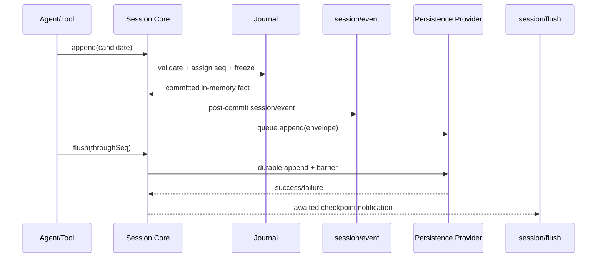

# Session Core 与 Persistence Provider 分离规范

> 状态：目标设计已确认；P1-A contract slice 已实施，CLI persist/resume 与全量迁移仍由 G1 收口。
>
> 本规范承接 P0 已冻结的 13 种 Session 核心事件、Journal replay、`session/event`、`session/flush` 和现有 JSONL 行为。它只重新划分所有权，不改变事件名称、顺序、恢复语义或具体工具 executor。

## 1. 决策

ActSpace 将 Session 拆为四个可独立替换的层：

```text
Session Journal
  └─ 事件 Envelope、Codec、关系校验、Surface、Replay

Session Core
  └─ live Session、SessionStore、append、通知、运行时生命周期

Persistence Definition
  └─ backend-neutral 的 create/load/append/flush/inspect/fork contract

Persistence Provider
  └─ JSONL 文件、writer lease、write-behind、torn-tail、物理 recovery
```

唯一事实源仍然是 Session Journal。物理 backend 只保存和读取已验证的事件，不拥有 Agent、Prompt、Tool 或 UI 语义。

## 2. 为什么现在做

当前 `@actspace/session-persistence` 中的 `SessionStore`、`SessionHandle` 和 `JsonlSessionPersistence` 已经有 seam，但 `SessionHandle` 仍直接导入 `JsonlSessionWriter`，导致“Session 核心”和“JSONL 后端”只是逻辑分层而不是可替换边界。目标是让 fake、JSONL 和未来 backend 都消费同一份 Session Core contract。

DSH 的可迁移机制是：Session 作为 live service，Persistence 作为独立 Service Definition/Provider；append 事实与 flush durability 是两个不同的 Cordis 事件。ActSpace 采用这个边界，但保留自己的 raw JSONL 格式、recovery 规则和工具行为。

## 3. 包边界

```text
@actspace/session-journal
  纯事件和投影原语；禁止 node:fs、Cordis Context、writer lease

@actspace/session-core              新增
  SessionHandle、SessionStore、SessionPreparation、live lifecycle
  依赖 session-journal + persistence contract

@actspace/session-persistence
  只导出 Persistence Definition、snapshot/inspection 类型和 Provider ABI
  不返回 SessionHandle，不导入 JSONL writer

@actspace/session-jsonl
  JSONL Provider；持有文件布局、writer、lease、write-behind 和物理 repair

@actspace/session-projection
  从 Journal/Snapshot 派生只读 projection
```

`@actspace/session-core` 可以依赖 `@actspace/session-persistence` 的纯 contract；Persistence Provider 只能依赖 `session-journal` 和 `session-core` 的 detached snapshot 类型，不能反向持有 `SessionStore`。如果 TypeScript 类型边界产生循环，Provider contract 中只允许出现 detached `SessionInspection`、`SessionSeed` 和 event arrays，不允许出现 live handle。

## 4. 所有权和职责

| 层 | 负责 | 明确不负责 |
| --- | --- | --- |
| Journal | 13 个核心事件、扩展 Codec、连续 seq、关系不变量、Surface fold | 文件、锁、Cordis、Host |
| Session Core | 创建/恢复 live Session、append、projection 入口、post-commit `session/event`、关闭 | 文件路径、JSONL 编码、`fsync`、跨进程锁 |
| Persistence Definition | provider 方法、错误类别、revision、durability 语义 | 具体文件或数据库 |
| JSONL Provider | locate、create、append、load、inspect、readFrom、list、flush、lease、torn-tail | Agent Loop、工具 policy、通知语义 |
| Projection | 只读 UI/model DTO | append、repair、持久化副作用 |

## 5. Provider contract

Provider contract 是数据边界，不要求 Provider 返回 live Session：

```ts
interface SessionPersistenceProvider {
  locate(meta: SessionHeaderV1): SessionLocation | undefined
  create(meta: SessionHeaderV1): Promise<void>
  append(sessionId: string, events: readonly SessionEventEnvelopeV1[]): Promise<void>
  flush(sessionId: string, throughSeq: number): Promise<void>
  load(sessionId: string): Promise<SessionInspection>
  inspect(sessionId: string): Promise<SessionInspection>
  readFrom(sessionId: string, fromSeq: number): Promise<SessionInspectionSuffix>
  list(): Promise<readonly SessionHeaderV1[]>
  fork(input: SessionForkInput): Promise<SessionSeed>
  close(sessionId: string): Promise<void>
}
```

Provider 必须遵守：

1. `append` 只接受已由 Session Core 接纳、seq 连续的 immutable envelope。
2. `flush` 是明确 durability barrier；成功返回前，`throughSeq` 已满足 provider 的 durability contract。
3. `load` 可以做冷恢复，但不得删除已 durable 的 open turn；必须追加保守 closers 或返回明确 corruption。
4. `inspect` 不获取 writer lease，不隐式修复物理文件。
5. `list` 返回轻量 metadata，不要求完整读取每个 Journal。
6. `fork` 只接受经过验证的完整 prefix，不复制 live registry、credential 或 Fiber。
7. Provider 失败必须保留原始 cause、标记 Session writer blocked，并让后续有副作用操作 fail closed。

## 6. Session Core contract

Session Core 接受 provider 作为构造依赖，但对上层只暴露 live-log API：

```ts
interface SessionCore {
  create(input: CreateSessionHeaderInput): Promise<SessionHandle>
  open(sessionId: string): Promise<SessionHandle>
  inspect(sessionId: string): Promise<SessionInspection>
  list(): Promise<readonly SessionHeaderV1[]>
}

interface SessionHandle {
  readonly header: SessionHeaderV1
  readonly journal: ReadonlySessionJournal
  append(candidate: SessionEventCandidateV1): Promise<SessionEventEnvelopeV1>
  appendMany(candidates: readonly SessionEventCandidateV1[]): Promise<readonly SessionEventEnvelopeV1[]>
  flush(throughSeq?: number): Promise<void>
  close(): Promise<void>
}
```

Session Core 不暴露 provider class、writer、lease、文件路径或 Cordis Context 给 Agent Loop、Tool Runtime、Host 或 renderer。

## 7. 事件和 durability 时序



不变量：

- `session/event` 只在 Journal 接纳事实后触发；通知失败不能回滚事实。
- `session/flush` 只在 provider barrier 完成后完成；它不是另一种 append。
- persistent Session 在 LLM dispatch、工具副作用边界和下一 Step 前必须 checkpoint。
- ephemeral Session 仍执行同样的 Journal/invariant 流程，只把 durability 明确标为内存边界。

## 8. JSONL Provider 保留内容

`@actspace/session-jsonl` 继续保留当前已验证行为：

- UTF-8 raw JSONL、Header 首行、一个 envelope 一行；
- `SessionWriteBehind` 的批写和 `flush(throughSeq)`；
- `SessionWriterLease` 的跨进程排他、heartbeat 和 stale 诊断；
- torn-tail 检测、保守 recovery、fork seed 和 artifact layout；
- 现有 golden、recovery、fork、lease 和 process smoke 语义。

这些实现只从 `SessionHandle` 移入 Provider，不在本 P1 中改成 SQLite、zstd、远程存储或新的物理格式。

## 9. 生命周期

```text
Provider apply
  → Session Core apply
  → create/open unpublished state
  → publish Session
  → ACTIVE
  → reject new work
  → flush owned batches
  → close provider handle / lease
  → DISPOSED
```

Cordis Service 的 Effect 只归属拥有资源的一层：Provider 拥有 writer/lease，Session Core 拥有 live Session 和 observer registration。关闭顺序必须先停止新 append，再 drain/flush Provider，最后释放 Context effect。

## 10. 验收标准

1. `session-core` 的生产源码不导入 `@actspace/session-jsonl` 或 `JsonlSessionWriter`。
2. JSONL Provider 可以被 fake/in-memory Provider 替换，Agent Loop 和 projection 测试不改代码。
3. 13 个核心事件、扩展事件、Surface、replay、recovery、fork 和 `session/end-seed` golden 结果与 P0 基线一致。
4. `session/event` 与 `session/flush` 的先后、失败和 observer containment 有独立 contract tests。
5. provider append/flush 失败时，后续 LLM/tool 副作用不会继续执行。
6. 两个并行 Session 的 writer lease、seq 和通知不串线。
7. `pnpm -r typecheck`、Session 相关 tests、CLI `run --persist/--resume` 和 process smoke 全部通过。

## 11. 回退

P1-A 不迁移或删除现有 Session 数据，不引入双写。若新 Core contract 出现回归，回退范围只包括 Core/Provider adapter；JSONL 物理文件和 13-event 语义保持不变。不得通过重新让 Core 导入 JSONL writer 来掩盖 contract 问题。

## 12. 参考

- [DSH 风格 Session 事件模型](./agent-spec-dsh-event-model.md)
- [Session 格式公共契约](./agent-spec-session-format-v1.md)
- [核心 Cordis Service 化与能力 seam](./agent-spec-core-cordis-services.md)
- `tmp/deepseek-harness/packages/core/session/src/index.ts`
- `tmp/deepseek-harness/packages/session/session-persistence/src/index.ts`
- `tmp/deepseek-harness/packages/session/session-persistence-jsonl/src/index.ts`
