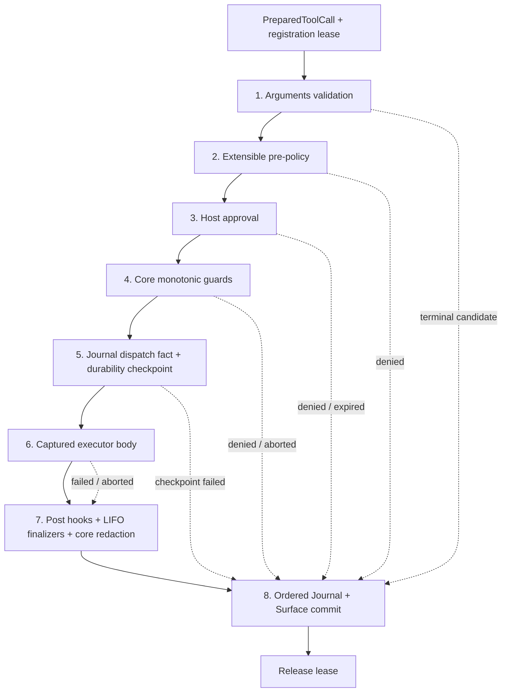

# ActSpace v2 Tool Runtime ABI

> 状态：已确认的目标语义合同。
>
> 本文定义 Tool definition、executor、registration、prepared execution、policy、approval、durability、结果提交和卸载之间的稳定边界。实现可以调整内部类名和包位置，但不得改变本文规定的顺序、不变量和失败语义。
>
> 2026-08-29 起，工具事件、Cordis hooks 和内核/外壳所有权以 [Tool Runtime 内核与外壳边界](./agent-spec-tool-runtime-boundary.md) 为准；本文保留为 prepared execution ABI 背景。
>
> 2026-08-29 起，本文中关于工具稳定身份的 `toolId` 语义由 [Tool Name 与 Plugin Namespace 契约](./agent-spec-tool-name-contract.md) 取代。新的公共身份是扁平 `name`，`pluginId` 独立表示归属，`registrationId` 表示进程内 lease；本文其余 prepared execution、policy、approval、lease 和 parity 语义仍然有效。本文中的旧字段名不构成兼容要求。

上位插件身份、Host ceiling、restart-only 和生命周期合同见 [插件 Runtime ABI](./agent-spec-plugin-runtime-abi.md)；固定 Host DTO 见 [Runtime Projection 规范](./agent-spec-runtime-projection.md)。

## 1. 决策

ActSpace v2 保留已经验证的具体工具 executor 和协议实现，替换 v1 的集中式 ToolManager、静态枚举、ToolResult 聚合对象和 Desktop UI 耦合。

新的 Tool Runtime 遵循五条总原则：

1. Tool definition 与 executor 分离；模型、Prompt 和固定前端只能看到数据合同，不持有执行函数。
2. `prepare()` 一次性捕获 exact registration、definition、policy chain、middleware chain、executor 和 activation lease。
3. 单次调用从参数校验到终态提交都不能切换到另一份同名工具实现。
4. Core admission、Host approval、单调安全检查、durability checkpoint 和 Journal invariant 不可由插件 hook 绕过。
5. body 可以按明确声明有界并行，终态 Journal 和 Surface 提交必须保持模型 tool-call 顺序。

本文中的“必须”“不得”是 ABI 约束，不是实现建议。

## 2. 范围与非目标

本文覆盖：

- 工具身份和版本；
- definition / executor 的公共边界；
- Registry 注册、启动发布、draining 和 activation lease；
- prepared execution 的一次性语义；
- 参数校验、策略、审批、checkpoint、body、post/finalizer 和提交顺序；
- 并行、取消、插件卸载、崩溃恢复和脱敏；
- 现有 executor 迁移时保留与删除的边界。

本文不定义：

- 插件市场、签名、下载或不可信代码沙箱；
- Desktop React component 或插件前端代码；
- 某个具体工具的参数和业务行为；
- Journal 的 raw JSONL 物理写入细节；
- 进程外 executor RPC。v2 Tool 插件仍是受信任的同进程后端代码。

## 3. 稳定身份

### 3.1 `pluginId`

`pluginId` 来自已验证的插件 manifest，是插件所有权和 provenance 身份。发布后不得把同一个 `pluginId` 转让给无关插件。

### 3.2 `name`

`name` 是 Runtime 和模型使用的全局稳定工具身份：

- 同一 Runtime 中不得同时存在两个相同 `name`；
- 内置工具优先保留已经暴露给模型的稳定名称，例如 `read_file`、`write_file` 和 `bash`；
- 文案、实现优化和向后兼容的 schema 扩展可以保留 `name`；
- 工具用途、副作用类别或参数含义发生不兼容变化时必须使用新的 `name`；
- renderer 选择和 UI 文案不得成为 `name` 的组成部分。

`pluginId` 表示谁拥有工具，`name` 表示工具是什么。二者都进入 durable provenance 和固定投影，不能用易变的 registration id 替代。

### 3.3 `callId`

`callId` 在一个 Session 内唯一且永不复用。Provider 返回的 tool-call id 只有在非空、合法且当前 Session 未使用时才可直接采用；否则 Core 生成 opaque id，并把原始 Provider id 作为非权威诊断字段保留。

重试、用户确认后的再次执行和 `outcome-unknown` 后的人工重做都创建新 `callId`。任何终态结果只能引用一个既有 `callId`。

### 3.4 Definition 与 registration 版本

- `definitionVersion` 是插件维护的正整数。任何会改变输入校验、能力声明、审批摘要、并行类别或模型可见输出合同的修改都必须递增。
- Core 对规范化 definition 计算 `definitionDigest`，用于 approval 绑定、Journal provenance 和漂移检测。
- `registrationId` 是一次进程内注册的 opaque 身份，只用于 lease 和 diagnostics，不是 Session 兼容性身份。
- 同一 `name + definitionVersion` 不得发布不同 `definitionDigest`；发现冲突时注册失败。

## 4. Definition 与 executor 分离

以下 TypeScript shape 是规范性数据合同；实现可以拆成多个内部类型，但对外语义必须等价。

```ts
interface ToolDefinitionV2 {
  abiVersion: 2;
  pluginId: string;
  name: string;
  definitionVersion: number;
  description: string;
  inputSchema: JsonSchema;
  effects: readonly ToolEffectV1[];
  concurrency: "exclusive" | "read-only" | "declared-safe";
  sensitiveArgumentPaths: readonly JsonPointer[];
  resultSchemaVersion: number;
}

interface ToolEffectV1 {
  capabilityId: string;
  mode: "read" | "write" | "execute" | "use";
  resourceScope: string | null;
}

interface ToolExecutorV1<TArgs = unknown> {
  execute(args: TArgs, context: ToolExecutionContextV2): Promise<ToolBodyResultV1>;
}

interface ToolExecutionContextV2 {
  pluginId: string;
  name: string;
  callId: string;
  sessionId: string;
  agentRunId: string;
  turnId: string;
  stepId: string;
  signal: AbortSignal;
  capabilities: ToolCapabilitySet;
  reportProgress(update: ToolProgressUpdateV1): void;
  createArtifact(input: ToolArtifactInputV1): Promise<ToolArtifactRefV1>;
  defer(finalizer: ToolFinalizerV1): void;
}

interface ToolBodyResultV1 {
  status: "completed" | "failed";
  modelOutput: readonly ToolModelOutputInputBlockV1[];
  summary: string;
  detail?: readonly ToolDetailInputBlockV1[];
  artifacts?: readonly ToolArtifactRefV1[];
  failure?: {
    code: string;
    message: string;
    retryable: boolean;
  };
}

type ToolFinalizerV1 = () => Promise<void>;
```

`effects` 只能引用当前 Runtime contract 已知、且位于 BootManifest Host ceiling 内的 capability id；任意字符串不能创造新能力。`resourceScope` 是给 policy 和 scheduler 使用的声明性范围，不是路径、socket 或 credential handle。`ToolCapabilitySet` 是 Core 根据最终 admission 构造的 opaque handle 集，executor 不能自行实例化。

`ToolBodyResultV1` 是尚未提交的 body candidate：`completed` 不得带 failure，`failed` 必须带 failure。其 model output、detail 和 artifact ref 仍须经过 post/finalizer、Core schema、redaction 和 ordered commit；返回该对象不表示工具已经终结。输入 block 的允许类型必须可归一化为 Runtime Projection 规范中的稳定 `ToolModelOutputBlockV1` / `ToolDetailBlockV1`，不能携带函数或 renderer code。

Definition 必须是冻结、JSON-safe、可 hash 的纯数据。它可以进入 Prompt、config dump、diagnostics 和 Session provenance。Executor 是不可序列化的运行函数，只能由 Tool Runtime 在持有 registration lease 时调用。

Executor context 不提供以下能力：

- Host approval broker；
- Core Journal writer；
- Cordis root Context；
- 任意 credential store；
- renderer IPC 或 React component registry；
- 绕过 Host ceiling 的原始文件、网络、进程或浏览器入口。

Executor 只能获得 admission 后缩窄过的 capability handles。凭据由对应 Host capability 在调用时解析，不作为 tool arguments、definition 或 Session 字段传入。

## 5. 注册合同

一个 Tool contribution 必须原子提交 definition、executor 和随 registration 固定的 policy / middleware contributions。禁止先发布 definition、稍后再补 executor，也禁止 executor 在静态全局变量中自行注册。

Registry 必须满足：

- 注册由 Cordis activation Effect 拥有，并返回可等待 disposer；
- 重复 `name` 注册失败，不能用“最后一个覆盖前一个”解决冲突；
- 发布前验证 ABI 版本、definition schema、稳定身份、capability 声明和 policy 引用；
- 发布后 definition 和 chain 均不可变；definition、executor 或 chain 更新通过完整 Runtime restart 生效；
- unload / Runtime shutdown 先停止 registration 接受新 preparation，再等待旧 lease drain；
- Registry lookup 只能返回 active registration，不返回 importing、failed、pending 或 disposed Fiber 的贡献。

Tool Registry 不维护全局 Composition Generation。每个 registration 只拥有自己的 identity、状态、lease 计数和生命周期。

## 6. Prepared execution 与 lease

### 6.1 `prepare()` 的原子边界

Tool Runtime 收到一个已进入当前 Step 的 tool call 后，必须在第一次 `await` 前完成以下动作：

1. 检查 Runtime 与 Tool preparation admission gate；
2. 按 `name` 解析唯一 active registration；
3. 捕获冻结的 definition、definition digest、executor、policy chain、pre/post middleware chain 和 concurrency classification；
4. 为该 registration 获取 activation lease；
5. 为当前模型 tool-call 顺序预留 result commit slot；
6. 返回 one-shot `PreparedToolCall`。

```ts
interface PreparedToolCall {
  readonly pluginId: string;
  readonly name: string;
  readonly callId: string;
  readonly registrationId: string;
  readonly definitionVersion: number;
  readonly definitionDigest: string;
  execute(): Promise<ToolTerminalResultV1>;
  cancel(reason: ToolCancelReasonV1): void;
  dispose(): Promise<void>;
}
```

`execute()` 最多调用一次。未调用、调用前失败、审批拒绝、checkpoint 失败、body 结束和终态提交失败都必须通过同一个 `try/finally` 路径释放 lease 和 commit slot。

### 6.2 Lease 保证

Lease 保证本次调用在以下整个区间使用同一 registration：

```text
prepare
  -> arguments validation
  -> pre-policy
  -> Host approval
  -> monotonic guards
  -> durability checkpoint
  -> body
  -> post/finalizers
  -> ordered Journal commit
  -> lease release
```

插件进入 draining 后不得接受新 `prepare()`，但已经持有 lease 的调用继续使用旧 executor 和旧 chain。审批等待期间也持有 lease，因此不会发生“旧定义请求审批、新 executor 执行”的切换。

## 7. 唯一合法的执行顺序



任何插件 API 都不得提供跳过其中某一步的快捷入口。

### 7.1 Arguments validation

- 使用 captured definition 的 `inputSchema` 校验原始 arguments；
- 在本阶段完成默认值、规范化和不可变 materialization；
- 校验后的 args 冻结，后续 policy 不得改写；
- 校验失败产生 `failed / INVALID_ARGUMENTS` terminal candidate，不进入 policy、approval、checkpoint 或 body；
- schema validator 不得解析 credential、访问网络或执行工具副作用。

### 7.2 Extensible pre-policy

Pre-policy 接收不可变、已校验 args、definition、Host capability view 和 Session scope。它只能返回：

```ts
type ToolPolicyDecisionV1 =
  | { kind: "continue" }
  | { kind: "require-approval"; reason: string; risk: ToolRiskV1 }
  | { kind: "deny"; code: string; reason: string };
```

多个 decision 按 `deny > require-approval > continue` 单调合并。Hook 可以收紧权限，不能把 Core、Host ceiling 或更早 policy 的 deny 改成 allow，也不能自行构造 approval token。

Policy hook 不得：

- 调用 executor body；
- append 核心 Tool Journal event；
- 修改 args 或 definition；
- 获取 secret；
- 把调用标记为已完成；
- 注册一个“跳过后续策略”的 finalizer。

### 7.3 Host approval

只有 Host Adapter 提供的 Approval Broker 能产生 approval decision：

- Desktop 映射到 IPC 审批 UI；
- 当前 CLI run 不提供交互式审批页面，按 headless 审批结果结束或拒绝执行；
- CLI run 由显式 permission mode 决定，不能交互时返回稳定拒绝或 `APPROVAL_REQUIRED`；
- 无 Broker 且 policy 要求审批时 fail-closed。

Approval 必须绑定 `callId + pluginId + name + definitionDigest + normalizedArgsDigest + requested capability scope`。过期、取消、Host 切换、definition 不匹配或 scope 不足的 approval 不可复用。

Approval 是“在当前事实下允许继续”，不是永久授权。它不能覆盖下一阶段发现的 capability 缩减、Session 结束或取消。

### 7.4 Core monotonic guards

审批后、checkpoint 前，Core 重新检查：

- prepared call 尚未终结且未重复 dispatch；
- caller signal 尚未取消；
- Session、Run、Turn 和 Step 仍允许该 call 继续；
- captured registration lease 仍有效；
- Host capability ceiling 没有收窄到不再允许本次 effects；
- approval 与 definition / args digest 仍匹配；
- concurrency slot 和 workspace / resource guard 已获得；
- Core invariant validator 没有发现 dangling、重复或越序 call。

这些 guard 只能保持或减少 admission，不能新增插件未声明、Host 未提供或用户未批准的能力。已经持有 lease 的 registration 进入 draining 本身不使调用切换或失败；只有显式协作取消、Host ceiling 收窄或 Runtime shutdown policy 才能阻止其继续。

### 7.5 Durability checkpoint

Persistent Session 在进入 body 前必须：

1. append 经过 Core schema 校验的 dispatch-boundary fact，包含 call identity、definition provenance、effects、args digest 和 approval provenance；
2. 原子确认该 fact 与既有 assistant tool call 的关系；
3. flush 到 persistence backend 的 durability barrier；
4. checkpoint 成功后才调用 captured executor。

Checkpoint 失败时 body 调用次数必须为零，terminal candidate 为 `failed / DURABILITY_CHECKPOINT_FAILED`，Runtime 对后续副作用保持 fail-closed。

该 dispatch-boundary fact 表示调用已经越过副作用边界。若进程在其 durable 后、terminal result 前消失，冷恢复必须保守地产生 `outcome-unknown`，不得自动重试。checkpoint 后若在真正调用 executor 前观察到取消，Core 立即提交 `aborted` 终态；若进程恰在这个窄窗口崩溃，仍按 `outcome-unknown` 处理。

Ephemeral Profile 仍执行同一逻辑 append 和 invariant 检查，只是 durability barrier 明确为内存边界；Runtime diagnostics 必须显示该 Session 不具备 crash durability。

### 7.6 Executor body

Core 只调用 captured executor 一次。Executor：

- 必须响应 `AbortSignal`，但不能把收到 signal 等同于外部副作用已经停止；
- 只能使用 admission 后的 capability handles；
- 可以报告有界、已脱敏的 live progress；
- 可以通过 artifact sink 创建不暴露绝对路径的 artifact ref；
- 可以注册 LIFO finalizer；
- 不得直接写 Session、发送 renderer IPC 或自行提交 terminal state。

Executor 正常返回 `completed` 或 `failed` body result。Throw、rejection 和不合法 result 由 Core 归一化为稳定 failure；AbortError 只有在 executor 能确认操作已停止且结果未知风险为零时才归一化为 `aborted`。

### 7.7 Post hooks、finalizers 与 Core normalization

Body settle 后按以下顺序处理：

1. post hooks 按 registration 时固定的顺序运行；
2. executor 通过 `defer()` 注册的 finalizers 按 LIFO 运行；
3. Core 校验 result schema、artifact ownership、状态转换，并对 model output、summary 和 detail 执行有界裁剪或 artifact 化；
4. Core 合并插件声明与平台强制 redaction，形成唯一 terminal candidate。

Post hook 可以增加摘要、detail、artifact metadata 或把成功降级为失败，不能：

- 把 body failure、abort 或 deny 提升为 completed；
- 替换 `callId`、`pluginId`、`name` 或 definition provenance；
- 删除平台 redaction；
- 再次调用 body；
- 直接提交 Journal / Surface。

裁剪不得只删除中间内容后伪装成完整输出：被裁剪的 model output 必须明确标记，并在需要保留完整结果时写入 Session-owned artifact。禁止用 renderer 可见的临时绝对路径代替 artifact ref。

Finalizer 是正确性相关清理；任一 finalizer 失败会使尚未失败的 candidate 变为 `failed / FINALIZER_FAILED`。纯观测、metrics 和日志使用 best-effort observability listener，不能伪装成 finalizer 以影响业务结果。

### 7.8 Ordered Journal commit

每个模型 tool-call batch 在 prepare 时按模型顺序获得连续 commit slot。Body 可按 concurrency policy 并行 settle，但 terminal candidate 只能在所有更早 slot 已提交后进入 Journal。

一次 terminal commit 必须原子完成：

- append 一个且仅一个核心 tool terminal event；
- 关联原始 assistant tool call 和 dispatch boundary；
- 对 Session Surface append 对应 model-visible tool result；
- 记录最终状态、稳定 failure、`durationMs`、definition provenance 和 artifact refs；
- 推进 durable Session projection 使用的 Journal cursor。

Invalid args、policy deny、approval deny、checkpoint failure、body failure 和 abort 同样占用并最终关闭自己的 slot，避免较早失败永久阻塞后续结果。

Terminal event append 后状态不可改写。若逻辑 commit 失败，Core 不得向模型假装已经收到结果，也不得进入下一 Step；Session 进入 fail-closed 状态。若 body 已产生外部副作用而 terminal result 未 durable，恢复按 `outcome-unknown` 处理。

下一 Step 或下一次 LLM dispatch 前，persistence policy 必须 flush 已提交的有序结果前缀。

## 8. 并发合同

`concurrency` 是安全能力声明，不是性能提示：

| 值 | 语义 |
|---|---|
| `exclusive` | 与同一 Agent scope 的其他 tool body 串行；未知工具默认值。 |
| `read-only` | 只读、无外部写副作用，可以进入有界并行池。 |
| `declared-safe` | 插件明确声明共享资源和互斥 key，Core 按 key 调度。 |

即使 body 并行，以下阶段仍由 Core 保证确定性：

- tool-call 顺序和 commit slot；
- policy 与 approval 绑定；
- dispatch-boundary checkpoint；
- terminal Journal / Surface 顺序；
- concludes-turn、additional context 和下一 Step admission。

插件漏报共享写资源属于 ABI 违规。Runtime 可以把任何类别降级为 `exclusive`，不能把未声明工具自动升级为并行。

## 9. 取消、卸载与失败语义

### 9.1 状态

Tool terminal state 只有：

- `completed`：body、post、finalizers、Core normalization 和 ordered commit 都成功；
- `failed`：执行或正确性失败，包括 `OUTCOME_UNKNOWN`；
- `denied`：policy、Host approval 或 Host capability 明确拒绝；
- `aborted`：Core 能确认调用在无未知副作用的情况下停止。

`running` 是 projection 使用的非终态，不写作 terminal result。

### 9.2 取消矩阵

| 取消时点 | Body 是否可运行 | 终态 |
|---|---:|---|
| prepare / validation 前 | 否 | `aborted` |
| policy 或 approval 等待中 | 否 | `aborted`，并取消 pending Host request |
| checkpoint 前 | 否 | `aborted` |
| checkpoint 后、executor 调用前且 Core 仍在线 | 否 | `aborted`，追加明确未调用事实 |
| body 中，executor 明确确认停止 | 不再运行 | `aborted` |
| body 中，只收到 signal 但无法确认外部结果 | 未知 | `failed / OUTCOME_UNKNOWN` |
| terminal commit 后 | 已结束 | 无状态变化；取消为 no-op |

取消不是回滚，也不保证 exactly-once。具有副作用的 `OUTCOME_UNKNOWN` 只能由用户显式确认后用新 `callId` 重做。

### 9.3 插件 unload / Runtime shutdown

正常卸载顺序固定为：

1. registration 进入 `draining`，停止新 preparation；
2. 取消尚未发布的 setup 和插件自有后台工作；
3. 等待 prepared / executing lease settle；
4. 可按插件声明和 Runtime shutdown policy 请求协作取消；
5. lease 为零后释放 executor、subprocess、socket、timer 和 Fiber Effect；
6. registration 进入 `disposed`。

v2 不实现在线 reconcile。卸载或 Runtime shutdown 不得强制释放仍被 lease 使用的 executor。到达有界等待期限仍未 quiesce 时保持 fail-closed diagnostics；不能让任何新 registration 接管旧 call。进程级强制退出可以终止未完成工作，但下次恢复必须把越过 checkpoint 的调用标记为 `OUTCOME_UNKNOWN`。

## 10. Result 与脱敏边界

Executor body result 分成三类数据：

| 数据 | 用途 | 规则 |
|---|---|---|
| `modelOutput` | 作为 Tool result 进入 Session Surface 和下一次模型请求 | 必须是 Core redaction 后的最终值；不得包含 credential 或 Host-only handle。 |
| `summary` / `detail` | 固定 Host 的 generic projection | 经过大小、schema 和 redaction 校验；不影响模型语义。 |
| `artifacts` | 指向 Session-owned 产物 | 只保存 opaque artifact id 和安全 metadata，不把任意绝对路径或可执行 URL 交给 renderer。 |

原始 model-generated args 已经作为 assistant tool call 成为 Session 事实；它们不是 credential 注入通道。Host-resolved secret 永不写回 args、progress、result、diagnostics 或 artifacts metadata。

Redaction 按单调并集工作：

```text
platform mandatory redaction
  UNION definition.sensitiveArgumentPaths
  UNION Host policy redaction
  UNION plugin additional redaction
```

插件只能增加敏感字段，不能解除平台或 Host 的 redaction。`argsSummary` 必须从已校验 args 经过该并集生成，禁止插件直接提供一段未经验证的“安全摘要”。

## 11. Hook 权限表

| 能力 | Pre-policy | Host approval | Executor | Post hook | Core |
|---|---:|---:|---:|---:|---:|
| 读取 immutable definition / args | 是 | 只读摘要 | 是 | 是 | 是 |
| 收紧 permission | 是 | 是 | 否 | 否 | 是 |
| 授予 Host capability | 否 | 仅批准既有 scope | 否 | 否 | 是，且受 Host ceiling 限制 |
| 调用 body | 否 | 否 | 仅一次 | 否 | 仅通过 captured executor |
| 写核心 Tool Journal event | 否 | 否 | 否 | 否 | 是 |
| 绕过 durability checkpoint | 否 | 否 | 否 | 否 | 否 |
| 产生 progress | 否 | 审批投影由 Core 产生 | 是 | 否 | 是 |
| 增加 redaction | 是 | 是 | 是 | 是 | 是 |
| 删除 redaction | 否 | 否 | 否 | 否 | 否 |
| 提交 terminal result | 否 | 否 | 否 | 否 | 是 |

## 12. 现有工具迁移合同

v2 迁移保留：

- executor 核心算法；
- Bash、文件、HTTP、Browser Bridge、搜索和图片工具的外部协议；
- 路径边界、防误写、输出上限、超时、错误分类和 secret 处理；
- 已验证的行为测试、fixtures 和真实 Host capability 集成。

v2 不保留：

- `createToolManager()` 的闭合集合和静态全局注册；
- 旧 `ToolManager` / `ToolScheduler` 生命周期；
- executor 返回 SessionEvent、Desktop preview 或 provider runtime bag；
- 工具直接调用 Electron IPC、审批弹窗或 renderer component；
- v1 autonomous / fs-watch 专用分支；
- 从可变 Context messages 反向拼 Session events 的 bridge。

Browser Bridge 的 Go 实现和协议保留，由 Host capability 提供连接；对应 tool plugin 只依赖窄化 capability，不持有 Electron main service。

## 13. 必须通过的合同测试

### 13.1 身份与注册

- 重复 `name` 注册失败且不替换旧 registration；
- 同一 `name + definitionVersion` 的 digest 漂移失败；
- registration unload / Runtime shutdown 期间，新 prepare 要么命中完整 active registration，要么稳定失败；
- disposed registration 永不再次被解析。

### 13.2 Prepared execution

- `prepare()` 与 unload 竞争时，要么拿到完整 lease，要么失败，不能拿到半套 chain；
- 审批等待期间 unload / Runtime shutdown 不改变 captured executor；
- `execute()` 第二次调用稳定失败；
- prepare 后未 dispatch 的所有异常路径释放 lease 和 commit slot。

### 13.3 安全顺序

- invalid args 时 policy、approval、checkpoint 和 body 调用次数均为零；
- policy deny 时 Host approval 和 body 调用次数为零；
- required approval 没有 Broker 时 fail-closed；
- checkpoint 失败时 body 调用次数为零；
- 自定义 hook 无法绕过 Core guard、approval、checkpoint 或 result invariant；
- approval 后 Host ceiling 收窄会拒绝调用。

### 13.4 并发与提交

- 后一个 body 先完成时，Journal / Surface result 仍按原 tool-call 顺序提交；
- 较早 call 的 deny、abort 和 failure 都能关闭 slot，不造成死锁；
- 未声明工具保持 exclusive；
- 下一 Step 在完整有序结果前缀 durable 前不能开始。

### 13.5 取消与恢复

- 每个取消时点符合取消矩阵；
- signal 已触发但 executor 不能确认停止时产生 `OUTCOME_UNKNOWN`；
- dispatch boundary durable、terminal 缺失的 cold recovery 不自动重试；
- unload 等待 lease，超时不切换 executor；
- 进程强退后的 repair 追加事实，不 truncate 原 Journal。

### 13.6 脱敏与投影

- platform、Host、definition 和 plugin redaction 只能做并集；
- credential 不出现在 args summary、progress、model output、detail、artifact metadata 或 diagnostics；
- artifact 只向 renderer 暴露 opaque id；
- executor 不能直接构造 renderer payload 或核心 terminal event。

## 14. 实施时仍需确定的机械细节

以下项目不改变本文语义，可以在 execution plan 中按仓库实现约束确定：

- Tool Runtime 内部模块和 npm package 的最终文件名；
- opaque `registrationId` / `callId` 的具体编码；
- JSON Schema validator 库与 digest canonicalization 实现；
- bounded concurrency 的默认数字、queue 长度和 timeout 常量；
- activation lease 的内部引用计数结构；
- Journal 核心 event 的最终 TypeScript 名称和 raw JSONL row 序列化细节；
- metrics 名称、日志采样和测试 helper API。

这些机械选择不得引入第二条无 checkpoint 执行路径、第二套 Host approval、可变 definition 或无序 terminal commit。
