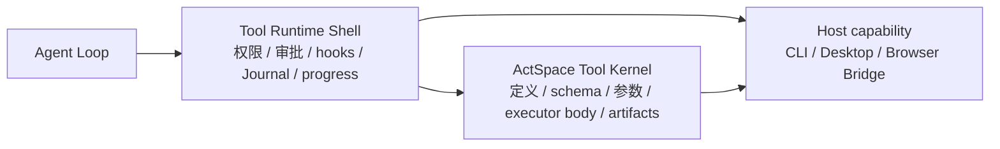
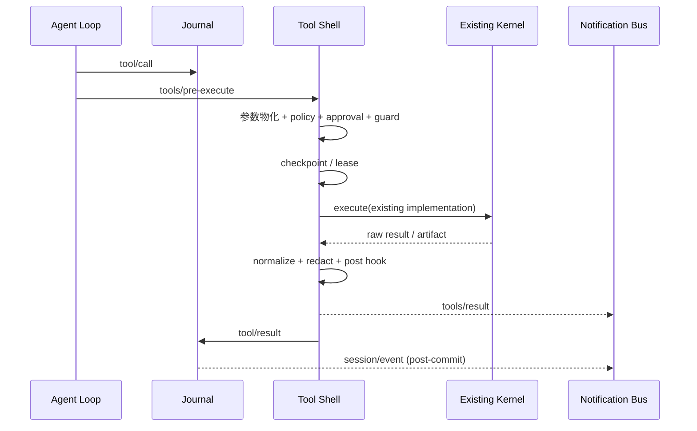

# Tool Runtime 内核与外壳边界

> 状态：已确认目标设计，等待 execution plan 实施
>
> 日期：2026-08-29

本轮重构采用 DSH 的事件与干预模型，但不把 DSH 工具实现当作替换目标。ActSpace 已有的读取、list、编辑、浏览器等具体工具行为是稳定资产；重写只触及权限、审批、事件、进度和 Host 适配等 ToolRuntime 外壳。ToolRuntime 可以换 ABI，只要保留工具的可观察实现逻辑和行为测试。

## 1. 两层模型



### 1.1 保留的内核资产

以下部分默认冻结行为，只做必要的类型适配：

- Tool definition、名称、输入 schema、参数物化和验证；
- 当前 executor 的主体实现，包括 read/list 等文件工具的范围、排序、截断和错误语义；
- artifact 生成、输出规范化、redaction 和大型结果处理；
- 已有工具级单元测试、fixture 和成功/失败边界；
- 并发调度的实际执行能力，以及 Browser Bridge 等 Host capability 的协议行为。

“冻结行为”不表示禁止修 bug；任何行为变化都必须有独立说明和 parity test，不能借着外壳迁移顺便重写工具。

### 1.2 可替换的外壳

以下部分按 DSH Agent Loop/Tools 事件模型重写：

- `tools/pre-execute`、`tools/execute`、`tools/post-execute` 的 hook 调度；
- permission preset、policy evaluation、approval broker 和 fail-closed 决策；
- `tool/call`/`tool/result` Journal adapter 与 `tools/result` 通知；
- live progress、diagnostics、artifact 引用和 Host projection；
- registration lease、plugin disposal、code-dispatch bridge；
- executor 与 stdout/stderr 的隔离，避免工具实现直接污染 CLI JSONL。

## 2. DSH 风格工具流水线



`tool/call` 是模型意图的持久化事实，`tool/result` 是执行结果的持久化事实。`tools/result` 是低延迟通知，不是第二条事实。工具执行期间的 progress 只能进入 live/diagnostics，除非未来明确增加持久化扩展事件。

## 3. 权限与审批顺序

```text
captured registration / lease
→ materialize arguments
→ validate schema
→ tools/pre-execute waterfall
→ resolve permission preset
→ evaluate policy (fail closed)
→ request approval when required
→ checkpoint before side effect
→ tools/execute waterfall
→ existing executor body
→ normalize/redact artifacts
→ tools/post-execute waterfall
→ append tool/result
→ emit tools/result
```

规则：

- policy 只授予当前 `toolCallId` 所需的最小权限；
- approval 超时、拒绝、broker 断开或无法解析都视为 deny；
- `tools/pre-execute` 不能把一次被拒绝的调用悄悄变成另一工具；改写后必须重新验证并写入 provenance；
- checkpoint 之后才允许产生不可逆副作用；
- executor 只能返回结构化 result，不能直接向 CLI stdout 写协议行；
- 工具异常必须规范化为 `tool/result(status=error)`，再决定 Agent Loop 是否重试或结束。

## 4. 事件与重试

核心 Session 只保留 `tool/call` 和 `tool/result`。以下属于扩展事件，可按需落盘：

- `approval/asked`, `approval/decided`, `approval/policy`；
- `permission/preset`；
- `tool-workflow/agent-start`, `tool-workflow/agent-end`, `tool-workflow/run-start`, `tool-workflow/run-end`；
- `tool/code-dispatch-start`, `tool/code-dispatch`；
- `command/run`, `command/done`。

工具重试不得重复写一条新的 `tool/call`，除非模型确实产生了新的 call id。Shell 应在同一调用的 provenance 中记录 attempt，并将最终结果写入唯一的 `tool/result`；每次尝试的细节可以用 `tool-workflow/*` 扩展记录。

## 5. 责任分配

| 责任 | Agent Loop | Tool Shell | Tool Kernel |
|---|---|---|---|
| 决定何时调用工具 | 是 | 否 | 否 |
| 写 `tool/call` | 是 | 否 | 否 |
| 参数 schema 与具体行为 | 否 | 否 | 是 |
| permission / approval | 否 | 是 | 否 |
| 执行 hook | 通过事件调用 | 是 | 否 |
| executor body | 否 | 调度 | 是 |
| 输出规范化 / redaction | 否 | 是（调用 kernel 能力） | 提供底层能力 |
| 写 `tool/result` | 否 | 是（通过 Journal adapter） | 否 |
| live progress / diagnostics | 观察 | 是 | 提供 progress 回调 |
| artifacts | 消费摘要 | 记录引用 | 生成内容 |

## 6. ToolRuntime API 方向

新的公开 API 面向 shell，不暴露内部 scheduler 状态：

```text
prepare(call, context) -> PreparedToolCall
execute(prepared, signal) -> ToolResult
subscribeProgress(scope, listener) -> dispose
register(definition, executor, metadata) -> lease
```

`PreparedToolCall` 包含捕获时的 registration version、policy snapshot、approval state、attempt 和 provenance。lease 失效或 plugin dispose 后不得执行新调用；正在执行的调用等待 cancellation/settlement 后再释放。

不要求把现有 `PreparedExecution`、`ToolScheduler` 的字段原样公开；只要上述行为和测试可以从新 shell 访问即可。

## 7. 与现有工具的验证边界

重构完成前必须对至少以下现有工具做 parity：

1. read：范围、编码、截断、缺失文件和目录错误；
2. list：递归边界、忽略规则、稳定排序和空目录；
3. edit/write：参数校验、冲突保护、artifact/结果摘要；
4. bash/subprocess：权限、取消、退出码和 stdout/stderr 隔离；
5. Browser Bridge：Host capability 调用、超时和结构化错误。

parity 只比较工具实现的可观察结果和副作用，不要求旧事件名称、旧 ToolManager 或旧 UI bridge 保留。

## 8. 非目标与验收门

本轮不做：把工具全部改写成 DSH 实现、引入不可信工具进程、为每个 progress chunk 增加持久化事件、CLI chat UI、Goal/Schedule producer。

验收条件：

- 现有工具行为 parity tests 全部通过；
- 任意工具调用都经过 pre/execute/post 三个干预面和权限 fail-closed；
- Journal 只提交一次 `tool/call` 与一次最终 `tool/result`，通知与事实不重复计算；
- executor 不污染 CLI stdout，CLI `run` 仍能输出稳定 JSONL；
- plugin unload、approval 拒绝、取消、超时和进程崩溃恢复都有 contract test；
- 工具实现无需知道 Cordis、Journal 或 Host UI 的存在。
