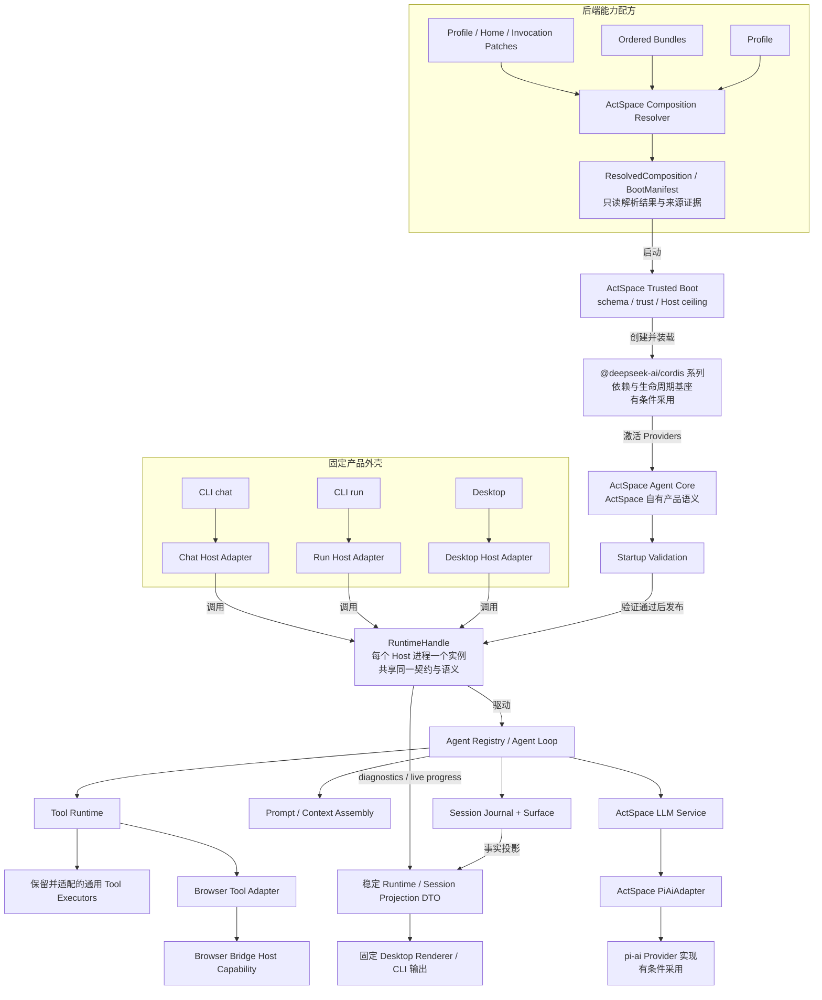
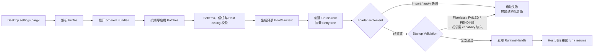
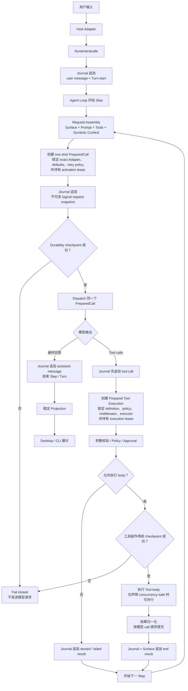
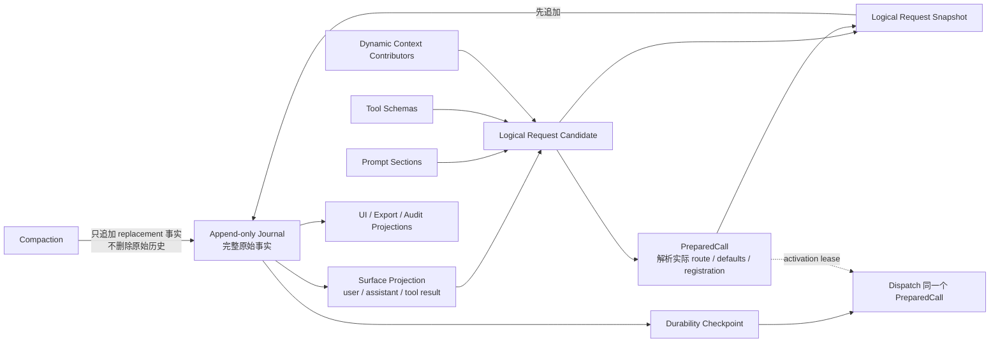

# ActSpace v2 总体架构

> 状态：历史总体目标设计视图，已被 [Profile-first Runtime 决策](./agent-decision-profile-first-headless-desktop.md) superseded。
>
> 本文保留早期三 Host / RuntimeHandle 目标的推导证据；当前实现只保留 `headless` 与 `desktop` Profile，应用操作入口由各自 App Bundle Service 提供。当前代码、入口和验收以 Profile-first 决策与执行记录为准。

## 1. 先用一句话理解 v2

ActSpace v2 是一个**固定产品外壳 + 可组合后端 Agent Runtime**：

- Desktop、CLI run 和 CLI chat 继续提供不同的交互方式；
- 三种 Host 共享同一套 `RuntimeHandle` 契约和运行语义，不再各自组装 Agent；
- Profile / Bundle / Patch 决定本次启动要启用哪些后端能力；
- Trusted Boot 负责解析、校验、启动和关闭；
- Cordis 负责插件依赖、生命周期和资源回收；
- ActSpace 自己的 Agent Core 决定 Session、Prompt、Tools、LLM、Agent 和 Agent Loop 的产品语义；
- 固定前端只消费稳定投影，不执行插件携带的前端代码。

最重要的边界是：**Cordis 不是 Agent 的大脑。** 它是插件运行和生命周期基座；Agent 如何记录事实、组装请求、调用模型、执行工具和恢复会话，仍由 ActSpace 自己定义。

## 2. 先认识九个名词

| 名词 | 给第一次接触这个话题的人的解释 |
|---|---|
| Host | 用户所在的产品外壳，例如 Desktop、CLI run、CLI chat。 |
| Host Adapter | 把窗口、TTY、stdout、审批和进程信号翻译成 Runtime 能理解的调用。 |
| RuntimeHandle | 每个 Host 进程唯一的后端入口，也是该进程内 Runtime 生命周期的持有者；三种 Host 共享同一契约。 |
| Profile | 一份命名配方，选择本次运行需要的有序 Bundles、插件和覆盖配置。 |
| Bundle | 一组可分发的插件代码和默认配置行，不是一个正在运行的插件实例。 |
| Patch | 按稳定 Entry id 插入、禁用或整对象替换配置的覆盖层，不做隐式深合并。 |
| Cordis | 管理插件依赖、激活、卸载和资源回收的运行时基座。 |
| Agent Core | ActSpace 自己定义的 Session、Prompt、Tools、LLM、Agent 和执行循环。 |
| Journal / Surface | Journal 保存只追加、接纳后不覆写的运行事实；Surface 是从这些事实派生出的当前模型历史。 |
| Host Extension | 前端设置页中的“扩展”，指 Browser Bridge 这类由 Host 管理的本机桥接能力；它不是 Cordis 后端插件。 |

可以把 Profile / Bundle / Patch 理解成一份后端能力配方，把 Cordis 理解成负责安装、供电和回收这些能力的运行底座，把 RuntimeHandle 理解成产品外壳唯一允许使用的总入口。

## 3. 一张图看完整体

下面这张图同时标出了三个平面：配置与启动控制面、Agent 语义运行面、Host 与展示面。箭头上的文字很重要：`启动` 表示 Boot 时序，`调用` 表示运行时控制，`投影` 表示只读数据派生。

图中的单个 `RuntimeHandle` 节点表示统一契约。Desktop 与 CLI 通常位于不同进程，各自只 boot 一个句柄实例，并不跨进程共享同一个 JavaScript 对象。



这张图表达五个核心关系：

1. 配置先被解析成一份只读 `BootManifest`，再启动插件树。
2. Host 在 Startup Validation 通过前拿不到 `RuntimeHandle`。
3. Cordis 管插件生命周期，ActSpace Agent Core 管 Agent 语义。
4. 现有工具实现作为 executor 迁入新 Tool Runtime，不原样保留旧 ToolManager。
5. Session 事实先被投影成稳定 DTO，再交给固定前端或 CLI；后端插件不能把代码送进 renderer 执行。

## 4. 每一层具体负责什么

### 4.1 Host 与 Host Adapter

三个 Host 只负责各自的交互环境：

| Host | 负责 | 不负责 |
|---|---|---|
| Desktop | Electron 生命周期、IPC、窗口、审批 UI、credential resolver、固定 renderer | Agent Loop、Session 事实、插件生命周期 |
| CLI run | argv/stdin、stdout/stderr、退出码、无头审批策略、signal | 第二套无头 Agent 内核 |
| CLI chat | TTY、交互审批、`/new`、`/resume`、进程级 Session lock | 独立 Session 实现或独立 Loop |

因此，同一条任务无论来自桌面端还是 CLI，都应该经过同一套 Turn、Step、LLM、Tool 和 Session 语义。区别只在输入输出和审批如何呈现。

### 4.2 RuntimeHandle

`RuntimeHandle` 是 Host 与后端之间的窄边界。它负责：

- create / resume main Session，以及 list / inspect 所有可读 Session；one-shot child 只允许 inspect / browse / export 和内部 repair；
- run turn、提交 main Agent `next-step` steering / `next-turn` follow-up、abort 和 active Session guard；
- flush durability；
- 暴露当前只读 manifest 和 diagnostics；
- 停止接收新工作；
- 等待领域资源静止并关闭 root Cordis Context。

Host 不直接持有 Cordis Context、Session writer 或具体 AgentLoop class。这样 Desktop、CLI run 和 CLI chat 才不会慢慢演化出三套行为不同的后端。

### 4.3 Trusted Boot 与 Cordis

Trusted Boot 是很小、不可由普通业务插件替换的启动边界。它拥有：

- 插件 ABI 和 runtime contract version；
- Profile / Bundle / Patch 解析入口；
- schema、信任和 Host capability ceiling 校验；
- root Context 的创建和释放；
- Loader settlement、Startup Validation、诊断和关闭。

Cordis 在这个边界内部提供生命周期能力：

| Cordis 概念 | 在 v2 中的意义 |
|---|---|
| Context | 插件运行作用域和 Service 可见范围。 |
| Service | 插件按名字提供或依赖的一项能力。 |
| Fiber | 一个插件实例的生命周期对象和状态，不是全局 generation。 |
| Effect | 插件拥有的 listener、timer、watcher、subprocess 等资源及其 disposer。 |
| Loader / Include | 把 Entry tree 变成插件实例，并串行处理配置更新。 |

Cordis isolate 只控制 Service 可见域，不是权限沙箱，也不是进程隔离。v2 后端插件明确按**受信任同进程代码**设计；不可信插件、市场、签名和自动更新不属于 v2 范围。

### 4.4 ActSpace Agent Core

ActSpace 不直接依赖 DSH Agent Core 包，而是在 Cordis 上实现自己的语义层：

| 模块 | 核心职责 |
|---|---|
| Scope | Agent scope identity、父子 scope、贡献可见性和资源所有权。 |
| Session | append-only Journal、Surface、flush、resume、fork、repair。 |
| Prompt / Context | 从事实和当前 scope 贡献中确定性组装一次模型请求。 |
| Tool Runtime | 定义注册、参数校验、策略、审批、执行租约、调度和结果归一化。 |
| LLM Service | 稳定 Message/Stream/Usage/Failure 契约、Provider registry 和 PreparedCall。 |
| Agent Registry | Agent identity、main Agent durable Inbox、create/resume/dispose 和完整构造后发布。 |
| Agent Loop | Turn / Step 驱动、模型调用、工具调度、终止和恢复事实。 |

这些 Provider 可以被替换，但不代表可以无替代地缺失。Base Profile 声明为必需的能力如果没有 active Provider，启动必须失败。

### 4.5 三种容易混淆的 Context

v2 文档里可能同时出现三个相近词，它们不是同一个对象：

| 名称 | 含义 | v2 处理 |
|---|---|---|
| Cordis Context | Service 可见域和插件生命周期作用域 | 作为 Runtime 内部机制保留，不穿过 IPC。 |
| Model request context | 某个 Step 实际交给模型的 Surface、Prompt、Tools 和动态贡献 | 每次重新组装为不可变 logical request snapshot。 |
| v1 `ContextManager` | 同时持有可变 conversation、Prompt、Tools 和压缩状态的旧组件 | 不保留；其中有价值的能力拆入 Session、Request Assembly 和领域 contributors。 |

Cordis Context 是插件生命周期作用域，Agent Scope 是 Agent 语义作用域，两者也不是同一个 Context。因此，“使用 Cordis Context”不等于继续使用旧 `ContextManager`，也不意味着模型请求上下文可以只存在于进程内。

## 5. 系统怎样启动



`PENDING` 对 Cordis 本身是合法等待状态，因为插件可能正在等待依赖；但对一个声称已经启动完成的 ActSpace Base Profile 来说，它不是健康状态。因此 Startup Validation 会列出缺失 Service 并拒绝发布 `RuntimeHandle`。

Profile / Bundle / Patch 的 v2 组合顺序是：

```text
empty root
  -> kernel/base bundle
  -> profile ordered bundles
  -> Host surface bundle
  -> profile patch
  -> user-home patch
  -> invocation patch
  -> Host capability ceiling
```

最后的 Host capability ceiling 只能减少能力。例如 CLI Host 没有 renderer，Patch 不能凭配置凭空获得 renderer 权限。

## 6. 用户发出一次任务后发生什么

先认识两个运行单位：

- **Turn**：用户输入一次，到 Agent 给出这一轮最终结果为止。
- **Step**：一次 LLM 请求及其后续工具处理。一个 Turn 可以有多个 Step。



这个流程有五条关键保护：

1. 完整 logical request snapshot 必须先写入并 flush，之后才能发送模型请求。
2. Tool Runtime 在策略和审批前先锁定本次 definition、policy、middleware 和 executor；拒绝审批时不会进入 body。
3. tool call 必须先写入并 flush，之后才能进入可能产生副作用的工具 body；checkpoint 失败会释放未执行的 tool lease。
4. 同一次 LLM 或 Tool 调用持有本领域 activation lease，不能在执行中混用刷新前后的两个注册实例。
5. 只有明确声明 concurrency-safe 的工具 body 可以并行；参数、审批、结果和模型可见提交顺序仍保持稳定。

checkpoint 只能让系统知道副作用边界前的事实已经 durable，不能承诺工具 exactly-once。进程若在工具执行后、结果落盘前崩溃，恢复时必须记录 `outcome-unknown`，而不是盲目重试。

## 7. 为什么 Session 是 Agent 运行与模型历史的唯一事实来源

v1 的问题之一是可变 conversation 和持久化日志可能形成两份需要同步的真相。v2 删除这个双真相模型。



这里要区分四层：

| 层 | 是什么 | 不是什么 |
|---|---|---|
| Journal | 按连续 `seq` 追加的领域事实 | Renderer state 或 debug log 大杂烩 |
| Surface | 从 Journal 派生的当前模型历史 | 第二份可独立修改的 conversation |
| Persistence coordinator | write-behind、flush、load、inspect、repair 和 writer lease | JSONL 文件本身 |
| Physical backend | UTF-8 raw JSONL 文件，Header 首行、每个 event 一行 | Turn / Step / Tool 领域语义 |

只要 Prompt、Tool schema 或动态 Context 影响了模型输入，它就必须出现在本次 logical request snapshot 中。API key、代理对象、HTTP headers 和 Provider wire payload 不进入 Session。

Compaction 只追加一条“以后用摘要替代哪段 Surface”的 replacement 事实；原始 Journal 不删除。UI、导出和审计仍能查看完整历史。

## 8. 一个具体例子

假设用户在 Desktop 中说：“读取 `package.json`，告诉我项目使用了哪些依赖。”

1. Desktop Host Adapter 把消息交给 `RuntimeHandle`。
2. Session 先记录 user message 和 Turn start。
3. Request Assembly 从当前 Surface、system prompt、可见工具和动态 workspace context 形成候选请求。
4. LLM Service 创建 PreparedCall，解析这次真正使用的模型与 Adapter；Session 记录 request snapshot 并 checkpoint。
5. 模型返回一个 `read_file` tool call。Session 先记录 call，再在工具副作用边界前 checkpoint。
6. Tool Runtime 校验参数和 workspace policy，然后调用保留下来的 `read_file` executor。
7. 结果按模型 call 顺序写入 Journal 和 Surface，Agent Loop 开始下一 Step。
8. 第二次模型请求从新的 Surface 重建，模型生成最终解释。
9. 最终 assistant message 和 Turn end 写入 Journal，再投影给 Desktop。

如果第 6 步执行期间插件配置发生变化，这次调用仍使用它已经锁定的 executor registration；新的调用才解析更新后的注册。如果第 6 步后进程崩溃且结果没有落盘，恢复时不会假设可以安全重做。

## 9. 插件化以后，什么可以替换

插件化不是“所有东西都能随便拔掉”。v2 把能力分成三类：

| 类别 | 例子 | 规则 |
|---|---|---|
| 小型固定内核 | Trusted Boot、插件 ABI、Session format ownership、RuntimeHandle boundary | 普通业务插件不能替换，否则无法判断插件能否安全运行。 |
| Base Profile 必需 Provider | Session、Prompt、Tools、LLM、Agent Registry、Agent Loop | 可以提供替代实现，但启动时必须有一套满足契约的 active Provider。 |
| 可选能力插件 | Browser Bridge tools、Web、图片、Skills、Compaction | 缺失时允许降级，但必须有明确诊断，不能冒充 active；persistent Profile 仍默认选择 Compaction。 |

所有插件贡献都必须有生命周期所有者。Tool definition、Prompt section、LLM route、listener、timer、watcher 和 subprocess 在插件卸载时都要可等待地撤销并进入静止状态。

v2 前端不插件化。后端插件可以贡献事实、工具和可投影数据，但不能贡献可执行的 JavaScript、React component、CSS 或 HTML。未知 renderer 使用固定前端的 generic fallback。

## 10. 为什么不设计全局 Composition Generation

`ResolvedComposition` / `BootManifest` 只回答“这次解析出了什么”，不管理所有运行中的旧实例。ActSpace 不创建一个知道所有领域细节的 `CompositionGenerationManager`。

真正需要的一致性由拥有该问题的领域处理：

| 领域 | 自己拥有的一致性机制 |
|---|---|
| Cordis | Fiber object identity、state 和 dependency epoch。 |
| Loader / Include | 串行 reconcile 和配置树失败恢复。 |
| Preset | v2 使用启动期静态 descriptor，不实现 StandingMount 或 live reload。 |
| Session | 连续 Journal `seq`；`replaceGeneration` 只用于 replacement 缓存失效。 |
| LLM | one-shot PreparedCall + Adapter registration activation lease。 |
| Tools | Prepared execution + executor registration lease。 |
| Prompt / Context | 每次调用不可变、可持久化的 logical request snapshot。 |

DSH Loader replacement 也不是双实例零中断切换：它先导入候选模块，再卸载旧实例并启动候选；失败时尝试恢复旧插件。它不能回滚已经发生的外部副作用，也不能代替 LLM 或 Tool 自己保护 in-flight 调用。

v2 不实现在线 reconcile。配置或插件代码发生变化时只报告 `restartRequired`，由 Host 完整重启当前进程内 Runtime；未来若引入在线刷新，必须另立设计并由各领域拥有自己的 snapshot 或 lease。

## 11. 前端为什么先保持固定

前端不插件化可以显著降低 v2 重构复杂度和安全风险：

- renderer 不需要信任任意插件代码；
- IPC 只传 ActSpace 稳定 DTO，不泄漏 Cordis Context 或 pi-ai 类型；
- Desktop 与 CLI 共享事实语义，只在呈现方式上不同；
- 内置工具仍可使用构建时 allowlist 的专用 renderer；
- 未知工具或未知 renderer 始终有通用 fallback。

后端插件若声明 optional frontend contribution，Host 忽略并记录诊断。若插件声明 `frontend.required=true` 且当前 Host 不支持，则该插件后端不激活：Profile 把它声明为 required capability 时 Boot 失败；optional entry 则跳过并记录 incompatible diagnostic。任何情况下都不会执行插件前端代码。

## 12. 失败时系统怎样保护数据

| 失败点 | v2 行为 |
|---|---|
| 插件 import / apply 失败 | Boot 失败，不发布 RuntimeHandle，输出原始错误和 Entry provenance。 |
| 插件停在 `PENDING` | Startup Validation 列出缺失 Service 并拒绝启动。 |
| LLM 前 checkpoint 失败 | 不发送模型请求，并释放未 dispatch 的 PreparedCall lease。 |
| Tool 前 checkpoint 失败 | 不进入工具 body。 |
| 工具结果不确定 | 记录 `outcome-unknown`，不自动重试有副作用工具。 |
| Session 遇到未知 required event | 保留 raw log，允许 browse/export，禁止 resume、compact 和新写入。 |
| 配置或插件代码发生变化 | 当前 Runtime 继续使用启动时组合，记录 `restartRequired`；Host 完整重启后才应用变化。 |
| Host 关闭 | 停止接流、终止或 drain 工作、处理审批、flush Session、静止资源、dispose Cordis，最后退出。 |

Cordis 生命周期、Session checkpoint 和 activation lease 共同减少“半启动、半卸载、半写入”的状态，但不应被宣传成权限沙箱、外部副作用事务或 exactly-once 保证。

## 13. 保留、替换和删除什么

| 处理方式 | v2 内容 |
|---|---|
| 保留并适配 | 具体工具 executor、协议、安全检查、行为测试、Browser Bridge、Host 交互语义。 |
| 参考后自研 | Scope、Session、Prompt、Tool Runtime、LLM Service、Agent Registry、Agent Loop。 |
| 条件采用 | DSH 维护的 Cordis 发布族；通过 ActSpace Adapter 使用 pi-ai。 |
| 保持固定 | Desktop 前端和内置 renderer，不加载插件前端代码。 |
| 完全替换 | 旧 AgentRuntime 装配、可变 Context conversation、旧 Session、旧 ToolManager/结果/UI 耦合。 |
| 删除 | Kairos、fs-watch Rust 插件及产品集成、v1 Session 兼容层。 |

Browser Bridge 的 Go 进程、协议和命令行为继续保留，但通过新的 Host capability / Tool plugin 边界接入。图片生成工具在 v2 中保留现有实现，不强行并入 pi-ai chat Adapter。

## 14. 哪些已经确定，哪些仍要验证

### 14.1 已确认

- ActSpace 自己拥有 Agent Core、Session format、Host、插件 ABI 和稳定投影契约。
- Desktop、CLI run 和 CLI chat 共享同一 RuntimeHandle 契约和运行语义；每个 Host 进程只 boot 一个句柄实例。
- Profile / Bundle / Patch 组合后端能力。
- Session 使用 append-only Journal + Surface，不迁移 v1 Session。
- 前端在 v2 中不插件化；`frontend.required=true` 不兼容时不激活对应后端。
- 保留具体工具实现，删除 Kairos 和 fs-watch，保留 Browser Bridge。
- 不设计全局 Composition Generation。
- v2 只使用 raw JSONL 文件存储 Session，不实现 zstd 或 SQLite。
- 主分发采用 managed ESM runtime；CLI run 默认 ephemeral，CLI chat 与 Desktop 默认 persistent。
- v2 restart-only，不实现在线 reconcile。
- 完整产品范围包含 main Agent durable Inbox、Agent / Explore 重写、one-shot Subagent seam、静态 Preset、Todo、Skills、Compaction、保留工具、Browser Bridge、Desktop 与 CLI。
- generic Workflow、continuable subagent、Preset StandingMount 和 live reload 不进入 v2。

### 14.2 有条件确认

- `@deepseek-ai/cordis` 发布族要通过 fresh install、Node/Electron、packaged runtime 和资源清理门禁后，才正式进入依赖基线。
- pi-ai 要通过 scoped proxy、结构化错误、usage、取消、in-flight drain 和 packaged Electron 门禁；失败时允许保留双 backend。

### 14.3 实施时细化，但不改变架构

- RuntimeHandle 和各领域接口的精确 TypeScript 名称；
- 各 leaf package 的最终 npm scope/name、exports 字段和版本策略；领域分组、真实 Plugin Entry 边界和不建立 `vendor/`、`harness/`、通用 `plugins/` 总目录已经由 [包结构与真实插件包规范](./agent-spec-package-layout-and-plugin-packaging.md) 固定；
- Session writer lease、`fsync`、torn-tail 与 repair publish 的平台实现；
- lease timeout、compaction 阈值、cache 和 attachment API；
- Cordis 与 pi-ai compatibility proof 通过后锁定的 exact versions。

这些是机械 API、平台实现或兼容性证据，不是尚未决定的产品方向。公共语义已经由本目录的六份 `agent-spec-*` 文档固定。

## 15. 明确不做什么

- 不把旧 `AgentRuntime` 外包一层动态 import 就称为插件化。
- 不直接依赖 DSH Agent Core、App Boot、Web Client 或 headless 产品包。
- 不混用旧上游 Cordis 和 DSH 发布族。
- 不让 Cordis Context、pi-ai 类型或 Provider SDK 类型穿过 IPC 和 Session。
- 不启用 Electron 生产代码 HMR。
- 不把 Loader replacement 描述成零中断事务。
- 不把 Fiber uid、BootManifest 或 Session digest 描述成全局 generation。
- 不把 Cordis isolate 描述成权限沙箱。
- 不支持插件向 renderer 注入任意前端代码。
- 不保留 Kairos、fs-watch 或 v1 Session 的兼容壳。
- 不支持插件市场、签名、自动更新、URL 直载或不可信代码隔离。
- 不实现 generic Workflow、continuable subagent、Preset StandingMount 或 live preset reload。
- 不实现 Session zstd、SQLite、多 backend 或在线 Runtime reconcile。
- 不将 strict standalone SEA 作为 v2 主分发。

## 16. 关闭流程

所有 Host 使用同一关闭顺序：

```text
停止接受新 run / resume / reload
  -> abort active turn，并按策略 drain 已开始工具
  -> 解决或取消 pending approval
  -> flush Session writer
  -> quiesce Agent / watcher / timer / subprocess 等领域资源
  -> dispose root Cordis Context，等待 Fiber / Effect cleanup
  -> Host 退出进程
```

第一次退出信号执行有界 graceful shutdown；第二次信号可以强制退出，但必须输出未完成 flush 或 disposer 的诊断。Desktop app quit 也必须等待 RuntimeHandle dispose。

## 17. 接下来怎样进入实施规划

产品范围与公共语义已经收口。生成总 execution plan 前只剩两类准备：

1. 对六份 `agent-spec-*` 公共契约做一次整体一致性评审；
2. 把 Cordis 与 pi-ai compatibility proof 作为总 execution plan 的前置验收任务。

总 execution plan 可以按依赖拆成可验证任务和提交，但必须覆盖完整 v2 范围。只有 Session recovery、全部保留工具、Agent / Explore、Desktop、CLI 和关闭诊断都通过后，才做一次默认 Runtime 切换；中间状态不作为半成品 v2 交付。

更细的规范见：

- [v2 已确认决策](./agent-decisions-v2-foundation.md)
- [Cordis 采用决策](./agent-decision-cordis-adoption.md)
- [Agent Core 目标边界](./agent-target-agent-core.md)
- [Session 与 Context 目标设计](./agent-target-session-and-context.md)
- [LLM Adapter 目标设计](./agent-target-llm-adapter.md)
- [Runtime 与 Composition 目标设计](./agent-target-runtime-architecture.md)
- [插件 Runtime ABI](./agent-spec-plugin-runtime-abi.md)
- [Session 格式公共契约](./agent-spec-session-format-v1.md)
- [Tool Runtime 公共契约](./agent-spec-tool-runtime-abi.md)
- [Runtime Projection 公共契约](./agent-spec-runtime-projection.md)
- [Prompt 与 Context Contributor 公共契约](./agent-spec-prompt-context-contributors.md)
- [Agent 与 Subagent 公共契约](./agent-spec-agent-and-subagent.md)
