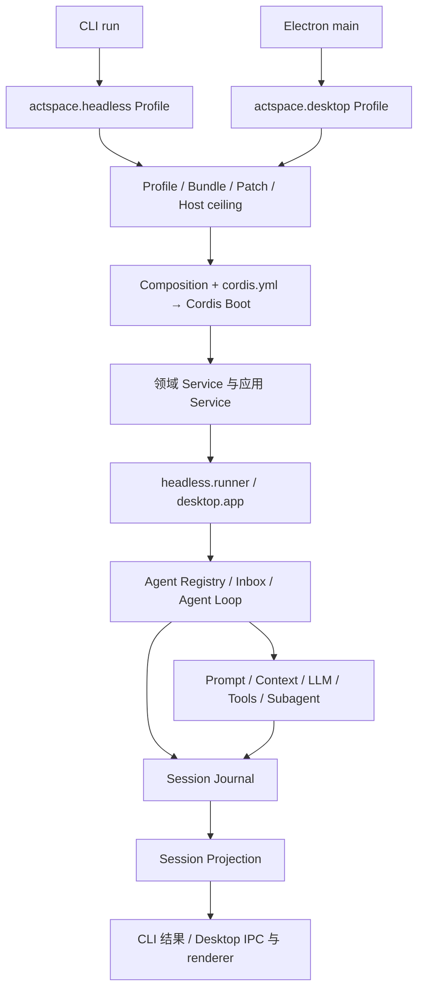

# ActSpace v2 总体架构

> 状态：当前实现概览，2026-09-08 按源码校准。文件名保留以稳定引用；本文已更新为 Profile-first 架构。实现存在不代表真实 Provider、Electron、Chrome 或发行制品门禁已全部通过。

## 1. 整体关系

ActSpace 使用独立领域包构成 Cordis 插件树。CLI 与 Desktop 各自在自己的进程内启动 Profile，应用操作由对应 Service 承担，Agent、Session、LLM 与工具共享领域实现。

图中的共享节点表达实现复用，不代表 CLI 和 Desktop 共享同一个 live Context。当前业务命令是 `run`；CLI 的 help/version 是辅助入口。

## 2. 所有权

| 层 | 当前职责 | 源码入口 |
|---|---|---|
| CLI Host | argv/stdin、工作目录、凭据和工具端口、结果输出与退出 | `apps/cli/src/cli.ts`、`runtime-v2/host-adapter.ts` |
| Desktop Host | Electron 生命周期、Main-only 凭据、IPC、窗口与本机能力 | `apps/desktop/src/main/runtime-v2/desktop-host-adapter.ts` |
| Profile / Composition | 选择应用 Bundle、解析 Patch、Host ceiling 与只读组合事实 | `packages/runtime/src/profiles/composition.ts`、`packages/composition/` |
| Boot / Runtime | Cordis root、Host ports、codec discovery、settlement、启动验证、诊断和 shutdown | `packages/boot/src/dsh-boot.ts`、`packages/runtime/src/runtime/boot.ts` |
| 应用 Service | CLI 单次任务或 Desktop 会话操作 | `packages/headless/`、`packages/desktop-app/` |
| 领域 Service | Agent、Loop、Session、LLM、Tools、Prompt、Context、Compaction、Subagent | `packages/core/`、`packages/session/` 等独立包 |
| 固定 renderer | 展示 DTO、提交用户意图，不执行后端插件代码 | `apps/desktop/src/renderer/`、`packages/shared/` |
| Browser Bridge | Go/Chrome 外部能力，经 Host port 与工具包接入 | `browser-bridge/`、`packages/tools/browser-tools/` |

`packages/runtime` 当前还包含 Session/Run controller、Host port 组装与投影适配，并非已经完全清空的 Boot 包。领域持久化与 Service 全域收敛的剩余工作见 [P1/P2 计划](../../exec-plans/active/20260829-actspace-p1-p2-contract-and-composition/README.md)。

## 3. 启动到应用操作

1. Host 选择 headless 或 desktop Profile，提供工作目录、存储根、凭据 resolver、审批和外部 capability；Desktop 额外提供自己的 App Bundle。
2. Composition 解析 Bundle、Patch 和 Host ceiling。生产 Host 指定受控的 `packages/runtime/cordis.yml`，其 Loader transport 与组合事实进行一致性检查。
3. Runtime 先发现可信 codec，再创建 Cordis root、注入 Host services、由 Include/Loader 挂载行为。required Service、Fiber 状态和启动验证通过后才返回结果。
4. 生产 Host 得到 `BootedRuntimeProfile`，从本进程 Context 取得 `headless.runner` 或 `desktop.app`；应用 Service 持有具体领域操作。
5. 退出时 Host 等待 Profile shutdown；运行停止接纳新工作，领域资源完成取消、flush 和可等待 dispose。具体实现与失败边界见 [Runtime 与 Composition](agent-target-runtime-architecture.md)。

Boot 只建立可运行的服务环境。创建 Agent、恢复 Session 和发起任务属于应用/领域 Service 的职责，不等同于装载插件。

## 4. 一次任务与持久事实

CLI 的 `runV2Command()` 调用 `headless.runner.run()`；Desktop 通过 `DesktopAppService` 创建或恢复 main Session、运行任务和投递后续输入。Run controller、Agent factory 与 Agent Loop 连接 Session、Inbox、Prompt、LLM 和 Tools。

输入通过 Agent 的 followup/Inbox 语义进入 Loop，request snapshot、模型响应、工具调用和结果进入 Session Journal。一次性 Subagent 创建独立 child Session，向父任务返回有界结果；它不是持久 Member、Room 或 Team。

当前持久目录是 `sessions-v2/<sessionId>/journal.jsonl`。Session Format 的版本仍为 1，不能按文件名中的 v1 将其归档。可恢复状态来自 Journal，live progress 与 diagnostics 不替代持久事实。

Desktop 的聊天、Trajectory、Context、Usage 等消费投影；统一水位与完整消息映射仍按 [Session 持久化与投影计划](../../exec-plans/active/20260830-actspace-session-persistence-projection/README.md)收口。已退役的分析观测页面不再是当前入口。

## 5. 当前、未来与历史

- 当前：headless/desktop Profile、Cordis 原生事件与插件组装、Journal、一次性 Subagent、固定前端、模型/工具及英语学习能力。
- 部分实施：P1/P2 全域契约收口、完整 Session 投影收敛及相应回归门禁；以 active 计划列出的差距为准。
- 未来：Member、Room、Team 产品意图保留在 collaboration 专题，实施前需重新制定 v2 方案。
- v1：旧 Runtime、Kairos、Lab、fs-watch、旧设置与旧 Usage 设计在 [v1 归档](../../archive/v1/README.md)。

## 6. 阅读路线

- 启动与生命周期：[Runtime 与 Composition](agent-target-runtime-architecture.md)。
- 行为分层：[Agent Run / Turn](../agent-runtime/agent-turn-layers.md)。
- 当前事件：[DSH 事件模型](agent-spec-dsh-event-model.md)、[Cordis ABI](agent-spec-cordis-event-abi-and-eventhub-retirement.md)。
- 领域与剩余任务：[专题索引](README.md)、[测试策略](agent-testing.md)。
- 演进背景：[Profile-first 决策](agent-decision-profile-first-headless-desktop.md)。历史决策中的旧接口不能覆盖本页和当前源码。
