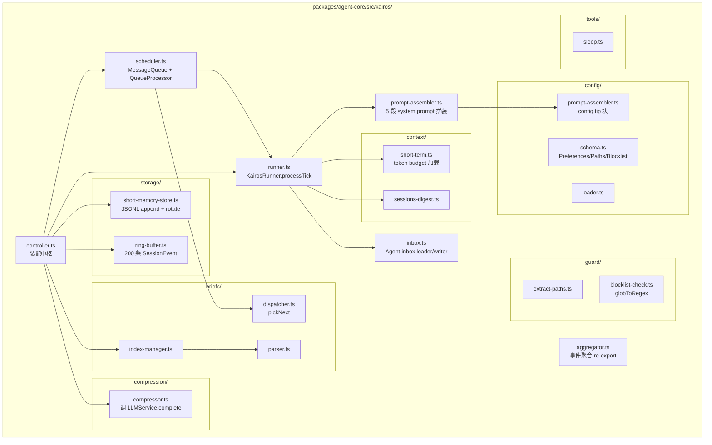

# Agent Core 当前模块地图

本文档记录 `packages/agent-core` 当前已经落地的模块结构。它回答“现在代码分布在哪里、各模块负责什么”，长期设计动机见 `docs/design-docs/agent-runtime/agent-backend-design.md`。

> DeepSeek / Kimi / OpenRouter / DuckCoding 多供应商实现见 `docs/design-docs/model-context/agent-multi-provider-llm.md` 与 `agent-duckcoding-multi-key-model-catalog.md`。shared 契约、agent-core 显式 runtime/代理 transport、desktop settings v2、多 Key、本地 DuckCoding 档案/模型存储、Codex Responses、任务模型消费方和 renderer 已贯通；真实 OpenRouter 代理、DuckCoding Agent 工具循环与跨任务场景保留为用户统一手动验收项。

## 顶层类型与契约

- `messages.ts`：内部 Message/Content 类型体系（discriminated union），包含 Usage、StopReason、Context 等核心类型。
- `internal-tools.ts`：统一工具定义（InternalTool）与注册表（InternalToolRegistry），支持 definition + handler + permission 组合。
- `adapters.ts`：内部类型（Message）与 shared 契约（SessionEvent/MessageBlock）之间的双向转换。
- `fixtures.ts`：测试用 mock 数据工厂。
- `types.ts`：agent-core 内部辅助类型。

## `llm/` - LLM 服务层

- `llm/types.ts`：LLMConfig、StreamOptions、LLMService 接口、AssistantMessageEventStream、LLMServiceError。LLMService 暴露非敏感 `provider/model` 运行身份供 Trace 使用；LLMConfig 把 `api` / `apiFormat` / `input` 拆开，error 事件仍携带完整 `AssistantMessage`，而非 `Error` 对象。
- `llm/provider-adapter.ts`：供应商品牌差异的小型函数表。当前只承担 display name、OpenRouter 非敏感默认 header 和 Kimi thinking 请求修饰，不持有消息历史或协议转换状态。
- `llm/provider-transport.ts`：供应商级 fetch/代理边界。无代理时沿用 SDK 默认 fetch；有代理时按标准化 HTTP(S) URL 复用 Undici `ProxyAgent`，拒绝认证 URL，并把失败脱敏归一为 `proxy` 错误。
- `llm/convert.ts`：OpenAI 协议的共享消息转换、工具转换、流式 chunk 处理和 SDK 错误映射逻辑。包含防御性消息处理（跳过 error/aborted 的 assistant messages、为孤儿 tool calls 插入 synthetic toolResult）。
- `llm/responses-convert.ts`：OpenAI Responses 协议适配层。把 Context 转成 instructions/input/function tools，保留 assistant phase 与 `call_id` 对账，并把加密 reasoning item 编码为可持久化的 opaque provider signature 后在后续工具轮次回放。
- `llm/anthropic-convert.ts`：Anthropic 协议适配层。Context↔Anthropic system/messages/tools 转换、server/client tool 映射、usage 归一（`anthropicUsageToUsage`），以及真流式处理（`createAnthropicAccumulator` + `processAnthropicStream` 逐增量累积 → `buildAnthropicAssistantMessage` / `buildAnthropicErrorMessage`，设计思路与 `convert.ts` 同构，差异仅在协议）。
- `llm/transform-messages.ts`：跨 provider 通用预处理层。负责图片降级、thinking 降级、tool call id 规范化、孤儿 tool result 修复，以及 error/aborted assistant 消息过滤；OpenAI Chat / Responses / Anthropic 协议服务都先过这一层再做各自协议转换。
- `llm/services/anthropic-messages.ts`：AnthropicMessagesService，真正的 Anthropic Messages 协议实现层，负责 provider-native tools、usage 归一和真流式事件组装。
- `llm/services/openai-completions.ts`：OpenAICompletionsService，真正的 OpenAI Chat Completions 协议实现层，负责公共消息转换、tool call 重组和 usage 归一。
- `llm/services/openai-responses.ts`：OpenAIResponsesService，真正的 OpenAI Responses 协议实现层，负责 Responses 流式事件、工具调用、`store: false` 无状态上下文、session 缓存键、加密 reasoning item 和 usage 归一。
- 协议服务是 LLM 职责事实来源；品牌 service 只保留兼容包装，不再新增消息转换、tool call 重组或 usage 归一逻辑。
- `llm/services/deepseek.ts`：DeepSeekService 兼容包装层，普通对话实际复用 `OpenAICompletionsService`；只负责 DeepSeek 的 provider 默认值和 api 兜底。
- `llm/services/deepseek-anthropic.ts`：DeepSeekAnthropicService 兼容包装层，普通对话实际复用 `AnthropicMessagesService`；只负责 DeepSeek 的 provider 默认值和 api 兜底。
- `llm/services/kimi.ts`：KimiService 兼容包装层，普通 Kimi 对话复用 `OpenAICompletionsService`；只兜底 provider 默认值。
- `llm/services/mock.ts`：MockLLMService，支持 response queue 模式（通过 `setResponses`/`appendResponses` 预设响应序列）和默认行为模式（向后兼容）。提供 `mockText`、`mockToolCall`、`mockError` 辅助工厂函数。
- `llm/factory.ts`：createLLMService 工厂函数。当前按 `LLMConfig.api` 选 `AnthropicMessagesService` / `OpenAICompletionsService` / `OpenAIResponsesService`；OpenRouter 复用 Chat Completions，DuckCoding Codex 使用 Responses，provider 品牌包装层只保留兼容入口。

## `prompt/` - 提示词集中管理

- `prompt/main-agent.ts`：桌面端默认主 Agent 系统提示词，供 `SystemPromptContext` 初始化使用。
- `prompt/lab-agent.ts`：Lab Agent 默认系统提示词 builder；当前仅作为未来 Lab Runtime 的版本化 prompt 资产，包含写入 `<userData>/kairos/inbox/lab-agent.md` 的 handoff 规则，尚未接入真实 Lab 后端运行时。
- 提示词文件顶部应写明使用位置、影响范围和维护边界；动态上下文、工具协议、密钥和运行时配置不应硬编码进提示词。

## `tools/` - 模块化工具系统

- `tools/types.ts`：ToolDefinitionSpec、ToolExecutorFn、ToolManagerConfig；工具定义必须声明 `previewKind` 作为前端展示语义，并可用 `exposeOnlyTo` / `requiresKey` 做轻量暴露筛选。`ToolManagerConfig` 除压缩字段外，还可注入图片生成 runtime 与当前 session `artifactRoot`；这些运行时密钥不进入共享 session 契约。
- `tools/workspace-guard.ts`：路径解析与边界守卫。写类工具（write/edit/bash）走 `guardWorkspacePath` 拒绝越界；**读类工具（read_file/grep/glob/list_directory）走 `resolveReadablePath` 只解析不越界**（为支持回读 `<userData>/tmp` 落盘文件与 `session.jsonl`），`displayReadablePath` 决定 workspace 外结果展示绝对路径。取舍与后续 blocklist 见 `docs/SECURITY.md`、`docs/design-docs/execution-safety/agent-权限设计规则和原则.md`。
- `tools/manager.ts`：ToolManager（注册/获取/导出工具定义），执行入口委托给 ToolScheduler；把 `readTruncateThreshold` / `absoluteMaxChars` / `summarizer` 透传给 scheduler。
- `tools/scheduler.ts`：ToolScheduler（权限三态决策、工具状态记录、执行、结果渲染与裁剪）。`ask` 通过 `ApprovalGate` 暂停工具执行，向桌面端 pending approval registry 发出审核请求，用户 `approve_once` / `deny` / 超时后再恢复调度；`allow_similar` 只有工具权限显式允许时才可继续执行。`postProcess` 异步化：bash 由 executor 自处理（流式落盘 + 头部截断 + outputRef），其余工具走 `output-truncator`（flash 摘要 / 头尾确定性截断兜底）。
- `tools/output-truncator.ts`：非 bash 工具输出后处理。按工具类型取阈值，超阈值先 `headTailTruncate(absoluteMaxChars)` 再送 `summarizer.summarizeToolOutput`，summarizer 不可用回退头尾确定性截断；回填前拼 `compressedNotice` 压缩标记，返回 `modelOutput` + inline `rawOutputRef`。
- `tools/tool-output-paths.ts`：bash 大输出落盘路径构造 `<tmpRoot>/tool-output/<sessionId>/<uniqueId>-bash.txt`。
- `tools/cleanup-tool-outputs.ts`：`cleanupOldToolOutputs(tmpRoot, maxAgeMs=7天)` 按 mtime 删除超期落盘文件并回收空会话目录；desktop 在 turn 起始 best-effort 调用。
- `tools/subprocess/{run-process,ripgrep-path,ripgrep}.ts`：受控子进程执行封装。`run-process` 统一处理进程生命周期、timeout、stdout/stderr；支持流式落盘 sink（`outputFile` / `headBufferCap` / `diskCap`）：内存只留头部缓冲，超出懒落盘、达 `diskCap` 停写标记 truncated，返回 `headBuffer` / `totalBytes` / `outputFilePath`。`ripgrep-path` 按 `ACTSPACE_RG_PATH -> 系统 rg -> bundled @vscode/ripgrep` 解析可执行文件；`ripgrep` 在其上封装 `rg` 命令语义。
- `tools/tools/shared/write-atomic.ts`：原子写入 helper（tmpfile → fsync → rename），Edit 和 Write 工具共用。
- `tools/tools/{read-file,list-directory,edit-file-diff,write-file,delete-file,bash}/`：每个工具一个目录，含 `definition.ts` + `executor.ts`；其中 `edit-file-diff` 对外工具名为 `edit_file`（snake_case），使用 `diff` 库生成 unified diff 并原子写入；`new_string: ""` 表示删除匹配文本内容，不是删除文件，整行删除会连同该行换行删除，行内删除不得吞掉后续换行；`write-file` 对外工具名为 `write_file`，创建或覆写文件并生成 diff；`delete-file` 对外工具名为 `delete_file`，只删除 workspace 内普通文件，默认走一次性用户审批且不允许 `allow_similar`；这些写类/删类工具各有 `permissions.ts` 预留 AgentMode 审批扩展；Bash 额外包含 `permissions.ts` 和 `render-result.ts`。目录名沿用 kebab-case，对外 `name` 字段统一 snake_case，详见 `docs/design-docs/tool-system/agent-tool-preview-design-guidelines.md` 的工具命名约定章节。
- `tools/tools/{grep,glob}/`：文件搜索工具。grep 通过 ripgrep 正则搜索文件内容，glob 通过 `rg --files --glob` 按文件名模式查找。
- `tools/tools/{web-search,web-fetch}/`：联网工具（设计见 `docs/design-docs/tool-system/agent-web-tools.md`）。`web_search` 走外部搜索 API 双通道（智谱 + Tavily/TinyFish/Exa failover），任一搜索 key 存在时注册；`web_fetch` 本地确定性抓取 URL 转 Markdown，始终注册。
- `tools/tools/generate-image/`：主 Agent 图片生成工具（设计见 `docs/design-docs/tool-system/agent-image-generation-tool.md`）。`generate_image` 由独立图片服务 Key 门控，接受 `prompt / size / n`，把 URL/Base64 结果校验后写入当前 session artifacts；Kairos/Explore 不注入该 runtime，因此默认不可用。
- `tools/tools/browser/`：Browser Use 的薄 Agent adapter。`definition.ts` 只暴露 9 个分类工具、`browser_help`、`browser_run`；`generated-actions.ts` 从 Go 62 条 registry 生成 action/risk/status/legacy alias；`permissions.ts` 对单 action 做 metadata 审批、对 batch 调 Go preflight 并携带绑定 session/turn/action hash 的短期 token；`executor.ts` 通过单一长连接调用 `command.execute/describe/run`，不实现 CDP、Locator 或 Chrome API 逻辑。旧 15 个工具名只保留禁用配置 alias 与历史 preview 读取兼容。
- `tools/tools/analyze-media/`：DeepSeek-only Kimi 辅助工具（多模态识别）；只有 DeepSeek 为主模型且配置 Kimi key 时注册。
- `tools/tools/agent/`：Agent 工具（用户可见名 `Agent`，内部工具名 `agent`）。`definition.ts` 声明 `description` / `prompt` / `subagent_type:"explore"` 输入和 `previewKind:"agent"`；`runner.ts` 创建隔离 Explore SubAgent runtime，复用父 turn 的 LLMService，但只注册 `read_file`、`grep`、`glob`、`list_directory` 四个只读工具，不恢复主 session 历史，也不允许递归 Agent。runner 把 SubAgent 内部事件转成 sidecar transcript、`AgentToolPreview.recentEvents`、最终 summary/stats/transcriptRef，并通过 `ToolResult.subagent` 返回给 bridge。

新增工具时，先读 `docs/design-docs/tool-system/agent-tool-preview-design-guidelines.md`，确保 `previewKind` 和 `ToolUiPreview` 语义稳定。

## `skills/` - Skill 发现与 catalog 注入

- `skills/types.ts`：SkillScope、SkillSource、SkillSummary、SkillRegistry 等基础类型。
- `skills/frontmatter.ts`：轻量 frontmatter parser。读取 `name` / `description`，支持简单单双引号标量；缺少 frontmatter 或必需字段时用目录名兜底并返回 warning，不阻断普通 turn。
- `skills/registry.ts`：Skill 扫描与去重。按 `<workspace>/.actspace/skills`、`<workspace>/.agents/skills`、`<workspace>/.claude/skills`、`<userData>/skills`、`<userData>/.actspace/skills`、`<home>/.agents/skills`、`<home>/.claude/skills` 顺序扫描一级子目录中的 `SKILL.md`；同名 first-win，后发现的进入 `shadowed`。
- `skills/catalog.ts`：把 registry 渲染为 `<available_skills>` XML catalog，并生成 `bucket: "skills"` 的 system prompt segment。catalog 只注入元信息和 `SKILL.md` 绝对路径，提示 Agent 在任务匹配时用已有 `read_file` 读取 `location`。

## `context/` - 上下文管道

- `context/types.ts`：SystemPart、ContextModule、PromptSegment、CompressionConfig + `DEFAULT_COMPRESSION_CONFIG`（contextWindow / compressionThreshold / compressKeepRatio / compactMinIntervalCalls / toolTruncateThreshold / readTruncateThreshold / bashInlineThreshold / bashDiskCap / absoluteMaxChars 的单一默认来源）。另含 `CACHE_STABILITY`（IMMUTABLE 100 / STABLE 70 / SEMI 40 / VOLATILE 10）缓存稳定性档位；`PromptSegment` 与 `SystemPart` 都带 `stability` 字段，用于把不易变内容稳定排在请求前缀，提高 DeepSeek prefix-cache 命中率（动机见 `docs/design-docs/model-context/agent-token-usage-and-context-state.md`「缓存稳定性档位」）。
- `context/token-estimator.ts`：token 估算与用量快照生成（`createContextUsageSnapshot` 支持 `compressionCount`）。`createEmptyBuckets()` 遍历共享注册表 `@actspace/shared` 的 `CONTEXT_BUCKET_REGISTRY` 生成 bucket（单一事实来源，新增上下文类型只改注册表 + 主题 token，不改组件）。
- `context/modules/system-prompt.ts`：分段系统提示词上下文。核心段为 `CACHE_STABILITY.IMMUTABLE`，`registerSegment` 默认 `STABLE`；`getPrompt()` 排序键为「stability 降序 → priority 降序 → id 升序」，确定性拼接避免前缀字节漂移。
- `context/modules/conversation.ts`：会话历史上下文模块。构造函数接受可选 `initialMessages`；`static async createFromSession(sessionPath)` 一次性恢复 `Message[]`。历史压缩为充血入口：`async compress({ summarizer, sessionJsonlPath, keepRatio })` 自编排 `planCompaction → 序列化 → 摘要 → applyCompaction` 全流程并内置兜底（摘要不可用时「丢弃最旧 + session.jsonl 指针」）；`planCompaction(keepRatio)`（只读，按 keepRatio 找安全切点——不动区以 assistant turn 开头，不拆 tool_call/tool 配对、避免连续 user）与 `applyCompaction(summary, split)` 作为可独立单测的细粒度步骤保持 public。运行期 `format()` / `appendMessage` 仍是纯内存操作。
- `context/manager.ts`：ContextManager 编排器（模块协调、appendMessage、getContext、用量统计）。`buildSystemPrompt()` 收集各模块 `SystemPart` 后按 `stability` 降序稳定排序（同稳定性按收集 index tie-break），让最不易变内容（系统提示词 IMMUTABLE）稳定落在请求前缀。`static async createForSession({ systemPromptModule, sessionPath, ... })` 是会话恢复入口，同时把 `sessionPath` 存为压缩摘要的回看 ref。`async compactIfNeeded(summarizer)`：token 水位过 `contextWindow×compressionThreshold` 且距上次压缩满足 `compactMinIntervalCalls` 时向 `conversation.compress()` 发压缩指令（指挥者只判断「要不要压」，「怎么压」封装在数据所有者模块内），返回 `ContextCompactionReport`（trigger/threshold token、前后消息数、ref），`compressionCount` 计入用量快照。`async compactNow(summarizer)` 是手动 `/compact` 入口，跳过阈值与间隔检查直接发同一指令，返回 `compacted/skipped` 状态。
- `context/compression/`：上下文压缩工具库（纯函数与服务，不含编排——压缩编排权在数据所有者模块，见 `modules/conversation.ts` 的 `compress()`）。`summarizer.ts`（flash 摘要封装，`summarizeToolOutput` / `summarizeHistory`，失败抛 `SummarizerUnavailableError`）、`tool-summary-prompts.ts`（按 previewKind 选 prompt + `compressedNotice` 压缩标记）、`history-prompts.ts`（ClaudeCode 8 节摘要 prompt + 开篇语 + session.jsonl 回看 footer）、`history-serializer.ts`（可压区消息序列化为摘要模型输入）。

## `engine/` - 执行引擎

- `engine/types.ts`：AgentEvent（discriminated union，含 Agent Run 内真实 `turn_start/end`、`llm_call_start/end` 与 `context_compaction`）、AgentLoopConfig、AgentLoopResult、`ContextCompactionInfo` / `CompactionOutcome`。`LLMUsageCall` 保存 `turnId/llmCallId/attempt/durationMs`，并可携带 cache audit 元数据。
- `engine/loop.ts`：runAgentLoop 纯函数双层循环（内层工具调用+转向、外层跟进）。每个内部 Turn 生成真实 `turnId`，每次 `llm.stream` 尝试生成 `llmCallId + attempt`；调用前捕获 provider/model、系统提示词、消息、工具和推理选项，调用后记录响应、usage 与耗时。自动重试留在同一 Turn，但拥有新的 LLM Call。
- `engine/agent.ts`：Agent 入口类（run/abort），编排 ContextManager + ToolManager + LLMService；持有 `summarizer` 与可选 `cacheAudit`，把 `contextManager.compactIfNeeded` 包成 `maybeCompact` 传入 loop。
- `engine/bridge.ts`：IPC 桥接层，将 AgentEvent 实时映射为 RuntimeStreamEvent，并把一次用户输入聚合为 `AgentRunResult`。Bridge 给所有 SessionEvent 附加粗粒度 `agentRunId`，给内部 Turn/LLM Call 事件附加真实 `turnId/llmCallId`；同时把请求、响应与重试写入可选 Trace Writer。工具预览、压缩、cache audit 和 SubAgent sidecar transcript 仍沿用既有边界。
- `engine/compact-context.ts`：手动 `/compact` 后端入口。接收 `CompactContextInput` + 已装配 `AgentDeps`，发送 `context_compaction_started/progress/finished/failed` stream event，调用 `contextManager.compactNow()`，返回 `CompactContextResult` 并产出 `context_compaction` / `context_snapshot` 事件。
- `engine/partial-args.ts`：partial JSON 字符串字段提取状态机，正确处理 `\"` `\\` `\n` `\uXXXX` 等 JSON escape，未闭合时返回当前累积部分。仅给 streaming-preview-extractors 使用。
- `engine/streaming-preview-extractors.ts`：按 `ToolPreviewKind` 注册的 extractor 表，把 LLM 流式 `tool_call_delta` 累积的 partial JSON 解析成 typed `ToolUiPreview`。write_file 同时提取 path 与 content（content 作为 `streamingContent` 让前端 cursor 风格边写边看）；edit_file 和 delete_file 只提取 path（edit 的 diff 需要文件上下文 + 替换执行才能生成，delete 的审批/执行状态由权限事件和工具结果决定）。新工具按 previewKind 注册一行 extractor 即可。
- `engine/create-agent-deps.ts`：Agent 配置构建与实例创建，两步分离。Desktop 通过 provider-qualified `modelDefinition`、`modelKey` 和显式 `ProviderRuntimeConfig` 装配主模型；utility summarizer 也由已解析任务模型构造。旧 `modelSpec`/env builder 仅保留测试、CLI 和兼容入口。`createAgentFromConfig(config)` 用于空历史 mock/测试，`createAgentForSession(config, { sessionPath })` 在 main 进程恢复真实会话。

Agent Run、内部 Turn 与 LLM Call 的跨层职责边界见 `docs/design-docs/agent-runtime/agent-turn-layers.md`，Trace 契约见 `agent-observability-trace-model.md`。

## `persistence/` - 持久化与恢复

- `persistence/types.ts`：SessionStorePaths、JsonlParseResult、WriteResult、SessionRecoveryResult。
- `persistence/jsonl.ts`：健壮 JSONL 读写（坏行容错 + 结构化错误传播）。
- `persistence/meta.ts`：Session V2 `meta.json` 增量更新（`agentRunCount/updatedAt/lastModel`），拒绝旧 Schema。
- `persistence/recovery.ts`：多维恢复（events -> Messages/Blocks/Snapshot/DiffSummary）。
- `persistence/session-store.ts`：会话存储生命周期（create/ensure/write/read/list）。`writeSessionResult()` 追加 Session V2 事实事件，并把 `AgentRunResult.subagentTranscripts` 写到独立 sidecar；`readSubAgentTranscript()` 通过 typed ref 和路径段校验拒绝跨 session 或路径穿越读取。

## `observability/` - 本地排障与分析 Trace

- `observability/agent-run-log.ts`：每次 Agent Run 一个短期 JSONL 排障文件，记录 main、AgentEvent、RuntimeStreamEvent 和最终结果，超过 24 小时清理。
- `observability/agent-trace.ts`：每次 Agent Run 一个 append-only、安全脱敏的长期分析 Trace，保存 Run/Turn/LLM request/response/retry 事件；写入失败 fail-soft，不影响主流程。
- `observability/cache-audit.ts`：缓存失效旁路审计器。模型调用前对真实 Context 生成稳定 hash 指纹并读取滚动 `last.context.json` 做 prefix / append-only 比较；模型返回后按 `cacheHit/cacheRead + cacheMiss` 计算命中率，低于阈值时在 `<userData>/cache-audit/<sessionId>/<cacheAuditId>/` 固化 `summary.json`、`previous.context.json`、`current.context.json`、`diff.txt`，并始终 best-effort 覆盖滚动 `last.context.json`。

日志和 session 持久化的边界见 `../core-storage-and-observability.md`。

## 环境变量管理

- `env.ts`：集中式环境变量管理模块。自带轻量 `.env` 文件解析器（无第三方依赖），按 Schema 驱动验证、解析、冻结。
- `loadEnv()`：应用启动时调用，自动探测并加载 `.env` 文件，合并到 `process.env`（不覆盖已有值）。
- `env` proxy：类型安全的只读对象，任意文件 `import { env }` 后直接访问 `env.DEEPSEEK_API_KEY` 等。
- `envToLLMConfig()`：从 env 生成 `LLMConfig`，仅用于测试和 mock fallback 场景；Electron 真实 turn 使用 `engine/create-agent-deps.ts` 中的 `buildAgentConfig()` + `createAgentFromConfig()` 两步完成。
- `engine/create-agent-deps.ts`：`buildLLMConfigFromRuntime(model, providerRuntime, inferenceSettings)` 已由 desktop 真实 turn、compact、Explore、Kairos、context describe、eval candidate 和回复可视化路径消费；env builder 只保留非 Desktop 兼容入口。
- `EnvValidationError`：缺失必填项或值不合法时抛出，携带所有问题列表。

项目根目录的 `.env.example` 列出全部可配置项和默认值，`.env` 已被 `.gitignore` 忽略。

## 兼容层

原有单文件入口（`agent.ts`、`llm.ts`、`tools.ts`、`context.ts`、`persistence.ts`）保留为兼容层，内部 re-export 新模块的 API，确保 `desktop` 等现有消费方不被破坏。

## `kairos/` - 自治模式

Kairos 是 actspace 内置的"主动 Agent"——常驻进程、tick 驱动、随时被用户消息打断。它复用主 Agent 的 LLMService / ToolManager / SessionEvent / engine.runAgentLoop，自身只新增"调度 + 配置 + 观察 + 短期记忆"四组能力。完整设计见 `docs/design-docs/kairos/agent-kairos-autonomous-mode.md`。

模块速读：

- `controller.ts`：单例装配中枢。`createKairos(opts)` 接收 `kairosRoot / llm / toolManagerFactory / contextWindow`，内部串起所有子模块并 emit `event` / `state`。`eventSink` 严格按"写盘 → 推 ring buffer → 回调 listener"顺序，保证消费方任何时刻看到的都是已持久化事实。**额度护栏**：持有 `KairosBudgetStore`，`eventSink` 处理 `llm_usage` 后按 `budget.enabled` 扣减余额、耗尽则 `triggerWake`；scheduler emit `budget_exhausted` 时走 `haltForBudget`（enabled=false + 持久化 preferences.enabled=false + emit error）；`setBudget()` 写盘 + 重算 + 耗尽态清理；`start({force})` 耗尽时 throw。**优雅退出**：持有每轮重建的 `AbortController`，`shutdown()` = abort 在飞请求 + stop 循环 + flush usage/budget。
- `scheduler.ts`：`MessageQueue` FIFO + `QueueProcessor` 主循环。`runInterruptibleSleep` 用 `Promise + setTimeout + clearTimeout` 实现可中断 sleep；`mainAgentBusy` 标志让主 Agent Run 期间 scheduler 暂停取下一条；连续 `errorThreshold` 次失败进 cooldown。`sleepBiasAt(now, prefs)` 按 `preferences.rhythm` 调节 sleep 系数，`clampSleep` 卡住 LLM 请求范围。注入的 `canStartTick()`（额度耗尽时返回 false）在投/取 tick 前 + tick 后 sleep 前各检查一次，命中即 `onStateChange("budget_exhausted")` + break。
- `runner.ts`：`KairosRunner.processTick(msg)` 执行单次 tick：刷新观察（sessions digest + Agent inbox；目录变化已改由 fs-watch Skill 主动读取，2026-07-03 起不进观测）→ 加载 short-term context（token budget）→ assemble system prompt → emit `kairos_tick_injected` → 从 Kairos 专属 ToolManager 注入工具定义 → 直接调用共享 `runAgentLoop({ toolExecuteOptions: { callerAgent:"kairos", kairosGuard } }, getAbortSignal?.())`（透传退出用 AbortSignal）→ 把 `tool_start/tool_end/message_end` 转成 Kairos `SessionEvent` → 解析最后一次 `sleep(seconds)` 工具参数返回给 scheduler。
- `prompt-assembler.ts`：把 5 段（pacing / observation / config tip / history / rule.md）拼到 `KAIROS_SYSTEM_PROMPT` 占位符；每段独立 token budget。观测增量把 sessions digest、Agent inbox 分块截断，避免某一类长内容把其它观测信号完全挤掉。
- `inbox.ts`：V0 Agent 文件收件箱。幂等创建 `<kairosRoot>/inbox/main-agent.md` / `lab-agent.md`，提供 `appendKairosInboxMessage()` 和 `loadKairosInboxSummary()`；写入只 append 到文件末尾，读取时按最近消息数与字符预算截断。inbox 只作为 Kairos prompt 观测信号，不作为短期记忆事实源。
- `aggregator.ts`：薄壁 re-export `@actspace/shared` 的 `aggregateKairosEvents`——agent-core 内部统一从这里 import，避免散落引用 shared。
- `config/`：4 个文件（preferences.json / paths.json / blocklist.json / rule.md）的 schema 解析器（无 Zod，手写校验）+ tip 提取拼装。
- `storage/`：`ShortMemoryStore` 移植自 heartclaw，按月分目录 + 按日分文件 + 每日分卷（`_001.jsonl` → reset 时滚到 `_002`）。`SessionEventRingBuffer` 是内存圆环，200 条上限，给 UI 首屏用。`usage-accumulator.ts`（`KairosUsageAccumulator`，lifetime + sinceReset 双维度 token/成本总账，只增不减）和 `budget-store.ts`（`KairosBudgetStore`，额度护栏运行态 `{enabled, balanceCny}`，运行时被扣减且用户可改）共用 debounce + atomic rename + flush 范式，分别落 `memory/usage-accumulator.json` 与 `memory/budget-state.json`。
- `context/`：`sessions-digest` 扫 `paths.json` 列出的会话路径生成 unread turn 元数据，`short-term` 按 token budget 倒序加载历史事件并 sanitize 工具孤儿。（`watch-scanner` / `watch-diff` 已于 2026-07-03 随巡检管道退役删除，目录变化感知归口 fs-watch 插件。）
- `briefs/`：用户写在 `briefs/tasks/<id>.md` 的任务，frontmatter 含 `intervalSec`（v1 替代 cron）；`index-manager` 维护 `briefs/index.json` 的 lastRun/nextRun；`dispatcher.pickNext(now)` 在每次"队列空"时被 scheduler 调用。
- `guard/`：`extract-paths(args)` 集中处理"哪些字段是路径"，`blocklist-check` 用手写 `globToRegex` 匹配命中。两者被 `tools/scheduler.ts` 的 `checkKairosGuard` 调用，只对 `callerAgent === "kairos"` 路径激活。
- `compression/compressor.ts`：被动调用——controller 在 tick 完后看 short-term token 超阈值时触发，调 `llm.complete()` 出 markdown summary 写回 `memory/short-term/<YYYY-MM>/week_*.summary.md`。
- `tools/sleep.ts`：Kairos 专属工具。executor 只是"记账"——返回成功结果给 LLM、把 `seconds` 通过 SessionEvent 传出，真正的 sleep 由 scheduler 在 tick 结束后执行。

与主 Agent 共用的 hooks（已在前置模块文档中说明）：

- 主 Agent 和 Kairos 共享 `LLMService / ToolManager / ToolScheduler / runAgentLoop` 这套工具执行内核；差异只在外壳：主 Agent 通过 `engine/bridge.ts` 推 `RuntimeStreamEvent` 到聊天区并写主 session，Kairos 通过 `kairos/runner.ts + controller.eventSink` 推 `SessionEvent` 到 KairosPage 并写 short-term jsonl。
- `desktop/src/main/kairos-bootstrap.ts#createKairosToolManagerFactory()` 创建 Kairos 专属 ToolManager：先注册主 Agent 同款基础工具，再按 `env.disabledTools + blocklist.toolsDenied` 过滤；`controller.ts` 之后调用 `registerKairosTools()` 追加 Kairos 专属 `sleep`。默认 `blocklist.toolsDenied` 含 `bash`，用户显式移除后才会暴露给 Kairos。
- `engine/types.ts` 的 `AgentLoopConfig.toolExecuteOptions` 字段：让 runner 把 `callerAgent + kairosGuard` 透到 `ToolManager.execute(name, args, callId, options)`。主 Agent 不传该字段时路径零开销。
- `tools/scheduler.ts` 的 `checkKairosGuard(toolName, args)`：仅在 `callerAgent === "kairos"` 时跑路径白名单 + blocklist 双校验。2026-07-03 起读写授权分离：读工具（`isReadOnly === true`）可访问 `allowedRoots ∪ readOnlyRoots`（后者含 Skill 目录与 fs-watch 监听目录），写工具仅限 `allowedRoots`（paths.json）。
- Kairos 工具事件契约：`tool_start` 转 `tool_call { id, name, arguments }`，`tool_end` 转 `tool_result { toolCallId, toolName, ok, summary, modelOutput }`；前端右侧"工具结果"里的输入来自 `tool_call.payload.arguments`。
- 4 个新 `SessionEventType`：`kairos_tick_injected` / `kairos_sleep_start` / `kairos_sleep_end` / `kairos_sleep_interrupted`。`@actspace/shared/kairos-aggregator.ts` 的 `aggregateKairosEvents(events)` 把它们和复用的 `assistant_message` / `tool_call` / `tool_result` 聚合为表格行。

Desktop 集成（`packages/desktop`）：

- `src/main/settings-service.ts` + `model-store-service.ts` + `model-runtime-service.ts`：provider 默认 Key 与额外命名 Key 分层持久化；模型用可选 `credentialId` 引用同 provider 凭据，runtime 解析目标密钥并把 Key 倍率应用到本次调用的价格快照。缺失或不可用的绑定明确失败，不回退默认 Key。
- `packages/shared/src/duckcoding-model-catalog.ts` + `src/main/model-store-service.ts`：共享本地 Codex/Grok 档案，保存 DuckCoding 精确请求模型名、名称变体和用户覆盖后的上下文/输出限制；未知模型仍可按安全默认能力手动添加，不依赖外部公共目录。
- `src/main/agent-runtime-context.ts` + `agents-md-service.ts`：主 Agent runtime context 装配入口。`SettingsService.readAgentSystemPrompt()` 读取 `<userData>/prompts/main-agent.md` 作为主系统提示词；`agents-md-service` 固定加载 `<userData>/AGENTS.md` 与 `<workspaceRoot>/AGENTS.md`，缺失静默跳过、读取失败只 warning，并以 `rules` segment 注入 `SystemPromptContext`。同一 loader 还注入 Main Agent → Kairos handoff 段，给出真实绝对路径 `<userData>/kairos/inbox/main-agent.md`，并把 `<userData>/kairos/inbox/` 作为主 Agent `write_file/edit_file` 的额外可写根；随后调用 `loadSkillRegistry()` 扫描项目级/用户级 Skill，把 `<available_skills>` 注入 `skills` segment。Skill 正文由 Agent 按 catalog 中的绝对 `location` 使用 `read_file` 读取。真实 turn、`context:describe` 和 `/compact` 共用该 loader，避免上下文检查视图和 LLM 实际输入漂移。
- `src/main/context-describe-service.ts`：按需重建某个 session 的 Context 明细，不调用 LLM；现在通过同一 runtime context loader 注入主系统提示词文件和 `AGENTS.md` rules，再用 `buildContextEntries` 生成 systemPrompt / rules / tools / conversation 逐条全文。
- `src/main/kairos-bootstrap.ts`：`ensureKairosScaffolding(kairosRoot)` 幂等建目录 + 落 4 份默认 config；`createKairosLlm()` 复用 `buildLLMConfig`；`createKairosToolManagerFactory({ workspaceRoot })` 把 `blocklist.toolsDenied` 合并进 `disabledTools`。
- `src/main/kairos-ipc.ts` + `kairos-ipc-internals.ts`：注册 invoke handler（`kairos:get-state/get-events-recent/control/read-config/write-config/get-context-snapshot`） + 50ms debounce 推 `kairos:event/state` 到 renderer。`dispatchKairosControl` 纯逻辑分派 `KairosControl`，含 `set_budget`（→ `controller.setBudget`，不碰 preferences）。
- `src/main/index.ts` 的 `before-quit`：优雅退出——首次进入 `preventDefault` + 发 `app:shutting-down` → `await controller.shutdown()` → `app.exit(0)`，5s 超时兜底强退（修复早期 async before-quit 不被 await 的 bug）。
- `src/preload/index.ts` + `global.d.ts`：`window.actspace.onShuttingDown(cb)` 订阅 `app:shutting-down`。
- `src/renderer/state/useKairos.ts` + `src/renderer/pages/KairosPage.tsx`：UI 入口，事件流上限 500 条，4 个 config tab 共用 raw textarea + 保存按钮；状态条按 `budget.enabled` 显示额度胶囊、`budget_exhausted` 显示"额度不足"。
- `src/renderer/components/settings/KairosSettings.tsx`：「Kairos 自主智能体」分区的额度限制开关 + 剩余额度输入（走 `window.kairos` getState/onState/control set_budget）。
- `src/renderer/components/ShutdownOverlay.tsx`：挂在 `App.tsx` 顶层，收到 `onShuttingDown` 后铺全屏「Kairos 正在安全关闭」遮罩。
