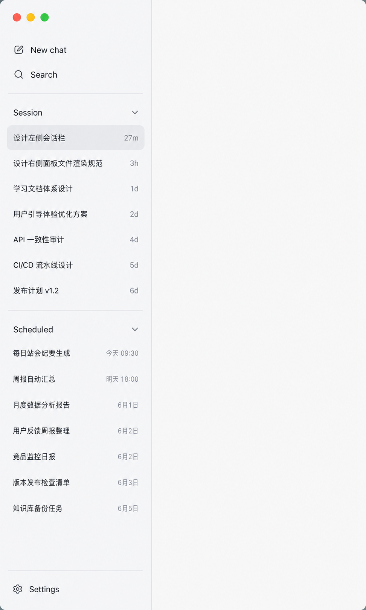

# 前端设计文档

本入口汇总 `actspace` 桌面端 renderer、交互、视觉、组件和页面设计资料。`docs/design-docs/` 已改为扁平结构，前端专题文档统一使用 `front-` 前缀；图片和 HTML prototype 统一放在 `public/front/`。

## 当前阶段

- 目标设计系统为根目录 `DESIGN.md` 定义的 `Ink & Emerald / 墨色与翡翠绿`。
- `Ink & Emerald` renderer token 与组件迁移已完成，旧强调色消费者已清零。
- 工程验证已完成；真实 Electron / Retina 与完整页面状态由用户进行最终人工验收。

## Ink & Emerald 配色样板

- [打开 Sidebar / Composer / Settings 浅深主题样板](public/front/ink-emerald-color-preview.html)
- 状态：**样板已确认，生产迁移已落地**。
- 支持：Light、Dark、System-Light、System-Dark。
- 样板内置关键前景 / 背景对比度矩阵，并明确标记 selected 需要非颜色冗余表达。
- 样板提出的 text-faint、warning 与 line-strong 可访问性校准已同步到生产 token。

## 当前基线图

## 当前定稿图

## 文档列表

- `front-前端设计文档.md`：总目标、布局原则、消息语法和输入区原则。
- `front-全局视觉语言规范.md`：全局字体、颜色、间距、圆角、阴影和动效 token，约束整体品牌气质。
- `front-主题与配色规范.md`：三态主题（浅/深/跟随系统）机制与「颜色必须随主题翻转」的硬约束；任何写颜色的样式工作先读这里。
- `front-tailwind-style-architecture.md`：Tailwind v4 样式架构、全局样式边界、token 映射和迁移顺序。
- `front-基础组件封装规范.md`：基础 UI wrapper 分层、Radix / shadcn 关系、组件抽象边界和迁移顺序。
- `front-icon-button-tooltip-guidelines.md`：图标按钮 Tooltip、`aria-label`、`title` 迁移、禁用态说明和当前迁移清单。
- `front-工作台布局与面板交互规范.md`：自研 SplitView、左右面板 resize、左侧 rail 和未来拖动边界。
- `front-左侧会话栏规范.md`：左侧轻量列表、Pinned / Scheduled / Workspaces 分区规则与状态点约定。
- `front-中间消息区规范.md`：消息语法、类型规则、顺序原则和工具流可视化。
- `front-聊天输入框规范.md`：Composer、模式、模型、附件、Context 弹窗和发送。
- `front-右侧面板与文件渲染规范.md`：右侧对象启动页、文件预览、Workspace 文件树、Markdown / HTML / Context / Reply、会话级 diff、IPC 契约和安全边界。
- `front-设置页规范.md`：设置态布局、导航与聊天态切换规则。
- `front-Kairos监控页规范.md`：Kairos 自治模式监控页、上下文 Sheet、运行轨迹、执行列表、统计区、详情区和聊天态右侧 compact view。
- `front-usage-statistics.md`：Usage Statistics 页面布局、组件、数据来源和视觉规范。

## 资产

- `public/front/README.md`：前端设计图说明。
- `public/front/actspace-deepseek-workbench.html`：工作台高保真 HTML 原型。
- `public/front/agent-subagent-flow-prototype.html`：Agent 工具与 SubAgent 执行流 HTML 原型，包含 running / completed / transcript modal / light-dark 状态。
- `public/front/usage-statistics-prototype.html`：Usage Statistics 高保真 HTML 原型。
- `public/front/compact-command-states.html`：`/compact` 命令消息流三态与浅/深主题 HTML 原型。
- `public/front/*.png`：当前阶段的前端设计图。

## 设计方式

- 先定全局视觉语言，再进入具体组件打磨。
- 基础交互组件先沉淀到项目 UI wrapper，再进入业务组件组合。
- 先定大纲，再逐个组件细化。
- 每次只把一个组件打透，不一次性堆所有状态。
- 左侧先轻量，右侧先够用，中间聊天区优先级最高。
- 工作台布局底座先把 resize、collapse 和 restore 做稳，再单独规划 tab 拖动与 dock 区域。
- 设置页单独作为页面态处理，不挂在聊天页右侧做叠加面板。

## 图片约定

- 每张图尽量只表达一个明确状态。
- 图片命名建议按顺序编号，例如 `01-overview.png`、`02-composer.png`。
- 图片旁边最好配一份简短说明，写清楚这张图想验证什么。

## 下一步

1. 手动检查 Light、Dark、System-Light、System-Dark 四个实际渲染分支。
2. 在真实 Electron / Retina 环境复验 Sidebar、Composer、Settings、消息流、右侧面板、Usage、Lab 与 Kairos。
3. 人工验收通过后归档 `20260725-frontend-color-system-migration.md`。
