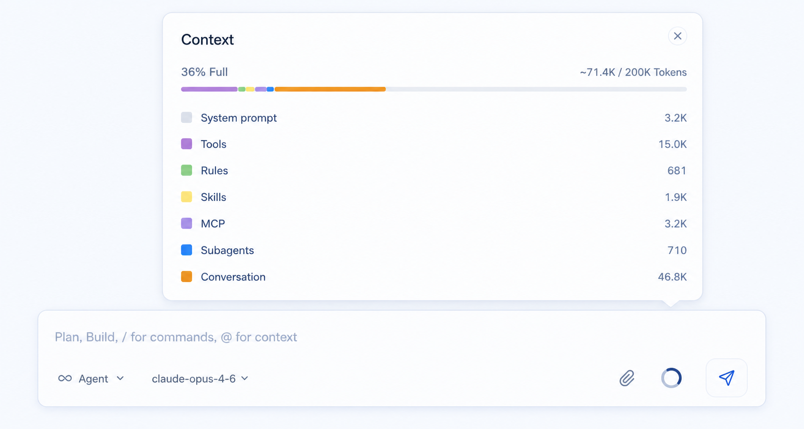

# 聊天输入框规范

## 定位

聊天输入框是整页最重要的操作中心。

当前 Composer 是一套可复用输入系统，而不是单一输入条。它既支持已有会话底部的轻量 `follow-up bar`，也支持创建新会话时的居中 `initial composer`。

- 默认态是低高度的贴底输入面板，优先服务“继续追问 / 继续指挥当前会话”。
- 复杂能力通过左侧 `+` 菜单展开，不在默认态把所有入口铺开。
- 输入栏下方展示会话状态行，让 branch、local runtime 和 context usage 成为稳定状态信息。
- 输入栏上方预留 `Review / overflow` 操作层，未来承载 diff review、批量操作和更多会话动作。
- 新会话首屏使用 `initial composer`，发送首条消息后切换回底部 follow-up composer。

## 内容

- follow-up 输入区域默认一行高，内容较长时向多行扩展（上限内滚动）。
- 左侧 `+` command menu，用于添加 agents、context、tools、附件和其他能力入口。
- `Review / overflow` 操作层。
- 模型按钮下拉。
- 附件入口。
- 发送按钮。
- 会话状态行：branch、local runtime、context usage。
- 新会话上下文选择行：workspace、branch、runtime。
- 上下文弹窗。

## 原则

- 使用弹出下拉，不使用生硬的静态选择框。
- 输入区要像桌面应用里的 follow-up command bar，而不是普通网页表单或网页聊天大卡片。
- 默认态保持轻量、贴底、低高度；不要把输入区域做成大面积白色卡片。
- 保留继续输入的舒适空间，但默认视觉重心应让位给上方消息流。
- 不显示语音按钮。
- 发送按钮保持单一、轻量、克制。样式对齐 Cursor（2026-07-05）：反色圆形按钮 + 上箭头，用 `bg-text-main` / `text-surface` 语义类随主题翻转（浅色 = 近黑底白箭头，深色 = 近白底深箭头），禁用态退为灰底；不使用品牌蓝。
- `model` 选择保持文字化，不加边框。
- Context usage 只在 follow-up 底部状态行右侧显示和打开，不再放在输入 panel 内。
- 品牌蓝仍可用于 focus ring、Context usage、Thinking toggle 等关键状态。
- workspace、branch、runtime 都应表现为下拉入口，即使第一版只有静态选项。

## Composer 形态

Composer 有 `surface`（`followup` / `initial`）一个外部维度，内部布局按内容高度**动态切换**（2026-07-05 定稿，对齐 Cursor）：

- **inline（单行）**：follow-up 默认态。`+` 左侧、输入框居中占满、右侧模型选择 + 发送按钮，全部同一行，低高度。
- **stacked（两行）**：输入框全宽在上，控件行贴底（左 `+` 和模型选择，右发送 / 停止）。

切换规则：

- 判定依据是**inline 可用宽度下的渲染高度**（`scrollHeight` 超过单行阈值），不是有没有 `\n`——长文本自动折行也会触发；删回一行自动切回 inline。不允许用 stacked 全宽输入框的高度反向决定是否切回 inline，否则宽度变化会造成误判和内容裁切。
- 附件存在、`initial` surface 强制 stacked。
- **实现约束：切换不允许 remount textarea**。inline / stacked 是同一个 grid 容器切换 `grid-template-areas`，textarea / `+` / 模型 / 发送四个元素 DOM 结构不变，正在打字时切换不丢焦点和光标。toolbar 分组用 `display: contents` 保留 aria 语义。
- 模型菜单展开方向随布局态切换：inline 时按钮在右、菜单向左展开；stacked 时按钮在左、菜单向右展开（菜单宽 280px，避免撞窗口边界）。

| surface | 布局 | 结构 |
| --- | --- | --- |
| `followup` 单行 | inline | Review strip → panel 内 `+ / input / model / send` 同行 → status row |
| `followup` 多行或有附件 | stacked | Review strip → panel 内 `attachments? / input` 全宽 / `+ model … send` 贴底 → status row |
| `initial` | stacked | selector row → panel 内 `attachments? / input` 全宽 / `+ model … send` 贴底 → Plan New Idea |

首条消息发送后，ConversationView 进入消息流状态，并显示底部 followup composer。

## Initial composer 结构

创建新会话时，Composer 位于消息区中部，包含三层：

1. 上下文选择行：`actspace-agent` workspace、`main` branch、`Local` runtime，三者都是下拉入口。
2. 输入 panel：输入框在面板上半部；底部 toolbar 包含左侧 `+`、紧跟其后的 `Auto` 模型入口和发送按钮。
3. 快捷 chip：`Plan New Idea`。

Initial composer 不显示 follow-up 的 Review strip，也不显示底部 branch/local/context usage 状态行。

## Follow-up bar 结构

从上到下分三层：

1. Review 操作层：位于输入栏上方，Git workspace 存在未提交改动时显示真实 `Review +N -M` 汇总和 `...`；无改动时不显示 Review 入口；当前 workspace 不是 Git repository 时显示无计数的 `Review` 入口，引导用户到右侧 Review 面板初始化 Git。
2. 输入面板：输入框全宽在上；底部控件行左侧为 `+` 与模型选择，右侧为发送 / 停止按钮。
3. 状态行：左侧显示 branch 与 `Local`，右侧显示 context usage 百分比或等价统计入口，也是打开 Context 弹窗的唯一入口。

### `+` command menu

点击左侧 `+` 打开菜单。菜单第一版可以先展示 demo 结构：

- 顶部弱提示：`Add agents, context, tools.`
- 常用 mode：Plan、Debug、Multitask、Ask。
- 能力入口：Image、Models、Skills、MCP Servers。

该菜单的语义是“添加能力 / 上下文 / 工具”，不等同于单纯附件按钮。真实附件选择仍由附件计划接入，当前 Composer 计划只保证入口位置、浮层样式和窄窗口布局稳定。

### Review / overflow 操作层

输入栏上方的轻量 action strip 用于进入 Review：

- 左侧 Review 按钮由 Git Review summary 驱动：有未提交改动时显示 `Review +N -M`。
- 无 Git repository 时显示无计数的 `Review`，点击打开右侧 Review 空态。
- 无未提交改动时不显示 Review strip，避免 Composer 常驻无效操作。
- SubAgent transcript panel 打开期间不显示 Review strip，优先保证当前 panel 和 follow-up 输入的视觉关系；关闭 panel 后恢复。
- 右侧或相邻 overflow `...` 保留位置，后续接入更多 Review / Git 操作。

## Context 弹窗

点击 follow-up 底部状态行右侧的 context usage 入口后弹出。

### 内容

- 上下文总占用。
- 分段占用条。
- System prompt。
- Tools。
- Rules。
- Skills。
- MCP。
- Subagents。
- Conversation。

### 原则

- 保持统计感。
- 以占用和构成为主，不做复杂编辑。
- 视觉上接近你给的那张参考图。

## Context 定稿图

## 附件展示

- 图片附件只显示图片本体。
- 文件附件只显示文件名。
- 附件位于 follow-up 输入栏上方、Review / overflow 层下方，简洁排列。
- 删除附件的 X 按钮默认隐藏，仅在鼠标悬浮到附件或键盘聚焦到删除按钮时显示。

## Composer 定稿图

当前实现计划以 `/Users/wakeup-jin/Desktop/actspace-learing-design/bug/19-2.png` 和 `/Users/wakeup-jin/Desktop/actspace-learing-design/bug/19-3.png` 的 follow-up bar 方向为准；仓库内 `composer-final.png` 后续需要在视觉稿更新时同步替换。
