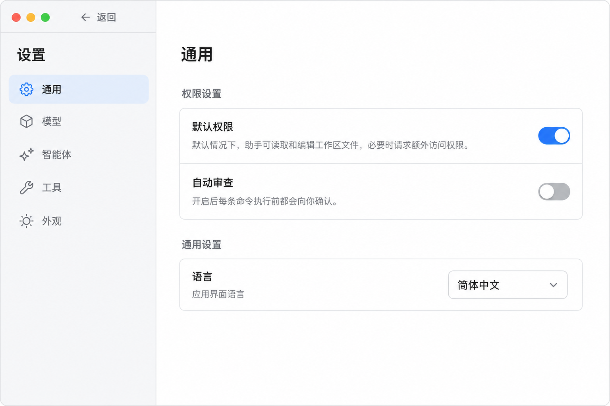

# 设置页规范

## 定位

设置页是独立于聊天态的页面级视图，用于承载应用配置，不作为聊天页右侧附属面板存在。

对应执行计划：[`docs/exec-plans/active/20260529-settings-page.md`](../../exec-plans/active/20260529-settings-page.md)。

## 切换规则（整页接管）

- 用户在聊天态点击左侧底部 `Settings` 后进入设置态。
- 进入设置态后，**原左侧会话栏整体替换为设置导航**（不是在聊天侧栏之外再叠一栏）。
- 右侧主区域同步替换为设置内容区，聊天态右侧文件/diff 面板在设置态强制关闭。
- 设置态与聊天态共享同一应用外壳，复用现有 `view` 切换机制（与 `usage` / `kairos` 同款）。
- 左上角提供「返回应用」回到聊天态。

> 实现落点：`WorkbenchLayout` 在 `view === "settings"` 时，左槽渲染 `SettingsNav`（替换 `Sidebar`）、主槽渲染 `SettingsPage`；`Sidebar` 底部已存在的 `Settings` 按钮接 `onSelectView("settings")`，并挂 `⌘,`。设置态左栏固定窄宽、禁用 hide/resize 的 snap。

## 布局

设置页采用两栏结构：

- 左侧：设置导航列表（窄而稳定）。
- 右侧：当前设置项详情内容。
- 滚动归属：设置页根容器固定为整窗高度，左侧导航不参与页面滚动；纵向滚动只发生在右侧设置内容区。

### 左侧设置导航

- 保持窄而稳定的宽度，纯列表导航，不做聊天会话展示。
- 当前分区：
  - `通用 General`
  - `模型 Model`
  - `智能体 Agent`
  - `Kairos`
  - `工具 Tools`
  - `插件 Plugins`
  - `文件监听 File Watch`
  - `Skills`
  - `外观 Appearance`
  - `归档会话 Archived Chats`
  - `更新 Update`
- 当前选中项使用轻量高亮背景，延续聊天态侧栏的克制视觉，不变成后台控制台。

### 右侧设置内容区

- 以表单和配置分组为主：清晰的标题、分组标题、说明文本、开关、下拉和输入控件。
- 版式节奏与聊天页保持一致，不追求复杂卡片感，优先静态可读与操作稳定。

## 各分区内容（首版定稿）

> 字段到后端的精确绑定、IPC 契约与生效机制以执行计划 `20260529-settings-page.md` 为准，本节只描述信息架构。

- 通用 General
  - 权限设置 ·「默认权限」：占位开关（暂不接逻辑）。
  - 权限设置 ·「自动审查」：开 = 每条 bash 命令执行前都要确认（绕过 allowlist，硬拒绝仍生效）。
  - 通用 ·「语言」：固定「简体中文」。
  - （已删除「工作模式」「完全访问」两条。）
- 模型 Model（按供应商而非按模型，参考 OpenCode）
  - DeepSeek / Kimi 供应商卡，徽标显示是否已连接。
  - 未连接「连接」→ API Key 输入弹窗；已连接「断开连接」。
  - 「测试连接」按钮校验 Key 是否有效。
  - 「网络搜索」组：智谱 Web Search / Tavily / TinyFish / Exa 四个搜索供应商行（`web_search` 工具的通道 key，见 `agent-web-tools.md`），仅连接/断开，无测试连接；Tavily 已连接时显示本周期 credits 用量（main 进程代理 `GET /usage`）。
  - 「默认模型」下拉，决定 Composer 初始选中模型。
- 智能体 Agent（2026-07-04 起只含主 Agent 内容；Kairos 全部迁到独立「Kairos」分区）
  - 主 Agent：自定义系统提示词（当前完整系统提示词，保存后下轮主 Agent 对话生效）。
  - Explore 子代理：模型下拉。
- Kairos（2026-07-04 新增独立分区，聚拢 Kairos 全部配置；提示词分层设计见 `agent-kairos-prompt-design.md`）
  - Kairos 自主智能体：模型下拉、思考链（自动/开/关，仍走 settings → `KAIROS_THINKING`）、**额度限制（开关 + 剩余额度 ¥，写入 `memory/budget-state.json`，不进 settings/preferences）**。
    - 额度控件读写走 `window.kairos`（`getState().budget` 回填 + `onState` 订阅运行时余额递减 + `control({type:"set_budget"})` 提交），与下方 config 文件读写独立。开关切换即时提交；剩余额度 commit-on-blur（本地 draft + focus 标志，避免运行时递减打断编辑）；关闭额度时余额输入禁用；耗尽时显示「额度不足」。语义见 `agent-kairos-autonomous-mode.md` 的「额度护栏（单一余额）」。桥不可用（mock）时禁用并提示仅桌面端可配置。
  - 人格 `soul.md`（2026-07-04 新增）：预设下拉（时机之神（默认）/ 极简 / 技术流 / 温暖陪伴 / 自定义）+ markdown 文本框（失焦保存，约 500 token 上限）。预设选中态通过「当前内容与哪个 preset 逐字节相等」反推，都不等显示「自定义」；选预设 = 把预设全文写入 soul.md（覆盖自定义内容前 confirm）。预设字典在 `@actspace/shared` 的 `kairos-soul-presets.ts`。留空 = 使用默认人格（loader fallback）。
  - 用户规则 `rule.md`：markdown 文本框，失焦自动保存。
  - 任务表 briefs（2026-07-04 新增）：`briefs/tasks/*.md` 列表编辑。每行显示 id / 状态徽章（启用/暂停/已完成/失败）/ 调度描述（每 N 天/小时/分钟 或 手动/事件）；点击展开编辑器（启用开关、触发方式、间隔秒、优先级、正文 textarea，显式「保存」）；「新建任务」内联表单（含 id 输入，校验 `[A-Za-z0-9][A-Za-z0-9_-]{0,63}`）；删除需 confirm。读写走 `window.kairos.briefsList/briefsRead/briefsWrite/briefsDelete`，main 端保护系统字段（created/lastRun/nextRun），写/删成功后 `reloadBriefs()` 让 dispatcher 下一 tick 生效。
  - Kairos 配置（结构化表单，**不暴露 raw JSON**）：3 份 JSON 用表单/开关/下拉/多选/列表呈现。所有控件**即时生效**（开关/下拉/多选改即写，文本/数字 commit-on-blur，列表增删即写）；写回时**保留表单未暴露的字段**（含给 LLM 的 `tip`）。保存走 `window.kairos.writeConfig`（schema 校验 + 原子写 + reloadConfig）。
    - 运行偏好 `preferences.json`（精简）：工作时段（固定 `09:00 - 21:00`）/ 晚上时段（固定 `23:00 - 07:00`）只暴露运行频率下拉，选项用「更活跃 / 正常 / 更安静」表述，**不出现「夹紧」字样**；时间不在 UI 中编辑，运行时也固定使用默认起止。另保留睡眠区间（最短/最长/默认，秒）；`rhythm.timezone` / `rhythm.weekend` / `tickBudget` / `circuitBreaker` / `memory` / `tip` 不暴露、写回原样保留。模型下拉与本表单同源。解析失败时禁用并提供「用默认值覆盖」恢复。
    - 可读写路径 `paths.json`（2026-07-03 由「可访问路径」更名，随巡检开关一起移除了每行的 watch Toggle；只读授权由文件监听目录自动获得，说明文案在卡片头部提示）：**「展示 → 点击编辑」列表**（Cursor rule 风格）——路径与说明默认是只读文本、点一下变输入框失焦/回车提交；说明为空时只显示极轻的「+ 添加说明」幽灵按钮，不常驻空输入框；新增行自动进入编辑态；删除按钮 hover 行才浮现。**默认 workspace 行**（路径后缀 `kairos/workspace`）标「默认」徽章、路径只读且禁止删除（防误删工作根目录，说明仍可改）。
    - 屏蔽规则 `blocklist.json`（精简）：屏蔽路径 glob 列表 + **禁用工具多选下拉**（复用「工具」分区清单，选中=对 Kairos 禁用）。`timeWindows`（免打扰时段）/ `maxToolCallsPerTick`（单次唤醒上限）不暴露、写回原样保留。
  - 不含 Kairos 开启/暂停按钮、也不放 `enabled` 开关（启停留在 Kairos 页）；但**直接改 `preferences.json` 的 `enabled` 保存后仍会真的起/停 Kairos**（main 端按 enabled 调和运行态）。
- 工具 Tools
  - 列出全部基础工具开关；当前 provider 下不可用的工具显示禁用态与原因。
- 插件 Plugins（管理外部插件二进制的**安装 / 编译 / 版本**；功能开关与配置在各功能自己的分区；设计事实来源 `agent-plugins-fs-watch.md`）
  - 「插件仓库」卡片：配置本机 `actspace-plugins` 仓库绝对路径（目录选择器 + 手输 commit-on-blur，持久化 `settings.plugins.repoRoot`）。
  - 「已接入的插件」列表，当前只有 fs-watch 卡片：未安装态——已设仓库路径时主按钮「编译并安装」（cargo build → 安装 → 自动开启，按钮带「编译中…」busy 态与耗时提示），副按钮「选二进制」兜底；未设仓库路径时只有「选择二进制安装」+ 引导提示。已安装态显示版本、运行状态徽标（运行中 / 启动中 / 已停止 / 异常+重试）、最近心跳与「重新编译」按钮（已设仓库路径时；升级用：停旧进程 → 重编 → 重装 → 重启）；卡片文案指引用户到「文件监听」分区做开关与配置。
- 文件监听 File Watch（面向用户管 fs-watch **功能**：开关 + 监听配置；插件安装在「插件」分区）
  - 未安装态：整版引导提示「请先到插件分区完成安装」。
  - 「开关与状态」卡片：总开关 Toggle、运行状态徽标、最近心跳、异常时内联「重试」，`overflow` 时提示当日记录不完整；关闭不删除历史日志。
  - 配置区：监听目录列表（系统目录选择器增删）、合并窗口(debounce)与日志保留天数步进器、排除隐藏文件开关；排除名单与事件输出目录只读展示。开关 / 配置变更即时生效（写 config.json，运行中自动重启进程）。
  - 两个分区共用 `fs-watch-shared.ts`（状态轮询 hook、徽标 / 心跳格式化），各自挂载时独立 2s 轮询；浏览器 mock 模式均显示「仅桌面端可用」。
  - 开启文件监听时 main 自动把 `fs-watch` 并入 Kairos 的 Skill 白名单（用户可在 Skills 分区再关掉）。
- Skills（管理**知识能力**的可见性；插件分区管进程安装、文件监听分区管功能，这里管 catalog）
  - Skill 卡片列表：name / description / scope+来源徽标 / SKILL.md 目录路径 / 异常 warning；同名被遮蔽（shadowed）的条目默认不展示、只在顶部计数提及。
  - 每卡两个独立开关：「主 Agent」= 黑名单反向（默认全开，关闭写 `settings.skills.disabled`）；「Kairos」= 白名单（默认全关，开启写 `settings.kairos.enabledSkills`，变更触发 Kairos controller 重建）。
  - 顶部「安装 Skill」：选目录 → 校验 SKILL.md → 复制到 `<userData>/skills/<目录名>/`；仅该目录下（`removable`）的 Skill 显示「卸载」按钮（confirm 后删除目录）。
- 外观 Appearance（字体 + 缩放 + 三态主题均已落地）
  - **字体**（参考 Cursor，只分两类）：
    - `UI 字体`：驱动 `--act-font-ui`，连带 AI 输出正文（`.markdown-body` 用的 `--act-font-display` 始终 = `--act-font-ui`）。
    - `代码字体`：驱动 `--act-font-mono`，作用于代码块、diff、bash 输出、行内 code。
    - 选择方式为「预设字体栈下拉」（每项是带 fallback 的整套 font stack），不打包字体、不做自由输入。
  - **字号**（仿 Cursor，px 数字步进 + 重置按钮）：
    - `界面字号`：以 px 基准字号呈现（默认 14px，范围 12–20）。我们 UI 用写死像素而非 rem，无法逐元素改字号，故底层按 `uiFontSize / 14` 的比例做整窗缩放（`webFrame.setZoomFactor`），对外呈现为 px 数字而非百分比。
    - `代码字号`：CSS 变量 `--act-font-mono-size`，单独调代码/diff/bash 字号（默认 13px）。Electron 下整窗缩放会再乘一次，故写入前按缩放比反向补偿（`codeFontSize / zoom`），保证渲染恰为设定的 px。
  - **主题**：浅色 / 深色 / 跟随系统三态分段控件（`ThemeSegmented`）。由 `<html data-theme>` 驱动：`light`/`dark` 走 `:root[data-theme=...]` 覆盖；`system` 用 `:root[data-theme="system"]` 下的 `@media(prefers-color-scheme: dark)` 随 OS 切换。组件统一用语义类（`bg-surface`/`text-text-main`/`border-line`），主题只覆盖一组 `--act-color-*` 即整体翻转；数据可视化色走 `--act-chart-series-*`（浅深各一组）。原生交通灯 / 滚动条经 `appearance:set-theme` IPC → `nativeTheme.themeSource` 同步。
  - 外观偏好（字体、缩放、代码字号、主题）走 renderer `localStorage`，不进 `settings.json`；开机在 `main.tsx` 渲染前重放，避免闪烁。
- 归档会话 Archived Chats
  - 通过 `listSessions({ archived: true })` 读取已归档会话，不混入普通侧边栏列表。
  - 每条展示标题、更新时间、turn 数和 workspace 摘要。
  - 「恢复」按钮调用 `archiveSession({ sessionId, archived: false })`，恢复后刷新归档列表，并通知应用刷新普通会话列表。
  - 恢复不会自动切换到该会话；它只重新出现在普通会话列表中。
  - 空状态显示「暂无归档会话」。
- 更新 Update
  - 作为设置导航里的独立页面，放在「归档会话」下方；不再塞进「通用」分区。
  - 选择本机 `actspace` 源码目录后，可触发“构建并更新”。
  - 该能力仅面向 macOS 已安装版；开发模式、非 macOS 或当前安装目录不可写时按钮禁用并显示原因。
  - 更新流程由 main 进程验证源码目录并写入 helper 脚本；构建阶段当前 app 保持打开，renderer 弹窗轮询 `status.json` 展示阶段进度；helper 默认生成 ad-hoc signed 本地包，并在退出当前 app 前验证新 `.app` 的 bundle 元数据、主可执行文件和 code signature。helper 报告 `ready_to_replace` 后，main 才退出当前 app，由 helper 替换 `.app` 并重启；复制或打开新 app 失败时 helper 会尝试恢复旧版本。
  - 页面分三段：源码目录、安装目标、构建并更新；安装目标展示当前进程路径与 Electron packaged 状态，方便排查安装版/开发态差异。点击“构建并更新”后弹出进度弹窗，显示启动 / 构建 / 准备替换 / 退出当前应用 / 替换等阶段和日志路径。

## 配置存储与安全

- 非敏感配置落 `<userData>/settings.json`（原子写）。
- **供应商 API Key 用 Electron `safeStorage` 加密**单独落盘；UI 与 IPC 永不回传明文，仅返回「是否已配置」。
- 本地更新源码目录落 `<userData>/local-update.json`，只保存路径；更新日志写 `<userData>/tmp/local-update/update.log`，阶段状态写同目录 `status.json`。`local-update:start` 只接受已保存且通过校验的源码目录，不接受 renderer 传入的任意命令或脚本内容。
- 配置生效：main 把 env-backed 设置覆盖到 `process.env` 后 `loadEnv()` 刷新冻结的 `env`，**下一轮对话自动生效，无需重启**；`settings.json` 只保存主 Agent 系统提示词文件路径，正文由 `settings:read-agent-system-prompt` / `settings:write-agent-system-prompt` 读写 `<userData>/prompts/main-agent.md`，真实 turn 和 `context:describe` 都从同一 prompt 文件注入；Kairos 思考链变更时在空闲态重建 Kairos LLM。Kairos 模型不再走 settings/env：其唯一来源是 `preferences.json` 的 `modelId`，由 `kairos:write-config` 保存后按 modelId 变化触发空闲态重建。
- UI 偏好（主题、UI/代码字体、界面缩放、代码字号）走 renderer `localStorage`，不进 `settings.json`；开机渲染前重放。

## 视觉原则

- 保持极简、冷静、桌面应用感。
- 不使用弹窗式设置菜单（供应商 Key 输入这类轻量弹窗除外）。
- 不引入登录卡片、账号浮层或复杂账户中心。
- 让用户感受到这是同一产品的另一种主页面，而不是另一个系统。

## 当前参考图

下图为「整页接管（两栏）」定稿基线：左侧设置导航（通用 / 模型 / 智能体 / 工具 / 外观 / 归档会话 / 更新）+ 右侧内容区。

