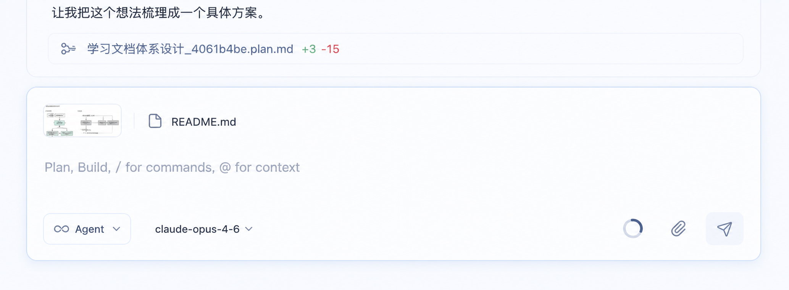

# 前端设计目录

这个目录专门放 `actspace` 桌面端前端设计资料。

## 当前阶段

- 先做设计大纲。
- 再按组件逐个细化。
- 先让结构稳定，再继续补交互细节和图片。

## 当前基线图

## 当前定稿图

## 目录结构

- `全局视觉语言规范.md`：全局字体、颜色、间距、圆角、阴影和动效 token，约束整体品牌气质。
- `tailwind-style-architecture.md`：Tailwind v4 样式架构、全局样式边界、token 映射和迁移顺序。
- `基础组件封装规范.md`：基础 UI wrapper 分层、Radix / shadcn 关系、组件抽象边界和迁移顺序。
- `前端设计文档.md`：总目标、布局原则、消息语法、输入区原则。
- `工作台布局与面板交互规范.md`：自研 SplitView、左右面板 resize、左侧 rail 和未来拖动边界。
- `左侧会话栏规范.md`：左侧轻量列表、Pinned / Scheduled / Workspaces 分区规则与状态点约定。
- `设置页规范.md`：设置态布局、导航与聊天态切换规则。
- `Kairos监控页规范.md`：Kairos 自治模式监控页的信息架构、运行轨迹、执行列表、统计区和详情区规范。
- `中间消息区规范.md`：消息语法、类型规则、顺序原则。
- `聊天输入框规范.md`：composer、模式、模型、附件、context 弹窗、发送。
- `右侧面板与文件渲染规范.md`：文件预览、会话级 diff、右侧定稿图。
- `prototype/actspace-deepseek-workbench.html`：基于当前规范整理的单文件桌面端高保真原型。
- `Kairos右侧紧凑视图规范.md`：聊天态右侧面板中的 Kairos compact view，约束同源数据流、三段布局和组件复用边界。
- `usage-statistics/`：Usage Statistics 统计页面设计专题。
  - `设计规范.md`：统计页面的布局、组件、数据来源和视觉规范，当前以蓝色产品仪表盘为基线。
  - `prototype.html`：统计页面的单文件高保真 HTML 原型，和设计规范保持同步。
- `image/`：当前阶段的设计图。

## 设计方式

- 先定全局视觉语言，再进入具体组件打磨。
- 基础交互组件先沉淀到项目 UI wrapper，再进入业务组件组合。
- 先定大纲，再逐个组件细化。
- 每次只把一个组件打透，不一次性堆所有状态。
- 左侧先轻量，右侧先够用，中间聊天区优先级最高。
- 工作台布局底座先把 resize、collapse 和 restore 做稳，再单独规划 tab 拖动与 dock 区域。
- 设置页单独作为页面态处理，不挂在聊天页右侧做叠加面板。

## 图片约定

- 每张图尽量只表达一个明确状态。
- 图片命名建议按顺序编号，例如 `01-overview.png`、`02-composer.png`。
- 图片旁边最好配一份简短说明，写清楚这张图想验证什么。

## 下一步

1. 聊天输入框。
2. 中间消息区。
3. 左侧会话栏。
4. 右侧文件预览。
5. 设置页。
6. 统计页（Usage Statistics）。
7. Kairos 监控页。
