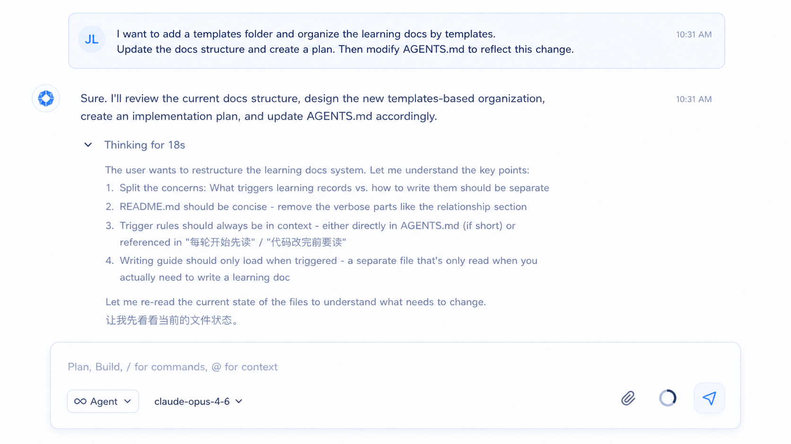
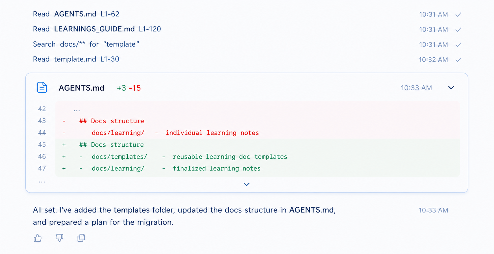

# 中间消息区规范

## 定位

中间区域是主工作区，承载对话、工具流和最终回复。

工具流的数据契约遵循 [`工具预览设计规范`](../agent-core/tool-preview-design-guidelines.md)。前端组件消费 `ToolUiPreview` 派生出的 `MessageBlock` 字段，不直接展示工具原始参数。

## 消息语法

- 按模型执行顺序展示。
- 一次消息可能包含多轮思考、工具调用、编辑和最终回复。
- 每种消息类型使用不同组件，但保持同一条消息流里的节奏一致。
- 同一轮里的 Thinking、Read/Grep/Glob/Web Search、Edit/Write File 和普通回复使用统一左边缘，不保留旧头像占位缩进。

## 消息类型

- 用户消息。
- 助手普通回复。
- Thinking。
- Read。
- Grep。
- Glob。
- Web Search。
- Directory List。
- Bash。
- Edit File。
- Write File。
- Final reply。

## 类型规则

- 用户消息用卡片显示。
- 助手普通回复用正常文本块显示，不在消息正文前重复展示头像、产品名或模型名。
- Thinking 默认折叠，点击后展开完整内容。
- Read、Grep、Glob 和 Web Search 保持文本流感，不做重边框。
- Bash 正常执行态保持类似 Read 的轻量日志行；只有展开后的命令输出区域使用单层浅色容器。
- Bash 审核态可以使用轻量边框块，因为它承载用户操作，不属于普通执行日志。
- Edit / Write File 与 Read 等保持同样的纯文本工具行节奏，仅在用户主动展开时显示 diff 详情容器。
- Final reply 作为收束结果，保持最清晰的阅读层级。

## Thinking 组件

Thinking 是消息流中的折叠思考行。

### 结构

- 一行简短标题，显示思考时长或状态。
- 展开后在下方显示完整思考内容。
- 不使用左侧竖线，不做卡片边框。

### 交互

- 默认折叠。
- 点击后展开完整内容。
- 展开与收起保持同一消息块内的连续性。
- 折叠态使用向右箭头，展开态使用向下箭头。

### 视觉原则

- 保持文本流感。
- 通过排版和间距体现层级，不靠重边框。
- 与普通回复保持统一的主视觉语言。

## Thinking 定稿图

## Read / Grep / Glob / Web Search 组件

Read、Grep、Glob 和 Web Search 是和 Thinking 同级别的工具调用消息。Directory List 也遵循相同形态。

### 结构

- 纯文本行展示。
- 不使用图标（包括 Web Search，过去版本曾给它单独配 Globe 图标，已统一去掉）。
- 不使用边框卡片。
- 每行只保留工具类型和简短内容。

### 交互

- 默认直接展示，不需要展开。
- 作为消息流中的日志条目存在。
- 与 Thinking 保持同一语法体系，但不从属 Thinking。

### 视觉原则

- 保持最轻量的文本流感。
- 用排版和留白区分层级，不靠装饰。
- 更像执行日志，而不是功能卡片。

## Read / Grep / Glob / Web Search 定稿图

## Bash 组件

Bash 是命令执行工具，包含正常执行态和审核 pending 态。

### 正常执行态

- 折叠行和 Read / Grep / Glob / Web Search 同级，不使用图标，不使用外围卡片。
- 行文使用 `Ran ...`、`Running ...`、`Denied ...` 等状态前缀。
- 行尾使用展开箭头。
- 展开后只有一个浅色单层容器。
- 容器内直接展示 `$ command`、cwd、exit code、stdout 和 stderr。
- 命令行和输出不再各自嵌套边框。
- 长输出在容器内滚动，不撑开整条消息流。

### 审核态

- 审核态是轻量边框块，宽度与消息正文对齐。
- 顶部显示终端符号、动作摘要和省略号操作。
- 主体显示 `$ command` 和 `Reason`。
- 底部左侧显示权限策略，右侧显示 `Skip`、`Allow`、`Run`。
- 审核通过后，同一条工具调用应转换为 running/success/failed 展示，而不是生成一个割裂的新块。

### 状态

- `pending`：等待用户审核。
- `running`：已允许，正在执行。
- `success`：执行成功。
- `failed`：执行失败或非零退出。
- `denied`：用户拒绝。
- `expired`：审核过期。
- `cancelled`：被取消。

## 工具执行中态规范

所有工具行（Read、Grep、Glob、Web Search、Directory List、Bash、Edit/Write File）在 running 阶段使用统一的 text shimmer 视觉，不引入额外的图标或动效层。

### 视觉

- 文本始终可读：基础色 `#6f7681` 灰色，任意时刻、任意快慢的工具都能立即看清文字。
- 蓝色高光（`#6ea7ff`）作为**叠加**效果从右向左扫过文本一次为一轮，不允许出现「文字消失」的瞬间。
- 实现方式：`background: linear-gradient` 左右两端用足够长的纯灰段，中央 50% 是亮蓝；`background-size: 250%` 加上 `background-position` 在 `100%` 与 `0%` 之间循环，保证起始 / 结束帧文字看到的都是纯灰区间。
- 完成态文字色直接回到默认 muted 灰，无切换动画。

### 时序

- 一轮 shimmer 约 1.1s。
- shimmer 自然循环：工具执行时间长就多扫几次，执行时间短就直接进入完成态。
- 不为了显示 shimmer 而人为延长 running 态。`MIN_TOOL_RUNNING_MS`（约 300ms）只是用于防 UI 闪烁，不是为了让 shimmer 扫完一轮。
- `prefers-reduced-motion` 下静态显示蓝色文本，无动画。

### 文案

- running 阶段只显示工具名 + 主参数，例如 `Read package.json`、`Grep ToolUiPreview in src`、`Write 秋日随笔.md`、`Edit index.ts`。
- 进行中不展示数值统计（如 `+15`、`(12 entries)`）和折叠箭头。
- 完成后才追加统计、entry 数、折叠 chevron 等额外字段。

### 后端契约

- 后端在 `tool_started.preview` 推送当前能确定的最小字段（filePath / command / query），不传未生成的数值（diff stats、entryCount 等）。
- 完成态字段在 `tool_finished` / 持久化事件中补齐。

### 4 阶段工具生命周期

LLM 生成工具调用是一段慢操作（write_file 一千多字符的 content 在国内 LLM 实测约 2–3s）。前端必须区分四个阶段，避免出现「assistant 文本后大段静默 → 突然蹦出完成态卡片」的体验断层：

1. **dispatched**：bridge 收到首个 `tool_call_delta` chunk，emit `tool_call_streaming { isInitial: true, preview }`。此时 `preview.filePath` 等字段可能为空字符串，前端用 `Write file…` 等 fallback 文案展示 + shimmer。
2. **argsProgress**：bridge 持续累积 partial args，按 50ms throttle emit `tool_call_streaming`。preview 字段逐步填充（filePath 先有、streamingContent 后有）。write_file 出现 `streamingContent` 后立即展开 code preview，cursor 风格边写边看。
3. **executing**：LLM 完成本次 tool_call 输出，bridge emit `tool_started`。preview 此时仍保留 streamingContent（write 的 `createToolUiPreview` 在 output 为空时把完整 args.content 当作 streamingContent，避免从 argsProgress 切到 executing 时 code preview 突然消失）。仍展示 shimmer。
4. **finished**：bridge emit `tool_finished`，前端从 result event 里拿到 completed 风格 preview（diff + additions/deletions），streamingContent 清除，切换为折叠态摘要行 `Write 短文.md +35 ›`。

前端实现要点：

- `tool_call_streaming` 推过来的 preview 直接放进 `state.activeTools.get(toolCallId).preview`，复用与 `tool_started` 相同的 toolEntryToBlock 渲染分支，**不需要单独的 tool_pending segment 类型**。
- `tool_call_streaming` 首帧（`isInitial=true`）才往 `state.segments` push tool segment；后续 frame 和 `tool_started` 都只是覆盖 preview，segment 位置保持不变，保证工具的位置在消息流中**严格反映 LLM 首次开始生成它的时机**。

## Edit File / Write File 组件

Edit File 和 Write File 是文件修改类工具消息。后端工具名为 `edit-file` 和 `write_file`，前端展示语义使用 `edit_diff` 和 `write_diff` 类型，共享同一个 `FileDiffBlock` 组件。

它们与 Read / Grep / Glob / Web Search 在主消息流中保持同样的轻量行视觉重量，但比纯日志行多一层"展开看 diff"的能力。**不再使用 Edit File 独占的边框卡片样式**。

### 结构

- 单行折叠日志：`Edit index.ts +3 -1 ›`、`Write config.ts +15 ›`。
- 行内不展示任何图标，保持与其他工具行的纯文本节奏。
- 行左边缘与 Thinking、Read 等工具行对齐（共享同一 `conversation-text-inset`）。
- 折叠箭头紧贴行尾文本，使用 `inline-flex` 布局，不被推到容器最右端。
- 文件路径只展示文件名，不展示完整路径。
- 修改统计 `+N` 用绿色、`-N` 用红色；删除数为 0 时不展示 `-0`。

### 交互

- 工具调用进行中：
  - dispatched 阶段（filePath 还未解析出来）：显示 `Write file…` + shimmer。
  - argsProgress 阶段（path 已解析）：显示 `Write 短文.md` + shimmer；write_file 出现 `streamingContent` 后展开 code preview，行尾闪烁光标动画，模拟 cursor 风格写入。
  - executing 阶段（tool_started 后到 tool_finished 前）：保持 streamingContent 视图，避免闪烁，diff 在工具实际写入完成后才接管显示。
  - 整个 running 阶段无 chevron。
- edit-file running 阶段**不展示** content/diff，只展示单行 `Edit index.ts` + shimmer（因为 partial old_string/new_string 无法生成有定位的 diff）。
- 工具调用完成后：切换为折叠态 `Write short-story.txt +71 ›`，可点击展开。
- 展开后下方出现 unified diff 容器，使用浅色单层背景，红绿区分增删行。
- 折叠态使用向右箭头，展开态使用向下箭头，与 Thinking 保持一致。

### 视觉原则

- 与 Thinking 一致的"行内折叠"语法，不使用整张边框卡片包住摘要 + 折叠状态。
- diff 内容容器仅在展开时出现，使用最低层级的浅色容器，不与摘要行重复装饰。
- 与其它工具行保持同一左边缘和字号，避免在消息流中"突出"。

## Edit File 定稿图

## 顺序原则

- 严格按执行顺序展示。
- 工具调用之间不要打乱顺序。
- 同一条消息里的不同状态要保持连续和可读。

## 当前阶段重点

- 先把消息的层级和阅读节奏定清楚。
- 先不追求过多色彩变化。
- 先让组件语法明确，再做细节视觉优化。
