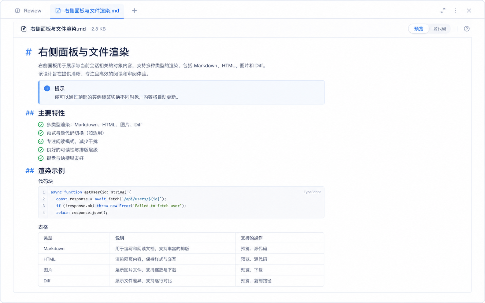

# 右侧面板与文件渲染规范

## 定位

右侧面板是当前会话的对象浏览工作区，用于查看文件、预览结果和会话级修改结果。

它属于聊天态工作台的可调对象区；右侧开关、宽度边界和中间聊天区保护规则见 `工作台布局与面板交互规范.md`。

## 渲染专题规范

具体渲染线各自有专题规范，本文件只保留面板外壳与总规则：

- `HTML渲染与沙箱安全规范.md`：HTML 渲染的威胁模型、sandbox iframe + CSP 双闸、V1 / V2 边界。
- `Markdown渲染规范.md`：Markdown 渲染栈、主题感知高亮、Preview/源码切换、V1 / V2 边界。
- `Context完整视图规范.md`：Context 完整只读视图的数据契约、配色联动、折叠/导出、V1 / V2 边界。

## 交互模型

- 顶部使用短高度横向 Tab。
- 每个 Tab 对应一个对象实例，不对应固定页面。
- 点击消息中的文件、链接、图片或 diff 时，在右侧打开对应 Tab。
- 支持多个 Tab 并列打开与切换。
- 首版重点只保留文件预览和会话级 diff 两条主线。
- 面板打开后允许调整宽度，关闭后把宽度归还给中间聊天区。
- 首版关闭右侧面板时不保留右侧 rail。
- 右侧 Tab 行位于隐藏标题栏 chrome 的同一高度区间，必须保证 tab 按钮能高于 `.chrome-center` 拖拽区接收点击；同时继续给右上角 PanelRight 按钮预留 padding，避免 tab 命中区压住关闭右侧面板入口。

## Tab 类型

- `Markdown`：Markdown 文件渲染。
- `HTML`：HTML 预览。
- `Image`：图片渲染。
- `PDF`：PDF 预览。
- `CSV`：表格预览。
- `Text`：纯文本或代码文件查看。
- `Diff`：会话级 review diff。
- `Kairos`：聊天态右侧紧凑状态视图；具体布局和数据边界见 `Kairos右侧紧凑视图规范.md`。

## 文件渲染规则

不同文件类型使用不同渲染组件。

- `md`：默认渲染为可读文档，可切源码。
- `html`：渲染为可交互预览。
- `csv`：渲染为表格视图。
- `pdf`：渲染为分页阅读视图。
- `图片`：直接预览。
- `diff`：展示当前会话累计改动，不放在单条消息里替代消息流中的局部 diff。

## 首版边界

- 先支持 `md`、`html`、`图片` 三种文件预览优先级。
- 会话级 diff 作为第二主线。
- 其他类型后续再补，不抢首版设计重点。

## 定稿图

- [右侧 Markdown 定稿图](image/right-panel-markdown-final.png)
- [右侧 HTML 定稿图](image/right-panel-html-final.png)
- [右侧 Image 定稿图](image/right-panel-image-final.png)
- [右侧 Diff 定稿图](image/right-panel-diff-final.png)

## 定稿图

## Diff 展示边界

- 聊天区保留单次工具调用或编辑动作的局部 diff。
- 右侧 `Diff` Tab 负责会话级 review diff。
- 会话级 diff 按文件浏览，适合审核本轮修改结果。
