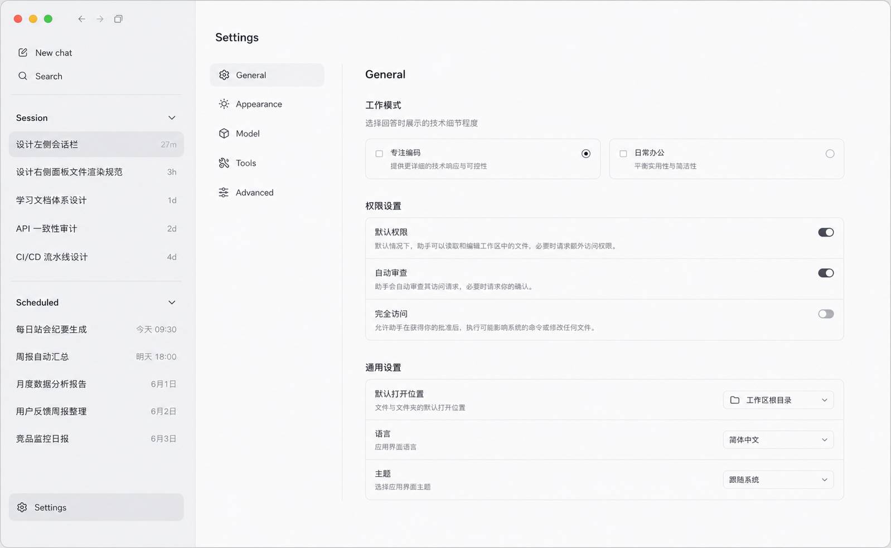

# 设置页规范

## 定位

设置页是独立于聊天态的页面级视图，用于承载应用配置，不作为聊天页右侧附属面板存在。

对应执行计划：[`docs/exec-plans/active/20260529-settings-page.md`](../../exec-plans/active/20260529-settings-page.md)。

## 切换规则（整页接管）

- 用户在聊天态点击左侧底部 `Settings` 后进入设置态。
- 进入设置态后，**原左侧会话栏整体替换为设置导航**（不是在聊天侧栏之外再叠一栏）。
- 右侧主区域同步替换为设置内容区，聊天态右侧文件/diff 面板在设置态强制关闭。
- 设置态与聊天态共享同一应用外壳，复用现有 `view` 切换机制（与 `usage` / `kairos` 同款）。
- 左上角提供「返回应用」回到聊天态。

> 实现落点：`WorkbenchLayout` 在 `view === "settings"` 时，左槽渲染 `SettingsNav`（替换 `Sidebar`）、主槽渲染 `SettingsPage`；`Sidebar` 底部已存在的 `Settings` 按钮接 `onSelectView("settings")`，并挂 `⌘,`。设置态左栏固定窄宽、禁用 hide/resize 的 snap。

## 布局

设置页采用两栏结构：

- 左侧：设置导航列表（窄而稳定）。
- 右侧：当前设置项详情内容。

### 左侧设置导航

- 保持窄而稳定的宽度，纯列表导航，不做聊天会话展示。
- 首版分区（定稿）：
  - `通用 General`
  - `模型 Model`
  - `智能体 Agent`
  - `工具 Tools`
  - `外观 Appearance`
- 当前选中项使用轻量高亮背景，延续聊天态侧栏的克制视觉，不变成后台控制台。

### 右侧设置内容区

- 以表单和配置分组为主：清晰的标题、分组标题、说明文本、开关、下拉和输入控件。
- 版式节奏与聊天页保持一致，不追求复杂卡片感，优先静态可读与操作稳定。

## 各分区内容（首版定稿）

> 字段到后端的精确绑定、IPC 契约与生效机制以执行计划 `20260529-settings-page.md` 为准，本节只描述信息架构。

- 通用 General
  - 权限设置 ·「默认权限」：占位开关（暂不接逻辑）。
  - 权限设置 ·「自动审查」：开 = 每条 bash 命令执行前都要确认（绕过 allowlist，硬拒绝仍生效）。
  - 通用 ·「语言」：固定「简体中文」。
  - （已删除「工作模式」「完全访问」两条。）
- 模型 Model（按供应商而非按模型，参考 OpenCode）
  - DeepSeek / Kimi 供应商卡，徽标显示是否已连接。
  - 未连接「连接」→ API Key 输入弹窗；已连接「断开连接」。
  - 「测试连接」按钮校验 Key 是否有效。
  - 「默认模型」下拉，决定 Composer 初始选中模型。
- 智能体 Agent
  - 主 Agent：自定义系统提示词（当前完整系统提示词，保存后下轮主 Agent 对话生效）。
  - Kairos 自主智能体：模型下拉（**写 `preferences.json` 的 `modelId`**，非 settings.json）、思考链（自动/开/关，仍走 settings → `KAIROS_THINKING`）、**额度限制（开关 + 剩余额度 ¥，写入 `memory/budget-state.json`，不进 settings/preferences）**。
    - 额度控件读写走 `window.kairos`（`getState().budget` 回填 + `onState` 订阅运行时余额递减 + `control({type:"set_budget"})` 提交），与下方 config 文件读写独立。开关切换即时提交；剩余额度 commit-on-blur（本地 draft + focus 标志，避免运行时递减打断编辑）；关闭额度时余额输入禁用；耗尽时显示「额度不足」。语义见 `agent-core/kairos-autonomous-mode.md` 的「额度护栏（单一余额）」。桥不可用（mock）时禁用并提示仅桌面端可配置。
  - Kairos 配置（结构化表单，**不暴露 raw JSON**）：3 份 JSON 用表单/开关/下拉/多选/列表呈现，`rule.md` 保留文本框。所有控件**即时生效**（开关/下拉/多选改即写，文本/数字 commit-on-blur，列表增删即写）；写回时**保留表单未暴露的字段**（含给 LLM 的 `tip`）。保存走 `window.kairos.writeConfig`（schema 校验 + 原子写 + reloadConfig）。
    - 运行偏好 `preferences.json`（精简）：工作时段 / 安静时段（各含起止 + 睡眠倾向，倾向选项用「更活跃 / 正常 / 更安静」表述，**不出现「夹紧」字样**）+ 睡眠区间（最短/最长/默认，秒）；`rhythm.timezone` / `rhythm.weekend` / `tickBudget` / `circuitBreaker` / `memory` / `tip` 不暴露、写回原样保留。模型下拉与本表单同源。解析失败时禁用并提供「用默认值覆盖」恢复。
    - 可访问路径 `paths.json`：**「展示 → 点击编辑」列表**（Cursor rule 风格）——路径与说明默认是只读文本、点一下变输入框失焦/回车提交；说明为空时只显示极轻的「+ 添加说明」幽灵按钮，不常驻空输入框；新增行自动进入编辑态；删除按钮 hover 行才浮现。**默认 workspace 行**（路径后缀 `kairos/workspace`）标「默认」徽章、路径只读且禁止删除（防误删工作根目录，说明 / 巡检仍可改）。
    - 屏蔽规则 `blocklist.json`（精简）：屏蔽路径 glob 列表 + **禁用工具多选下拉**（复用「工具」分区清单，选中=对 Kairos 禁用）。`timeWindows`（免打扰时段）/ `maxToolCallsPerTick`（单次唤醒上限）不暴露、写回原样保留。
    - 用户规则 `rule.md`：markdown 文本框，失焦自动保存。
  - 不含 Kairos 开启/暂停按钮、也不放 `enabled` 开关（启停留在 Kairos 页）；但**直接改 `preferences.json` 的 `enabled` 保存后仍会真的起/停 Kairos**（main 端按 enabled 调和运行态）。
- 工具 Tools
  - 列出全部基础工具开关；当前 provider 下不可用的工具显示禁用态与原因。
- 外观 Appearance（字体 + 缩放 + 三态主题均已落地）
  - **字体**（参考 Cursor，只分两类）：
    - `UI 字体`：驱动 `--act-font-ui`，连带 AI 输出正文（`.markdown-body` 用的 `--act-font-display` 始终 = `--act-font-ui`）。
    - `代码字体`：驱动 `--act-font-mono`，作用于代码块、diff、bash 输出、行内 code。
    - 选择方式为「预设字体栈下拉」（每项是带 fallback 的整套 font stack），不打包字体、不做自由输入。
  - **字号**（仿 Cursor，px 数字步进 + 重置按钮）：
    - `界面字号`：以 px 基准字号呈现（默认 14px，范围 12–20）。我们 UI 用写死像素而非 rem，无法逐元素改字号，故底层按 `uiFontSize / 14` 的比例做整窗缩放（`webFrame.setZoomFactor`），对外呈现为 px 数字而非百分比。
    - `代码字号`：CSS 变量 `--act-font-mono-size`，单独调代码/diff/bash 字号（默认 13px）。Electron 下整窗缩放会再乘一次，故写入前按缩放比反向补偿（`codeFontSize / zoom`），保证渲染恰为设定的 px。
  - **主题**：浅色 / 深色 / 跟随系统三态分段控件（`ThemeSegmented`）。由 `<html data-theme>` 驱动：`light`/`dark` 走 `:root[data-theme=...]` 覆盖；`system` 用 `:root[data-theme="system"]` 下的 `@media(prefers-color-scheme: dark)` 随 OS 切换。组件统一用语义类（`bg-surface`/`text-text-main`/`border-line`），主题只覆盖一组 `--act-color-*` 即整体翻转；数据可视化色走 `--act-chart-series-*`（浅深各一组）。原生交通灯 / 滚动条经 `appearance:set-theme` IPC → `nativeTheme.themeSource` 同步。
  - 外观偏好（字体、缩放、代码字号、主题）走 renderer `localStorage`，不进 `settings.json`；开机在 `main.tsx` 渲染前重放，避免闪烁。

## 配置存储与安全

- 非敏感配置落 `<userData>/settings.json`（原子写）。
- **供应商 API Key 用 Electron `safeStorage` 加密**单独落盘；UI 与 IPC 永不回传明文，仅返回「是否已配置」。
- 配置生效：main 把 env-backed 设置覆盖到 `process.env` 后 `loadEnv()` 刷新冻结的 `env`，**下一轮对话自动生效，无需重启**；主 Agent 系统提示词直接从 `settings.json` 注入下一轮 Agent runtime；Kairos 思考链变更时在空闲态重建 Kairos LLM。Kairos 模型不再走 settings/env：其唯一来源是 `preferences.json` 的 `modelId`，由 `kairos:write-config` 保存后按 modelId 变化触发空闲态重建。
- UI 偏好（主题、UI/代码字体、界面缩放、代码字号）走 renderer `localStorage`，不进 `settings.json`；开机渲染前重放。

## 视觉原则

- 保持极简、冷静、桌面应用感。
- 不使用弹窗式设置菜单（供应商 Key 输入这类轻量弹窗除外）。
- 不引入登录卡片、账号浮层或复杂账户中心。
- 让用户感受到这是同一产品的另一种主页面，而不是另一个系统。

## 当前参考图

下图为「整页接管（两栏）」定稿基线：左侧设置导航（通用 / 模型 / 智能体 / 工具 / 外观）+ 右侧内容区。

