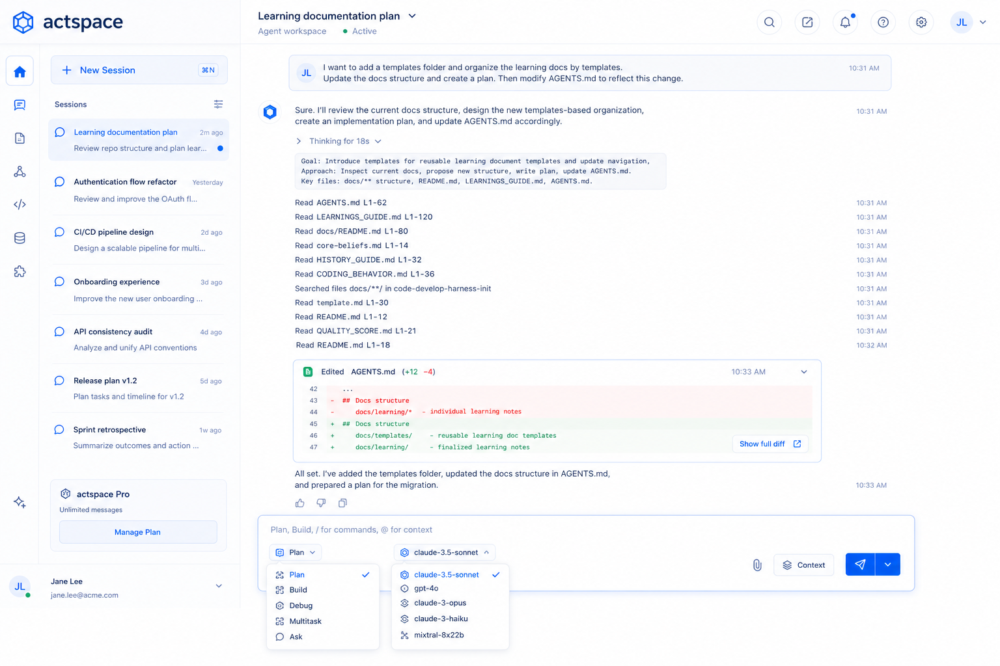

# 前端设计文档

本目录汇总 `actspace` 桌面端 renderer 的视觉语言、主题、工程样式、基础组件、工作台区域、页面规范和设计原型。目录中的 Markdown、HTML 和 PNG 均直接平铺，不再创建资产子目录。

当前产品级设计系统名称为 **ActSpace Editor Design System**，内部视觉方向为 **Ink & Emerald / 墨色与翡翠绿**。总纲见仓库根目录 `DESIGN.md`。

## 当前阶段

- `Ink & Emerald` renderer token 与组件迁移已完成，旧 `brand` / `warm` 消费者已清零。
- 工程验证与防回流检查已落地；真实 Electron / Retina 与完整页面状态保留人工验收。
- [打开 Sidebar / Composer / Settings 四态主题样板](ink-emerald-color-preview.html)。

## 总目标

- 让 ActSpace 呈现为真实的桌面编辑与 Agent 工作工具，而不是普通网页聊天页。
- 中间消息与工作区始终是视觉和交互主轴，左右面板服务于上下文、导航和对象浏览。
- 复杂能力必须可见、可控、可收起，并保持执行顺序和状态可追踪。
- 先稳定全局视觉语言、主题 token 和布局底座，再逐个打磨业务组件。
- 颜色、字体、间距、圆角和动效不在入口文档重复定义，分别以视觉语言与主题规范为事实来源。
- 中性灰阶承担主要信息层级，主操作使用主题反色的墨色 action，翡翠绿只承担运行、连接、开启和成功等 operational 语义。

## 页面与布局原则

- 聊天态使用左侧会话栏、中间主工作区和可展开右侧对象面板。
- 初始状态可以折叠右侧面板，但必须保留明确入口。
- 左右面板争抢空间时优先保护中间区域的可读、可输入和可滚动性。
- 设置态是独立页面布局，不作为聊天态右侧面板叠加。
- Composer、消息流、Context 和文件预览分别由专题规范维护，避免入口文档重复描述组件细节。

## 必读顺序

1. `docs/design-docs/frontend/front-全局视觉语言规范.md`
2. `docs/design-docs/frontend/front-主题与配色规范.md`
3. `docs/design-docs/frontend/front-tailwind-style-architecture.md`
4. `docs/design-docs/frontend/front-基础组件封装规范.md`
5. 根据任务进入具体区域或页面规范

## 文档列表

- `docs/design-docs/frontend/front-全局视觉语言规范.md`：字体、颜色、间距、圆角、阴影和动效 token。
- `docs/design-docs/frontend/front-主题与配色规范.md`：浅色、深色、跟随系统三态主题和颜色硬约束。
- `docs/design-docs/frontend/front-tailwind-style-architecture.md`：Tailwind v4 样式架构和迁移策略。
- `docs/design-docs/frontend/front-基础组件封装规范.md`：基础 UI wrapper 分层和组件抽象边界。
- `docs/design-docs/frontend/front-icon-button-tooltip-guidelines.md`：图标按钮 Tooltip 和可访问性规范。
- `docs/design-docs/frontend/front-工作台布局与面板交互规范.md`：SplitView、resize、collapse 和 restore。
- `docs/design-docs/frontend/front-左侧会话栏规范.md`：会话、Pinned、Scheduled 和 Workspaces 分区。
- `docs/design-docs/frontend/front-中间消息区规范.md`：消息语法、工具流和执行状态。
- `docs/design-docs/frontend/front-聊天输入框规范.md`：Composer、模型、附件、Context 和发送。
- `docs/design-docs/frontend/front-workspace-git-worktree-context.md`：初始 Composer 的 Workspace、Git branch、This Mac 与 New Worktree 执行上下文。
- `docs/design-docs/frontend/front-右侧面板与文件渲染规范.md`：对象启动页、文件预览、Workspace 文件树和 diff。
- `docs/design-docs/frontend/front-设置页规范.md`：设置态布局和导航分组。
- `docs/design-docs/frontend/front-usage-statistics.md`：Usage Statistics 页面和数据展示规范。

Kairos 监控页与 Kairos Runtime 强关联，统一维护在相邻的 `../kairos/` 专题目录。

## 当前基线图

> 以下 PNG / HTML 记录迁移前的历史实现状态，其中部分仍使用蓝色主强调。结构和交互可以参考；颜色、层级和状态职责以 `DESIGN.md`、全局视觉语言和主题规范为准。

## HTML 原型

- `actspace-deepseek-workbench.html`：工作台高保真原型。
- `agent-subagent-flow-prototype.html`：Agent 工具与 Subagent 执行流原型。
- `usage-statistics-prototype.html`：Usage Statistics 高保真原型。
- `compact-command-states.html`：`/compact` 消息流三态及浅深主题原型。
- `review-v1-git-review-prototype.html`：Review V1 Git-first 右侧面板原型。

## 资产约定

- 图片和原型直接放在本目录，不创建 `assets/` 或 `public/` 子目录。
- 每个资产尽量只表达一个明确状态，并使用可识别的功能名。
- 新增资产时同步更新本入口或对应组件规范，写清它验证的状态。
