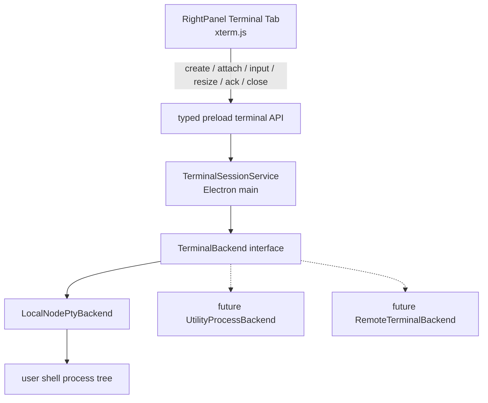

# 右侧终端与会话生命周期规范

## 定位

Terminal 是聊天态工作台右侧对象面板中的用户交互式 shell。它绑定当前 Agent 会话的真实 workspace / Git worktree，让用户在不离开 ActSpace 的情况下运行本机命令、查看服务日志和操作交互式 CLI。

Terminal 是**用户直接操作的本机能力**，不是 Agent 工具，不与 `bash` / `bash_output` / `bash_kill` 共用运行时、审批流、沙盒或任务注册表。Agent 后台命令未来如果需要终端化展示，只能提供独立的只读输出视图，不能默认接管用户 Terminal。

本文是右侧 Terminal 的长期事实来源，覆盖产品语义、PTY 架构、IPC 契约、会话归属、输出背压、进程收割、环境注入、原生模块打包和分阶段边界。右侧面板通用 Tab 与文件渲染规则仍见 `front-右侧面板与文件渲染规范.md`；面板宽度和紧凑覆盖规则见 `front-工作台布局与面板交互规范.md`；Agent Bash 边界见 `docs/design-docs/execution-safety/agent-bash工具设计文档.md`。

## 设计依据

2026-07-30 对本机 Codex Desktop、Cursor 和 Codex 开源仓库的实现调研得出以下结论：

- Codex Desktop 采用 Electron main 内的 Terminal Session Manager + `node-pty` + renderer xterm.js，支持会话归属、attach、resize、有界回放和进程树清理。
- Codex 将用户交互式 Terminal 与 Agent 命令输出分开；后者使用独立的只读终端视图。
- Cursor 基于 VS Code 的独立 PTY Host、MessagePort、持久化恢复和 shell integration 更完整，但复杂度明显高于 ActSpace 首版需求。
- Cursor 的显式输出确认与高低水位背压值得首版吸收，可避免大量输出压垮 renderer。
- Codex 开源仓库中的 Rust PTY 属于 Agent / tool execution runtime，其进程组中断与 kill 语义可作为清理参考，但不应直接变成用户 Terminal 后端。

ActSpace 因此采用**Codex 的轻量会话模型 + Cursor 的背压和进程治理**，不在首版复制完整 VS Code PTY Host。

## 产品目标

- Terminal 默认从当前会话实际 workspace / worktree 启动。
- 收起右侧面板、切换右侧 Tab 或切换会话时，shell 继续运行。
- renderer 重载后可以重新 attach 并回放有界输出，但不将终端历史持久化到磁盘。
- 明确关闭 Terminal Tab 时终止对应 shell 及子孙进程；App 退出时不留孤儿进程。
- `vim`、`top`、REPL、密码提示、Ctrl+C、ANSI 颜色、窗口 resize 等真实 PTY 场景可用。
- 终端输入和输出默认不记入 session JSONL、应用日志、Agent 上下文或使用统计。

## 非目标

首版不做：

- 独立 PTY Host / Electron `utilityProcess`。
- 跨 App 重启的终端进程持久化。
- xterm headless buffer 序列化。
- shell integration 脚本注入、命令历史结构化和 exit code 提取。
- 远程 Terminal、SSH 终端或 Cloud Runner 终端。
- 图片协议、WebGL renderer、ligature 和复杂 Unicode addon。
- Agent 在用户 Terminal 中自动输入或自动执行命令。
- 用户 shell 输出的自动录屏、落盘或模型分析。

## 当前实现状态（2026-07-31）

V1 已落地：`node-pty@1.1.0`、main-owned TerminalSessionService、typed preload、xterm + FitAddon、每会话 / 每窗口数量上限、16ms 批处理、32 KiB IPC 分片、256 / 64 KiB ACK 高低水位、128 KiB 有界回放、会话切换 / renderer remount 重新 attach、退出后重启、Tab / archive / window / app 进程收割，以及 production deploy 的架构、权限和 nested signing 检查。

当前有两个明确边界：

- 多终端继续使用右上角已有的 `+` 菜单创建，不在终端内容区重复放第二套创建控件。
- WebLinksAddon 不进入 V1 依赖；待 main 提供窄化的外部 URL 打开 IPC 后再评估，renderer 不直接导航外部链接。

首次打开与关闭体验已完成可靠性收口：用户触发后立即创建 `Starting…` Tab，同时并行创建 PTY 和预加载 xterm chunk；两者都就绪后原位替换为真实 Terminal。创建失败保留明确错误 Tab。若用户在创建完成前关闭 starting Tab，随后成功创建的 PTY 必须立即由 main 回收，不能成为无 UI 的隐藏会话。关闭运行中 Terminal 时 Tab 显示 `Closing…` 并禁用重复关闭，main 清理进程树成功后才移除 Tab。

## 交互模型

### 入口

Terminal 作为右侧对象类型，同时出现在：

- 右侧对象启动页。
- `+ 新建对象` 菜单。

对象启动页从五个入口调整为六个，默认按 `2 × 3` 排列：

```text
Files       Terminal
Review      Context
Kairos      Reply
```

Terminal Tab 使用 `Terminal` 作为基础标题；存在多个终端时可显示 `Terminal 2`、`Terminal 3`。首版底层支持每会话多终端，UI 在终端视图顶部提供轻量 `+` 创建入口，不引入独立 IDE 终端面板树。

### 宽度与紧凑布局

- Terminal 沿用右侧面板 `390px` 默认、`320px` 最小和 `min(640px, 50vw)` 最大宽度。
- xterm 容器占满右侧 Tab 的剩余宽高，不叠加文档预览的 `18px` 内容 padding。
- 面板宽高变化由 `ResizeObserver` 触发 xterm `fit()`，实际 `cols / rows` 变化后再通知 main resize PTY。
- `<= 820px` 时 Terminal 跟随右侧覆盖层；480px 窗口下占满可用主区，不生成第二套移动终端交互。
- Terminal 消费主题语义 token，浅色、深色和 system 主题下均可读；禁止引入不随主题翻转的颜色字面量。

### 关闭和离开

- 关闭右侧面板：只收起 UI，Terminal Session 保持运行。
- 切换 Tab 或会话：renderer detach，Terminal Session 保持运行。
- 点击 Terminal Tab 的关闭按钮：先请求 main 关闭该 Terminal Session，再移除 Tab。
- Terminal 创建中：允许用户关闭 `Starting…` Tab；renderer 记录取消意图，创建请求完成后如果已经取消则立刻关闭新 PTY，不重新弹回 Tab。
- Terminal 关闭中：Tab 标题切换为 `Closing…` 并展示活动指示，禁止重复 close；清理失败时恢复可关闭状态并展示错误。
- shell 自然退出：Tab 保留退出状态和 exit code，提供 `Restart` 和关闭操作，不自动重启。
- App 退出：main 在统一退出流程内同步发送终止信号，并在宽限后强制清理进程树。

## 运行架构



### 分层职责

`packages/shared`：

- 定义 Terminal IPC 输入、结果、事件和错误码。
- 不包含 `node-pty`、Electron 对象、xterm 对象或进程句柄。

Electron main：

- 根据 `sessionId` 解析会话已登记的 workspace / worktree。
- 选择默认 shell，构建脱敏环境，创建 PTY。
- 持有 Terminal Session、PTY 句柄、回放缓冲、背压计数和终止逻辑。
- 校验 BrowserWindow / `webContents` 所有权，拒绝跨窗口读写。

Preload：

- 只暴露窄化的 create / attach / write / resize / ack / close / subscribe API。
- 不暴露任意 `spawn(executable, args)` 接口。
- 不暴露 ChildProcess、PTY fd、绝对 shell 路径或完整环境变量。

Renderer：

- 创建和销毁 xterm 显示实例。
- 转发用户输入、终端尺寸和 xterm 写入完成 ACK。
- 不把终端输出放进 React 全局 state，不将输出持久化。

## Terminal Backend 抽象

首版只实现 `LocalNodePtyBackend`，但 Session Service 不直接依赖 `node-pty` 具体对象。

```ts
interface TerminalBackend {
  readonly pid: number | null;
  write(data: string): void;
  resize(cols: number, rows: number): void;
  pause(): void;
  resume(): void;
  terminate(): Promise<void>;
  onData(listener: (data: string) => void): Disposable;
  onExit(listener: (event: TerminalExit) => void): Disposable;
  dispose(): Promise<void>;
}
```

只有出现下列信号时，才把 backend 迁移到 Electron `utilityProcess`：

- 多终端压力使 main event loop 出现可量化卡顿。
- PTY / native addon 异常影响 main 稳定性。
- 需要独立重启 PTY Host，且不关闭 BrowserWindow。
- 需要 Remote Backend 或跨窗口持久会话。

## Session 模型

```ts
type TerminalSession = {
  id: string;
  sessionId: string;
  workspaceRoot: string;
  ownerWebContentsId: number;
  backend: TerminalBackend;
  shellName: string;
  title: string;
  cols: number;
  rows: number;
  status: "running" | "exited" | "closing" | "closed";
  exitCode?: number | null;
  replayBuffer: string;
  replayTruncated: boolean;
  unackedBytes: number;
  attached: boolean;
  createdAt: number;
};
```

main 维护：

```ts
Map<terminalId, TerminalSession>
Map<sessionId, { activeTerminalId: string | null; terminalIds: string[] }>
```

边界：

- 每会话最多 4 个运行中 Terminal。
- 单窗口最多 12 个运行中 Terminal。
- 超过上限返回明确 `terminal_limit_reached`，不自动关闭旧终端。
- Terminal 不进入 session JSONL；会话恢复时只恢复当前 App 进程内仍存活的 Session。
- 会话归档时，如果存在运行中 Terminal，归档流程必须先显式关闭它们；不保留绑定已归档会话的后台 shell。

## IPC 契约

Renderer 不传 shell 可执行文件、argv、cwd 或 env。它只声明会话与终端视口：main 从 SessionStore 和 Workspace Registry 解析真实运行上下文。

```ts
type TerminalCreateInput = {
  sessionId: string;
  cols: number;
  rows: number;
};

type TerminalAttachInput = {
  terminalId: string;
  cols: number;
  rows: number;
};

type TerminalWriteInput = {
  terminalId: string;
  data: string;
};

type TerminalResizeInput = {
  terminalId: string;
  cols: number;
  rows: number;
};

type TerminalAckInput = {
  terminalId: string;
  bytes: number;
};

type TerminalCloseInput = {
  terminalId: string;
};
```

主要事件：

```ts
type TerminalEvent =
  | { type: "attached"; terminal: TerminalSessionSnapshot }
  | { type: "init_log"; terminalId: string; data: string; truncated: boolean }
  | { type: "data"; terminalId: string; data: string; bytes: number }
  | { type: "title"; terminalId: string; title: string }
  | { type: "exit"; terminalId: string; exitCode: number }
  | { type: "error"; terminalId?: string; error: TerminalOperationError };
```

错误码至少覆盖：

- `session_not_found`
- `workspace_not_found`
- `workspace_not_registered`
- `terminal_not_found`
- `terminal_owned_by_another_window`
- `terminal_limit_reached`
- `shell_not_found`
- `shell_environment_failed`
- `pty_spawn_failed`
- `invalid_terminal_size`
- `invalid_terminal_input`
- `terminal_closed`
- `native_module_unavailable`

## 输出管道与背压

Terminal 输出不能按字符级频率直接穿过 Electron IPC。

首版采用：

1. main 收到 PTY data 后先进入短周期批处理。
2. 每约 16ms 或达到单批上限时发送一个 `data` 事件。
3. renderer 调用 `terminal.write(data, callback)`。
4. callback 返回后再向 main 发送该批次字节数 ACK。
5. `unackedBytes` 超过高水位时 main 暂停 PTY 读取；降到低水位后恢复。

初始参数：

- 高水位：256 KiB。
- 低水位：64 KiB。
- 单 Terminal 内存回放缓冲：128 KiB。
- 单批 IPC payload 上限：32 KiB。

这些参数是首版默认值，必须在压力验证中记录峰值内存、main / renderer 响应和输出完整性，再决定是否调整。

## Shell 与环境

### Shell 选择

- macOS / Linux 优先使用当前用户的默认 shell。
- shell 不存在或不可执行时返回 `shell_not_found`，不静默切换到任意 shell。
- 首版不允许 renderer 指定任意 executable。未来如果增加 shell profile 设置，只能从 main 验证过的 profile catalog 中选择。

### CWD

- `cwd` 来自当前 `sessionId` 对应的已登记 workspace / worktree。
- 不使用 renderer 临时传入的任意绝对路径。
- 会话 workspace 在 Terminal 启动后变更时，旧 Terminal 仍绑定旧 cwd；UI 提示用户创建绑定新 workspace 的 Terminal，不向运行中 shell 偷偷输入 `cd`。

### 环境变量

Electron 从 Finder 启动时可能没有用户终端中的 `PATH`，因此需要 `ShellEnvironmentService`：

- 读取并缓存用户 login shell 环境。
- 每个 Terminal 基于缓存构建独立 env，不修改全局 `process.env`。
- 设置 `TERM=xterm-256color`和 `COLORTERM=truecolor`。
- 保留 shell 运行所需的基础变量，过滤 ActSpace 内部控制变量、provider 密钥、短期 access token 和不应进入用户 shell 的应用内部配置。
- 环境解析失败时显式报错，并记录不包含变量值的诊断信息。

## 安全边界

- 用户 Terminal 默认以当前用户权限运行，不套用 Agent Bash 沙盒或工具审批。这是用户主动操作的本机终端，UI 不应把它误标为“沙盒”。
- renderer 被攻陷时不应获得通用进程启动能力；main 只为已登记会话创建默认 shell。
- Terminal Session 读写必须校验 `ownerWebContentsId`。renderer reload 只 detach，BrowserWindow 真正销毁时关闭该窗口所有 Terminal；不允许其他窗口凭 `terminalId` 接管。
- 单次 renderer input 设置尺寸上限；异常大的 paste 应分批写入，避免 IPC payload 失控。
- 首版不启用 OSC 52 终端程序驱动的剪贴板读写 addon。用户主动复制、粘贴通过桌面应用的显式交互完成。
- 终端文本不进入应用诊断日志。日志只记录 terminalId 的脱敏片段、状态转换、字节数、退出码和错误类别。

## Renderer 实现边界

首版使用版本相互兼容的稳定版：

- `@xterm/xterm`
- `@xterm/addon-fit`

依赖版本不直接复制 Cursor 的 beta 组合，也不在未验证 Electron 39 兼容性前使用松散的 caret 范围。Phase 0 技术验证必须产出一组精确锁定的版本组合。

`TerminalRenderView` 负责：

- 按 mount / unmount 创建与销毁 xterm 显示实例。
- 先建立事件订阅，再 create / attach，避免丢失首屏 shell prompt。
- 先写 `init_log`，再接收实时 data。
- 设置主题、字体和 cursor，并在主题改变时只更新 xterm options，不重启 shell。
- 显式覆盖 xterm 的完整 ANSI 16 色板：neutral 承担黑白灰层级，green / blue / yellow / red 分别消费 operational / info / warning / danger，cyan / magenta 消费低饱和 chart 色。不得让未覆盖角色回落到 xterm 的高饱和默认色，也不得修改用户 `.zshrc` / `PS1` 来实现应用内视觉统一。
- 处理复制、分批粘贴和重启语义，但不把 shell 输出转为 React 节点；搜索和外部链接打开留给后续窄化能力。

Terminal renderer chunk 继续使用动态 import，不进入 App 初始渲染关键路径。对象入口 hover / focus 时可以预取；用户点击后模块加载与 main PTY 创建并行。右侧面板只展示一段统一 `Starting…` 状态，不再先等待 PTY、再显示第二段 Suspense loading。

## Main 进程清理

Terminal 与 Agent Bash 使用独立 registry，但共享“退出时不留孤儿进程”原则。

- Unix 优先向 shell 进程组发送温和终止信号，宽限后再强制 kill。
- 如 `node-pty` 不能稳定终止子孙进程，macOS 可在关闭路径中查询后代并按叶子到根的顺序清理。
- `before-quit` 必须先收割 Terminal Registry，再进入现有 Kairos / provider / plugin 收尾流程。
- 清理幂等：重复 close、exit 竞态、BrowserWindow 销毁和 App 退出同时发生时不重复发送错误或死锁。

## 原生模块打包与签名

`node-pty` 是原生 Node addon，不能只通过 TypeScript 和 Vite 构建证明可用。

Phase 0 必须验证：

- 与当前 Electron 39 ABI 兼容的 `node-pty` 精确版本。
- macOS arm64 的 `pty.node` 和 `spawn-helper` 可正确加载。
- 生产 deploy 后原生文件没有被 prune，`spawn-helper` 仍保留可执行权限。
- Developer ID 和 ad-hoc 两条路径都先签名嵌套的 `pty.node` / `spawn-helper`，再签名外层 App。
- 在最终打包的 `.app` / DMG 中实际启动 shell，不用 `pnpm dev` 结果代替制品验收。

正式实现必须为原生模块增加可重复的 Electron / arch rebuild 步骤，并在发布脚本中对嵌套原生文件做显式检查和签名。

## Phase 0 技术验证门槛

Phase 0 是正式实现的硬门槛，只验证 native PTY 和打包链路，不把实验性代码接入右侧面板。

通过条件：

1. Electron 39 开发态能启动默认 shell，收发数据并 resize。
2. Ctrl+C 可中断前台命令，关闭 PTY 可清理其后台子孙进程。
3. `vim` / REPL / dev server 等至少一类交互式场景行为正常。
4. 压力输出不导致 main 或 renderer 无响应，背压语义可被自动化证明。
5. 打包后 `.app` 能加载 native addon，签名验证通过，关闭 App 后没有孤儿 shell / dev server。
6. 记录精确依赖版本、rebuild 命令、制品路径、签名顺序和已知限制。

任一条未通过，Phase 1 及后续计划不得启动。应先在 execution plan 记录证据和下一个最小调整方案，由用户决定继续验证、更换技术路径或放弃集成。

## 验证矩阵

### 自动化

- shared 契约类型和错误分支单测。
- Terminal Session Service 的所有权、上限、attach / detach、有界回放、背压、exit 竞态和幂等 close 单测。
- ShellEnvironmentService 的 PATH 解析、敏感变量过滤和错误脱敏单测。
- preload API 名称与 TerminalEvent 订阅清理测试。
- renderer 的创建、attach、ACK、resize、exit、restart 和 Tab 关闭测试。
- 原生模块制品检查：文件存在、架构匹配、可执行权限、codesign 验证。

### Electron 真实验收

- 初始 cwd 与当前会话 workspace / worktree 一致。
- ANSI 颜色、中文、emoji、长行和滚动正常；常见 shell prompt 的 bright green / cyan / blue / red 在浅深主题下保持可区分但不呈现荧光高饱和效果。
- Ctrl+C、Ctrl+D、选择复制、粘贴和链接点击正常。
- `vim`、交互式 REPL、`top` 或等价全屏 CLI 可用。
- 面板 resize、窗口 resize、浅深主题切换不重启 shell。
- 右侧面板折叠、Tab 切换、会话切换和 renderer reload 后能 attach / 回放。
- 关闭 Terminal Tab 、归档会话和退出 App 后没有孤儿进程。
- `480 / 820 / 1120 / 1440px` 宽度下 Terminal 和中间 Composer 都可达。

### 发布制品验收

- 在真实 `.app` / DMG 运行上述关键场景。
- `file`、权限检查和 `codesign --verify` 能证明 native addon 与目标架构匹配。
- 应用从 Finder 启动时 PATH 与常用开发工具仍可用。
- 不将 `pnpm dev` 成功描述为打包制品或签名验收已通过。

## 分阶段路线

| Phase | 范围 | 准入条件 |
| --- | --- | --- |
| Phase 0 | native PTY、Electron ABI、进程树清理、打包与签名技术验证 | 当前设计文档和验证计划已批准 |
| Phase 1 | shared 契约、TerminalBackend、Session Service、ShellEnvironmentService | Phase 0 全部通过，用户再次批准实现 |
| Phase 2 | preload 和右侧 Terminal renderer | Phase 1 自动化验证通过 |
| Phase 3 | 完整背压、恢复、会话归档与 App 退出整合 | Phase 2 Electron 基础验收通过 |
| Phase 4 | 发布脚本、签名、DMG 验收、文档与 history 收尾 | Phase 3 全链路验收通过 |

Phase 0 通过只代表技术路径可行，不代表 Phase 1 自动获得实现授权。
