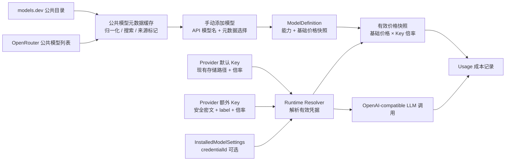

# DuckDing 多 Key、公共模型目录与倍率定价设计

## 文档状态

- 状态：首版实现完成，待使用用户自有 DuckDing Key 做真实连接与调用验收。
- 确认日期：2026-07-27。
- 适用范围：Desktop 的 LLM 服务商设置、模型管理、运行时凭据解析和 Usage 成本估算。
- 上位设计：`docs/design-docs/model-context/agent-multi-provider-llm.md`。
- 对应执行计划：`docs/exec-plans/active/20260724-multi-provider-llm/plan-7-duckding-multi-key.md`。

本文定义 DuckDing 接入、多 Key 渐进式扩展、供应商无关的公共模型元数据目录，以及按 Key 倍率估算模型费用的长期设计边界。首版代码已按本文实现；真实供应商连接与账单一致性仍需用户自有 Key 验收。

## 背景与问题

DuckDing 提供 OpenAI-compatible 接口：

```ts
const client = new OpenAI({
  baseURL: "https://www.duckcoding.ai/v1",
  apiKey,
});
```

它与现有服务商的主要差异不是协议，而是账户组织方式：同一服务商下可能存在多把 Key，不同 Key 对应不同价格分组和倍率。与此同时，用户手动添加模型时通常只知道 API 请求中的模型名称，不应被迫手工填写上下文长度、图片输入、工具调用、推理能力和基础价格。

因此需要同时解决四个问题：

1. 不破坏现有“一家服务商一把 Key”的配置和交互。
2. 多 Key 时，模型能够选择已经存在于服务商下的 Key，但不能在模型页直接录入秘密。
3. 模型元数据目录不依赖用户是否配置了 OpenRouter。
4. 模型基础价与 Key 倍率分离，既能估算费用，也不把公共目录价格误称为 DuckDing 官方账单价格。

## 目标

- 新增内部 ProviderId `duckding`，显示名称 `DuckDing`，默认 Base URL 为 `https://www.duckcoding.ai/v1`。
- 复用现有 `openai-completions` 协议服务，不复制一套 DuckDing 专用消息转换和流式实现。
- 保留现有 provider 默认 Key 的存储、连接和运行时路径；旧数据不迁移。
- 允许在供应商下额外添加多把 Key，并为默认 Key 和每把额外 Key 配置独立价格倍率。
- 只有存在额外 Key 时，模型添加和编辑界面才显示 Key 选择器。
- 模型页只能选择供应商下已经添加的 Key，不允许输入、粘贴或创建 Key。
- 用户只输入模型名称也可以添加；公共模型目录负责提供可选的能力与价格元数据。
- 公共模型目录独立于用户的供应商连接，以 models.dev 为主源、OpenRouter 公共模型列表为补充源。
- 每次调用使用“模型基础价格快照 × 所选 Key 倍率”计算估算费用。
- 额外 Key 缺失、解密失败或被明确测试为不可用时，绑定模型明确不可用，不静默切换到默认 Key。

## 非目标

- 不实现 Key 轮询、随机路由、负载均衡、配额感知路由或失败自动切换。
- 不允许模型页管理 Key 生命周期。
- 不把 Base URL、代理或请求参数拆成 Key 级配置；它们仍属于 provider。
- 不实现 DuckDing 余额查询、远端模型目录同步或专用 Management Key。
- 不把公共目录的能力声明视为真实兼容性验证结果。
- 不生成包含全部模型 ID 的大型 TypeScript 联合类型；运行时目录比编译期注册表更适合桌面产品。
- 不在第一版提供任意模型能力的手工覆盖；未匹配元数据的模型以 `unknown` 能力保存。

## 命名约定

- `duckding`：仓库内部稳定 ProviderId，按产品需求命名。
- `DuckDing`：用户界面显示名称。
- `duckcoding.ai`：服务端域名。ProviderId 与域名拼写不同是明确约定，不应在实现中自动改写。
- 默认 Key：现有 `secrets[provider]` 所表示的唯一默认凭据。
- 额外 Key：用户在供应商设置中新增的命名凭据。
- `credentialId`：模型对额外 Key 的非敏感引用；缺省表示使用默认 Key。
- 基础价格：来自公共模型元数据快照的单价。
- 价格倍率：用户为某把 Key 维护的乘数，例如 `0.2x`。
- 有效价格：基础价格乘价格倍率后的本次调用估算单价。

## 总体架构



关键分层：

- 公共模型目录解决“这个模型通常有什么能力、公开基础价格是多少”。
- Provider credential 解决“本次请求使用哪把 Key、按什么倍率估算”。
- `apiModel` 解决“实际发送给 DuckDing 的模型字符串是什么”。
- metadata reference 只关联元数据，不能替换或重写用户输入的 `apiModel`。

## Provider 与协议

目标 Provider Registry：

```ts
const duckdingProvider = {
  id: "duckding",
  label: "DuckDing",
  defaultBaseUrl: "https://www.duckcoding.ai/v1",
  supportedApis: ["openai-completions"],
  supportsRemoteModelCatalog: false,
  supportsProxy: true,
};
```

DuckDing 走现有 OpenAI-compatible service。Provider adapter 只承担显示名称、默认端点、连接测试和未来可能存在的薄请求修饰，不复制协议实现。

`supportsRemoteModelCatalog: false` 表示 actspace 不假设 DuckDing 提供稳定、完整的 `/models` 管理目录。公共元数据目录是独立能力，不属于 DuckDing provider 连接。

## 多 Key 数据模型

### 兼容原则

现有 provider 的默认 Key 保持原样：

- 不迁移成 credential profile。
- 不改变原有连接、断开和测试连接行为。
- `credentialId` 不存在时，模型继续动态继承默认 Key。
- 当 provider 没有额外 Key 时，模型 UI 与当前版本一致。

目标非敏感设置结构：

```ts
interface ProviderConnectionSettings {
  enabled: boolean;
  baseUrl: string | null;
  proxy: ProviderProxySettings;
  lastConnection: ProviderConnectionState;

  // 默认 Key 的价格倍率，旧数据缺省为 1。
  defaultPricingMultiplier?: number;

  // 这里只保存非敏感元数据，不保存 Key。
  additionalCredentials?: ProviderCredentialSettings[];
}

interface ProviderCredentialSettings {
  id: string;
  label: string;
  pricingMultiplier: number;
  lastConnection: ProviderConnectionState;
}

interface InstalledModelSettings {
  enabled: boolean;
  addedAt: string;
  customLabel?: string;

  // 缺省使用 provider 默认 Key；有值时只能引用同 provider 的额外 Key。
  credentialId?: string;
}
```

目标密钥存储结构：

```ts
interface PersistedSecrets {
  version: 1;

  // 现有默认 Key，保持兼容。
  deepseek?: string;
  kimi?: string;
  openrouter?: string;
  duckding?: string;

  // 新增额外 Key 的 safeStorage 密文。
  providerCredentials?: Record<`${ProviderId}:${string}`, string>;
}
```

`credentialId` 必须由 main 生成稳定、不含秘密的 ID。引用解析必须同时校验 model provider，不能仅凭全局 ID 查找，以避免跨 provider 误绑定。

### Key 生命周期

额外 Key 只允许在供应商页执行：

- 添加：输入 label、API Key、倍率；保存后 API Key 不回显。
- 测试：使用该 Key 独立执行最小连接探针，并保存独立连接状态。
- 编辑：允许修改 label 和倍率；替换 Key 应作为明确的重新录入操作。
- 删除：先扫描模型引用；仍被使用时阻止删除并列出引用模型。

模型页只允许：

- 选择“默认 Key”。
- 从当前 provider 已存在的额外 Key 中选择一项。
- 把已绑定模型改回默认 Key。

模型页不得出现 API Key 文本输入框，也不得在保存模型时隐式创建 credential。

### 显示条件

| Provider 凭据状态 | 模型页 Key 控件 |
| --- | --- |
| 只有默认 Key | 完全隐藏，行为与当前版本一致 |
| 默认 Key + 一把或多把额外 Key | 显示下拉，默认选项为“默认 Key” |
| 默认 Key 缺失但额外 Key 存在 | 显示下拉；“默认 Key”禁用并说明未配置 |
| 额外 Key 被删除或损坏 | 已绑定模型显示明确错误，不自动改回默认 Key |

价格倍率属于 Key 设置，因此即使只有默认 Key，DuckDing 供应商页仍可以配置默认 Key 倍率；这不会让模型页出现额外控件。

## 公共模型元数据目录

### 数据来源

| 来源 | 角色 | 使用原则 |
| --- | --- | --- |
| [models.dev API](https://models.dev/api.json) | 主源 | 提供跨供应商模型名称、能力、模态、上下文、输出限制和成本等结构化数据 |
| [OpenRouter Models API](https://openrouter.ai/api/v1/models) | 补充源 | 补充 OpenRouter 命名、架构和价格信息；匿名访问不可作为永久保证 |
| [pi-mono generated registry](https://github.com/badlogic/pi-mono/blob/main/packages/ai/src/models.generated.ts) | 设计参考 | 证明多源目录可归一为本地模型注册表；不直接复制其生成产物 |

目录服务必须由 Desktop main 访问和缓存，不依赖用户是否添加、连接或启用 OpenRouter。即使 OpenRouter 补充源未来要求认证或暂时不可用，models.dev 缓存和手动添加模型仍应正常工作。

### 为什么不使用编译期全部模型联合类型

编译期生成联合类型适合 SDK 的 `getModel()` 调用，但桌面应用存在不同约束：

- 目录会频繁变化，应用不应为新增模型发版。
- 用户可能输入目录尚未收录的 DuckDing 模型别名。
- 数百家 provider 的全部模型会显著扩大生成文件和升级噪音。
- 产品需要离线缓存、搜索排名、来源展示和未知模型容错，而不仅是类型检查。

因此采用“少量稳定 TypeScript 契约 + 动态公共目录 + 本地快照”，不把远端模型 ID 变成封闭联合类型。

### 归一化模型

```ts
interface PublicModelMetadata {
  key: string; // `${source}:${sourceProvider}:${sourceModelId}`
  source: "models.dev" | "openrouter";
  sourceProvider: string;
  sourceModelId: string;
  name: string;
  aliases: string[];
  contextWindow: number | null;
  maxOutputTokens: number | null;
  capabilities: {
    input: Array<"text" | "image">;
    toolUse: "declared" | "unsupported" | "unknown";
    reasoning: boolean;
  };
  pricing?: ModelPricing;
  fetchedAt: string;
}

interface ModelMetadataReference {
  source: "models.dev" | "openrouter";
  sourceProvider: string;
  sourceModelId: string;
  fetchedAt: string;
}
```

安装到本地模型注册表时保存归一化快照和 reference。`apiModel` 始终保留用户输入，例如用户输入 `grok-4.5`，可以选择 `models.dev` 的 `xai/grok-4.5` 作为元数据来源，但真实请求仍发送 `grok-4.5`。

目录刷新与已安装模型快照解耦：刷新公共缓存不能静默改变已经安装模型的价格或能力。更新已安装模型元数据应是明确操作，并展示旧值、新值、来源和时间，避免后台刷新导致费用估算突然变化。

### 搜索与匹配规则

搜索顺序从确定到模糊：

1. 完整 source model id 精确匹配。
2. 去除 provider 前缀后的 model id 精确匹配。
3. 模型显示名称精确匹配。
4. alias 精确匹配。
5. 前缀、包含和规范化后的模糊匹配。

规范化只处理大小写、空白和常见分隔符，不主动删除版本号或日期。多个候选拥有不同能力或价格时必须让用户选择，不能仅凭最低价、最高热度或某个来源优先级静默绑定。

以 `grok-4.5` 为例，界面可优先展示 xAI 原厂元数据，同时保留聚合服务商中的同名候选，并明确标注来源。

### 未匹配模型

公共目录未匹配不阻止添加：

- `apiModel`、显示名称和 provider 正常保存。
- 上下文、输出限制和价格显示为未知。
- 图片、推理和工具调用能力为 `unknown`。
- 第一版中 `toolUse: unknown` 的模型不进入需要 Agent 工具调用的 chat、Explore 和 Kairos 候选；可以进入纯文本 utility 场景。

未来若提供真实兼容性测试，可以把工具能力从 `unknown` 提升为本地 `verified`，但不能仅因一次普通 chat completion 成功就推断工具调用可用。

### 缓存策略

- main 进程维护单一归一化缓存，renderer 不直接请求外部目录。
- 写入使用临时文件 + 原子替换；坏 JSON 不覆盖最后一次成功缓存。
- 缓存记录各来源的抓取时间、成功状态和裁剪后的错误。
- 建议 24 小时后标记 stale；stale 缓存仍可搜索和添加模型。
- 搜索结果限制数量并按需分页；renderer 不一次传输完整原始数据集。
- 外部响应只提取白名单字段，不保存无法解释的整份 provider payload。

## 倍率定价

### 数据职责

- 模型元数据快照保存基础价格。
- 默认 Key 和额外 Key 分别保存价格倍率，缺省为 `1x`。
- 运行时解析模型和 Key 后生成有效价格快照。
- Usage 事件使用本次调用的有效价格快照，不在查询历史时重新套用最新倍率。

### 计算公式

对每个价格分量独立计算：

```text
有效输入价       = 基础输入价       × Key 倍率
有效输出价       = 基础输出价       × Key 倍率
有效缓存读取价   = 基础缓存读取价   × Key 倍率
有效缓存写入价   = 基础缓存写入价   × Key 倍率
有效推理价       = 基础推理价       × Key 倍率（仅来源提供时）
```

例如公共目录基础输入价为 `$5 / 1M tokens`，所选 Key 倍率为 `0.2x`，则 UI 预估输入价为 `$1 / 1M tokens`。输出、缓存读取和缓存写入使用相同倍率分别计算。

models.dev 的基础 `cost` 字段按每百万 token 读取；OpenRouter 的 `pricing` 字段按每 token 读取后换算为每百万 token。两个来源都可能提供长上下文阶梯价或 overrides，首版只保存默认基础档，不做按上下文长度分段计价，因此必须始终保留“实际账单以服务商为准”的估算提示。

倍率建议限制为有限非负数，并保留最多四位小数。`0x` 可以表达确实免费的分组，但 UI 应要求用户确认；NaN、Infinity、负数和异常大的值必须拒绝。

### 展示规则

价格区域同时显示：

- 基础价格及来源，例如“models.dev · xAI · 更新于 …”。
- Key label 与倍率，例如“CodeX-Sale · 0.2x”。
- 有效估算价格，例如“输入 $1 / 1M、输出 $6 / 1M”。
- 固定免责声明：“根据公共模型目录与本地倍率估算，实际账单以服务商为准。”

不能只显示有效价格而隐藏来源和倍率，也不能把它标成“DuckDing 官方价格”。

### Cache write

现有 Usage 结构已经可能收到 cache-write token，但费用模型若没有缓存写入单价会低估成本。目标 `ModelPricing` 应支持可选 `inputCacheWritePerMillion`：

- 来源提供 cache-write 价格时按独立单价计算。
- 来源未提供时标记未知，不应无提示地假设为普通输入价。
- UI 总价存在未知分量时标记“部分估算”，避免展示虚假的精确总额。

## 运行时解析与可用性

运行时解析顺序：

1. 解析 `ModelDefinition` 与 `InstalledModelSettings`。
2. 确认 provider 已启用。
3. 若 `credentialId` 缺省，解析 provider 默认 Key 与默认 Key 连接状态。
4. 若 `credentialId` 存在，只解析同 provider 的对应额外 Key 与独立连接状态。
5. 解密目标 Key，构造 `ProviderRuntimeConfig`。
6. 将模型基础价格乘目标 Key 倍率，生成仅属于本次调用的 resolved pricing snapshot。
7. 创建 OpenAI-compatible LLM service 并发起请求。
8. 用 resolved pricing snapshot 和实际 usage 记录估算成本。

额外 Key 路径不能先要求默认 Key 可用。也就是说，默认 Key 缺失或测试失败时，绑定到健康额外 Key 的模型仍可工作。

### 失败语义

| 场景 | 结果 | 是否 fallback 默认 Key |
| --- | --- | --- |
| 默认 Key 模型，默认 Key 缺失 | `provider_disconnected` | 不适用 |
| 默认 Key 模型，默认 Key 明确不可用 | `connection_unavailable` | 否 |
| 额外 Key 引用不存在 | `credential_missing` | 否 |
| 额外 Key 密文缺失或解密失败 | `credential_missing` | 否 |
| 额外 Key 明确不可用 | `credential_unavailable` | 否 |
| 额外 Key 未测试但存在 | 允许使用；请求失败按真实错误处理 | 否 |
| 元数据目录不可用但已有本地快照 | 继续使用快照 | 不涉及 |
| 模型无价格 | 允许调用，成本显示未知 | 不涉及 |

禁止静默 fallback 的原因是不同 Key 可能对应不同账户、额度和倍率；自动切换会产生不可预期的费用和数据边界。

## 设置页交互规范

### 服务商页

DuckDing 沿用现有 provider 卡片和编辑弹窗结构：

- 默认 Key 区域保持当前连接表单，不引入“凭据 profile”概念。
- DuckDing 默认 Key 增加“价格倍率”，缺省 `1x`。
- “额外 API Key”作为渐进披露区；为空时只有简短说明和“添加 Key”。
- 每把额外 Key 显示 label、脱敏状态、倍率、连接状态，以及测试、编辑、删除操作。
- 不显示 Key 尾号，除非当前安全策略明确允许；首版只显示用户自定义 label。
- 删除被模型使用的 Key 时，在原地列出引用模型并阻止操作。

### 模型页

手动添加 DuckDing 模型的最小必填项只有模型名称：

1. 用户输入 API 模型名。
2. 本地公共目录即时搜索候选。
3. 用户可以选择一个元数据候选，也可以选择“无匹配，仍然添加”。
4. 只有 provider 存在额外 Key 时才显示 Key 下拉。
5. 保存前显示能力、基础价格、倍率和有效价格摘要。

已添加模型的行内或编辑弹窗遵循同一显示规则。Key 下拉选项只包含：

- 默认 Key。
- 当前 provider 下仍存在的额外 Key label。

如果存量模型引用已经损坏，选择器必须显示“Key 已缺失”，而不是自动选中默认 Key。

### 视觉与可访问性

- 延续现有设置页的紧凑密度和语义色，不新增全局 CSS。
- 连接健康使用 operational green；缺失或失败使用 danger；价格来源与估算说明使用中性辅助文字。
- 浅色、深色和跟随系统三态必须可读，不使用 `text-black`、`bg-white` 或裸 hex 色。
- 下拉、搜索结果、错误提示支持键盘、焦点可见、Esc 和清晰的 aria label。
- 倍率输入必须显示 `x` 单位，避免被误解为折扣百分比或直接价格。

## 安全与隐私

- API Key 明文只在 renderer 输入到 main IPC 的单次提交和 main 发起请求前短暂存在。
- settings 文件只保存 credential id、label、倍率和连接状态。
- secrets 文件只保存 Electron `safeStorage` 密文；renderer 永不读取密文或明文。
- IPC 返回 `hasApiKey`、id、label、倍率和状态，不返回 Key 尾号、Authorization header 或外部原始错误正文。
- 日志只记录 provider、credentialId、modelKey 和脱敏错误分类，不记录 label 之外的用户输入秘密。
- 公共模型目录请求不携带用户的 DuckDing、OpenRouter 或其他 provider Key。
- 外部目录数据按不可信输入处理，限制大小、字段、字符串长度和缓存写入范围。

## 迁移与兼容

- 旧 provider 配置读取后，`defaultPricingMultiplier` 缺省为 `1`，`additionalCredentials` 缺省为空数组。
- 旧 installed model 没有 `credentialId`，继续使用默认 Key。
- 不批量重写现有 secrets，不要求用户重新输入 DeepSeek、Kimi 或 OpenRouter Key。
- DuckDing 是新增 provider，不改变现有余额查询联合类型或 OpenRouter 目录逻辑。
- 当前只在 DuckDing UI 暴露倍率；底层数据结构保持 provider-neutral，未来其他 provider 有真实需求时再开放。
- 回滚到不认识新字段的旧版本时，默认 Key 和旧模型路径仍可读取；额外 Key 与绑定模型可能不可用，因此升级前后需记录兼容提示。

## 验收标准

### Shared / contract

- `ProviderId`、`ModelKey`、credential metadata 与 IPC 类型正确。
- 旧 settings 缺省字段归一为单 Key、`1x`，且序列化不出现明文 Key。
- resolver 区分默认 Key 和额外 Key 的可用性，不发生静默 fallback。
- 被引用 credential 删除返回明确引用列表。

### Desktop main

- 额外 Key 增删改测、加密、原子写和失败回滚。
- 公共目录双源归一、缓存、stale、离线、坏 JSON 和多候选搜索。
- 手动模型保存 `apiModel` 与 metadata reference，不把 source model id 当作请求模型名。
- 模型切换 Key 后，下一次调用使用目标密钥和目标倍率。
- Usage 保存调用时的有效价格快照；修改倍率不重算历史。
- cache read、cache write、普通输入、输出和推理分量分别计算。

### Renderer

- 单 Key provider 不出现模型 Key 控件。
- 增加额外 Key 后，模型页无需重启即可出现选择器。
- 模型页不能录入 Key，只能选择已有项。
- 缺失 binding 不被自动修复或隐藏。
- 同名多候选要求用户确认 metadata source。
- 未匹配模型仍能保存，并明确显示元数据未知。
- 基础价格、倍率、有效估算与免责声明同时可见。

### 真实验收

- 使用用户自己的 DuckDing Key 完成最小连接测试和至少一次 `chat.completions`。
- 两把不同倍率 Key 分别绑定模型，确认请求使用正确 Key，Usage 估算按对应倍率变化。
- 删除被引用 Key 被阻止；解除引用后可以删除。
- 公共目录离线时仍能使用缓存和手动添加模型。
- 浅色、深色、跟随系统下完成服务商与模型关键路径。

真实探针不得携带仓库内容、session 内容或个人文件，测试 prompt 使用固定无敏感文本。

## 已确认决策

- 现有 provider Key 继续作为默认 Key，不迁移为凭据 profile。
- 供应商只有默认 Key 时，模型设置保持当前交互，不显示 Key 选择器。
- 额外 Key 只能在供应商页添加；模型页只能选择。
- 模型通过可选 `credentialId` 引用额外 Key；缺省动态继承默认 Key。
- 被模型引用的额外 Key 禁止删除，失效引用不静默 fallback。
- 公共模型目录不依赖 OpenRouter 用户配置，以 models.dev 为主、OpenRouter 公共列表为补充。
- 用户只输入模型名也能添加；多候选由用户确认，未匹配时允许以未知元数据添加。
- 基础价格来自公共目录，Key 保存倍率，有效估算为基础价格乘倍率。
- Usage 使用调用时价格快照，后续倍率变化不重算历史费用。
- 第一版不做 Key 轮询、自动切换、任意能力覆盖或 DuckDing 官方价格声明。
