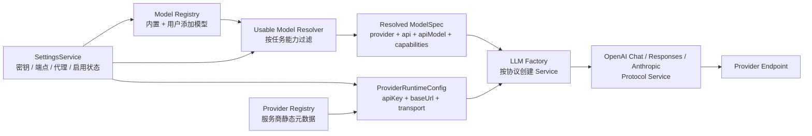

# 多供应商 LLM、模型管理与任务模型设计

## 文档状态

- 状态：代码已落地，待用户统一手动验收。
- 确认日期：2026-08-09。
- 当前文字模型供应商：DeepSeek、Kimi、OpenRouter。
- DuckCoding 文字模型供应商已退役；历史配置会在启动时清理，但图片生成仍使用独立的 `image-generation` 连接配置，默认端点可以继续是 DuckCoding Images API。
- 对应 execution plan：`docs/exec-plans/completed/20260724-multi-provider-llm/README.md`。
- 当前实现已贯通 DeepSeek / Kimi / OpenRouter 的 settings v3 持久化、`AppSettingsV2` 兼容视图、动态模型解析、服务商级代理 transport、任务模型 runtime、IPC 与设置页；旧 DuckCoding 文字模型配置会被迁移清理。OpenRouter 真实代理和跨任务模型场景仍按 execution plan 由用户统一手动验收。

本文是 actspace 多供应商 LLM、用户模型管理、服务商级代理和任务模型分配的长期设计事实来源。

相关当前实现文档：

- `packages/runtime/`、`packages/llm/` 与 `docs/design-docs/agent-plugin-runtime/`：当前 v2 Runtime、LLM 领域包与插件边界事实。
- `docs/design-docs/model-context/agent-deepseek-kimi-hybrid-capabilities.md`：当前 DeepSeek / Kimi 协议与能力边界。
- `docs/design-docs/frontend/front-设置中心重构规范.md`：当前设置中心的信息架构、模型统一流程和持久化边界；旧设置页仅作迁移追溯。
- `docs/design-docs/model-context/agent-token-usage-and-context-state.md`：模型 usage、价格快照和成本统计。
- `docs/archive/v1/design-docs/model-context-duckcoding-multi-key-model-catalog.md`：已退役的 DuckCoding 文字模型方案，仅供历史追溯。

## 背景

当前系统已经具备协议层复用基础：模型元数据区分 `api` 与 `provider`，LLM 工厂按 `openai-completions` / `openai-responses` / `anthropic-messages` 创建协议服务。但多供应商能力仍有以下结构性限制：

- `ProviderId`、API Key、Base URL 和设置页供应商列表覆盖 DeepSeek / Kimi / OpenRouter。
- `buildLLMConfig()` 通过手写 provider Map 选择密钥和端点，新增供应商需要修改多处分支。
- `MODEL_REGISTRY` 同时承担内置模型清单、公开选择器和能力事实，不支持用户从远端目录添加模型。
- Composer、Explore 等入口各自维护模型范围，新增模型不能自动获得运行时与 UI 一致性。
- 会话标题、工具输出摘要和上下文压缩默认固定使用 DeepSeek Flash，仍存在隐藏供应商绑定。
- 网络请求没有服务商级 transport 配置，无法只让 OpenRouter 走代理而保持 DeepSeek / Kimi 直连。

本轮设计把“连接供应商”和“启用模型”拆成两个独立产品概念，并让所有模型选择入口消费同一个目的感知的可用模型解析器。

## 目标

- 用户可以独立连接 DeepSeek、Kimi、OpenRouter，并分别配置 API Key、Base URL 与代理。
- OpenRouter 默认提供少量经过验证的精选模型，同时允许用户从远端目录搜索并添加其他模型。
- 用户可以控制哪些模型出现在主会话和任务模型选择器中。
- 默认会话模型、轻量任务模型、Explore 模型由用户显式选择。
- 轻量任务模型用于会话标题、工具输出摘要、上下文压缩等低成本、纯文本任务，不再固定绑定 DeepSeek。
- Composer、轻量任务与 Explore 使用统一的可用模型发现逻辑，但按任务能力要求过滤。
- 保持协议服务 provider-neutral：文字模型按模型声明复用 Chat Completions / Responses，不在 Agent loop 复制供应商品牌分支。
- API Key、代理认证等敏感值不进入 renderer、session、日志或普通 settings 文件。

## 非目标

- 首版不开放任意自定义供应商；供应商类型固定为 DeepSeek、Kimi、OpenRouter。
- 首版不接入 OpenRouter provider-native 工具、搜索、自动模型路由或模型 fallback。
- 首版不把 OpenRouter 数百个模型全部直接展示在 Composer。
- 首版不支持带用户名密码的代理 URL，也不支持 PAC、系统全局代理或按请求自动切换代理。
- 不把模型价格或能力声明当作永不变化的事实；远端目录数据必须带缓存时间和来源状态。
- 不自动把用户原来选择的模型替换成另一家供应商的模型。

## 核心术语

### Provider（服务商）

负责“请求发到哪里、用什么凭据、是否经过代理”。例如 DeepSeek、Kimi、OpenRouter。

### API Protocol（协议）

负责“消息、工具、流式响应如何编码”。当前为：

- `openai-completions`
- `openai-responses`
- `anthropic-messages`

Provider 与协议不是一一对应，但每个已安装模型必须显式声明当前协议。DeepSeek、Kimi 与 OpenRouter 当前模型走 OpenAI Chat Completions；通用 Anthropic Messages 和 OpenAI Responses 实现继续保留供其他模型或历史兼容测试使用。

### Catalog Model（目录模型）

服务商远端目录中存在的模型。目录存在不等于已经加入 actspace，也不等于适合 Agent 工具调用。

### Added Model（已添加模型）

已经进入用户本地模型注册表的模型。内置模型在迁移或连接供应商时自动添加；OpenRouter 其他模型由用户手动添加。

### Enabled Model（已启用模型）

用户允许其出现在模型选择器中的模型。关闭只影响未来选择，不删除模型定义或历史会话。

### Usable Model（当前任务可用模型）

服务商连接可用、模型已启用，并满足当前任务能力要求的模型。

## 总体架构



依赖原则：

- `Provider Registry` 只描述服务商能力与默认值，不保存用户密钥。
- `Model Registry` 描述模型身份和能力，不读取网络凭据。
- `Usable Model Resolver` 是所有 UI / runtime 模型候选项的唯一计算入口。
- `LLM Factory` 继续按协议选服务，不按品牌复制实现。
- provider-specific 请求头、参数修饰和连接测试通过薄适配器完成，不污染通用消息转换。

## 数据模型

以下类型用于表达设计边界，命名可在实现时按现有 shared 风格调整。

```ts
type ProviderId = "deepseek" | "kimi" | "openrouter";
type ModelApi = "openai-completions" | "openai-responses" | "anthropic-messages";
type ModelKey = `${ProviderId}:${string}`;

interface ProviderSpec {
  id: ProviderId;
  label: string;
  defaultBaseUrl: string;
  supportedApis: ModelApi[];
  supportsRemoteModelCatalog: boolean;
  supportsProxy: boolean;
}

interface ProviderConnectionSettings {
  enabled: boolean;
  baseUrl: string | null;
  proxy: {
    enabled: boolean;
    url: string | null;
  };
  lastConnection?: {
    status: "untested" | "available" | "unavailable";
    checkedAt: string;
    errorKind?: "proxy" | "network" | "auth" | "rate_limit" | "server";
  };
}

interface ModelCapabilities {
  input: Array<"text" | "image">;
  toolUse: "verified" | "declared" | "unsupported" | "unknown";
  reasoning: boolean;
  thinkingToggle: boolean;
  reasoningEfforts?: Array<"minimal" | "low" | "medium" | "high" | "xhigh" | "max"> | null;
  reasoningDefaultEffort?: "minimal" | "low" | "medium" | "high" | "xhigh" | "max";
  reasoningMandatory?: boolean;
}

interface ModelDefinition {
  key: ModelKey;
  provider: ProviderId;
  api: ModelApi;
  apiModel: string;
  label: string;
  source: "builtin" | "curated" | "provider-catalog" | "custom";
  contextWindow: number | null;
  maxTokens: number | null;
  capabilities: ModelCapabilities;
  pricing?: ModelPricing;
  catalogUpdatedAt?: string;
}

interface InstalledModelSettings {
  enabled: boolean;
  addedAt: string;
  customLabel?: string;
}

interface TaskModelSettings {
  defaultChatModel: ModelKey | null;
  utilityModel: ModelKey | null;
  exploreModel: ModelKey | null;
}
```

### 模型身份

模型的稳定身份必须包含 provider：

```text
deepseek:deepseek-v4-pro
kimi:kimi-k2.7-code
openrouter:anthropic/claude-...
```

原因：相同上游模型经原厂或 OpenRouter 调用时，凭据、价格、可用性和路由行为都不同。

旧 `ModelId` 继续作为兼容 alias。读取旧 session / settings 时映射到对应 `ModelKey`，历史事件不重写。

## 服务商注册表

当前注册三家：

| Provider | 默认协议 | 默认 Base URL | 远端模型目录 | 默认代理 |
| --- | --- | --- | --- | --- |
| DeepSeek | OpenAI-compatible Chat Completions | `https://api.deepseek.com` | 是，ID 发现 + 本地官方档案 | 关闭 |
| Kimi | OpenAI-compatible | `https://api.moonshot.cn/v1` | 首版不使用 | 关闭 |
| OpenRouter | OpenAI-compatible | `https://openrouter.ai/api/v1` | 是 | 关闭，由用户开启 |

Provider adapter 可提供：

- display name 与脱敏错误文案。
- 默认请求头。
- provider-specific request extras。
- 连接测试实现。
- 模型目录加载与归一化。

当前 `OpenAICompletionsService` 中的 Kimi thinking 分支应逐步下沉到 provider request adapter，避免通用协议层继续增长品牌判断。

### DeepSeek V4.1 目录与兼容（2026-09-10）

- 正式选择身份为 `deepseek:deepseek-flash`，API 名称为 `deepseek-flash`。旧 Flash / Flash Vision / Pro 的 bare ID 和 provider-qualified key 在读取时归一；设置保留 enabled、addedAt、自定义名称、连接及 credentialId。新旧键并存时按正式 Flash > 旧 Flash > Pro 优先，历史 Session Journal 不改写。
- DeepSeek `/models` 只返回 ID 等基础字段。复用现有目录缓存服务（历史文件名 `openrouter-catalog-service.ts`），按 provider 分目录存储；两套 IPC 验证 provider 后再选择对应服务与凭据。OpenRouter 不受影响。
- 已知 ID 由 shared 官方档案补齐能力/价格；未知 ID 为 text、toolUse=unknown、价格/上下文未知，不自动进入主 Agent 候选。远端 ID 需由用户点击“从目录添加”，不自动启用新模型；内置 Flash 迁移直接可见。
- 刷新成功更新已安装目录模型的能力，保留用户状态和任务引用；坏响应、网络失败或缓存写入失败保留最后成功目录。目录刷新仅发现模型，不能自动更新官方价格档案。
- V4.1 Flash 原生接收图片，1M 上下文、最大 384K 输出。Desktop 将模型事实传到 pi-ai，默认请求预算仍保留 32K，能力上限不作为默认预算。图片复用 Session artifact，Chat Completions 校验 user-role、格式签名、32 MiB 单图、600 张、48 MiB 编码请求体（Composer 自身更严格为 20 MiB）。其余像素限制由官方返回错误处理。
- 直连 DeepSeek 回放使用正确的 SDK model/provider/api 身份与 `reasoning_content`；代理 Chat Completions 显式保留 reasoning_content，避免工具轮次丢失推理上下文。
- 按用户 2026-09-11 追加要求，Pro 从内置可选列表和远端目录中移除；旧配置引用映射到 Flash，默认模型改为 Flash。不保留停用日期提示和定时切换逻辑。

## 服务商级代理

代理是 Provider transport 配置，不是模型配置，也不是应用全局配置。

规则：

- 每家服务商独立开关，默认关闭。
- 开启后，LLM 请求、连接测试、模型目录刷新和该服务商的余额/额度请求走同一 transport。
- 不影响 Browser Use、`web_search`、`web_fetch`、应用更新或其他供应商。
- 不设置全局 `HTTP_PROXY` / `HTTPS_PROXY`，不修改 Electron session 全局代理。
- 首版仅接受 `http://` / `https://` 代理地址，典型值为 `http://127.0.0.1:7890`。
- 首版拒绝 URL 中出现 username/password；未来支持代理认证时，凭据必须进入加密 secrets 存储。
- 代理地址校验在 main 进程完成，renderer 只提交结构化设置。
- 编辑已启用代理的服务商时，renderer 不回显脱敏地址；更新契约使用三态语义：省略 `proxy` 保持原值，传入新 URL 表示替换，`{ enabled: false, url: null }` 表示清除。

OpenAI Node SDK 可通过 `fetchOptions.dispatcher` 接受 `undici.ProxyAgent`。实现时 `undici` 必须作为直接依赖，不依赖 lockfile 中的传递依赖。

ProxyAgent 需要按标准化代理 URL 缓存复用，避免每轮 turn 新建连接池；应用退出时统一关闭。单元测试通过注入 fake dispatcher / fetch 验证，不连接真实代理。

## 模型注册表与模型状态

模型存在四层状态：

| 层级 | 含义 | 是否进入 Composer |
| --- | --- | --- |
| Catalog | 远端目录存在 | 否 |
| Added | 已加入本地模型注册表 | 否 |
| Enabled | 用户允许被选择 | 仍需判断服务商与能力 |
| Usable | Provider 可用且满足任务能力 | 是，取决于任务类型 |

移除服务商时：

- 保留已添加模型和自定义名称。
- 模型状态变为 unavailable，不出现在新选择器候选项中。
- 不修改历史会话中的模型身份。
- 重新连接并测试成功后自动恢复可用性。
- 原子清除默认 Key、Management Key、额外 Key、Base URL、代理和连接状态；历史 usage、session 与模型定义不删除。
- 绑定已移除额外 Key 的模型保留原 `credentialId` 并显式报告凭据缺失，不自动回退到默认 Key。

删除用户添加模型时：

- 只删除本地 installed 配置；catalog cache 不受影响。
- 内置 / 精选模型不可删除，只能关闭。
- 如果模型正被任务配置引用，删除前必须说明回退行为并二次确认。

## 目的感知的可用模型解析器

所有模型选择入口统一调用：

```ts
listUsableModels(purpose: "chat" | "utility" | "explore" | "kairos" | "vision")
```

基础过滤：

```text
provider.enabled
&& provider.lastConnection.status === available
&& installedModel.enabled
&& capabilityMatches(purpose)
```

任务能力：

| Purpose | 最低要求 |
| --- | --- |
| `chat` | text + toolUse verified/declared |
| `utility` | text；不要求工具调用 |
| `explore` | text + toolUse verified/declared |
| `kairos` | text + toolUse verified/declared |
| `vision` | image，并叠加调用方自身要求 |

`toolUse: unknown` 的远端模型可以加入本地列表，也可以作为 utility 模型，但不能默认进入主 Agent / Explore；用户完成兼容性测试或未来人工覆写后才可提升状态。v1 autonomous runtime 不再是当前 purpose。

这一解析器必须同时服务于：

- Composer 模型列表。
- 设置页默认会话模型。
- 轻量任务模型。
- Explore 模型。
- 其他仍在维护的任务模型。
- Member / Room 等未来模型配置入口。

禁止各入口继续复制 provider allowlist 或静态 ModelId 子集。

## 轻量任务模型

设置项：`taskModels.utilityModel`。

职责：

- 第一轮会话标题生成。
- 工具输出摘要。
- 自动或手动上下文压缩摘要。
- 后续新增的低成本、纯文本内部任务。

不负责：

- 主 Agent 工具调用。
- 图片理解。
- provider-native 搜索或其他隐藏辅助能力。

选择器只展示 `listUsableModels("utility")` 的结果，并显示 provider、价格摘要和上下文窗口，帮助用户控制成本。

回退顺序：

1. 用户配置的 utility 模型当前可用：使用它。
2. utility 模型不可用：使用当前主会话模型完成该次轻量任务。
3. 主会话模型也不可用：沿用现有确定性 fallback，例如标题使用消息摘要、工具输出头尾截断、历史压缩丢弃最旧可压消息。

不得自动寻找另一家未被用户选择的“便宜模型”，避免隐藏跨供应商调用。

### 首条消息的会话标题

新会话的持久标题为 `null`，`New chat` 仅是 renderer 的占位文案，创建 IPC 不传占位标题。DesktopAppService 在首次收到有文本的消息时启动一个会话级后台任务，通过 Desktop 的 `utility` LLM route 解析轻量任务模型；不等待主回复完成，也不阻塞主 Agent。标题任务只读取首条消息的文本（最多 4000 字符），不带入会话提示词、图片或工具。

生成结果通过 `session/title-set` 写入 Journal 并 flush。提交后的 revision 通知携带 `session-title-updated`，即使同批还有后续事件也保留标题变更标记；renderer 更新侧栏和当前窗口标题，不需要等待对话结束或重新打开会话。

- 同一会话最多一个进行中的命名任务；有正式标题时不再生成。
- 模型失败、30 秒超时或返回空文本，使用首条消息的短摘要兜底。
- 手动改名在第一次异步等待前取消后台命名；失败兜底也不得覆盖手动标题。应用关闭时取消并回收命名任务。
- 已持久化的历史 `New chat` 不自动改写，避免误覆盖同名的手动标题；历史批量补名另行授权。
- 纯图片且无文本的输入暂不发起标题任务；后续首条有文本消息可命名。

如果已选择的 utility 模型后来不可用：

- 保留原配置。
- 设置页显示“当前模型不可用，运行时暂时回退主模型”。
- 下拉展开时将不可用的当前值作为禁用项置顶说明，其余候选只展示可用模型。

迁移时，如果用户已配置 DeepSeek Key，则默认把现有 `deepseek-v4-flash` 映射为 utility 模型；否则为 `null`，运行时回退主模型。

## OpenRouter 模型目录

### 精选默认模型

OpenRouter 连接成功后自动安装少量精选模型，覆盖：

- 快速低成本文本模型。
- 高质量工具调用模型。
- 支持图片输入的模型。

精选模型必须有经过 actspace 验证的 capabilities，并标记 `source: "curated"`。具体模型 ID 属于易变配置，在实现阶段根据当时 OpenRouter 目录和真实兼容性测试确定，不写死在长期架构原则中。

### 添加其他模型

“添加模型”弹窗从 OpenRouter 当前模型目录搜索并添加模型。目录加载：

- 仅在 main 进程发起。
- 使用 OpenRouter 自己的 API Key、Base URL 和代理。
- 成功结果归一化后缓存到 `<userData>/providers/openrouter/models-cache.json`。
- 缓存记录 `fetchedAt` 和来源 URL；默认 24 小时后视为 stale，但仍可离线浏览。
- 用户可显式“重新加载”；失败时保留旧缓存并显示错误与重试入口。
- 重新加载成功后，main 进程同步重建所有已安装 `provider-catalog` 模型的能力快照，确保 reasoning、effort、价格和上下文等易变元数据不要求用户删除再添加。
- 添加模型或目录能力刷新完成后，Settings 必须通知 App 根层重新计算 usable models，使 Composer 和任务模型候选立即更新，不依赖重启或切换其他设置。

目录项至少展示：

- 名称与上游模型 ID。
- 上下文窗口。
- 输入 / 输出价格。
- 免费模型标识。
- text / image 输入能力。
- tools / reasoning 等服务商声明能力。
- 数据更新时间。

搜索按名称和模型 ID 匹配，输入防抖。模型数超过 50 时使用虚拟列表，避免数百行 DOM 影响设置页响应。

用户点击“添加”后：

- 写入本地 `ModelDefinition + InstalledModelSettings`。
- 默认 `enabled: true`，因为这是用户明确操作。
- provider 声明的工具能力记为 `declared`，不能伪装成 actspace 已验证。

## 设置页信息架构

当前设置中心重构后，顶层不再提供“服务商”或“智能体”页面，只保留一个“模型”页面作为 Provider、Connection 和 Model 的统一用户入口。数据层仍然保持三者分离，详细的页面、交互和持久化目标以 [`front-设置中心重构规范.md`](../frontend/front-设置中心重构规范.md) 为准。

```text
模型
├── 模型列表
├── 添加连接 → 服务商目录 → 连接配置 → 连接详情
├── 任务模型绑定
└── 媒体模型（图片生成 / 图片分析）
```

Kairos 已随 v2 唯一切换移除，不再是当前设置导航或模型分配目标。当前 one-shot Agent / Explore 子代理的模型选择由统一的 Model Resolver 和子 Agent 设置消费。

### 模型页面中的连接入口

模型页面同时回答两个问题：

1. 请求通过哪个 Connection 发出；
2. 哪些 Model 已添加、启用并可用于特定任务。

连接流程保持：

```text
选择服务商
→ 填 API Key
→ OpenRouter 可选填 Management Key（账户余额专用）
→ 展开高级配置（Base URL / 代理）
→ 保存并测试
→ available 后安装默认模型
```

联网搜索服务仍属于 ToolManager 搜索通道，不与 LLM Model Registry 混合；它们在设置 UI 中归入“工具 → 联网能力”，不再占用独立顶层入口。

“添加连接”只展示尚未配置的三家受支持服务商，不展示尚未实现的供应商。

允许保存但测试失败；此时卡片状态为“连接异常”，模型不可用，用户可以修改配置或重试。状态不能只靠红/绿颜色表达，必须同时有文字与图标。

### 模型页

回答“哪些模型可用、分别承担什么任务”。

页面结构：

1. 任务模型
   - 默认会话模型。
   - 轻量任务模型。
   - Explore 模型。
   - v1 autonomous runtime 的旧模型配置不再进入当前设置页事实源；迁移时只读取一次并写入 `models.taskBindings`。
2. 可用模型
   - 按 provider 分组。
   - 标题显示 `已启用 / 已添加` 数量。
   - 每行显示名称、上游 ID、能力徽标、价格摘要、启用开关。
   - 用户添加模型可删除；内置 / 精选模型只可停用。
   - OpenRouter 分组提供“添加模型”。

Composer 只展示 `listUsableModels("chat")`，不会因为远端 catalog 增长而自动出现数百个模型。

### OpenRouter 添加模型弹窗

- 宽尺寸模态框，背景 scrim 与设置页主题一致。
- 顶部固定标题、说明和搜索框。
- 中部显示数量、缓存时间、重新加载。
- 主列表为唯一纵向滚动区域，避免主页面与弹窗双重滚动争抢。
- 支持 Esc 关闭、Tab 顺序、上下键浏览、Enter 添加。
- 加载超过 300ms 显示 skeleton；请求失败显示原因与重试。
- 图标按钮必须有 `aria-label`，状态不能仅靠颜色。
- 所有颜色消费语义 token，浅色、深色、跟随系统三态验证。

界面借鉴“连接详情与模型目录分层、远端目录按需添加”的交互机制，不照搬其他产品的品牌、Claude Code 兼容标签、超大留白或角色映射术语。

## Settings 与持久化

当前实现仍兼容 `settings.json` v2 / v3 结构；设置中心重构的目标版本是 `version: 4`。非敏感配置继续落 `<userData>/settings.json`，通过幂等迁移进入逻辑 namespace：

```text
settings.json
├── version: 4
├── general
├── models
├── tools
├── media
├── skills
├── subagents
└── activity.usage
```

其中 `models.connections`、`models.definitions` 和 `models.installed` 使用稳定 ID，`taskBindings` 只保存稳定的 `modelKey` 引用。完整目标结构、v3 → v4 迁移和页面偏好边界见 [`front-设置中心重构规范.md`](../frontend/front-设置中心重构规范.md)。

敏感值：

- Desktop Key 集中写入 main-only `<userData>/secrets.json` v2 明文文件，创建、原子替换和启动读取时都收紧为 `0600`。
- renderer 的 `AppSettings` 只收到 `hasApiKey`、连接状态和非敏感配置。
- 明文 key 只在 main Host / v2 Runtime 创建 runtime config、连接测试和目录请求时短暂使用。

Electron 的真实 turn、上下文压缩、Explore 和回复可视化等直接 LLM 消费路径统一通过 `ModelRuntimeService` 装配显式 `ProviderRuntimeConfig`；不把 Desktop 设置页保存的 LLM Key 回写 `process.env`。环境变量入口继续只保留给 CLI、CI、测试和兼容场景，但新增供应商不应继续扩张散落的手写 Map。

## IPC 边界

renderer 只调用结构化 IPC：

- `providers:list`
- `providers:connect`
- `providers:update`
- `providers:test`
- `providers:disconnect`
- `models:list-installed`
- `models:list-usable`
- `models:catalog:list`
- `models:catalog:reload`
- `models:add`
- `models:update`
- `models:remove`
- `task-models:update`

命名可按当前 `settings:*` 风格合并，但必须保持：

- renderer 不传 env key 名。
- renderer 不读取明文 API Key。
- renderer 不直接请求 OpenRouter。
- main 校验 provider、ModelKey、URL scheme、模型能力和删除引用关系。

## LLM Service 与请求构造

`createLLMService()` 继续按 `LLMConfig.api` 选择协议服务：

- OpenRouter → `OpenAICompletionsService`。
- Kimi → `OpenAICompletionsService`。
- DeepSeek → `OpenAICompletionsService`，请求适配层发送 `thinking.type=enabled|disabled`；开启时支持 `reasoning_effort=low|high|max`；V4.1 Flash 缺省 `high`。
- 已声明 `openai-responses` 的历史模型仍可由 `OpenAIResponsesService` 处理；当前三家内置供应商默认使用 `OpenAICompletionsService`。

`LLMConfig` 目标扩展：

```ts
interface LLMConfig {
  provider: ProviderId;
  api: ModelApi;
  apiKey: string;
  baseUrl: string;
  model: string;
  transport?: { proxyUrl?: string };
  defaultHeaders?: Record<string, string>;
  promptCacheKey?: string;
  // existing input / temperature / maxTokens / retry...
}
```

OpenRouter 可设置固定、非敏感的 `X-OpenRouter-Title: Actspace`；`HTTP-Referer` 为可选项，首版没有稳定公开产品 URL 时可省略。

Provider request adapter 只处理请求差异，不拥有消息历史：

- Kimi thinking 参数。
- OpenRouter headers 或未来 provider routing extras。
- provider display name 与错误分类补充。

消息转换、tool call 对账、usage 归一仍归协议服务。

Responses 协议使用本地上下文管理：请求保持 `store: false`，不依赖 `previous_response_id`。主 Agent 的 `promptCacheKey` 由 session id 哈希派生，只用于稳定前缀缓存；加密 reasoning item 作为 opaque provider signature 进入 session 事件并在后续工具轮次回放，不能把缓存键或普通文本消息误当作完整的 Responses 会话状态。

### 推理强度能力与请求链路

推理强度不是全局静态菜单，而是模型能力的一部分：

- OpenRouter catalog 将 `supported_efforts`、`default_effort`、`default_enabled` 和 `mandatory` 归一化到 `ModelCapabilities`；`null` 表示目录声明支持全部标准化强度，缺失则表示不展示强度选择器。
- Composer 只展示当前模型支持的强度，并按模型分别保存临时选择，避免切换模型时相互污染。
- `Auto` 不向 provider 发送显式 effort，让模型或供应商使用默认策略；用户显式选择后，`reasoningEffort` 经 renderer IPC、Agent runtime 和每次 loop 请求传到 provider adapter。
- runtime 会再次校验强度是否属于模型能力范围；不支持的值被丢弃，不能仅依赖 UI 防御。`reasoningMandatory` 会强制开启推理且隐藏关闭入口。
- OpenRouter adapter 将关闭态映射为 `reasoning.enabled = false`，显式强度映射为 `reasoning.effort`，仅开启但没有强度覆盖时映射为 `reasoning.enabled = true`。

上下文长度不在 Composer 中作为请求级控制项。模型使用注册表中的原生 `contextWindow` 上限，避免把上下文窗口与输出 `maxTokens` 混为一谈。

## Usage 与价格

- 内置 / 精选模型价格来自受版本控制的模型定义。
- provider-catalog 模型保存目录返回的 pricing 与 `catalogUpdatedAt`。
- 每次 `llm_usage` 仍保存当次价格快照与 provider-qualified ModelKey，历史成本不因目录刷新而变化。
- 目录价格缺失时显示“价格未知”，不能按 0 计费。
- OpenRouter 同一上游模型与原厂模型分别统计，不按 `apiModel` 合并。
- Usage 活动行从 Journal request / tool 事件重建，并保留 provider、ModelKey、attempt 和 `costBasis`。当 provider 未返回 usage、currency 或价格来源不完整时，活动行保持 unknown / unavailable，不能用默认价格或零值伪造账单结果。

## 错误与可观测性

连接测试和真实调用至少区分：

- proxy：代理地址非法、代理不可达、代理认证不支持。
- network：DNS、超时、TLS、连接中断。
- auth：API Key 无效或权限不足。
- rate_limit：限流。
- insufficient_balance：余额不足。
- invalid_request：模型不存在、参数或能力不兼容。
- server：服务商错误。

允许记录：

- provider、ModelKey、api、base URL host。
- 是否启用代理、代理 host/port 的脱敏形式。
- 请求耗时、状态码、错误分类、重试次数。
- catalog cache 时间和条目数量。

禁止记录：

- API Key、Authorization header。
- 含凭据的代理 URL。
- 未裁剪的用户 prompt、工具输出或远端错误响应正文。

## 安全约束

- API Key 使用 main-only `secrets.json` v2 明文存储，文件权限固定为 `0600`；renderer 永不获得明文。该权限只隔离同机其他用户，不等同于静态加密。
- OpenRouter 模型调用 Key 与 Management Key 分字段存储：前者用于模型、目录和连接测试，后者只用于需要 Management Key 的 `/credits` 账户余额请求。
- `secrets.json` 读取、格式校验、权限收紧或旧版迁移失败时，所有凭据写操作必须停止，原文件保持不变，renderer 只显示脱敏存储错误。
- Base URL 和代理 URL 只允许 `http:` / `https:`；连接测试前解析并规范化。
- 首版代理 URL 禁止 username/password。
- catalog item 的 label、ID 等远端字符串只作为文本展示，不拼接 HTML。
- 自定义模型 ID 设长度上限并拒绝控制字符。
- 连接测试使用固定、无隐私探针，不发送 workspace、session 或工具内容。
- 测试成功不代表永久可用；真实请求仍必须正常处理 auth / network 等错误。
- 移除供应商配置时清除其密钥和连接设置，但不应误删历史 usage、session 或用户模型定义。移除 OpenRouter 时同时删除调用 Key、Management Key 与额外 Key。旧 DuckCoding 文字模型配置迁移时会清除对应模型、任务引用和密钥；图片生成连接保持不变。

## 迁移

从 settings v1 迁移到 v2：

1. 现有 settings 字段按下列规则迁移；旧 `secrets.json` v1 则单独执行全量迁移：所有 `safeStorage` 密文先在内存完整解密，全部成功后才原子写为 `0600` 的 v2 明文文件，任一失败都保留原文件并阻止后续覆盖。
2. DeepSeek / Kimi 内置模型写入 installedModels，保持当前公开模型 enabled。
3. 现有 `defaultModelId` 映射到 `taskModels.defaultChatModel`。
4. 现有 `agent.exploreModelId` 映射到 `taskModels.exploreModel`。
5. 已配置 DeepSeek Key 时，utility 默认映射 DeepSeek Flash；否则为 null。
6. 旧 autonomous runtime 的 modelId 仅在迁移读取阶段保留，候选项统一由 v2 resolver 生成。
7. 旧 session 的 modelId 在读取层映射，不批量重写历史 JSONL。

迁移必须幂等；失败时保留旧文件并输出脱敏诊断，不覆盖用户 secrets。

## 测试要求

### Shared / contract

- ProviderId、ModelKey、旧 ModelId alias 映射。
- settings v1 → v2 幂等迁移。
- purpose capability filter。
- provider 断开、模型停用、当前选择失效的解析结果。
- OpenRouter reasoning catalog 元数据归一化，包括强度全集、默认值和 mandatory。

### Agent Core

- OpenRouter 使用 OpenAI-compatible service 和正确 base URL / headers。
- 代理 dispatcher 只注入目标 provider。
- Kimi thinking 行为不泄漏到 OpenRouter。
- reasoning effort 从 runtime 贯通到每次模型请求；不支持的强度被过滤，mandatory 模型始终开启推理。
- utility 模型可用、不可用、主模型 fallback、确定性 fallback。
- 动态模型 toolUse unknown 不进入 chat / explore / kairos。

### Desktop main

- Key 明文文件权限、旧密文迁移、连接、移除与 renderer 脱敏视图。
- 连接测试与 catalog reload 使用同一代理配置。
- cache 成功、stale、离线回退与坏 JSON 恢复。
- catalog reload 成功后刷新已安装目录模型的能力快照，同时保留 enabled、addedAt 和任务引用。
- 删除被任务模型引用的模型需要确认或拒绝。

### Renderer

- 服务商状态：未连接、测试中、可用、异常。
- 模型状态：已添加、已启用、不可用、能力不匹配。
- 任务模型选择器只显示 purpose 对应候选项，并按供应商分组。
- OpenRouter catalog 搜索、防抖、虚拟列表、加载、错误、缓存状态。
- Composer 模型搜索只过滤当前 usable models，并按供应商分组；跨供应商同名模型在折叠态追加供应商名称，同供应商仍重名时追加 API model ID。推理开关与强度选项完全由当前模型能力决定。
- 默认会话、轻量任务与 Explore 模型选择器使用同一供应商分组和重名消歧规则。
- 添加模型和目录能力刷新后，Composer 与任务选择器在同一操作完成后重新拉取候选，不要求页面重挂载。
- 键盘、焦点、Esc、aria-label、浅色/深色主题。
- Composer 与设置修改实时同步，不需要重启应用。

### 真实验收

- DeepSeek 直连成功。
- Kimi 直连成功。
- OpenRouter 直连失败但经本地 HTTP 代理成功。
- 关闭 OpenRouter 代理不影响 DeepSeek / Kimi。
- OpenRouter 目录加载、添加模型、Composer 使用、usage 落盘完整。
- 启动含旧 DuckCoding 文字模型配置的实例，确认迁移后只保留 DeepSeek / Kimi / OpenRouter，并且图片生成 Key、端点和模型保持不变。
- utility 选择 OpenRouter 模型后，会话标题和 `/compact` 不再请求 DeepSeek。

真实探针不得携带仓库、session 或个人数据。

## 实施顺序

1. 契约地基：Provider Registry、ModelKey、ModelDefinition、purpose resolver、settings v2 / v3 migration；后续设置中心重构再由 v3 迁移到 v4 namespace。
2. 服务商运行配置：OpenRouter key/base URL、provider adapter、代理 transport、连接测试。
3. 模型管理：installed/custom model、OpenRouter catalog cache、添加/启用/删除。
4. 任务模型：默认会话、utility、Explore 统一 resolver；标题与 summarizer 去 DeepSeek 固定绑定。
5. 设置页：将服务商连接、模型目录、模型启用和 Composer 联动收敛到统一的模型页面。
6. Member 等仍在维护的消费方迁移到统一 resolver，删除独立 allowlist。
7. 文档、history、测试和真实 provider 验收同步收口。

该改动跨 shared、v2 Runtime、desktop main、preload、renderer 与 settings migration，实施前应单独编写 execution plan。

## 已确认决策

- 首批只支持 DeepSeek、Kimi、OpenRouter 三家服务商。
- 2026-07-27 的 Plan 7 在首批三家之外新增 DuckCoding；现有默认 Key 路径不迁移，额外 Key 采用可选 `credentialId` 渐进扩展。2026-07-28 将模型来源收敛为本地 Codex/Grok 档案和手动兜底。
- 2026-07-28 的缓存归因探针只在 Responses 对照中确认 Codex 缓存命中，因此 Codex 本地档案使用 `openai-responses`，Grok 与未知手动模型默认保留 `openai-completions`。
- Provider、Connection 和 Model 在数据层保持分离，在设置页通过一个模型入口完成连续配置流程。
- 代理按服务商配置，不做全局代理。
- OpenRouter 采用“精选默认模型 + 远端目录手动添加”。
- 用户添加模型后默认启用，但仍受 purpose 能力过滤。
- 轻量任务模型由用户手动选择，候选只来自当前可用模型。
- utility 不可用时回退主模型，不隐藏选择另一家供应商。
- 旧 autonomous runtime 的模型配置只作为迁移输入，不再在当前页面维护第二事实源。
- 主 Agent 联网能力继续走本地 `web_search` / `web_fetch`，不挂 provider-native 搜索。
- 具体 OpenRouter 精选模型 ID 在实现阶段基于当时目录和真实兼容性验证确定。

## 2026-09-12 连接隔离与生产代理验收

Desktop 通配路由的 `desktop:default` 只表示由 Host 适配器负责解析连接，不预取默认聊天模型的密钥。适配器根据本次请求选中的模型一次解析 API model、协议、Base URL、Key、代理和定价倍率，不能逐字段混入默认连接；自定义连接不依赖内置服务商是否配置。图片辅助模型仍使用独立选择入口。

自定义服务的显示名称、协议格式和稳定 connectionId 分离；详情页提供服务名称编辑入口。重命名不改变连接 ID 或已有模型绑定。服务地址必须是供应商提供的完整 API base（例如包含 `/v1`），不对任意中转服务盲目追加路径。

`@actspace/llm-service` 显式声明 `undici` 生产依赖。Desktop/CLI 生产 deploy 后运行 `scripts/check-provider-proxy-package.mjs <deploy-root>`，从产物自身解析依赖并初始化 ProxyAgent，不发送网络请求；失败阻断打包。初始化失败归类为代理错误，内部异常仅通过 cause 保留。

## 自定义模型推理能力（2026-09-12）

`ModelDefinition.reasoningConfig` 是模型级配置，创建连接时可通过 `modelReasoning` 为默认模型设置，已有自定义模型通过 `models:update.reasoningConfig` 编辑。来源为 `auto` 或 `manual`；手动字段包含 `support`（unknown/supported/unsupported）、有限 `efforts`、可选 `defaultEffort` 和 `allowOff`。默认自动不发送强度；关闭与强度是独立语义。

自动模式只按完整 API ID 或显式 referenceModel 精确匹配内置目录快照及已有精选定义；不联网、不按前缀猜测、不将 reasoning=true 扩展成所有强度。目录冲突返回未知，没有强度元数据返回空档位并提示手动配置。目录声明不是中转验证证明。手动覆盖随模型持久化，连接重命名和原有 provider-catalog 刷新不会重置自定义模型；旧模型不批量迁移，可以从单模型入口编辑。

未知支持状态保留在 reasoningConfig 中，当前运行时保守不注入推理字段。Composer 只展示允许档位，支持配置默认值与显式 Auto，并清除不再允许的本地选择。Host 对显式非法档位报错，防止 UI 与实际请求不一致。

未知中转端点以 generic custom wire identity 使用所选协议，不继承 OpenRouter 品牌字段；已知官方 DeepSeek/Kimi/OpenRouter 端点保留对应适配。Chat 为 reasoning_effort，Responses 为 reasoning.effort；Anthropic 显式档位使用 adaptive thinking + output_config.effort，仅允许 low/medium/high/xhigh/max，具体模型是否支持由用户确认。generic Auto 清除 SDK 推断的 effort/thinking 默认字段；直连与代理共享同一字段生成逻辑。Anthropic 参考：[Effort 官方文档](https://platform.claude.com/docs/en/build-with-claude/effort)。
