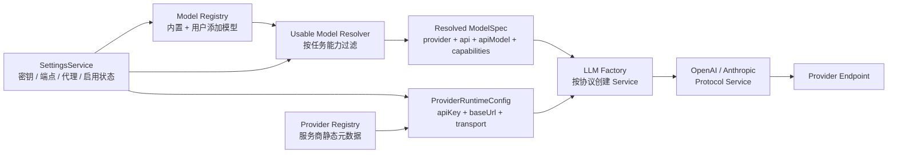

# 多供应商 LLM、模型管理与任务模型设计

## 文档状态

- 状态：代码已落地，待用户统一手动验收。
- 确认日期：2026-07-24。
- 首批供应商：DeepSeek、Kimi、OpenRouter。
- 对应 execution plan：`docs/exec-plans/active/20260724-multi-provider-llm/README.md`。
- 当前实现已贯通 DeepSeek / Kimi / OpenRouter 的 settings v2、动态模型解析、服务商级代理 transport、任务模型 runtime、IPC 与设置页；OpenRouter 真实代理和跨任务模型场景仍按 execution plan 由用户统一手动验收。

本文是 actspace 多供应商 LLM、用户模型管理、服务商级代理和任务模型分配的长期设计事实来源。

相关当前实现文档：

- `docs/design-docs/agent-runtime/agent-current-module-map.md`：已落地模块事实。
- `docs/design-docs/model-context/agent-deepseek-kimi-hybrid-capabilities.md`：当前 DeepSeek / Kimi 协议与能力边界。
- `docs/design-docs/frontend/front-设置页规范.md`：设置页信息架构和交互基线。
- `docs/design-docs/model-context/agent-token-usage-and-context-state.md`：模型 usage、价格快照和成本统计。

## 背景

当前系统已经具备协议层复用基础：模型元数据区分 `api` 与 `provider`，LLM 工厂按 `openai-completions` / `anthropic-messages` 创建协议服务。但多供应商能力仍有以下结构性限制：

- `ProviderId`、API Key、Base URL 和设置页供应商列表只覆盖 DeepSeek / Kimi。
- `buildLLMConfig()` 通过手写 provider Map 选择密钥和端点，新增供应商需要修改多处分支。
- `MODEL_REGISTRY` 同时承担内置模型清单、公开选择器和能力事实，不支持用户从远端目录添加模型。
- Composer、Explore、Kairos 等入口各自维护模型范围，新增模型不能自动获得运行时与 UI 一致性。
- 会话标题、工具输出摘要和上下文压缩默认固定使用 DeepSeek Flash，仍存在隐藏供应商绑定。
- 网络请求没有服务商级 transport 配置，无法只让 OpenRouter 走代理而保持 DeepSeek / Kimi 直连。

本轮设计把“连接供应商”和“启用模型”拆成两个独立产品概念，并让所有模型选择入口消费同一个目的感知的可用模型解析器。

## 目标

- 用户可以独立连接 DeepSeek、Kimi、OpenRouter，并分别配置 API Key、Base URL 与代理。
- OpenRouter 默认提供少量经过验证的精选模型，同时允许用户从远端目录搜索并添加其他模型。
- 用户可以控制哪些模型出现在主会话和任务模型选择器中。
- 默认会话模型、轻量任务模型、Explore 模型由用户显式选择。
- 轻量任务模型用于会话标题、工具输出摘要、上下文压缩等低成本、纯文本任务，不再固定绑定 DeepSeek。
- Composer、轻量任务、Explore、Kairos 使用统一的可用模型发现逻辑，但按任务能力要求过滤。
- 保持协议服务 provider-neutral：OpenRouter 复用 OpenAI-compatible 协议服务，不复制完整 service 实现。
- API Key、代理认证等敏感值不进入 renderer、session、日志或普通 settings 文件。

## 非目标

- 首版不开放任意自定义供应商；供应商类型固定为 DeepSeek、Kimi、OpenRouter。
- 首版不接入 OpenRouter provider-native 工具、搜索、自动模型路由或模型 fallback。
- 首版不把 OpenRouter 数百个模型全部直接展示在 Composer。
- 首版不支持带用户名密码的代理 URL，也不支持 PAC、系统全局代理或按请求自动切换代理。
- 不把模型价格或能力声明当作永不变化的事实；远端目录数据必须带缓存时间和来源状态。
- 不自动把用户原来选择的模型替换成另一家供应商的模型。

## 核心术语

### Provider（服务商）

负责“请求发到哪里、用什么凭据、是否经过代理”。例如 DeepSeek、Kimi、OpenRouter。

### API Protocol（协议）

负责“消息、工具、流式响应如何编码”。当前为：

- `openai-completions`
- `anthropic-messages`

Provider 与协议不是一一对应。DeepSeek 可走 Anthropic-compatible 或 OpenAI-compatible；OpenRouter 首版走 OpenAI-compatible。

### Catalog Model（目录模型）

服务商远端目录中存在的模型。目录存在不等于已经加入 actspace，也不等于适合 Agent 工具调用。

### Added Model（已添加模型）

已经进入用户本地模型注册表的模型。内置模型在迁移或连接供应商时自动添加；OpenRouter 其他模型由用户手动添加。

### Enabled Model（已启用模型）

用户允许其出现在模型选择器中的模型。关闭只影响未来选择，不删除模型定义或历史会话。

### Usable Model（当前任务可用模型）

服务商连接可用、模型已启用，并满足当前任务能力要求的模型。

## 总体架构



依赖原则：

- `Provider Registry` 只描述服务商能力与默认值，不保存用户密钥。
- `Model Registry` 描述模型身份和能力，不读取网络凭据。
- `Usable Model Resolver` 是所有 UI / runtime 模型候选项的唯一计算入口。
- `LLM Factory` 继续按协议选服务，不按品牌复制实现。
- provider-specific 请求头、参数修饰和连接测试通过薄适配器完成，不污染通用消息转换。

## 数据模型

以下类型用于表达设计边界，命名可在实现时按现有 shared 风格调整。

```ts
type ProviderId = "deepseek" | "kimi" | "openrouter";
type ModelApi = "openai-completions" | "anthropic-messages";
type ModelKey = `${ProviderId}:${string}`;

interface ProviderSpec {
  id: ProviderId;
  label: string;
  defaultBaseUrl: string;
  supportedApis: ModelApi[];
  supportsRemoteModelCatalog: boolean;
  supportsProxy: boolean;
}

interface ProviderConnectionSettings {
  enabled: boolean;
  baseUrl: string | null;
  proxy: {
    enabled: boolean;
    url: string | null;
  };
  lastConnection?: {
    status: "untested" | "available" | "unavailable";
    checkedAt: string;
    errorKind?: "proxy" | "network" | "auth" | "rate_limit" | "server";
  };
}

interface ModelCapabilities {
  input: Array<"text" | "image">;
  toolUse: "verified" | "declared" | "unsupported" | "unknown";
  reasoning: boolean;
  thinkingToggle: boolean;
  reasoningEfforts?: Array<"minimal" | "low" | "medium" | "high" | "xhigh" | "max"> | null;
  reasoningDefaultEffort?: "minimal" | "low" | "medium" | "high" | "xhigh" | "max";
  reasoningMandatory?: boolean;
}

interface ModelDefinition {
  key: ModelKey;
  provider: ProviderId;
  api: ModelApi;
  apiModel: string;
  label: string;
  source: "builtin" | "curated" | "provider-catalog" | "custom";
  contextWindow: number | null;
  maxTokens: number | null;
  capabilities: ModelCapabilities;
  pricing?: ModelPricing;
  catalogUpdatedAt?: string;
}

interface InstalledModelSettings {
  enabled: boolean;
  addedAt: string;
  customLabel?: string;
}

interface TaskModelSettings {
  defaultChatModel: ModelKey | null;
  utilityModel: ModelKey | null;
  exploreModel: ModelKey | null;
}
```

### 模型身份

模型的稳定身份必须包含 provider：

```text
deepseek:deepseek-v4-pro
kimi:kimi-k2.7-code
openrouter:anthropic/claude-...
```

原因：相同上游模型经原厂或 OpenRouter 调用时，凭据、价格、可用性和路由行为都不同。

旧 `ModelId` 继续作为兼容 alias。读取旧 session / settings 时映射到对应 `ModelKey`，历史事件不重写。

## 服务商注册表

首版注册三家：

| Provider | 默认协议 | 默认 Base URL | 远端模型目录 | 默认代理 |
| --- | --- | --- | --- | --- |
| DeepSeek | Anthropic-compatible，可显式回退 OpenAI-compatible | 当前 DeepSeek 默认端点 | 否 | 关闭 |
| Kimi | OpenAI-compatible | `https://api.moonshot.cn/v1` | 首版不使用 | 关闭 |
| OpenRouter | OpenAI-compatible | `https://openrouter.ai/api/v1` | 是 | 关闭，由用户开启 |

Provider adapter 可提供：

- display name 与脱敏错误文案。
- 默认请求头。
- provider-specific request extras。
- 连接测试实现。
- 模型目录加载与归一化。

当前 `OpenAICompletionsService` 中的 Kimi thinking 分支应逐步下沉到 provider request adapter，避免通用协议层继续增长品牌判断。

## 服务商级代理

代理是 Provider transport 配置，不是模型配置，也不是应用全局配置。

规则：

- 每家服务商独立开关，默认关闭。
- 开启后，LLM 请求、连接测试、模型目录刷新和该服务商的余额/额度请求走同一 transport。
- 不影响 Browser Use、`web_search`、`web_fetch`、应用更新或其他供应商。
- 不设置全局 `HTTP_PROXY` / `HTTPS_PROXY`，不修改 Electron session 全局代理。
- 首版仅接受 `http://` / `https://` 代理地址，典型值为 `http://127.0.0.1:7890`。
- 首版拒绝 URL 中出现 username/password；未来支持代理认证时，凭据必须进入加密 secrets 存储。
- 代理地址校验在 main 进程完成，renderer 只提交结构化设置。

OpenAI Node SDK 可通过 `fetchOptions.dispatcher` 接受 `undici.ProxyAgent`。实现时 `undici` 必须作为直接依赖，不依赖 lockfile 中的传递依赖。

ProxyAgent 需要按标准化代理 URL 缓存复用，避免每轮 turn 新建连接池；应用退出时统一关闭。单元测试通过注入 fake dispatcher / fetch 验证，不连接真实代理。

## 模型注册表与模型状态

模型存在四层状态：

| 层级 | 含义 | 是否进入 Composer |
| --- | --- | --- |
| Catalog | 远端目录存在 | 否 |
| Added | 已加入本地模型注册表 | 否 |
| Enabled | 用户允许被选择 | 仍需判断服务商与能力 |
| Usable | Provider 可用且满足任务能力 | 是，取决于任务类型 |

断开服务商时：

- 保留已添加模型和自定义名称。
- 模型状态变为 unavailable，不出现在新选择器候选项中。
- 不修改历史会话中的模型身份。
- 重新连接并测试成功后自动恢复可用性。

删除用户添加模型时：

- 只删除本地 installed 配置；catalog cache 不受影响。
- 内置 / 精选模型不可删除，只能关闭。
- 如果模型正被任务配置引用，删除前必须说明回退行为并二次确认。

## 目的感知的可用模型解析器

所有模型选择入口统一调用：

```ts
listUsableModels(purpose: "chat" | "utility" | "explore" | "kairos" | "vision")
```

基础过滤：

```text
provider.enabled
&& provider.lastConnection.status === available
&& installedModel.enabled
&& capabilityMatches(purpose)
```

任务能力：

| Purpose | 最低要求 |
| --- | --- |
| `chat` | text + toolUse verified/declared |
| `utility` | text；不要求工具调用 |
| `explore` | text + toolUse verified/declared |
| `kairos` | text + toolUse verified/declared |
| `vision` | image，并叠加调用方自身要求 |

`toolUse: unknown` 的远端模型可以加入本地列表，也可以作为 utility 模型，但不能默认进入主 Agent / Explore / Kairos；用户完成兼容性测试或未来人工覆写后才可提升状态。

这一解析器必须同时服务于：

- Composer 模型列表。
- 设置页默认会话模型。
- 轻量任务模型。
- Explore 模型。
- Kairos 模型。
- Member / Room 等未来模型配置入口。

禁止各入口继续复制 provider allowlist 或静态 ModelId 子集。

## 轻量任务模型

设置项：`taskModels.utilityModel`。

职责：

- 第一轮会话标题生成。
- 工具输出摘要。
- 自动或手动上下文压缩摘要。
- 后续新增的低成本、纯文本内部任务。

不负责：

- 主 Agent 工具调用。
- 图片理解。
- provider-native 搜索或其他隐藏辅助能力。

选择器只展示 `listUsableModels("utility")` 的结果，并显示 provider、价格摘要和上下文窗口，帮助用户控制成本。

回退顺序：

1. 用户配置的 utility 模型当前可用：使用它。
2. utility 模型不可用：使用当前主会话模型完成该次轻量任务。
3. 主会话模型也不可用：沿用现有确定性 fallback，例如跳过标题、工具输出头尾截断、历史压缩丢弃最旧可压消息。

不得自动寻找另一家未被用户选择的“便宜模型”，避免隐藏跨供应商调用。

如果已选择的 utility 模型后来不可用：

- 保留原配置。
- 设置页显示“当前模型不可用，运行时暂时回退主模型”。
- 下拉展开时将不可用的当前值作为禁用项置顶说明，其余候选只展示可用模型。

迁移时，如果用户已配置 DeepSeek Key，则默认把现有 `deepseek-v4-flash` 映射为 utility 模型；否则为 `null`，运行时回退主模型。

## OpenRouter 模型目录

### 精选默认模型

OpenRouter 连接成功后自动安装少量精选模型，覆盖：

- 快速低成本文本模型。
- 高质量工具调用模型。
- 支持图片输入的模型。

精选模型必须有经过 actspace 验证的 capabilities，并标记 `source: "curated"`。具体模型 ID 属于易变配置，在实现阶段根据当时 OpenRouter 目录和真实兼容性测试确定，不写死在长期架构原则中。

### 添加其他模型

“添加模型”弹窗从 OpenRouter 当前模型目录搜索并添加模型。目录加载：

- 仅在 main 进程发起。
- 使用 OpenRouter 自己的 API Key、Base URL 和代理。
- 成功结果归一化后缓存到 `<userData>/providers/openrouter/models-cache.json`。
- 缓存记录 `fetchedAt` 和来源 URL；默认 24 小时后视为 stale，但仍可离线浏览。
- 用户可显式“重新加载”；失败时保留旧缓存并显示错误与重试入口。
- 重新加载成功后，main 进程同步重建所有已安装 `provider-catalog` 模型的能力快照，确保 reasoning、effort、价格和上下文等易变元数据不要求用户删除再添加。
- 添加模型或目录能力刷新完成后，Settings 必须通知 App 根层重新计算 usable models，使 Composer 和任务模型候选立即更新，不依赖重启或切换其他设置。

目录项至少展示：

- 名称与上游模型 ID。
- 上下文窗口。
- 输入 / 输出价格。
- 免费模型标识。
- text / image 输入能力。
- tools / reasoning 等服务商声明能力。
- 数据更新时间。

搜索按名称和模型 ID 匹配，输入防抖。模型数超过 50 时使用虚拟列表，避免数百行 DOM 影响设置页响应。

用户点击“添加”后：

- 写入本地 `ModelDefinition + InstalledModelSettings`。
- 默认 `enabled: true`，因为这是用户明确操作。
- provider 声明的工具能力记为 `declared`，不能伪装成 actspace 已验证。

## 设置页信息架构

设置导航新增“服务商”，原“模型”页收口为模型管理：

```text
通用
服务商
模型
智能体
Kairos
工具
...
```

### 服务商页

回答“请求通过谁发出”。

页面分组：

1. 模型服务商
   - 已连接的 DeepSeek / Kimi / OpenRouter 卡片。
   - 主操作“添加服务”。
   - 编辑、测试连接、断开。
   - 展示账户余额、状态、已启用模型数、接入方式、Base URL、代理状态。余额查询通过通用 provider IPC 分发到各服务商适配器，不与 Usage 统计页耦合。
2. 联网搜索服务
   - 迁移当前智谱 / Tavily / TinyFish / Exa 配置。
   - 保持它们属于 ToolManager 搜索通道，不与 LLM Model Registry 混合。

“添加服务”只展示尚未连接的三家受支持服务商，不展示尚未实现的供应商。

连接流程：

```text
选择服务商
→ 填 API Key
→ OpenRouter 可选填 Management Key（账户余额专用）
→ 展开高级配置（Base URL / 代理）
→ 保存并测试
→ available 后安装默认模型
```

允许保存但测试失败；此时卡片状态为“连接异常”，模型不可用，用户可以修改配置或重试。状态不能只靠红/绿颜色表达，必须同时有文字与图标。

### 模型页

回答“哪些模型可用、分别承担什么任务”。

页面结构：

1. 任务模型
   - 默认会话模型。
   - 轻量任务模型。
   - Explore 模型。
   - Kairos 保留在 Kairos 页面配置，并提供跳转提示，不建立第二事实源。
2. 可用模型
   - 按 provider 分组。
   - 标题显示 `已启用 / 已添加` 数量。
   - 每行显示名称、上游 ID、能力徽标、价格摘要、启用开关。
   - 用户添加模型可删除；内置 / 精选模型只可停用。
   - OpenRouter 分组提供“添加模型”。

Composer 只展示 `listUsableModels("chat")`，不会因为远端 catalog 增长而自动出现数百个模型。

### OpenRouter 添加模型弹窗

- 宽尺寸模态框，背景 scrim 与设置页主题一致。
- 顶部固定标题、说明和搜索框。
- 中部显示数量、缓存时间、重新加载。
- 主列表为唯一纵向滚动区域，避免主页面与弹窗双重滚动争抢。
- 支持 Esc 关闭、Tab 顺序、上下键浏览、Enter 添加。
- 加载超过 300ms 显示 skeleton；请求失败显示原因与重试。
- 图标按钮必须有 `aria-label`，状态不能仅靠颜色。
- 所有颜色消费语义 token，浅色、深色、跟随系统三态验证。

界面借鉴“服务商与模型分离、远端目录按需添加”的交互机制，不照搬其他产品的品牌、Claude Code 兼容标签、超大留白或角色映射术语。

## Settings 与持久化

目标设置版本升级为 v2。非敏感配置继续落 `<userData>/settings.json`，建议新增：

```ts
interface PersistedSettingsV2 {
  version: 2;
  providers: Record<ProviderId, ProviderConnectionSettings>;
  installedModels: Record<ModelKey, InstalledModelSettings>;
  customModels: Record<ModelKey, ModelDefinition>;
  taskModels: TaskModelSettings;
  // 既有 agent / kairos / plugins / skills 等字段保持
}
```

敏感值：

- `secrets.json` 增加 `openrouter` API Key 密文。
- renderer 的 `AppSettings` 只收到 `hasApiKey`、连接状态和非敏感配置。
- 明文 key 只在 main / agent-core 创建 runtime config、连接测试和目录请求时短暂使用。

Electron 的真实 turn、上下文压缩、Explore/Kairos、评估候选和回复可视化等直接 LLM 消费路径统一通过 `ModelRuntimeService` 装配显式 `ProviderRuntimeConfig`；不把 `safeStorage` 中的 LLM Key 回写 `process.env`。环境变量入口继续只保留给 CLI、CI、测试和兼容场景，但新增供应商不应继续扩张散落的手写 Map。

## IPC 边界

renderer 只调用结构化 IPC：

- `providers:list`
- `providers:connect`
- `providers:update`
- `providers:test`
- `providers:disconnect`
- `models:list-installed`
- `models:list-usable`
- `models:catalog:list`
- `models:catalog:reload`
- `models:add`
- `models:update`
- `models:remove`
- `task-models:update`

命名可按当前 `settings:*` 风格合并，但必须保持：

- renderer 不传 env key 名。
- renderer 不读取明文 API Key。
- renderer 不直接请求 OpenRouter。
- main 校验 provider、ModelKey、URL scheme、模型能力和删除引用关系。

## LLM Service 与请求构造

`createLLMService()` 继续按 `LLMConfig.api` 选择协议服务：

- OpenRouter → `OpenAICompletionsService`。
- Kimi → `OpenAICompletionsService`。
- DeepSeek 默认 → `AnthropicMessagesService`。

`LLMConfig` 目标扩展：

```ts
interface LLMConfig {
  provider: ProviderId;
  api: ModelApi;
  apiKey: string;
  baseUrl: string;
  model: string;
  transport?: { proxyUrl?: string };
  defaultHeaders?: Record<string, string>;
  // existing input / temperature / maxTokens / retry...
}
```

OpenRouter 可设置固定、非敏感的 `X-OpenRouter-Title: Actspace`；`HTTP-Referer` 为可选项，首版没有稳定公开产品 URL 时可省略。

Provider request adapter 只处理请求差异，不拥有消息历史：

- Kimi thinking 参数。
- OpenRouter headers 或未来 provider routing extras。
- provider display name 与错误分类补充。

消息转换、tool call 对账、usage 归一仍归协议服务。

### 推理强度能力与请求链路

推理强度不是全局静态菜单，而是模型能力的一部分：

- OpenRouter catalog 将 `supported_efforts`、`default_effort`、`default_enabled` 和 `mandatory` 归一化到 `ModelCapabilities`；`null` 表示目录声明支持全部标准化强度，缺失则表示不展示强度选择器。
- Composer 只展示当前模型支持的强度，并按模型分别保存临时选择，避免切换模型时相互污染。
- `Auto` 不向 provider 发送显式 effort，让模型或供应商使用默认策略；用户显式选择后，`reasoningEffort` 经 renderer IPC、Agent runtime 和每次 loop 请求传到 provider adapter。
- runtime 会再次校验强度是否属于模型能力范围；不支持的值被丢弃，不能仅依赖 UI 防御。`reasoningMandatory` 会强制开启推理且隐藏关闭入口。
- OpenRouter adapter 将关闭态映射为 `reasoning.enabled = false`，显式强度映射为 `reasoning.effort`，仅开启但没有强度覆盖时映射为 `reasoning.enabled = true`。

上下文长度不在 Composer 中作为请求级控制项。模型使用注册表中的原生 `contextWindow` 上限，避免把上下文窗口与输出 `maxTokens` 混为一谈。

## Usage 与价格

- 内置 / 精选模型价格来自受版本控制的模型定义。
- provider-catalog 模型保存目录返回的 pricing 与 `catalogUpdatedAt`。
- 每次 `llm_usage` 仍保存当次价格快照与 provider-qualified ModelKey，历史成本不因目录刷新而变化。
- 目录价格缺失时显示“价格未知”，不能按 0 计费。
- OpenRouter 同一上游模型与原厂模型分别统计，不按 `apiModel` 合并。

## 错误与可观测性

连接测试和真实调用至少区分：

- proxy：代理地址非法、代理不可达、代理认证不支持。
- network：DNS、超时、TLS、连接中断。
- auth：API Key 无效或权限不足。
- rate_limit：限流。
- insufficient_balance：余额不足。
- invalid_request：模型不存在、参数或能力不兼容。
- server：服务商错误。

允许记录：

- provider、ModelKey、api、base URL host。
- 是否启用代理、代理 host/port 的脱敏形式。
- 请求耗时、状态码、错误分类、重试次数。
- catalog cache 时间和条目数量。

禁止记录：

- API Key、Authorization header。
- 含凭据的代理 URL。
- 未裁剪的用户 prompt、工具输出或远端错误响应正文。

## 安全约束

- API Key 使用 Electron `safeStorage` 加密，renderer 永不获得明文。
- OpenRouter 模型调用 Key 与 Management Key 分开加密存储：前者用于模型、目录和连接测试，后者只用于需要 Management Key 的 `/credits` 账户余额请求。
- Base URL 和代理 URL 只允许 `http:` / `https:`；连接测试前解析并规范化。
- 首版代理 URL 禁止 username/password。
- catalog item 的 label、ID 等远端字符串只作为文本展示，不拼接 HTML。
- 自定义模型 ID 设长度上限并拒绝控制字符。
- 连接测试使用固定、无隐私探针，不发送 workspace、session 或工具内容。
- 测试成功不代表永久可用；真实请求仍必须正常处理 auth / network 等错误。
- 断开服务商只删除对应密钥，不应误删历史 usage、session 或用户模型定义。断开 OpenRouter 时同时删除其调用 Key 与 Management Key。

## 迁移

从 settings v1 迁移到 v2：

1. 现有 DeepSeek / Kimi 密钥保持原 safeStorage 密文，不解密重写。
2. DeepSeek / Kimi 内置模型写入 installedModels，保持当前公开模型 enabled。
3. 现有 `defaultModelId` 映射到 `taskModels.defaultChatModel`。
4. 现有 `agent.exploreModelId` 映射到 `taskModels.exploreModel`。
5. 已配置 DeepSeek Key 时，utility 默认映射 DeepSeek Flash；否则为 null。
6. Kairos 现有 modelId 保持在其单一事实源中，但候选项改用统一 resolver。
7. 旧 session 的 modelId 在读取层映射，不批量重写历史 JSONL。

迁移必须幂等；失败时保留旧文件并输出脱敏诊断，不覆盖用户 secrets。

## 测试要求

### Shared / contract

- ProviderId、ModelKey、旧 ModelId alias 映射。
- settings v1 → v2 幂等迁移。
- purpose capability filter。
- provider 断开、模型停用、当前选择失效的解析结果。
- OpenRouter reasoning catalog 元数据归一化，包括强度全集、默认值和 mandatory。

### Agent Core

- OpenRouter 使用 OpenAI-compatible service 和正确 base URL / headers。
- 代理 dispatcher 只注入目标 provider。
- Kimi thinking 行为不泄漏到 OpenRouter。
- reasoning effort 从 runtime 贯通到每次模型请求；不支持的强度被过滤，mandatory 模型始终开启推理。
- utility 模型可用、不可用、主模型 fallback、确定性 fallback。
- 动态模型 toolUse unknown 不进入 chat / explore / kairos。

### Desktop main

- Key 加密、连接、断开与 renderer 脱敏视图。
- 连接测试与 catalog reload 使用同一代理配置。
- cache 成功、stale、离线回退与坏 JSON 恢复。
- catalog reload 成功后刷新已安装目录模型的能力快照，同时保留 enabled、addedAt 和任务引用。
- 删除被任务模型引用的模型需要确认或拒绝。

### Renderer

- 服务商状态：未连接、测试中、可用、异常。
- 模型状态：已添加、已启用、不可用、能力不匹配。
- 任务模型选择器只显示 purpose 对应候选项。
- OpenRouter catalog 搜索、防抖、虚拟列表、加载、错误、缓存状态。
- Composer 模型搜索只过滤当前 usable models；推理开关与强度选项完全由当前模型能力决定。
- 添加模型和目录能力刷新后，Composer 与任务选择器在同一操作完成后重新拉取候选，不要求页面重挂载。
- 键盘、焦点、Esc、aria-label、浅色/深色主题。
- Composer 与设置修改实时同步，不需要重启应用。

### 真实验收

- DeepSeek 直连成功。
- Kimi 直连成功。
- OpenRouter 直连失败但经本地 HTTP 代理成功。
- 关闭 OpenRouter 代理不影响 DeepSeek / Kimi。
- OpenRouter 目录加载、添加模型、Composer 使用、usage 落盘完整。
- utility 选择 OpenRouter 模型后，会话标题和 `/compact` 不再请求 DeepSeek。

真实探针不得携带仓库、session 或个人数据。

## 实施顺序

1. 契约地基：Provider Registry、ModelKey、ModelDefinition、purpose resolver、settings v2 migration。
2. 服务商运行配置：OpenRouter key/base URL、provider adapter、代理 transport、连接测试。
3. 模型管理：installed/custom model、OpenRouter catalog cache、添加/启用/删除。
4. 任务模型：默认会话、utility、Explore 统一 resolver；标题与 summarizer 去 DeepSeek 固定绑定。
5. 设置页：新增服务商分区、重构模型分区、目录弹窗、Composer 联动。
6. Kairos / Member 等消费方迁移到统一 resolver，删除独立 allowlist。
7. 文档、history、测试和真实 provider 验收同步收口。

该改动跨 shared、agent-core、desktop main、preload、renderer 与 settings migration，实施前应单独编写 execution plan。

## 已确认决策

- 首批只支持 DeepSeek、Kimi、OpenRouter 三家服务商。
- 服务商与模型在设置页分成两个入口。
- 代理按服务商配置，不做全局代理。
- OpenRouter 采用“精选默认模型 + 远端目录手动添加”。
- 用户添加模型后默认启用，但仍受 purpose 能力过滤。
- 轻量任务模型由用户手动选择，候选只来自当前可用模型。
- utility 不可用时回退主模型，不隐藏选择另一家供应商。
- Kairos 模型仍在 Kairos 页面配置，但候选项来自统一 resolver。
- 主 Agent 联网能力继续走本地 `web_search` / `web_fetch`，不挂 provider-native 搜索。
- 具体 OpenRouter 精选模型 ID 在实现阶段基于当时目录和真实兼容性验证确定。
