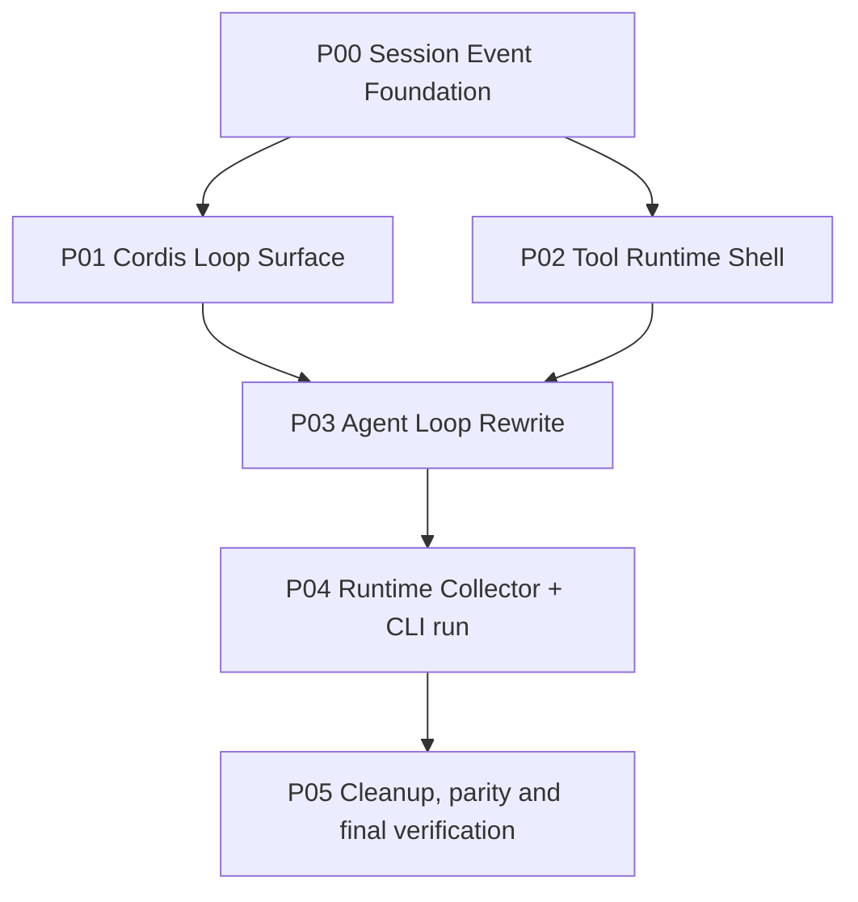

# ActSpace DSH Agent Loop / Session / Tool Shell 核心重构

状态：完成候选（核心实现与验证已落地，待归档到 completed/）

确认日期：2026-08-29

执行模式：交互模式。每个工作包完成后先跑其 contract tests，再进入下一个依赖阶段；本计划不授权删除数据、提交代码或发布制品。

## 1. 目标

在不改写 ActSpace 具体工具实现逻辑的前提下，把后端核心改为 DSH 风格：Session 使用 13 种核心持久化事件及可扩展事件目录，Agent Loop 暴露 9 个 Cordis 干预点，Runtime 发布 5 个主要通知，并让单次无头 `cli run` 通过同一 RuntimeHandle 完整执行、持久化、投影、flush 和退出。旧 ActSpace 事件模型不兼容、不迁移；CLI chat 留到后续。

## 2. 设计真源

- [DSH 风格 Session 事件模型](../../../design-docs/agent-plugin-runtime/agent-spec-dsh-event-model.md)
- [Agent Loop Cordis 插入面与通知面](../../../design-docs/agent-plugin-runtime/agent-spec-agent-loop-cordis-surface.md)
- [Tool Runtime 内核与外壳边界](../../../design-docs/agent-plugin-runtime/agent-spec-tool-runtime-boundary.md)
- [DSH-native 启动规范](../../../design-docs/agent-plugin-runtime/agent-decision-dsh-native-plugin-runtime.md)
- [插件 Runtime ABI](../../../design-docs/agent-plugin-runtime/agent-spec-plugin-runtime-abi.md)
- [Session 与 Context 背景设计](../../../design-docs/agent-plugin-runtime/agent-target-session-and-context.md)
- [现有 Tool Runtime ABI 背景](../../../design-docs/agent-plugin-runtime/agent-spec-tool-runtime-abi.md)
- `tmp/deepseek-harness/packages/core/session/src/types.ts`
- `tmp/deepseek-harness/packages/core/agent-loop/src/agent.ts`
- `tmp/deepseek-harness/packages/core/tools/src/index.ts`
- `tmp/deepseek-harness/docs/persistence-catalog.md`
- `/Users/wakeup-jin/Downloads/session/干预主链和相关通知.md`

新三份事件/Loop/Tool 规范取代旧 v2 计划中相应领域的实施入口；DSH-native 启动规范保留 Boot、`cordis.yml`、Include、Loader、`apply(ctx)` 和 AgentLoop Service 方向。旧计划其余 v2 范围仍保留为历史交付记录。

## 3. 固定范围

### 包含

- 13 种 DSH 核心 Session 事件、Envelope、codec/replay、顺序校验和 post-commit `session/event`；
- DSH 扩展持久化事件的分类和 codec/replay 入口，包含 `goal/change`、`schedule/change`，但不创建对应业务 producer；
- 9 个 Cordis Agent Loop waterfall/serial 干预点；
- 5 个主要通知及 Agent/Runtime/Session 生命周期通知；
- Agent scope、插件 activation/dispose、通知隔离和 quiescent shutdown；
- Tool Runtime 权限、审批、hook、Journal adapter、progress、诊断和 Host shell；
- 保留当前工具 definition、schema、executor body、artifact、redaction、协议和行为测试；
- 单次无头 `cli run` 的 boot → runTurn → flush → stable exit；
- 新格式下的 no-tool/tool/retry/error/abort/recovery contract tests、CLI JSONL tests 和 docs/histories 记录。

### 不包含

- CLI chat、交互式长连接 Inbox/UI；
- 现有具体工具的业务实现重写或大规模重命名；
- Goal/Schedule producer、generic Workflow、continuable/background Subagent；
- 旧 Session importer、旧事件兼容、双写或 fallback；
- 插件市场、不可信进程执行、前端插件注入；
- Desktop UI 视觉改造、真实 Provider/Chrome/Electron/签名发布门禁（这些是后续/外部验收）。

## 4. 不可违反的工具边界

Tool Runtime 可以全面改 ABI 和事件外壳，但以下行为默认不得改变：

1. read/list 等工具的参数、路径范围、排序、截断、编码与错误语义；
2. edit/write、bash/subprocess、Browser Bridge 的可观察副作用和结构化结果；
3. artifact 生成、redaction、输出规范化和已有 fixture/behavior tests。

权限、审批、ToolRuntime 事件、progress、Journal、Host adapter 和 Cordis hooks 属于可替换 shell。若 parity test 证明必须改动 kernel，必须先单独记录原因、输入输出差异和回滚点。

## 5. 依赖图

P00 是唯一的数据/协议地基；P01 和 P02 可在 P00 contract 稳定后分别执行；P03 必须等待二者；P04 只接入 `cli run`，P05 才做旧事件和旧入口的清理确认。

## 6. 子计划

| 包 | 子计划文件 | 交付重点 |
|---|---|---|
| P00 | [p00-runtime-boot-and-plugin-contract.md](./p00-runtime-boot-and-plugin-contract.md) | Session 13 核心事件、扩展 codec、append/replay/recovery |
| P01 | [p01-cordis-loop-surface.md](./p01-cordis-loop-surface.md) | scoped Cordis dispatcher、9 插入点、5 通知、生命周期 |
| P02 | [p02-agent-loop-service.md](./p02-agent-loop-service.md) | Tool Runtime shell、权限审批、三 hook、工具 parity |
| P03 | [p03-runtime-collector-cli-run.md](./p03-runtime-collector-cli-run.md) | Agent Loop DSH 顺序、chunk durable、retry/error/abort |
| P04 | [p04-cutover-legacy-boot.md](./p04-cutover-legacy-boot.md) | Runtime collector、单次 CLI run、flush 和稳定输出 |
| P05 | [p05-verification-and-handoff.md](./p05-verification-and-handoff.md) | 旧模型清理、完整验证、history/learning 收口 |

子计划文件名保留了早期草案的路径名；以每个文件正文的 P00–P05 标题和本 README 的依赖关系为准，不另建第二套计划入口。

## 7. 工作包验收摘要

### P00：Session Event Foundation

- 修改 `packages/session/journal/src/{core-codecs.ts,event-envelope.ts,invariant-validator.ts,codec-registry.ts,journal.ts}` 和 `packages/session/persistence/src/{session.ts,session-store.ts,recovery.ts}` 及对应测试；
- 固定 13 核心事件、扩展 codec、连续 `seq`、provenance、surface、commit 后 `session/event`；
- 覆盖 no-tool/tool/retry/error/abort/crash recovery golden JSONL；
- 验证：`pnpm --filter @actspace/session-journal test`、`pnpm --filter @actspace/session-persistence test` 及两包 `typecheck`。

### P01：Cordis Loop Surface

- 修改 `packages/cordis-adapter/src/{cordis-root.ts,cordis-types.ts,behavior-loader.ts,plugin-contract.ts,manifest.ts}` 和 `packages/core/agent/src/{registry.ts,publication.ts,inbox.ts}`；
- 提供受限 `on/emit/waterfall/serial`、Agent scope、activation/dispose drain、通知隔离；
- 验证：9 个干预点、5 个主要通知、生命周期、跨 Agent 写入拒绝和 post-commit 时序；
- 验证命令：`pnpm --filter @actspace/cordis-adapter test`、`pnpm --filter @actspace/core-agent test` 及两包 `typecheck`。

### P02：Tool Runtime Shell

- 修改 `packages/tools/runtime/src/{runtime.ts,scheduler.ts,prepared-execution.ts,policy.ts,approval-port.ts,result.ts,activation-lease.ts}`；不改具体工具 executor body；
- 保留参数物化、schema、lease、checkpoint、executor、artifact、redaction、ordered commit kernel；
- 接入 `tools/pre-execute`、`tools/execute`、`tools/post-execute`、`tools/result` 和唯一 tool call/result Journal adapter；
- 验证 read/list/edit/bash/Browser Bridge parity、permission/approval fail closed、取消/超时/dispose 和 stdout 隔离。

### P03：Agent Loop DSH 顺序

- 修改 `packages/core/agent-loop/src/{loop.ts,plugin.ts,manifest.ts}`、`packages/core/agent/src/*`、`packages/prompt/src/assembler.ts`、`packages/llm/service/src/service.ts` 及测试；
- 固定 `turn/start → user/message → step/start → request/header → request/context → assistant/chunk* → assistant/message → tool/call/result → step/end → turn-stopping → turn/end`；
- 接通 prompt/request/stream/tool hooks，retry 保持同一 step，error/abort 形成结构化终态和 `agent/error`；
- 验证：相关 agent-loop、agent、prompt、llm package tests/typecheck。

### P04：Runtime Collector + CLI run

- 修改 `packages/runtime/src/runtime/{boot.ts,run-controller.ts,runtime-handle.ts}`、`packages/runtime/src/projection/{live-progress.ts,cursor-stream.ts}`、`apps/cli/src/runtime-v2/{run.ts,types.ts,host-adapter.ts}`；
- Runtime 每进程只 boot 一个实例，collector 统一 Journal/通知/live，CLI stdout 只输出稳定 JSONL，diagnostics 走 stderr；
- 退出前等待 active tool/handler settlement、flush 和 `session/end-seed`；
- 验证 fresh/resume、no-tool/tool/retry/error/abort、通知丢失后 replay 和 CLI process smoke。

### P05：清理与最终验证

- 删除旧 `turn/started`、`request/snapshot`、`llm/chunk`、`llm/usage`、`llm/error`、`llm/aborted` 生产引用和 v1 fallback；
- 不删除用户 Session 数据，不做 importer，不修改无关 dirty-worktree；
- 运行完整 package tests/typecheck、`check:docs`、`check:current-docs`、`check:package-cutover`、`check:v2-legacy-removal`；
- 依据 `docs/HISTORY_GUIDE.md`、`docs/QUALITY_SCORE.md`、`docs/learnings/WRITING_GUIDE.md` 记录 history 和迁移学习。

## 8. 全局验收矩阵

| 场景 | 必须证明 |
|---|---|
| 单次无工具 | 13 核心事件顺序、chunk/message provenance、稳定 stdout/exit |
| 单次含工具 | tool/call → pre/execute/post → tool/result、权限/审批、tools/result |
| LLM retry | 同一 step，`llm/retry-started`/`llm/retry`，最终 step/turn 状态 |
| LLM error | 结构化 `step/end`/`turn/end` 与 `agent/error`，无半条事件 |
| abort/cancel | 已提交 chunk 保留，终态可重放，dispose 无 waiter 泄漏 |
| plugin intervention | 9 点顺序、Waterfall/Serial、scope 隔离、activation fail closed |
| session recovery | 崩溃后以最后完整 seq 恢复，不改写历史、不读旧格式 |
| extension codec | DSH 扩展可 replay，`goal/change`/`schedule/change` 无 producer 也不污染核心 |
| tool parity | read/list/edit/bash/Browser Bridge 的结果和副作用保持当前行为 |

## 9. 风险与最小回退

- 每个 chunk 落盘可能提高写入量：只优化 writer/write-behind，不能减少核心事实；
- Cordis API bridge 不足：在 `packages/cordis-adapter` 内包受限 dispatcher，不让 Cordis 类型穿过公共 ABI；
- 工具权限迁移导致行为差异：保留 kernel，逐工具 parity；失败时只回退 shell 适配；
- 新旧事件混用：P00 先让旧生产者编译失败，再按搜索清单删除，不做双写；
- 崩溃/取消边界复杂：用 fault injection 和 golden replay，不手工修日志。

最小回退是回滚代码提交并保留设计/计划文档；本计划不执行 Session 数据删除或不可逆迁移。

## 10. 计划状态

- [x] 2026-08-29：核对 DSH Session、Agent Loop、Tools 源码、持久化目录和附件三平面。
- [x] 2026-08-29：写入三份设计规范并更新索引、决策和旧文档 supersession 标记。
- [x] 2026-08-29：拆出 P00–P05 子计划、依赖图、文件边界、验证和回退策略。
- [x] 用户审核并批准本计划。
- [x] P00–P04 实施与逐包 contract verification。
- [x] 最终完整验收、history/learning 文档和产品切换评审（严格 package-cutover 已通过；测试 fixture 不计入运行时路径）。

用户已批准实现；执行过程与结果记录见 `docs/exec-runs/20260829-actspace-dsh-core-rebuild/`。
