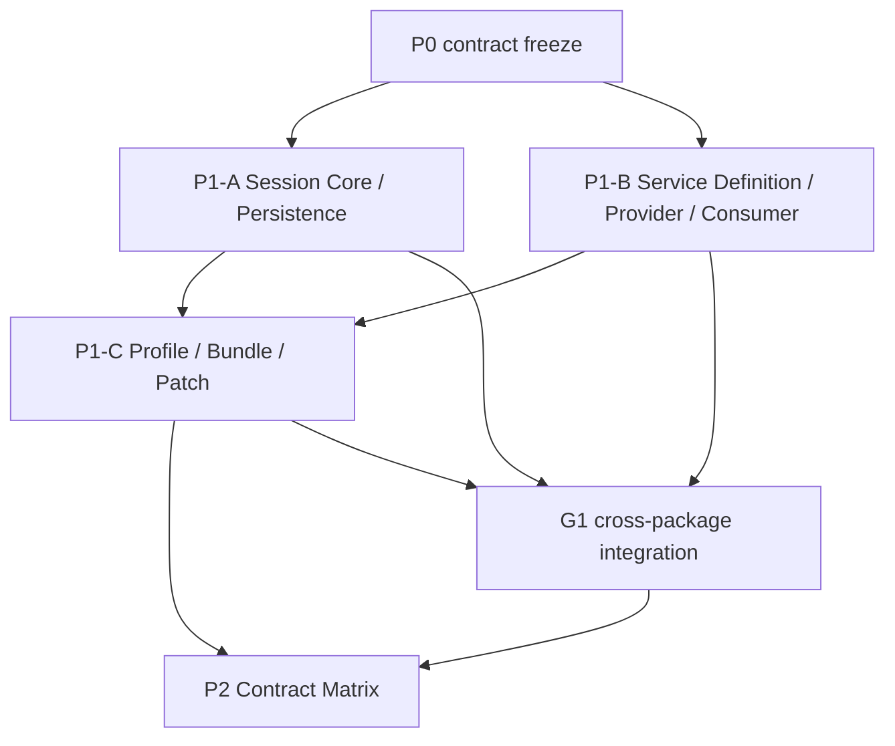

# ActSpace P1/P2：Session、Service、Composition 与契约矩阵

状态：实施中；P1-A、P1-B、P1-C、P2 contract slices 已交付，G1 跨包收口待执行；P2 字节漂移检查通过，但完整 G2 语义门禁仍有缺口。

确认日期：2026-08-29

执行模式：交互模式。实现阶段仍需逐包验证和人工确认；本计划本身不授权提交、发布、删除数据或修改用户 Session。

## 1. 目标

在已完成的 P0 DSH 核心事件、Cordis Event ABI、Agent Scope、核心 Service seam 和单次 CLI run 基线之上，完成四个后续能力：

1. Session Core 与可替换 Persistence Provider 的真实分离；
2. 全部核心能力统一采用 Service Definition / Provider / Consumer 三层；
3. Profile / Bundle / Patch 形成唯一的 `ResolvedComposition / BootManifest` 激活事实；
4. 自动生成契约矩阵，机械检查事件、Service、插件组装和 package export 漂移。

最终结果仍以 CLI 单次无头 `run` 为第一条集成验收链，CLI chat、Goal/Schedule producer 和具体工具 executor 不在本轮扩展。

## 2. P0 输入冻结

以下 P0 产物作为本计划的只读输入，不重新设计、不复制第二套契约：

- [DSH 核心重构执行摘要](../../../exec-runs/20260829-actspace-dsh-core-rebuild/execution-summary.md)
- [Cordis Event ABI 执行摘要](../../../exec-runs/20260829-actspace-cordis-event-abi-and-eventhub-retirement/execution-summary.md)
- [Core Cordis Services 执行摘要](../../../exec-runs/20260829-actspace-core-cordis-services/execution-summary.md)
- [Agent Scope 执行摘要](../../../exec-runs/20260829-actspace-agent-scope-model/execution-summary.md)

冻结内容包括：13 个 Session 核心事件、扩展事件 codec 入口、9 个 Loop 插入点、5 个主要通知、Cordis `next()`/serial/parallel/contained emit 语义、opaque Agent Scope identity、现有工具 kernel 和 CLI run 的 boot/followup/flush/dispose 生命周期。

若实施发现 P0 事实与上述摘要不一致，先暂停对应子计划并更新事实证据；不得在 P1/P2 中悄悄改写 P0 ABI。

## 3. 设计真源

- [Session Core 与 Persistence Provider 分离规范](../../../design-docs/agent-plugin-runtime/agent-spec-session-core-persistence-separation.md)
- [Service Definition / Provider / Consumer 分层规范](../../../design-docs/agent-plugin-runtime/agent-spec-service-definition-provider-consumer.md)
- [Profile / Bundle / Patch 分层规范](../../../design-docs/agent-plugin-runtime/agent-spec-profile-bundle-patch-layering.md)
- [Agent Contract Matrix 自动生成规范](../../../design-docs/agent-plugin-runtime/agent-spec-contract-matrix-generation.md)
- [DSH 风格 Session 事件模型](../../../design-docs/agent-plugin-runtime/agent-spec-dsh-event-model.md)
- [Agent Loop Cordis 插入面与通知面](../../../design-docs/agent-plugin-runtime/agent-spec-agent-loop-cordis-surface.md)
- [插件 Runtime ABI](../../../design-docs/agent-plugin-runtime/agent-spec-plugin-runtime-abi.md)
- [核心 Cordis Service 化与能力 seam](../../../design-docs/agent-plugin-runtime/agent-spec-core-cordis-services.md)
- [Agent 测试策略](../../../design-docs/agent-plugin-runtime/agent-testing.md)

DSH 参考源码只用于验证机制：`tmp/deepseek-harness/packages/core/session/`、`tmp/deepseek-harness/packages/session/session-persistence/`、`tmp/deepseek-harness/packages/boot/` 和 Cordis vendor；ActSpace 工具的具体行为以当前 package tests 和 executor parity fixture 为准。

## 4. 范围

### 包含

- 新增 `@actspace/session-core` 或等价 Core seam，并使 Session Core 不再导入 JSONL writer；
- 将 JSONL 文件、lease、write-behind、torn-tail recovery 保持在独立 Provider package；
- 为 Session、Journal、Persistence、LLM、Prompt、Tools、Agent、Compaction、Loop、Runtime 等核心能力补齐 Definition/Provider/Consumer 可审计元数据；
- 收敛默认 Runtime Boot 到单一 Profile/Bundle/Patch 解析结果和 Cordis Loader 输入；
- 生成确定性的 JSON/Markdown 契约矩阵及 `--check` 漂移门禁；
- 完成 package contract、生命周期、CLI one-shot 和全仓文档/类型/测试验证。

### 不包含

- CLI chat、交互式 Inbox UX、在线 HMR 或运行时 reconcile；
- Goal/Schedule 业务 producer、generic Workflow、continuable/background Subagent；
- `read`、`list`、`grep`、`edit`、`write`、`bash`、Browser Bridge executor 的实现逻辑重写；
- SQLite、zstd、远程 Session backend、数据 importer、双写或旧事件兼容；
- 不可信插件沙箱、市场、签名、自动更新和远程下载；
- Electron/Chrome/真实 Provider/DMG 签名等外部宿主门禁。

## 5. 依赖图和并行边界



- P1-A 和 P1-B 在 P0 冻结后可以并行；二者只通过公开 contract 文件交接，不共享实现文件。
- P1-C 可以先实现纯 composer/schema 测试，但接入生产 Boot 必须等待 P1-A/P1-B 的 public metadata 稳定。
- P2 可以先搭建只读 normalizer fixture，但最终生成和 CI 门禁必须消费 P1-A/B/C 的最终声明。
- G1 是唯一允许集中处理跨包接线的阶段；在 G1 之前不得让子计划互相修改对方所有权文件。

## 6. 工作包

| 编号 | 计划 | 依赖 | 主要产物 | 可独立合并 |
| --- | --- | --- | --- | --- |
| P1-A | [Session Core / Persistence](../20260829-actspace-p1-session-core-persistence/README.md) | P0 freeze | Core contract、JSONL Provider seam、fake provider、parity tests | 是；生产接线前需 G1 |
| P1-B | [Service Roles](../20260829-actspace-p1-service-roles/README.md) | P0 freeze | Definition/Provider/Consumer metadata、manifest verifier、lifecycle tests | 是 |
| P1-C | [Profile / Bundle / Patch](../20260829-actspace-p1-profile-bundle-patch/README.md) | P0；生产接线依赖 A/B | 唯一 ResolvedComposition、BootManifest、CLI/Runtime 统一入口 | 纯 composer 是；Boot cutover 需 G1 |
| P2 | [Contract Matrix](../20260829-actspace-p2-contract-matrix/README.md) | 最终依赖 A/B/C | 生成器、JSON/Markdown 产物、CI `--check` 门禁 | generator fixture 是；最终门禁需 G2 |

## 7. 文件所有权

| 计划 | 默认拥有的路径 | 明确禁止 |
| --- | --- | --- |
| P1-A | `packages/session/core/**`（新增）、`packages/session/persistence/**`、`packages/session/jsonl/**`、Session tests 和 manifests | 不改 Agent Loop 事件 ABI；不改工具 executor；不让 Core 重新依赖 JSONL writer |
| P1-B | `packages/cordis-adapter/src/service-contract.ts`、各领域 Definition/Provider/Consumer metadata、service contract tests | 不改 Session Provider 实现；不改工具 executor body；不建立中央 service map |
| P1-C | `packages/bundle/**`、`packages/composition/**`、`packages/runtime/src/profiles/**`、`packages/runtime/src/runtime/boot.ts`、config transport、CLI/Runtime composition tests | 不维护第二份插件清单；不绕过 Host ceiling；不做 online reconcile |
| P2 | `scripts/contract-matrix/**`、`artifacts/agent-contract-matrix.json`、generated Markdown、CI/check script 与 generator tests | 不改 Runtime activation、Session schema、Tool executor 或手工添加例外映射 |

共享文件规则：根 `package.json`、workspace lockfile、公共 index、README 只能在工作包 contract 已明确后由 G1 集中修改；子计划不得为方便测试直接改动另一个计划的实现目录。

## 8. 实施阶段

### 阶段 0：P0 输入复核

执行人只读核对 P0 摘要、对应源码和测试结果，列出可消费的 symbol、Service ID、事件目录和配置入口。任何差异形成阻断诊断，直到事实更新完成。

### 阶段 1：P1-A / P1-B 并行 contract slice

先写 type-only/public metadata 和 fake/contract tests，再落默认 Provider。两包都必须先证明“Consumer 不依赖具体 Provider”，再接入生产 Boot。

### 阶段 2：P1-A Provider integration

把现有 SessionHandle 的 JSONL 物理职责移动到 Provider seam，保持 raw JSONL、lease、recovery、flush 和 golden 结果；接入 `session/event` post-commit 与 `session/flush` durability barrier。

### 阶段 3：P1-C composition/boot integration

统一 Profile、Bundle、Patch 和 Host ceiling 的解析结果；让 CLI、Runtime fixture 和 Desktop 入口消费同一 `BootManifest`，并移除默认生产路径的 `serviceValues`/第二套激活列表。

### 阶段 4：G1 跨包回归

用单次 CLI run 验证 `boot → create/open Session → followup → Agent Loop → tool/LLM → flush → dispose`。检查 Session Provider、Service lifecycle、Composition digest、通知 collector 和 stdout/stderr 契约没有互相绕过。

### 阶段 5：P2 矩阵与 G2 门禁

接入最终 declarations 和 `ResolvedComposition`，生成 JSON/Markdown，运行 fixture drift、缺 provider、缺 codec、错误 capability ceiling 和 package export 缺口测试；CI 使用 `--check` 拒绝未更新产物。

## 9. 全局验收门

| 门 | 通过条件 |
| --- | --- |
| G0 | P0 事件、scope、Cordis mode、工具 kernel 和 CLI run baseline 有可追溯证据 |
| A | Session Core 生产源码不导入 JSONL writer；fake/JSONL Provider 可替换；13-event/recovery/fork golden 不变 |
| B | 每个核心 Service 有 Definition、Provider、Consumer；manifest/inject/provide 一致性错误 fail closed |
| C | CLI/Runtime/fixture 使用同一 immutable BootManifest；digest、Patch、Host ceiling 和 restart-only 有 contract tests |
| G1 | CLI one-shot fresh/resume、tool/no-tool、retry/error/abort、flush/dispose 和 process smoke 全通过 |
| G2 | 矩阵可重复生成，所有 13+9+5 事件有正确状态，漂移 fixture 由 `--check` 拒绝 |

## 10. 验证命令

每个子计划先执行自己的定向命令，再由 G1/G2 执行：

```bash
pnpm -r typecheck
pnpm -r test
pnpm run check:docs
pnpm run check:current-docs
pnpm run check:packages
pnpm run check:v2-legacy-removal
pnpm test:agent-cli:process
pnpm run gen:contract-matrix --check
```

命令不存在时，负责的子计划必须先把脚本/入口作为自身产物落地；不能把缺少命令当成“跳过门禁”。真实 Provider、Chrome、Electron、签名/公证仍标记为外部人工门禁，不以本地自动测试冒充通过。

## 11. 风险和最小回退

- Provider seam 破坏现有 recovery：只回退 Core/Provider adapter，保留 JSONL 文件和 Journal 语义，不双写。
- Service metadata 漂移：关闭对应 Provider admission，保留 Definition/fake tests，不恢复中央 service map。
- Composer 与 Cordis Loader 输入不一致：回退到 Boot 生成受控 transport 文件，不恢复第二套生产 activation 列表。
- 矩阵误报：修正 explicit input allowlist/normalizer fixture，不在生成器中添加按路径的特例。
- 并行冲突：停止进入 G1，按文件所有权拆分 handoff patch；不使用 broad staging 或破坏性回滚。

所有回退都不删除用户 Session、不修改具体工具实现、不恢复旧事件双写。

## 12. 进度记录

- [x] 2026-08-29：复核 P0 设计与执行摘要，确认 P1/P2 不需要重新打开 P0 方向。
- [x] 2026-08-29：新增四份目标设计规范。
- [x] 2026-08-29：拆分 P1-A、P1-B、P1-C、P2 子计划并写明文件所有权。
- [x] P1-A Session Core / Persistence contract slice 完成；CLI persist/resume 与全仓门禁待 G1。
- [x] P1-B Service Roles contract slice 完成；全仓门禁待 G1。
- [x] P1-C Profile / Bundle / Patch schema、digest、loader transport parity 完成；restart/one-shot 待 G1。
- [ ] G1 CLI one-shot 跨包回归。
- [x] P2 Contract Matrix generator、产物、字节 `--check` 和 CI wiring 完成；旧摘要记录当时 G2 通过。
- [ ] 2026-09-09 复核：补齐 P2 原验收要求的语义 validator 与负向 fixtures 后再完成 G2，不以字节一致性代替语义校验。
- [x] 更新对应 execution-runs、history 和必要的 learning 文档。

执行记录已按 [exec-runs 规范](../../../exec-runs/README.md) 更新；当前仍保留 G1 未完成边界；G2 原始通过记录与本次发现的语义检查缺口分别留痕，不把定向 contract slice 误报为最终运行时验收。

## 13. 交接要求

每个子计划交接时必须提供：修改文件清单、公开 contract diff、定向测试命令及结果、未通过的外部门禁、回滚点和下游消费说明。下一个 Agent 先读本 README、对应设计规范和 `AGENTS.md`，再开始代码修改。

## 2026-09-09 状态复核

P1-A/B/C 的实施记录集中在 [联合执行摘要](../../../exec-runs/20260829-actspace-p1-session-core-persistence/execution-summary.md)。子计划的 contract slice 不等于本计划第 9 节的完整 G1 通过。下一步统一由 G1 收集 fresh/resume、tool/no-tool、retry/error/abort、flush/dispose 证据，避免各子计划重复宣称整体验收完成。

P2 保留 active；字节漂移检查已恢复通过，语义 validator 与负向 fixtures 的剩余工作见 P2 实施范围复核。本轮全仓 typecheck/test 在中文界面任务收口后已通过，详见 [本次文档复核](../../../exec-runs/20260908-docs-v1-archive-v2-refresh/followup-audit.md)；这些通用回归不能替代上方完整 G1 CLI/process 矩阵或 P2 缺失的语义检查。
