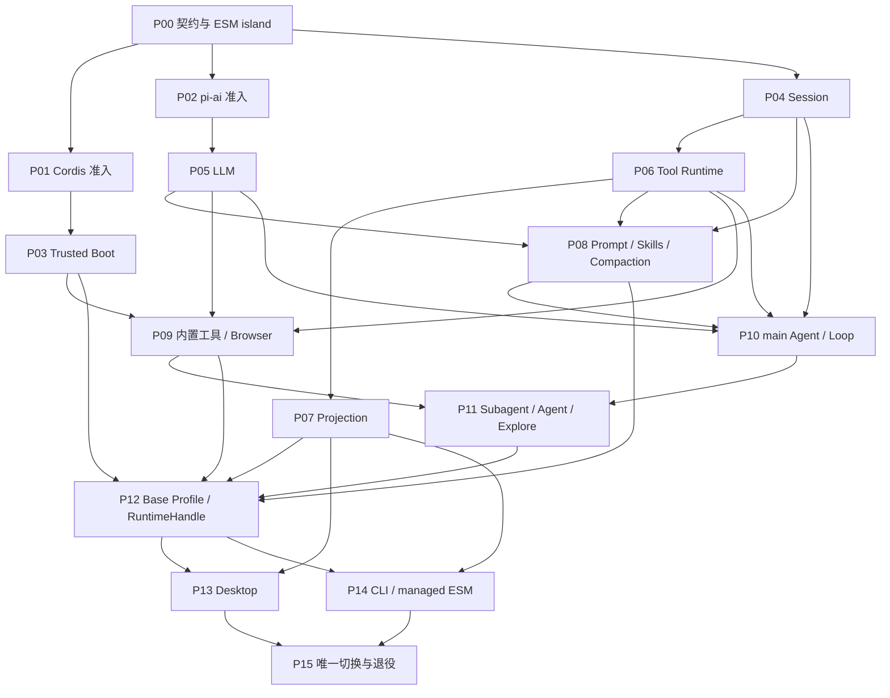

# ActSpace v2 插件化 Agent Runtime 完整交付计划

状态：实现已完成，2026-09-08 按计划生命周期归档；历史记录中的真实宿主、人工验收及回归证据边界继续保留，本次未重跑产品验收。


> 2026-08-24 架构修正：本文原有的“单一 `@actspace/agent-runtime` ESM package”、`agent-runtime/src/*` 内部拆分和 `src/plugins/*` 路径只适用于此前的实现交付，不再是 v2 的最终包结构。产品语义、公共 ABI、Session 格式、Host 边界和完整交付范围继续有效；package boundary、manifest/codec/behavior entry、workspace 拆分和 Browser Bridge 顶层路径以 [包结构与真实插件包规范](../../../design-docs/agent-plugin-runtime/agent-spec-package-layout-and-plugin-packaging.md) 及 [包拆分与真实插件包化执行计划](../20260824-actspace-v2-package-layout-and-plugin-packaging/README.md) 为准。

确认日期：2026-08-22

> 2026-08-29 起，Session 事件模型、Agent Loop Cordis 插入面、Tool Runtime 外壳和单次 CLI run 的实施入口由 [DSH Agent Loop / Session / Tool Shell 核心重构计划](../20260829-actspace-dsh-core-rebuild/README.md) 取代。本文件其余 v2 范围保留为历史交付记录，不作为上述四个领域的实施真源。

执行模式：交互模式。单个边界明确、无外部副作用的工作包可在独立 worktree 中并行执行；共享依赖、Desktop 集成、最终切换和任何数据清理必须由主集成线串行执行。

## 1. 目标

在 `refactor-dsh-plugin` 分支上完成一次 ActSpace v2 后端重写：以 DSH 发布的 Cordis family 作为受信任同进程插件生命周期基座，在新的 ESM Runtime island 中实现 ActSpace 自有的 Session、LLM、Prompt、Tool、Agent 与 Host 语义，迁移现有工具行为和 Browser Bridge，最终让 Desktop、CLI run 与 CLI chat 通过同一 `RuntimeHandle` 契约运行。

本计划只认可一次产品交付。P00-P14 是内部可合并、可独立验证的工作包；当前源码入口已经切换为 v2-only，P15 负责发布门禁、制品验证和最终验收，不再维护 v1 fallback。任何中间工作包完成都不表示可以发布“部分 v2”。

## 2. 设计来源

- [v2 总体架构](../../../design-docs/agent-plugin-runtime/agent-target-overall-architecture.md)
- [v2 已确认决策](../../../design-docs/agent-plugin-runtime/agent-decisions-v2-foundation.md)
- [Cordis 采用决策](../../../design-docs/agent-plugin-runtime/agent-decision-cordis-adoption.md)
- [Agent Core 目标边界](../../../design-docs/agent-plugin-runtime/agent-target-agent-core.md)
- [Session 与 Context 目标设计](../../../design-docs/agent-plugin-runtime/agent-target-session-and-context.md)
- [LLM Adapter 目标设计](../../../design-docs/agent-plugin-runtime/agent-target-llm-adapter.md)
- [Runtime 与 Composition 目标设计](../../../design-docs/agent-plugin-runtime/agent-target-runtime-architecture.md)
- [插件 Runtime ABI](../../../design-docs/agent-plugin-runtime/agent-spec-plugin-runtime-abi.md)
- [Session Format v1](../../../design-docs/agent-plugin-runtime/agent-spec-session-format-v1.md)
- [Tool Runtime ABI](../../../design-docs/agent-plugin-runtime/agent-spec-tool-runtime-abi.md)
- [Runtime Projection](../../../design-docs/agent-plugin-runtime/agent-spec-runtime-projection.md)
- [Prompt 与 Context Contributor](../../../design-docs/agent-plugin-runtime/agent-spec-prompt-context-contributors.md)
- [Agent 与 Subagent](../../../design-docs/agent-plugin-runtime/agent-spec-agent-and-subagent.md)

目标设计和六份公共契约是语义真来源。本目录只决定实现路径、文件所有权、机械参数、验收与回滚；执行时不得用旧 v1 实现反向修改已确认的 v2 语义。

## 3. 完整交付范围

必须全部完成：

- `@actspace/agent-runtime` ESM package、Cordis Trusted Boot、Profile / Bundle / Patch、Startup Validation、诊断和 quiescent shutdown；
- raw UTF-8 `journal.jsonl`、append-only Journal、Surface、Event Codec、writer lease、checkpoint、repair、cold fork 和 Compaction；
- ActSpace LLM 契约、one-shot `PreparedLlmCall`、pi-ai Adapter、必要时的 legacy proxy backend、usage / failure / retry / secret 边界；
- Agent Scope、Prompt / Context Contributor、Skills、main Agent、Turn / Step Loop、durable Inbox、Todo；
- 同一个 synchronous one-shot Subagent seam，以及基于静态 descriptor 的 `agent` / `explore`；
- Tool Runtime 的 prepared execution、policy、Host approval、checkpoint、有界并行、有序提交和 generic projection；
- 现有文件、搜索、Bash、Web、图片和 Browser 工具行为；Browser Bridge 继续作为 Host capability；
- Desktop、CLI run、CLI chat 使用同一个 `RuntimeHandle` 契约；固定 renderer 使用 generic DTO 与构建时 allowlist；
- managed ESM CLI 制品、packaged Electron、真实 Provider、真实 Browser Bridge、TTY 与故障注入验收；
- 删除旧后端代码、Kairos、fs-watch、SEA 和全部已废弃产品入口。

明确不做：插件市场、签名、自动更新、不可信代码沙箱、前端插件加载、在线 reconcile / HMR、全局 Composition Generation、zstd / SQLite Session、v1 Session importer、generic Workflow、background / continuable Subagent、StandingMount、Agent Room / Team v2 重写。

## 4. 固定机械决策

### 4.1 Package 与模块边界

- 新建 `packages/agent-runtime/`，包名固定为 `@actspace/agent-runtime`。
- 该包使用 `"type": "module"`、TypeScript `NodeNext`、`strict: true`，只通过 package exports 暴露公共 API，禁止 `src/*` deep import。
- `packages/agent-core/` 已在 P15 从 Git 跟踪源码中退役；v2 不在旧 CommonJS 包里原位重写。
- v2 的 Host DTO 放在 `packages/shared/src/runtime-v2/` 命名空间，不提前改写旧 `SessionEvent`、`RuntimeStreamEvent` 或 v1 Session 类型。
- CJS Host 通过 `@actspace/agent-runtime/loader` 的小型 `.cjs` bridge 使用原生 `import()` 加载 ESM，Host 不直接持有 Cordis `Context`。
- P15 删除 `packages/agent-core/`，不长期维护双 Agent 内核。

### 4.2 数据与配置

- v2 持久 Session 固定使用 `<dataRoot>/sessions-v2/<session-id>/journal.jsonl`。
- 旧 `<dataRoot>/sessions/` 不导入、不混读，也不在自动切换时删除；代码回滚不会改写 v2 Journal。
- v2 Profile / Bundle / Patch 使用 `<dataRoot>/runtime-v2/` 下的版本化配置；配置只含 JSON-safe 值和 `credentialRef`。
- 保留仍有效的 settings、provider credentials、workspace、Skills 与 Browser Bridge 安装资产；P15 移除 Kairos、fs-watch 和旧 Runtime 配置字段，未触碰用户数据。
- 旧 Session/Kairos/fs-watch 用户数据的物理删除不是 v2 发布门禁。若之后需要清理，另建交互模式破坏性计划，先 dry-run、备份并再次获得用户确认。

### 4.3 内部候选与唯一切换点

- v2 已成为 Desktop 与 CLI 源码的唯一入口；不再保留候选环境变量、v1 fallback 或第二套 Agent engine。
- P15 是正式发布闸门：在 fresh install、packaged smoke 和真实 Host 验收通过前，不把当前工作树称为可发布制品。

## 5. 工作包依赖图



## 6. 子计划清单

| Plan | 目标 | 主要路径 | 依赖 |
|---|---|---|---|
| [P00](actspace-v2-p00-contracts-and-esm-island.md) | 建立 namespaced Host DTO、package boundary 测试与 ESM package 空间 | `packages/shared/src/runtime-v2/`、`packages/agent-runtime/` | 无 |
| [P01](actspace-v2-p01-cordis-admission.md) | 把 Cordis 五包准入变成可重复合同测试 | `agent-runtime/src/compatibility/cordis/` | P00 |
| [P02](actspace-v2-p02-pi-ai-admission.md) | 验证 pi-ai 路由、错误、proxy、retry、lease 与 packaged loading | `agent-runtime/src/compatibility/pi-ai/` | P00 |
| [P03](actspace-v2-p03-trusted-boot-and-composition.md) | 实现 Plugin ABI、Composition、Cordis Boot、Startup Validation | `agent-runtime/src/{plugin,composition,boot,diagnostics}/` | P00、P01 |
| [P04](actspace-v2-plan-04-session-journal-and-persistence.md) | 实现 Journal、Surface、codec、raw JSONL、恢复与 fork | `agent-runtime/src/session/` | P00 |
| [P05](actspace-v2-plan-05-llm-service-and-adapters.md) | 实现 ActSpace LLM Service、PreparedCall 与 Adapter | `agent-runtime/src/llm/` | P00、P02 |
| [P06](actspace-v2-plan-06-tool-runtime.md) | 实现 Tool Registry、prepared execution、安全顺序和调度 | `agent-runtime/src/tools/` | P00、P04 |
| [P07](actspace-v2-plan-07-runtime-projection.md) | 实现 durable/live/diagnostics 三平面和 generic DTO | `agent-runtime/src/projection/` | P00、P04、P06 |
| [P08](actspace-v2-plan-08-prompt-skills-and-compaction.md) | 实现 Scope、Contributor、Skills、Request Assembly、Compaction | `agent-runtime/src/{scope,prompt,skills,compaction}/` | P04、P05、P06 |
| [P09](actspace-v2-plan-09-built-in-tools-and-browser.md) | 迁移具体 executor 和 Browser Bridge Host capability | `agent-runtime/src/plugins/{core-tools,browser-tools}/` | P03、P05、P06 |
| [P10](actspace-v2-plan-10-main-agent-loop-inbox-and-todo.md) | 实现 main Agent、Loop、Inbox、Todo、恢复和取消 | `agent-runtime/src/agent/` | P04、P05、P06、P08 |
| [P11](actspace-v2-plan-11-one-shot-subagent.md) | 实现静态 Preset、child Session、Agent / Explore | `agent-runtime/src/agent/subagent/` | P09、P10 |
| [P12](actspace-v2-plan-12-base-profile-and-runtime-handle.md) | 组装完整 Base Profile 与进程级 RuntimeHandle | `agent-runtime/src/{profiles,runtime}/` | P03-P11 |
| [P13](actspace-v2-plan-13-desktop-host-and-fixed-renderer.md) | Desktop main/preload/renderer 全量接入 v2-only 入口 | `apps/desktop/`、`packages/shared/src/runtime-v2/` | P07、P12 |
| [P14](actspace-v2-plan-14-cli-hosts-and-managed-esm.md) | CLI run/chat 接入并建立 managed ESM 制品 | `apps/cli/`、CLI packaging scripts | P07、P12 |
| [P15](actspace-v2-plan-15-cutover-and-legacy-retirement.md) | 完整验收、一次切换、删除旧后端和旧产品能力 | 全仓受影响路径 | P13、P14 |

## 7. 公共契约追踪

| 设计契约 | 首次实现 | 集成消费 | 最终验收 |
|---|---|---|---|
| Plugin Runtime ABI | P03 | P09、P12-P14 | P15 |
| Session Format v1 | P04 | P06-P14 | P15 的 17 个 golden cases 与真实 Journal 检查 |
| Tool Runtime ABI | P06 | P09-P14 | P15 的每工具 parity 和故障注入 |
| Runtime Projection | P07 | P13、P14 | P15 的 snapshot/cursor、fallback、redaction |
| Prompt / Context Contributor | P08 | P10-P14 | P15 的 byte-stable request snapshot |
| Agent / Subagent | P10、P11 | P12-P14 | P15 的 Inbox、Todo、Agent / Explore、恢复 |

## 8. 并行与文件所有权

- P01、P02 与 P04 可以并行研究和写测试，但 `packages/agent-runtime/package.json`、根 `package.json`、`pnpm-lock.yaml` 由主集成者串行修改：先 P01 锁 Cordis family，再 P02 锁 pi-ai。
- P03 与 P05 可并行；两者不得修改对方领域目录。
- P07、P08、P09 在各自依赖满足后可并行。
- P09 只迁移普通 executor 与 Browser；不得实现 `agent`、`explore`、Todo 或 main Loop。P10/P11 不复制普通 executor。
- P13 独占 Desktop、preload、renderer 和 Shared IPC；P14 独占 CLI。两者对 `packages/shared/src/runtime-v2/` 的调整先由 P07 定稿，再串行合并。
- P12 与 P15 是集成单线，不能与尚未完成的上游领域改动同时修改 Composition、RuntimeHandle 或根构建脚本。
- 现有 `frontend-ui-components-foundation` 计划不得与 P13 同时修改同一 renderer 文件。
- 现有 Agent Team 与 Bash session allowlist 计划依赖旧 Session / ContextManager / ToolManager，不属于本次 v2 范围；P00 只记录契约冲突，P15 在唯一产品切换时把旧实施方案移入 `discarded/`，并写明未来必须基于 v2 公共契约重新设计。

## 9. 外部依赖门禁

### Cordis

精确版本固定为：

- `@deepseek-ai/cordis@4.0.1`
- `@deepseek-ai/cordis-plugin-loader@1.0.2`
- `@deepseek-ai/cordis-plugin-include@1.0.6`
- `@deepseek-ai/cordis-plugin-group@1.0.1`
- `@deepseek-ai/cordis-plugin-timer@1.1.3`

P01 必须证明 fresh registry install、公开 exports / types / peer range、单实例依赖树、Node 与 Electron lifecycle、Loader / Include、Effect cleanup、异步 disposer 和 packaged loading。任一硬门禁失败则停止 P03-P15，回到 Cordis ADR；禁止使用旧上游 Cordis、私有 deep import 或直接修改依赖源码。

### pi-ai

首个验证版本固定为 `@earendil-works/pi-ai@0.82.1`。P02 必须证明 Completions、Responses、Anthropic、reasoning、tool、image、usage、structured failure、abort、SDK retry、direct/proxy isolation、lease drain 和 packaged loading。

若 scoped proxy 的公开注入面缺失，但其余硬门禁通过，P05 采用确定的双 backend：direct route 走 pi-ai，需要代理的 route 走迁移后的 ActSpace transport；上层仍只有一套 ActSpace LLM 契约。若基础路由、packaged ESM、结构化错误或关闭内部 retry 只能靠私有 API 才能成立，则停止 P05-P15 并重开采用范围评审。

## 10. 总体验收矩阵

| 范围 | 必须通过 |
|---|---|
| Boot / Plugin | stable id、Patch provenance、Host ceiling、`frontend.required`、Fiberless / FAILED / PENDING、restart-only、资源静止 |
| Session | 17 个 golden cases、连续 seq、writer lease、short write / fsync / torn tail、unknown codec、repair、fork、compaction、无 secret |
| LLM | 三 route、text / reasoning / tool / image / replay、usage / cost、401/402/403/429/5xx、Retry-After、proxy、abort、one wire attempt、lease once |
| Prompt | 随机注册顺序仍 byte-stable、重复 id fail-fast、Host / Skill provenance、required / optional contributor failure |
| Tools | 每个保留 executor 的 v1 parity、approval、checkpoint fail-closed、有界并行、有序 commit、cancel / outcome-unknown、redaction |
| Agent | main Turn / Step、durable Inbox、Todo、Skills、Compaction、Agent / Explore、child lineage、publication compensation、cascade cancel |
| Projection | cache 删除重建、snapshot/cursor 无丢失、Tool 五态、generic fallback、allowlist、artifact missing、三 Host parity |
| Desktop | packaged `.app`、真实 IPC、renderer reload、审批、退出 drain、恢复、浅深主题、真实 Provider 与 Browser Bridge |
| CLI run | 默认 ephemeral、`--persist` 才落盘、text / JSON / JSONL、无 TTY 审批、SIGINT 130、安装制品运行 |
| CLI chat | persistent、`/new` / `/resume`、TTY approval、EOF / SIGINT、跨进程 writer 竞争 |
| Supply chain | clean checkout、frozen lock、公开 exports、唯一 Cordis family、生产依赖完整、SBOM / notice |
| Legacy removal | v1 engine、Kairos、fs-watch、SEA、旧 Session / Context / Tool bridge、candidate flag 在源码和制品中均不可达 |

## 11. 全局验证命令

执行 P15 前必须在干净 checkout 中全部通过：

```bash
pnpm install --frozen-lockfile
pnpm run ci
pnpm typecheck
pnpm test
pnpm build
pnpm check:browser
pnpm package:desktop
pnpm package:agent-cli
pnpm check:docs
pnpm check:repo
pnpm check:secrets
git diff --check
```

真实 Desktop、真实 Provider、真实 Chrome / Extension / Go bridge 和 TTY 不可由 browser mock 或单元测试替代；结果记录到 P15 对应 `exec-runs`。

## 12. No-return Gate

只有同时满足以下条件，P15 才能切换：

1. P00-P14 全部完成，exec-run 中有命令、fixture、日志和人工验收边界。
2. Cordis 与 pi-ai proof 结论已签收，exact versions 和 lock integrity 已固定。
3. v2 候选覆盖全部产品范围，不存在以 v1 engine 补洞的运行路径。
4. clean checkout 的自动化、managed CLI 和 packaged Desktop 制品通过。
5. 用户完成 Desktop、CLI、真实 Provider 与 Browser Bridge 验收。
6. `v1-final` tag 可解析，已知良好 v1 制品或可重复构建证据可用。
7. v1 writer / process 已停止，v1 与 v2 Session root 已盘点；不执行自动数据删除。
8. 切换后制品只包含 v2 Runtime，candidate selector、旧 engine、Kairos、fs-watch 与 SEA 已移除。

真正不可逆的边界是 v2 首次执行真实文件、网络或 Browser 副作用。Git 或二进制可以回退，已经发生的外部动作不能承诺事务回滚或 exactly-once。

## 13. 回滚策略

| 时点 | 回滚方式 | 明确不承诺 |
|---|---|---|
| P00-P14 | 删除或 revert 隔离的 v2 代码，v1 默认入口和旧数据不变 | 不需要迁移数据 |
| P15 发布前 | revert 最终 cutover commit，恢复 v1 构建入口 | 不触碰 `sessions-v2/` |
| v2 已安装但尚无外部副作用 | 重装 v1 制品，恢复 settings 备份，保留 v2 Journal | v1 不能 resume v2 Journal |
| v2 已产生外部副作用 | 回退代码与 Runtime；人工核对 workspace、网络和 Browser 变化 | 不自动撤销外部动作 |
| 用户已明确删除旧数据 | 只能从用户确认的备份恢复 | 没有备份时无恢复路径 |

## 14. 必读与执行记录

执行任一子计划前必须阅读：

- `AGENTS.md`
- `docs/REPO_COLLAB_GUIDE.md`
- `docs/ARCHITECTURE.md`
- `docs/design-docs/core-beliefs.md`
- `docs/design-docs/agent-plugin-runtime/README.md`
- 当前子计划列出的设计契约和代码路径
- `docs/CODING_BEHAVIOR.md`
- `docs/HISTORY_GUIDE.md`
- `docs/QUALITY_SCORE.md`

每个子计划启动时，在 `docs/exec-runs/<该子计划文件名去掉 .md>/` 创建 `execution-process.md` 与 `execution-summary.md`。工作包状态、失败、恢复建议和人工验收都必须落盘，不能只存在聊天中。

## 15. 进度记录

- [x] 研究、目标设计与六份公共契约收口。
- [x] 完整交付范围、P00-P15 DAG、唯一切换点与回滚边界确认。
- [x] P00：契约与 ESM Runtime island。
- [x] P01：Cordis 准入（published-build public API、Loader settlement、Include/Group builtin、cleanup、fresh package integrity 与 packaged gate 已通过）。
- [x] P02：pi-ai 准入（public export、三路契约、双 backend、retry/lease seam 与 package gate 已通过）。
- [x] P03：Trusted Boot 与 Composition（published-build Cordis Loader/Include/Group/Timer lifecycle、PENDING recovery、patch rollback 与 packaged smoke 已通过）。
- [x] P04：Session Journal 与 Persistence。
- [x] P05：LLM Service 与 Adapter（双 backend、durable retry、structured failure 与 P02 package gate 已完成）。
- [x] P06：Tool Runtime。
- [x] P07：Runtime Projection。
- [x] P08：Prompt、Skills 与 Compaction。
- [x] P09：内置工具与 Browser Bridge（tool parity、具体 executor、`inspect_image` attachment 授权链、Go/protocol、Bash shutdown 与静态/构建门禁已完成；真实 Chrome/Extension 由用户手动验收）。
- [x] P10：main Agent、Loop、Inbox 与 Todo。
- [x] P11：one-shot Subagent、Agent 与 Explore。
- [x] P12：Base Profile 与 RuntimeHandle（候选实现、Runtime 行为测试、依赖准入与 package gate 已完成）。
- [x] P13：Desktop Host 与固定 renderer（v2-only Host、原有固定 Renderer、投影、credential/provider/OpenRouter catalog/model/prompt/appearance/Quick Open 设置、attachments/approval、Workspace/Review 固定壳、typecheck、production/root build 与开发态 Electron 已通过）。
- [x] P14：CLI Hosts 与 managed ESM（v2-only run/chat、ephemeral/persistent/resume、TTY approval/EOF、双 SIGINT、writer conflict、Host DTO parity 与 managed package 已验证）。
- [x] P15：一次切换、旧后端退役与完整源码交付（v2-only 入口、旧后端/Kairos/fs-watch/`/eval` 退役、Session 数据边界、制品和自动化门禁已完成；真实 Provider/Chrome/签名发布保留为人工验收）。

## 16. 决策记录

- 2026-08-22：采用一个总控计划和 16 个内部工作包；内部拆分不等于分阶段产品交付。
- 2026-08-23：源码入口切换为 `@actspace/agent-runtime` v2-only；Git 跟踪的旧 Agent Core 与 fs-watch 源码退役，不再作为运行入口。
- 2026-08-22：Host DTO 使用 `packages/shared/src/runtime-v2/` namespaced 契约，避免施工期破坏 v1。
- 2026-08-22：v2 Session 使用独立 `sessions-v2/`；不实现 importer，不自动删除旧数据。
- 2026-08-22：P15 是唯一产品完成闸门；源码切换与可发布制品验收分开记录。
- 2026-08-22：Cordis hard gate 失败则回到 ADR；pi-ai scoped proxy 缺失时使用统一 LLM 契约下的双 backend，不使用私有 API。
- 2026-08-22：候选实现可以在 P01/P02 外部门禁恢复前先建立本地契约证据，但不能被标记为对应工作包完成，也不能进入 P15。
