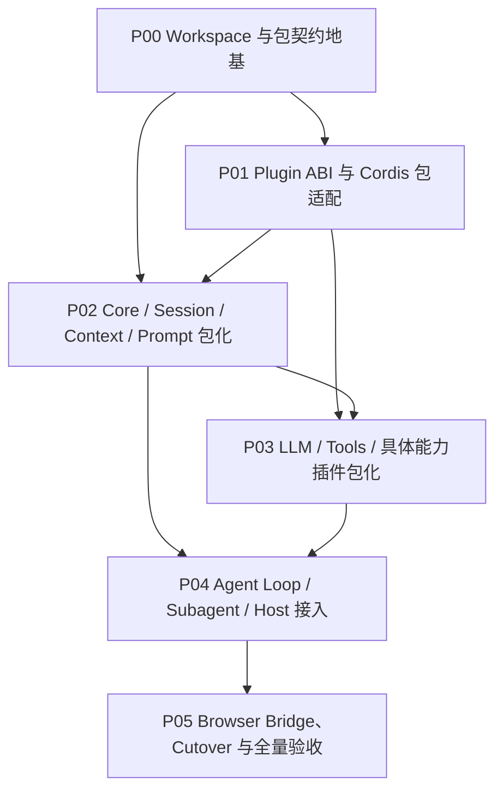

# ActSpace v2 包拆分与真实插件包化执行计划

状态：实现已完成，2026-09-08 按计划生命周期归档；历史记录中的真实宿主、人工验收及回归证据边界继续保留，本次未重跑产品验收。


确认日期：2026-08-24。

执行模式：交互模式。该计划会修改 workspace、包边界、运行时加载和 Host 接入，属于高风险架构变更；每个子计划可以独立验证，但只有全部范围完成后才进行一次产品切换，不交付只完成部分核心能力的 v2。

## 1. 目标

把当前集中在 `packages/agent-runtime` 的 v2 Runtime 重组为 DSH 风格的领域 workspace packages，并让核心语义与具体能力都成为真正的 ActSpace Plugin ABI package：每个可装载包拥有独立 manifest、behavior entry、codec entry（如需要）、exports、测试和生命周期所有权。

最终状态必须同时满足：

- Cordis 使用精确锁定的 DSH 发布包，不引入 `vendor/`；
- 不存在 `packages/harness/` 或通用 `packages/plugins/` 总目录；
- Harness 基座职责平铺到 `cordis-adapter`、`boot`、`bundle`、`composition`、`diagnostics` 和薄 `runtime` facade；
- `core`、`session`、`llm`、`context`、`prompt`、`tools`、`subagent` 和 `compaction` 按 DSH 领域分组，每个可装载领域包均可作为 Cordis Entry；
- 具体工具进入 `packages/tools/core-tools`、`packages/tools/browser-tools` 等明确领域包；
- Browser Bridge 作为顶层独立 Host capability 构建单元；
- Desktop 现有前端页面、样式、布局和信息架构不改变，只调整 Host / IPC / Projection 接入；
- Desktop、CLI、Site 三个可运行产品入口统一位于 `apps/`，`packages/` 只保留可复用 Runtime、领域能力和 Plugin package；
- 不再通过一个巨大 ESM Runtime 包的内部目录模拟插件化。

## 2. 范围

### 包含

- workspace package 拆分、独立 package exports 和依赖图；
- Static Manifest、Codec Entry、Behavior Entry 的真实包化；
- Cordis Loader / Include / Group / Timer 与 ActSpace Plugin ABI 的边界适配；
- Core、Session、LLM、Prompt、Context、Tools、Agent Loop、Subagent 的包迁移；
- 现有工具 executor 和 Browser Tools 的插件包迁移；
- Browser Bridge 顶层目录与 Host capability 适配；
- Desktop、CLI 和 Runtime facade 的新包接入；
- 旧单包内部入口、通用 plugins 入口、Kairos、fs-watch 和 `/eval` 可达路径的退役；
- 包级 contract/lifecycle/packaged smoke 验证和一次完整切换。

### 不包含

- 前端页面、布局、颜色、组件样式或交互信息架构重设计；
- DSH Agent Core 包的直接依赖；
- Cordis 源码 fork、`vendor/` 镜像、私有 deep import；
- 插件市场、签名、自动更新、不可信插件沙箱；
- HMR、在线 reconcile、双实例零停机切换；
- v1 Session importer；旧 Session 仅保留一份迁移参考数据，不由 v2 读取；
- zstd、SQLite、通用 Workflow、continuable Subagent 和新的前端插件加载。

## 3. 设计来源与优先级

1. [包结构与真实插件包规范](../../../design-docs/agent-plugin-runtime/agent-spec-package-layout-and-plugin-packaging.md) —— 本计划的目录、包边界和插件包真相。
2. [插件 Runtime ABI](../../../design-docs/agent-plugin-runtime/agent-spec-plugin-runtime-abi.md) —— manifest、codec、behavior、identity、trust、lifecycle 和 frontend 规则。
3. [Agent Core 目标边界](../../../design-docs/agent-plugin-runtime/agent-target-agent-core.md) —— ActSpace 自有语义与 DSH 参考边界。
4. [Session Format v1](../../../design-docs/agent-plugin-runtime/agent-spec-session-format-v1.md) —— raw JSONL 和 durable event 规则。
5. [Tool Runtime ABI](../../../design-docs/agent-plugin-runtime/agent-spec-tool-runtime-abi.md) —— 具体 executor 的迁移边界。
6. [Runtime 与 Composition 目标设计](../../../design-docs/agent-plugin-runtime/agent-target-runtime-architecture.md) —— Host、Boot、RuntimeHandle 和 restart-only。
7. `docs/ARCHITECTURE.md`、`docs/FRONTEND.md`、`docs/FRONTEND_VERIFICATION.md` —— 仓库和固定前端边界。

现有 `20260822-actspace-v2-plugin-runtime` 计划中的产品语义、公共 ABI、Session 格式、Host 语义和验收矩阵继续有效；其中关于单一 `@actspace/agent-runtime` 包、`agent-runtime/src/*` 路径和 `src/plugins/*` 的机械实现约束由本计划替代。

## 4. 依赖图



P00-P04 是内部可合并、可独立验证的施工单元，不代表用户可以使用一个缺少范围内能力的中间产品。P05 是唯一的产品切换和旧路径退役点。

## 5. 子计划清单

| Plan | 目标 | 主要所有权 | 依赖 |
|---|---|---|---|
| [P00](actspace-v2-p00-workspace-and-package-contracts.md) | 建立 DSH 风格 workspace 分组、包名、exports、tsconfig 和依赖图 | 根 `package.json`、`pnpm-workspace.yaml`、各 package manifest、package boundary tests | 无 |
| [P01](actspace-v2-p01-plugin-abi-and-cordis-adapter.md) | 把 Static Manifest / Codec / Behavior 和 Cordis 生命周期变成真实包 ABI | `packages/cordis-adapter/`、`packages/composition/`、`packages/boot/`、`packages/diagnostics/` | P00 |
| [P02](actspace-v2-p02-core-session-context-packages.md) | 拆出 Agent Core、Session raw JSONL、Context、Prompt、Compaction 的独立插件包 | `packages/core/`、`packages/session/`、`packages/context/`、`packages/prompt/`、`packages/compaction/` | P00、P01 |
| [P03](actspace-v2-p03-llm-tools-capability-packages.md) | 拆出 LLM、pi-ai、Tool Runtime、Core Tools、Browser Tools 的独立插件包 | `packages/llm/`、`packages/tools/` | P01、P02 |
| [P04](actspace-v2-p04-agent-host-runtime-integration.md) | 组装 Agent Loop、Subagent、Runtime facade、Desktop/CLI Host 接入 | `packages/runtime/`、`packages/subagent/`、`packages/host/`、`packages/client/`、`apps/` | P02、P03 |
| [P05](actspace-v2-p05-browser-bridge-cutover-and-verification.md) | 收口 Browser Bridge、退役旧路径、执行一次切换和全量门禁 | `browser-bridge/`、旧入口、构建/发布/验证脚本 | P04 |

## 6. 共享契约

- 包的公共入口只通过 `package.json.exports` 暴露；禁止 sibling package 相对读取 `src/`。
- 可装载插件必须提供 Static Manifest；涉及 durable event 的包必须提供 Codec Entry；行为代码只从 Behavior Entry 进入。
- Manifest 必须在 Behavior import 前完成 identity、runtimeContract、Host/frontend、配置和来源校验。
- 所有 Service、Tool、Prompt、LLM、Agent 和 Event listener 注册都由 activation Effect 拥有，并返回可等待 disposer。
- Session 固定使用 `sessions-v2/<id>/journal.jsonl`；旧 Session 不导入、不混读。
- `frontend.required=true` 与固定 renderer 不兼容时拒绝激活；optional frontend contribution 只告警并忽略。
- `RuntimeHandle` 是薄 facade；Host 不直接接触 Cordis Context、Fiber、Session writer 或具体 AgentLoop class。
- Browser Bridge 是 Host capability；TypeScript Browser Tools Adapter 管理它的进程、协议和关闭，不创建第二套插件 Loader。

## 7. 全局风险与回退

| 风险 | 处理 | 最小回退 |
|---|---|---|
| 包拆分导致循环依赖 | P00 先生成依赖图和 boundary test；领域包只消费公开契约 | 保留薄 facade，禁止回到跨包 `src` 相对导入 |
| Plugin Entry 仍只是内部函数 | P01 要求独立 manifest/codec/behavior contract test 和 Loader activation test | 关闭未满足 ABI 的 Entry，不将其标记为可装载插件 |
| Session codec 在包迁移后不可发现 | P02 用旧参考数据的 raw browse 检查和 required codec golden cases 门禁 | 保留 raw journal，不允许 resume 或新写入，不自动迁移 |
| pi-ai 或 Cordis 包不可用 | 继续使用已批准的条件采用门禁和双 backend 回退，不使用私有 API | 停止 P03-P05，回退到相应 ADR，不切换产品 |
| Desktop 接入误改前端样式 | P04 限定改动在 Host/IPC/Projection；按现有截图和前端规范验收 | revert renderer 样式变更，保留后端 adapter 工作 |
| 旧入口被删后无法回退 | P05 先做源码/制品可达性扫描和 dry-run，再做唯一切换 | 回退 cutover commit；不删除保留的迁移参考数据 |

## 8. 验证总表

每个子计划必须运行自己的 focused tests；P05 在 clean checkout 运行：

```bash
pnpm install --frozen-lockfile
pnpm run ci
pnpm typecheck
pnpm test
pnpm build
pnpm package:desktop
pnpm package:agent-cli
pnpm check:docs
pnpm check:repo
pnpm check:secrets
git diff --check
```

此外必须验证：

- 每个 core plugin 的 manifest、codec、behavior 可独立激活和 dispose；
- Loader 缺少 required provider 时 fail-closed；
- Session raw JSONL 可重建、repair、fork、compaction，且旧参考 Session 不会被加载；
- Desktop 页面布局和样式与重构前一致；
- CLI run/chat 使用同一 RuntimeHandle 语义；
- Browser Bridge Go/Extension 独立构建和真实协议门禁通过；
- 源码、workspace manifest 和打包制品中没有旧单包内部入口、通用 `plugins/` 可达入口、Kairos、fs-watch 或 `/eval`。

## 9. 执行记录

每个子计划开始时，在 `docs/exec-runs/<子计划 slug>/` 创建 `execution-process.md` 和 `execution-summary.md`。记录必须包含实际命令、变更边界、失败、回退和人工验收结果。

## 10. 决策记录

- 2026-08-24：确认不引入 `vendor/`；ActSpace 引用精确锁定的 DSH Cordis 发布包。
- 2026-08-24：确认删除 `harness/` 和通用 `plugins/` 目录；保留领域分组，插件身份由 Runtime ABI 表达。
- 2026-08-24：确认 Session、LLM、Prompt、Tools、Agent Loop 均可以且默认应作为核心语义插件包装载。
- 2026-08-24：确认 Browser Bridge 使用顶层能力目录和 Host capability 适配，不作为同进程 TypeScript plugin package。
- 2026-08-24：确认前端视觉和布局不变，只调整 Host、IPC、Projection 和 Runtime 接入。
