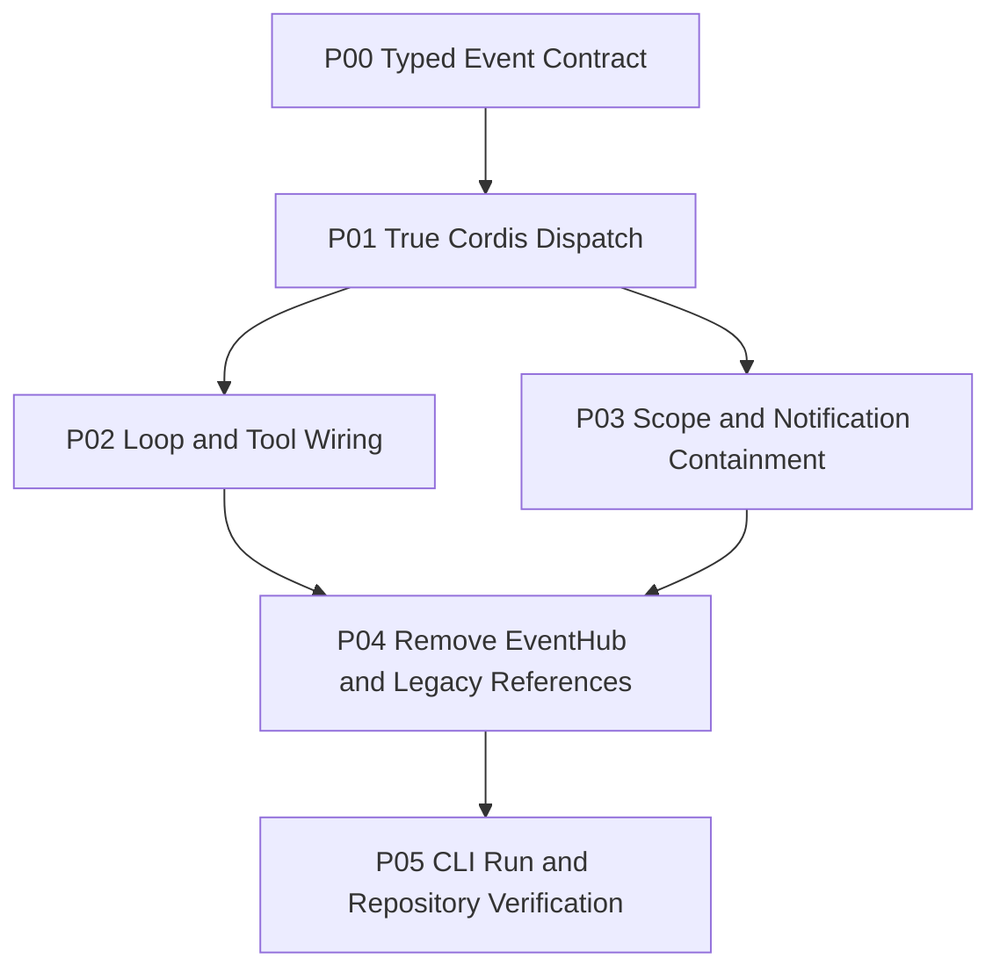

# ActSpace Cordis 原生事件 ABI 与 EventHub 退役计划

状态：待用户审核

日期：2026-08-29

执行模式：交互模式。每个阶段完成后运行对应 contract tests；本计划不授权删除 Session 数据、提交代码、发布制品或修改具体工具 executor 行为。

## 目标

把 ActSpace 的插件事件面从自定义 EventHub payload 变换模型切换为真实 Cordis typed event ABI：Waterfall 使用 `next()` around middleware，Serial 支持 bail，Parallel 等待全部 listener，通知使用 contained emit；随后删除 EventHub 的全部源码、公共导出、测试和调用点，保证重构后的仓库不存在重复事件层。

## 范围

### 包含

- Cordis `Events` declaration merging 和 Agent/Tool/Session/Runtime 事件 payload 契约；
- `emit`、`parallel`、`serial`、`waterfall` 的准确语义和错误边界；
- `llm/stream` 全 stream waterfall、`agent/request-error` recovery waterfall；
- Agent subject 与 scope carrier 绑定、父子 scope 验收；
- Agent Loop、Tool Runtime、Headless、Runtime Boot 的 typed Context 接入；
- 通知事件的逐 listener containment；
- EventHub 文件、导出、测试、桥接和依赖调用点删除；
- CLI run 的 no-tool/tool/retry/error/abort process smoke 和 Journal replay 验收。

### 不包含

- CLI chat UX、交互式长连接 inbox 和 renderer 改造；
- Session 数据迁移、旧事件兼容、双写或 importer；
- read/list/edit/bash/Browser Bridge 等具体 executor body 重写；
- 动态不可信插件、签名、市场、沙箱和远程下载；
- 删除真实 Cordis `EventsService` 或修改其第三方源码；
- Git commit、push、release 或外部宿主发布验收。

## 设计真源

- [Cordis 原生事件 ABI 与 EventHub 退役规范](../../../design-docs/agent-plugin-runtime/agent-spec-cordis-event-abi-and-eventhub-retirement.md)
- [Agent Loop Cordis 插入面与通知面](../../../design-docs/agent-plugin-runtime/agent-spec-agent-loop-cordis-surface.md)
- [DSH 风格 Session 事件模型](../../../design-docs/agent-plugin-runtime/agent-spec-dsh-event-model.md)
- [DSH 风格 Runtime 插件组装规范](../../../design-docs/agent-plugin-runtime/agent-spec-dsh-runtime-as-plugin-composition.md)
- [Agent 测试策略](../../../design-docs/agent-plugin-runtime/agent-testing.md)
- `tmp/deepseek-harness/vendor/cordis/src/events.ts`
- `tmp/deepseek-harness/packages/core/agent/src/dispatch.ts`
- `tmp/deepseek-harness/packages/core/agent/src/runtime-types.ts`
- `tmp/deepseek-harness/packages/core/session/src/index.ts`

## 当前实现入口

- `packages/cordis-adapter/src/events.ts`
- `packages/cordis-adapter/src/cordis-types.ts`
- `packages/cordis-adapter/src/cordis-root.ts`
- `packages/cordis-adapter/src/index.ts`
- `packages/core/agent-loop/src/loop.ts`
- `packages/core/agent-loop/src/service.ts`
- `packages/runtime/src/runtime/agent-factory-plugin.ts`
- `packages/runtime/src/runtime/boot.ts`
- `packages/tools/runtime/src/prepared-execution.ts`
- `packages/headless/src/runner.ts`
- `packages/headless/src/plugin.ts`
- `packages/cordis-adapter/tests/events.spec.ts`
- `packages/cordis-adapter/tests/cordis-lifecycle.spec.ts`

## 不可违反的约束

1. `ctx.on()` 的 handler 参数位置必须保留真实 Cordis 语义；Waterfall 第二个参数是 `next`，不是 `EventContext`。
2. Agent Loop 的 `llm/stream` 必须包围完整 `AsyncIterable`，不能降级为 chunk observer。
3. `agent/request-error` 的返回值必须可表达 retry/abort/escalate；不能只调用通知。
4. 通知 observer 失败不得阻断后续 observer，不得回滚已提交 Session 事件。
5. Runtime 不得重新引入另一个事件总线、字符串 payload adapter 或手工 listener registry。
6. EventHub 迁移完成后必须物理删除，不保留兼容导出或未使用的测试 helper。
7. 工具 executor 的可观察行为保持不变；工具事件只包裹权限、policy、参数、执行外壳和结果提交。
8. 每个新增 listener 必须由 Cordis fiber/effect 所有，dispose 后不得泄漏。

## 依赖关系

每个阶段都必须在本地 contract tests 中可验证；P04 完成前旧 EventHub 可以作为明确隔离的迁移临时层存在，但不得新增调用方。

## 子计划

| 子计划 | 文件 | 交付重点 |
|---|---|---|
| P00 | [p00-typed-event-contract.md](./p00-typed-event-contract.md) | Events declaration merging、payload、mode、next、scope 类型 |
| P01 | [p01-true-cordis-dispatch.md](./p01-true-cordis-dispatch.md) | true waterfall、serial bail、parallel、contained notification |
| P02 | [p02-loop-tool-wiring.md](./p02-loop-tool-wiring.md) | Agent Loop、LLM stream、request error、Tool pipeline 接入 |
| P03 | [p03-scope-and-lifecycle.md](./p03-scope-and-lifecycle.md) | Agent fused dispatch、scope chain、effect cleanup |
| P04 | [p04-delete-eventhub.md](./p04-delete-eventhub.md) | 删除 EventHub 源码、导出、测试、bridge、legacy 引用 |
| P05 | [p05-cli-run-verification.md](./p05-cli-run-verification.md) | CLI run、replay、grep gates、docs/history 收口 |

## 阶段验收

### P00

- 每个 Agent Loop/Tool/Session/Runtime 事件只有一份 typed declaration；
- Waterfall 事件的最后参数是 `next`；Serial 事件没有 `next`；
- `AgentSubjectEvent` 可以从声明中推导 subject、scope 和 payload；
- 编译期拒绝把 `EventContext` 作为 waterfall 第二参数。

验证：受影响 package typecheck、typed event contract tests、禁止无边界 `unknown` payload escape 的静态检查。

### P01

- A → B → built-in 的 around 顺序可观察；
- 不调用 `next()` 能短路；
- serial 首个 bail value 停止后续；
- parallel 等待全部 listener；
- contained emit 中一个 listener 失败不影响其他 listener。

验证：Cordis adapter contract tests 和真实 Cordis fixture tests。

### P02

- `llm/stream` 可替换完整 AsyncIterable；
- `agent/request-error` 可返回 retry decision；
- 三个 tools waterfall 能改写 policy/args/result；
- durable event 顺序和工具 executor parity 不变。

验证：agent-loop、llm、tools runtime tests；no-tool/tool/retry/error/abort golden cases。

### P03

- 两个 Agent 的事件不串线；
- parent scope 可观察 child，child 不接收 sibling/descendant；
- fiber dispose 后 listener、timer、lease 和 in-flight dispatch 正确收束。

验证：scope isolation、lifecycle disposal、parallel Agent process tests。

### P04

- `rg -n "EventHub|createEventHub|createCordisEventHub|EventContext" packages apps` 无运行时结果；
- `packages/cordis-adapter/src/events.ts` 和旧 `events.spec.ts` 已删除；
- `index.ts`、Cordis root、boot、headless、tool runtime 不再导出或传递 EventHub；
- 旧 `activate()` 事件适配路径未重新出现。

验证：`pnpm -r typecheck`、受影响 package tests、package boundary/static cutover checks。

### P05

- CLI `run` 在无工具、含工具、retry、error、abort 场景下稳定结束；
- stdout/stderr 契约不受通知 listener 故障影响；
- Session Journal replay 能重建最终状态；
- clean checkout 与构建产物中不存在 EventHub 运行时路径；
- history 记录删除 EventHub 的原因、边界和验证证据。

验证：`pnpm -r test`、`pnpm -r typecheck`、`pnpm run check:docs`、`pnpm run check:current-docs`、`pnpm run check:v2-legacy-removal`、`pnpm run check:packages`、CLI process smoke 和 `git diff --check`。

## 风险与最小回退

- Cordis 类型与实际 Loader 版本不一致：只在 `@actspace/cordis-adapter` 修正类型收口和 fixture，不在领域包重新创造事件总线。
- Waterfall 接入位置错误导致 stream/tool 行为变化：先用独立 contract fixture 验证 built-in next，再接入 Agent Loop；工具 executor parity 失败时只回退事件外壳，不改 executor body。
- 通知 containment 让错误不再冒泡：将业务失败与观察者失败分离，业务错误仍通过 typed Agent/Session 结果传播。
- 删除后仍有隐藏构建引用：先执行源码、dist、package exports 和 CLI bundle 扫描，再删除文件；无法证明可达性时停止删除并补充引用清单。

最小回退是回滚本次代码提交；不回滚设计规范和执行证据，不触碰 Session 数据。

## 进度记录

- [x] 2026-08-29：确认当前 EventHub 与 DSH/Cordis waterfall 语义不等价。
- [x] 2026-08-29：整理 Cordis 原生事件 ABI 与 EventHub 退役设计规范。
- [x] 2026-08-29：拆出 P00–P05 执行子计划。
- [x] 2026-08-29：用户审核并批准本计划。
- [x] 2026-08-29：P00–P05 实施与逐阶段验证完成。
- [x] 2026-08-29：删除 EventHub 全部源码、导出、测试和调用点。
- [x] 2026-08-29：完成 CLI mock run、构建产物扫描和文档门禁；clean checkout 与真实 Provider 属于外部验收边界。

## 决策记录

- 2026-08-29：EventHub 定位为一次性迁移桥，不作为终态测试适配器或兼容 API；原因是它无法表达 DSH 的 `next()`、bail、完整 stream middleware 和真实 scope 语义。
- 2026-08-29：通知错误隔离由领域 Service 显式负责，而不是修改底层 Cordis `ctx.emit()` 的通用语义；原因是通知和业务控制需要不同的失败策略。
- 2026-08-29：工具 executor body 保持不变，只迁移 ToolRuntime 的事件、权限、审批、scope 和 result shell；原因是具体 read/list 等实现已经是 ActSpace 的稳定资产。

## 执行文档

执行开始时创建：

- `docs/exec-runs/20260829-actspace-cordis-event-abi-and-eventhub-retirement/execution-process.md`
- `docs/exec-runs/20260829-actspace-cordis-event-abi-and-eventhub-retirement/execution-summary.md`

它们记录每个子计划的实际文件、测试证据、失败恢复和人工验收边界。
