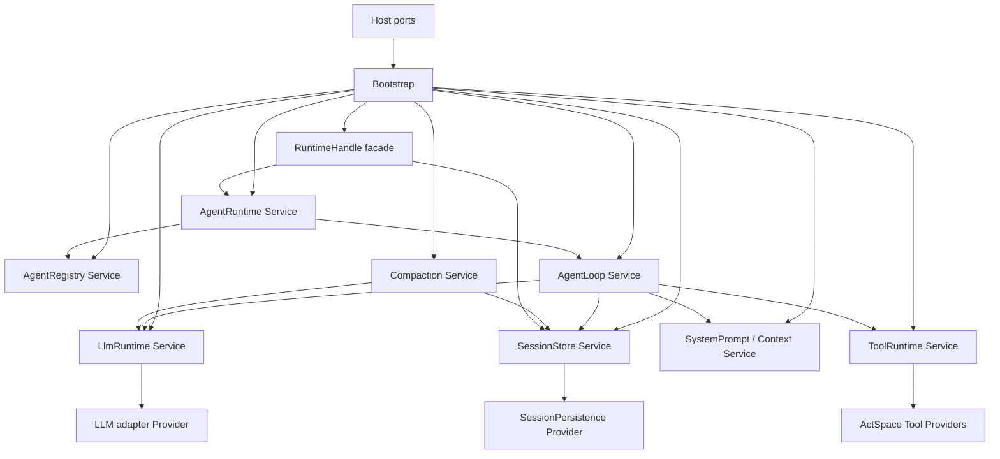

# ActSpace 核心 Cordis Service 化与能力 seam 实施计划

状态：已完成（Phase 1–5 已落地；另有仓库已有 active plan 的文档登记门禁待处理）。本文记录已批准的执行范围与阶段门禁。

设计真源：[核心 Cordis Service 化与能力 seam 规范](../../../design-docs/agent-plugin-runtime/agent-spec-core-cordis-services.md)。本计划承接已落地的 DSH-native Boot、Session 13 事件、Agent Loop 9 个干预点、5 个通知和 CLI 单次 run，不重新设计这些公共语义。

## 1. 目标

将 ActSpace 的长期运行时能力从“Runtime/Behavior 手工创建的普通 class”收敛为真正由 Cordis Context 拥有的 Service Graph：Service 自己声明依赖和配置，自己绑定事件与 Effect，自己完成 quiesce/dispose；Runtime 只保留 Host port、Bootstrap、Loader、RuntimeHandle facade 和 shutdown 边界。

具体目标对象：`SessionStore`、`SessionPersistence`、`LlmRuntime`、`ToolRuntime`、`SystemPrompt`、`AgentRegistry`、`AgentLoop`、`Compaction`、`AgentRuntime`。

## 2. 范围

### 包含

- Service Definition / Provider / Consumer 的公共类型和 service id；
- Session live log 与 JSONL persistence provider 解耦；
- LLM、Prompt/Context、ToolRuntime 的 Service 生命周期；
- AgentRegistry、AgentLoop、Compaction、AgentRuntime 的 Service ownership；
- 真实 `inject`、Config、Effect cleanup、quiescent shutdown；
- Cordis typed event、waterfall/serial/parallel/emit 语义接入；
- Runtime `boot.ts` 收缩、RuntimeHandle facade 收口；
- CLI 单次 run、Session replay、tool parity 和生命周期 contract tests；
- 相关设计文档、执行记录、history 和可迁移 learning。

### 不包含

- 不修改具体工具 executor body、Browser Bridge 协议或工具可观察行为；
- 不实现 CLI chat、Goal/Schedule producer、在线 HMR、配置热替换或动态不可信插件；
- 不实现 SQLite/远程 persistence provider，只保留可替换 Definition；
- 不修改 Session 13 核心事件、9 个 Loop 事件、5 个通知的公共名称和顺序；
- 不删除用户 Session 数据，不做旧格式 importer，不做双写；
- 不做 Electron/Chrome/DMG/签名/公证人工发布门禁。

## 3. 必读材料

- `AGENTS.md`
- `docs/REPO_COLLAB_GUIDE.md`
- `docs/ARCHITECTURE.md`
- `docs/design-docs/core-beliefs.md`
- `docs/PLANS_GUIDE.md`
- `docs/HISTORY_GUIDE.md`
- `docs/QUALITY_SCORE.md`
- `docs/design-docs/agent-plugin-runtime/agent-spec-core-cordis-services.md`
- `docs/design-docs/agent-plugin-runtime/agent-spec-dsh-runtime-as-plugin-composition.md`
- `docs/design-docs/agent-plugin-runtime/agent-spec-dsh-plugin-assembly-and-agent-startup.md`
- `docs/design-docs/agent-plugin-runtime/agent-spec-dsh-event-model.md`
- `docs/design-docs/agent-plugin-runtime/agent-spec-agent-loop-cordis-surface.md`
- `docs/design-docs/agent-plugin-runtime/agent-spec-tool-runtime-boundary.md`
- `docs/design-docs/agent-plugin-runtime/agent-spec-plugin-runtime-abi.md`
- `docs/design-docs/agent-plugin-runtime/agent-testing.md`
- `tmp/deepseek-harness/docs/architecture.md`
- `tmp/deepseek-harness/packages/core/session/src/index.ts`
- `tmp/deepseek-harness/packages/core/agent/src/dispatch.ts`
- `tmp/deepseek-harness/packages/core/agent-loop/src/index.ts`
- `tmp/deepseek-harness/packages/core/tools/src/index.ts`
- `tmp/deepseek-harness/packages/session/session-persistence/src/index.ts`

## 4. 当前代码入口与不变资产

### 主要 Service/Behavior 入口

- `packages/runtime/src/runtime/boot.ts`
- `packages/runtime/src/runtime/cordis-entry.ts`
- `packages/runtime/src/runtime/session-plugin.ts`
- `packages/runtime/src/runtime/agent-runtime-plugin.ts`
- `packages/runtime/src/runtime/agent-factory-plugin.ts`
- `packages/session/journal/src/plugin.ts`
- `packages/session/persistence/src/plugin.ts`
- `packages/session/persistence/src/session.ts`
- `packages/session/jsonl/src/plugin.ts`
- `packages/llm/service/src/plugin.ts`
- `packages/llm/service/src/service.ts`
- `packages/context/src/plugin.ts`
- `packages/prompt/src/plugin.ts`
- `packages/tools/runtime/src/plugin.ts`
- `packages/tools/runtime/src/runtime.ts`
- `packages/tools/core-tools/src/plugin.ts`
- `packages/tools/browser-tools/src/plugin.ts`
- `packages/core/agent/src/plugin.ts`
- `packages/core/agent/src/registry.ts`
- `packages/core/agent-loop/src/plugin.ts`
- `packages/core/agent-loop/src/loop.ts`
- `packages/core/agent-loop/src/service.ts`
- `packages/compaction/src/plugin.ts`

### 必须保留的资产

- `packages/tools/core-tools/src/` 与 `packages/tools/browser-tools/src/` 中具体 executor 的输入、输出、副作用和行为测试；
- `packages/session/journal/src/core-codecs.ts` 的 13 核心事件和扩展 codec；
- JSONL writer、lease、torn-tail recovery、projection 和 replay 算法；
- LLM PreparedCall、Tool PreparedExecution、credential redaction 和 Host capability ceiling；
- RuntimeHandle 的 Host-neutral API 与 CLI `run` 的稳定输出契约。

## 5. 目标依赖图



禁止新增 `Runtime → new DomainService`、`Provider → Runtime private state` 和 `Tool executor → Journal/file/stdout` 依赖。

## 6. 实施阶段

各阶段都必须保持 CLI `run --mock` 可构建；每阶段完成后运行自己的 contract tests，不能把所有改动堆到最后一次验证。

### Phase 1：Service ABI、Context key 与契约测试地基

**目标**：固定 Service id、Definition/Provider/Consumer 类型、Config 解析和 Effect-owned lifecycle 测试，不改变现有工具行为。

**文件范围**：

- `packages/cordis-adapter/src/cordis-types.ts`
- `packages/cordis-adapter/src/plugin-contract.ts`
- `packages/cordis-adapter/src/cordis-root.ts`
- `packages/cordis-adapter/src/index.ts`
- `packages/core/agent/src/manifest.ts`
- `packages/core/agent-loop/src/manifest.ts`
- 各领域 package 的 `src/manifest.ts`、`src/index.ts`、`package.json` exports
- `packages/cordis-adapter/tests/`
- 新增 `packages/test-support/src/service-fixtures.ts` 及对应测试

**动作**：

1. 定义稳定 Service id 与公共 Definition 类型，区分 Provider 和 Consumer；
2. 定义受限的 Service contract test helper，覆盖 inject 缺失、Config 非法、apply 失败、Effect cleanup、重复 dispose；
3. 让默认 Behavior ABI 只接受真实 Context 和 config，`activate()` 不再作为默认 Service source；
4. 将 Host capability 继续限定在 root Context，不向 Host 暴露内部 Service object。

**验收**：

```bash
pnpm --filter @actspace/cordis-adapter typecheck
pnpm --filter @actspace/cordis-adapter test
pnpm --filter @actspace/test-support typecheck
```

**阶段产物**：公共 service key/Definition、可复用生命周期 fixture、无默认激活兼容的新 contract。

### Phase 2：SessionStore 与 SessionPersistence 解耦

**目标**：让 Session live log 不直接拥有 JSONL backend；持久化通过 `session/event` 和 `session/flush` 订阅。

**文件范围**：

- `packages/session/journal/src/plugin.ts`
- `packages/session/journal/src/journal.ts`
- `packages/session/persistence/src/session.ts`
- `packages/session/persistence/src/session-store.ts`
- `packages/session/persistence/src/write-behind.ts`
- `packages/session/persistence/src/recovery.ts`
- `packages/session/persistence/src/plugin.ts`
- `packages/session/jsonl/src/plugin.ts`
- `packages/session/projection/src/plugin.ts`
- `packages/runtime/src/runtime/session-plugin.ts`
- `packages/runtime/src/runtime/session-controller.ts`
- `packages/session/**/src/test/`

**动作**：

1. 将 `SessionStore` 的 live append、surface 和 lifecycle 作为 canonical Service；
2. 定义抽象 `SessionPersistence` provider seam，JSONL provider 继续复用现有 writer/recovery；
3. 将 `onEvent` 拆成 post-commit `session/event` 和 awaited `session/flush`；
4. 保证 `session/end-seed`、连续 seq、replay、torn-tail recovery 和已有 JSONL 格式不变；
5. 增加 fake persistence provider，证明 SessionStore 不依赖具体 JSONL class。

**验收**：

```bash
pnpm --filter @actspace/session-journal test
pnpm --filter @actspace/session-persistence test
pnpm --filter @actspace/session-jsonl test
pnpm --filter @actspace/session-projection test
pnpm --filter @actspace/session-persistence typecheck
```

**通过标准**：observer 失败不影响已提交 append；flush 失败可被 Host 观测；CLI Journal golden 与实施前一致。

### Phase 3：LLM、Prompt/Context、ToolRuntime Service 化

**目标**：将模型、上下文和工具的长期 registry/lease/lifecycle 交给 Cordis Service，具体 executor 保持原样。

**文件范围**：

- `packages/llm/service/src/service.ts`
- `packages/llm/service/src/route-registry.ts`
- `packages/llm/service/src/plugin.ts`
- `packages/llm/pi-ai/src/plugin.ts`
- `packages/prompt/src/plugin.ts`
- `packages/prompt/src/registry.ts`
- `packages/prompt/src/assembler.ts`
- `packages/context/src/plugin.ts`
- `packages/context/src/assembly.ts`
- `packages/tools/runtime/src/runtime.ts`
- `packages/tools/runtime/src/registry.ts`
- `packages/tools/runtime/src/scheduler.ts`
- `packages/tools/runtime/src/plugin.ts`
- `packages/tools/approval/src/plugin.ts`
- `packages/tools/core-tools/src/plugin.ts`
- `packages/tools/browser-tools/src/plugin.ts`
- 各包 `src/test/`

**动作**：

1. 为 LLM route registry、PreparedCall lease、Prompt contributor registry、Tool registry/scheduler 建立 Service ownership；
2. 通过 `static inject`/Config 取得 credential、Host tool environment、approval 和 provider；
3. 接通 typed `agent/request`、`llm/stream`、`tools/*` 事件；
4. ToolRuntime 只包权限、审批、事件、lease 和调度，不修改 executor body；
5. 对 route/provider replacement、tool registration dispose、approval reject、timeout、cancel 做隔离测试。

**验收**：

```bash
pnpm --filter @actspace/llm-service test
pnpm --filter @actspace/llm-pi-ai test
pnpm --filter @actspace/context test
pnpm --filter @actspace/prompt test
pnpm --filter @actspace/tools-runtime test
pnpm --filter @actspace/tools-core-tools test
pnpm --filter @actspace/tools-browser-tools test
```

**通过标准**：LLM/Tool provider 可以替换而不修改 AgentLoop；read/list/edit/bash/Browser parity fixture 全部通过；任何 executor stdout 不污染 CLI 协议输出。

### Phase 4：AgentRegistry、AgentLoop、Compaction、AgentRuntime Service ownership

**目标**：消除 Agent 生命周期和 Loop driver 的重复所有权，建立 Agent scope 与 Service 之间的无环依赖。

**文件范围**：

- `packages/core/agent/src/registry.ts`
- `packages/core/agent/src/inbox.ts`
- `packages/core/agent/src/publication.ts`
- `packages/core/agent/src/plugin.ts`
- `packages/core/scope/src/scope.ts`
- `packages/core/agent-loop/src/loop.ts`
- `packages/core/agent-loop/src/service.ts`
- `packages/core/agent-loop/src/plugin.ts`
- `packages/compaction/src/plugin.ts`
- `packages/compaction/src/summarizer.ts`
- `packages/runtime/src/runtime/agent-runtime-plugin.ts`
- `packages/runtime/src/runtime/agent-factory-plugin.ts`
- `packages/runtime/src/runtime/run-controller.ts`
- `packages/core/agent/**/src/test/`
- `packages/core/agent-loop/**/src/test/`
- `packages/compaction/src/test/`

**动作**：

1. AgentRegistry 成为 Agent/scope/inbox 的唯一 owner；
2. AgentLoop 成为唯一 turn/step driver，直接注入 Session、LLM、Prompt、Tools；
3. AgentRuntime 只编排 main/subagent、RunController、followup、abort 和 idle；
4. Compaction 通过 Agent events 接入，不成为 Loop 内部硬编码分支；
5. 实现 Agent 创建/恢复/销毁事务，确保 Agent subject 与 scope carrier 一致；
6. 增加 two-agent、child-agent、observer failure、dispose drain 和 dependency-cycle negative tests。

**验收**：

```bash
pnpm --filter @actspace/core-agent test
pnpm --filter @actspace/core-agent-loop test
pnpm --filter @actspace/core-scope test
pnpm --filter @actspace/compaction test
pnpm --filter @actspace/runtime test
```

**通过标准**：源码默认路径不存在手工 `new AgentLoop()`；两个 Agent 的事件不串线；Loop、Registry、Runtime 无反向生命周期依赖；Compaction provider 缺失时按 profile severity 正确降级或 fail closed。

### Phase 5：Runtime 收缩、默认路径清理与 CLI 单次 run 验证

**目标**：让 `boot.ts` 只负责 Bootstrap/Host/Loader/Handle，删除默认路径中剩余的 central service assembly 和激活兼容层。

**文件范围**：

- `packages/runtime/src/runtime/boot.ts`
- `packages/runtime/src/runtime/cordis-entry.ts`
- `packages/runtime/src/runtime/runtime-handle.ts`
- `packages/runtime/src/runtime/shutdown.ts`
- `packages/runtime/cordis.yml`
- `apps/cli/src/runtime-v2/host-adapter.ts`
- `apps/cli/src/runtime-v2/run.ts`
- `apps/cli/src/runtime-v2/loader.ts`
- `apps/desktop/src/main/runtime-v2/desktop-host-adapter.ts`
- `packages/cordis-adapter/src/behavior-loader.ts`
- `packages/cordis-adapter/src/events.ts`
- `packages/cordis-adapter/src/source-loader.ts`
- `packages/runtime/src/test/`
- `apps/cli/src/test/`
- 相关当前设计文档、history 和执行记录

**动作**：

1. RuntimeHandle 只从 settled Context service 取得稳定 facade；不返回 Context、Fiber、writer、Provider 或 Loop class；
2. 删除默认路径中的 `serviceValues`、`activate()` service map、`loadConfiguredPlugins()` 和手工 domain construction；
3. 将 EventHub 降为测试/过渡 adapter，默认插件只使用真实 Cordis event API；
4. 保持显式 `cordis.yml`、required service validation 和 fail-closed shutdown；
5. CLI run 验证 `boot → followup → durable inbox → turn → flush → session/end-seed → dispose`；
6. 更新 package exports、当前设计入口、history 和 learning；旧兼容代码若不再有调用者则删除，不保留隐式 fallback。

**验收**：

```bash
pnpm --filter @actspace/runtime test
pnpm --filter @actspace/agent-cli test
pnpm --filter @actspace/runtime typecheck
pnpm --filter @actspace/agent-cli typecheck
pnpm test:agent-cli:process
pnpm -r typecheck
pnpm -r test
pnpm run check:docs
pnpm run check:current-docs
pnpm run check:packages
pnpm run check:v2-legacy-removal
pnpm run check:secrets
git diff --check
```

**手工验收**：

1. `run --mock --json` 完成一次无工具任务，Journal 顺序和最终 JSON 稳定；
2. 含工具任务保持工具输出和副作用 parity；
3. observer 抛错时任务仍完成，diagnostics 增加且 Journal 不缺事实；
4. 注入失败、缺失 required Service、Config 解析失败时不返回 RuntimeHandle；
5. SIGINT/flush timeout/dispose timeout 都有明确退出码和 diagnostics；
6. CLI 与 Desktop adapter 都不直接实例化 AgentLoop 或 Session writer。

## 7. 依赖与并行边界

```text
Phase 1
   ↓
Phase 2 ─────────────┐
   ↓                 │
Phase 3 ─────────────┤
   ↓                 │
Phase 4 ─────────────┘
   ↓
Phase 5
```

Phase 2 的 Session Definition 稳定后，Phase 3 可以与部分 Prompt/Tool contract tests 并行；Phase 4 必须等待 Session、LLM、Prompt、Tools 的注入接口稳定；Phase 5 必须等待所有 Service ownership 完成。

## 8. 风险与缓解

| 风险 | 影响 | 缓解 |
|---|---|---|
| Service 化只是移动 `new`，没有减少中心权威 | 架构表面改变但耦合不变 | 以“默认 Boot 不手工 new、Context 可独立替换/卸载”作为硬验收 |
| Session 与 persistence 拆分导致落盘时序回归 | resume/recovery 不可靠 | 保留现有 JSONL writer/recovery，新增 post-commit/flush golden 和 fault injection |
| Cordis typed waterfall 与现有 adapter 语义不一致 | 插件干预结果变化 | 先在 adapter 加薄适配和 next contract tests，禁止继续扩展自定义 EventHub ABI |
| AgentRegistry/Loop/Runtime 重复持有状态 | followup 重复或 dispose 泄漏 | 每阶段只保留一个 canonical owner，增加 two-agent 和 shutdown drain tests |
| Tool shell 迁移改变 executor 行为 | 用户工具回归 | executor body 不改，逐工具 parity；失败只回退 shell 适配 |
| 类型/包边界扩大导致 clean build 失败 | CLI/Desktop 不能启动 | 每阶段先 build 依赖闭包，再跑 `pnpm -r typecheck` 和 process smoke |

## 9. 回退策略

- Phase 1–4 采用可逐步启用的 Service seam；每阶段完成后已有 CLI mock run 仍可运行。
- Phase 5 切换前保留显式诊断入口，但禁止默认隐式 fallback 或双 Runtime。
- 如果某个 Service 迁移失败，只回退对应 phase 的代码变更和 provider adapter，不删除 Session 数据、不修改工具 executor。
- 如果发现公共 Service Definition 设计错误，先恢复上一个已验证 contract，再重新开一个小范围设计变更；不在 Boot 内加入临时 central registry。

## 10. 完成定义

- [x] 用户审核设计规范和本执行计划。
- [x] Phase 1：Service ABI 与 contract fixtures。
- [x] Phase 2：SessionStore / SessionPersistence seam。
- [x] Phase 3：LLM / Prompt / Context / ToolRuntime Service。
- [x] Phase 4：AgentRegistry / AgentLoop / Compaction / AgentRuntime Service ownership。
- [x] Phase 5：Runtime 收缩、默认清理、CLI process smoke 和全量门禁。
- [x] 创建并更新 `docs/exec-runs/20260829-actspace-core-cordis-services/` 下的 execution-process 与 execution-summary。
- [x] 按 `docs/HISTORY_GUIDE.md` 写 history；按 `docs/learnings/WRITING_GUIDE.md` 判断是否沉淀跨项目学习。

## 11. 执行模式

**交互模式**：这是 Runtime、Service ABI、Session durability 和 Agent lifecycle 的高风险重构。Phase 1–2 已在用户批准后完成；后续每个 Phase 完成后继续报告验证结果，再进入下一阶段。
