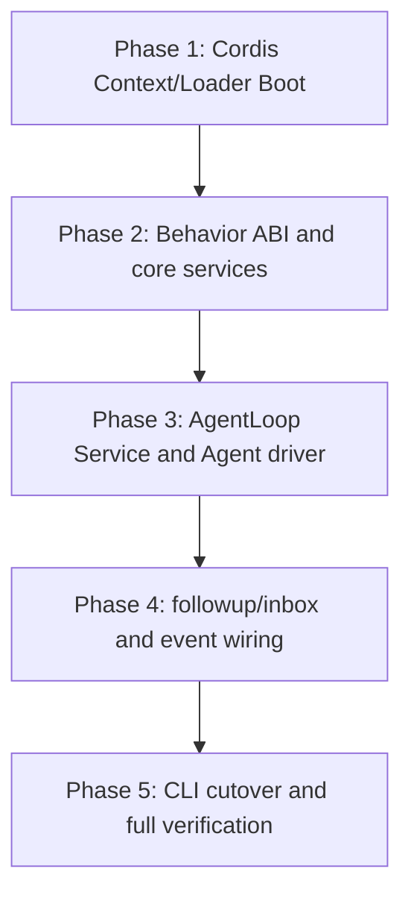

# ActSpace DSH 风格插件组装与 Agent 启动实现计划

状态：实现已完成，2026-09-08 按计划生命周期归档；历史记录中的真实宿主、人工验收及回归证据边界继续保留，本次未重跑产品验收。

旧 composition activation 收口由后续全量插件组装和 Profile-first 完成；当前生产 Boot 要求显式 configPath 与 Composition。原阶段警告保留为历史证据。


本计划只实现 [DSH 风格插件组装与 Agent 启动规范](../../../design-docs/agent-plugin-runtime/agent-spec-dsh-plugin-assembly-and-agent-startup.md)。它是新建的独立执行入口，不修改现有 `20260829-actspace-dsh-core-rebuild` 计划中的 P00/P04 文件或状态。实现完成后，再根据实际验证结果统一调整相关计划状态。

## 目标

把 ActSpace 默认 Runtime 启动从 `plugins.json + Static Manifest + activateBehavior + 手工 new AgentLoop` 切换为 `cordis.yml + Include + Cordis Loader + Behavior.apply(ctx, config) + AgentLoop Service + agent.followup()`，同时保持已经落地的 Session 13 核心事件、Agent Loop 9 个插入点、5 个通知和现有工具 executor 行为。

## 范围

### 包含

- 真实 Cordis root Context、Loader、Include、Group、Timer 的生产 Boot seam；
- `cordis.yml` 配置入口、Include 递归和 trusted Behavior module resolution；
- `apply(ctx, config)` Behavior ABI 及 package exports；
- Session、LLM、Prompt、Tools、Compaction、Agent Registry 和 AgentLoop 的 Context Service 组装；
- AgentLoop Service 的 Agent 创建/恢复、Agent scope、driver 和 dispose；
- `agent.followup()` → durable inbox → claim → turn 的单次输入链路；
- `ctx.on/ctx.emit` 的 9 个干预点、5 个通知和 post-commit `session/event`；
- CLI run 默认启动切换和 mock/abort/resume 验收；
- 相关 package tests、CLI tests、Boot fixture、当前设计入口和执行记录。

### 不包含

- 不修改旧 P00/P04 计划文件；
- 不重写 Session JSONL/replay/recovery/fork/compaction 内核；
- 不重写具体 Tool executor、Browser Bridge 或 LLM provider wire；
- 不交付 CLI chat UX、Goal/Schedule producer、实时 HMR 或配置在线 reconcile；
- 不做不可信插件签名、沙箱、市场和远程下载；
- 不做 Electron/Chrome/DMG/签名公证的最终人工发布验收。

## 背景与必读材料

### 设计和规则

- `AGENTS.md`
- `docs/REPO_COLLAB_GUIDE.md`
- `docs/ARCHITECTURE.md`
- `docs/design-docs/core-beliefs.md`
- `docs/design-docs/agent-plugin-runtime/agent-spec-dsh-plugin-assembly-and-agent-startup.md`
- `docs/design-docs/agent-plugin-runtime/agent-spec-dsh-event-model.md`
- `docs/design-docs/agent-plugin-runtime/agent-spec-agent-loop-cordis-surface.md`
- `docs/design-docs/agent-plugin-runtime/agent-spec-tool-runtime-boundary.md`
- `docs/design-docs/agent-plugin-runtime/agent-decision-cordis-adoption.md`
- `docs/design-docs/agent-plugin-runtime/agent-research-dsh-architecture.md`
- `docs/design-docs/agent-plugin-runtime/agent-testing.md`
- `docs/PLANS_GUIDE.md`
- `docs/HISTORY_GUIDE.md`
- `docs/QUALITY_SCORE.md`

### 参考源码和当前入口

- DSH：`tmp/deepseek-harness/packages/boot/app-boot/src/index.ts`
- DSH：`tmp/deepseek-harness/vendor/cordis/src/context.ts`
- DSH：`tmp/deepseek-harness/vendor/cordis/src/service.ts`
- DSH：`tmp/deepseek-harness/vendor/loader/src/index.ts`
- DSH：`tmp/deepseek-harness/vendor/include/src/index.ts`
- ActSpace：`packages/cordis-adapter/src/cordis-root.ts`
- ActSpace：`packages/cordis-adapter/src/behavior-loader.ts`
- ActSpace：`packages/cordis-adapter/src/plugin-contract.ts`
- ActSpace：`packages/runtime/src/runtime/boot.ts`
- ActSpace：`packages/runtime/src/runtime/run-controller.ts`
- ActSpace：`packages/runtime/src/runtime/runtime-handle.ts`
- ActSpace：`packages/core/agent-loop/src/loop.ts`
- ActSpace：`packages/core/agent/src/inbox.ts`
- ActSpace：`apps/cli/src/runtime-v2/host-adapter.ts`
- ActSpace：`apps/cli/src/runtime-v2/run.ts`

## 约束和不变式

1. 插件是完全信任的同进程代码，不能因为本轮不做不可信插件安全而重新引入 Static Manifest 激活协议。
2. 默认启动不得读取 `runtime-v2/plugins.json`，不得隐式扫描插件目录。
3. Behavior 入口只接受真实 Cordis Context 和配置；新路径不接受 `activate(context)`。
4. RuntimeHandle 是唯一 Host-facing 运行时对象；Host 不持有 root Context、Session writer 或 AgentLoop class。
5. `agent.followup()` 必须先产生 durable inbox enqueue，再允许 driver claim/turn。
6. Session 13 核心事件、扩展事件和已有工具行为不因启动重构而改变。
7. 任何启动/关闭失败都必须释放 Fiber、Effect、Agent、Session 和 Tool 资源；不能遗留后台 handler 或 timer。
8. 新路径失败时只允许显式 legacy 诊断回退，不能默认静默 fallback。

## 目标依赖图



每个阶段都必须保持已有测试可运行；Phase 1–4 可以通过独立 fixture/API 验证，不要求在完成最后阶段前把默认生产路径切换过去。

## 实施阶段

### Phase 1：真实 Cordis Boot 与 `cordis.yml`

目标：建立不依赖 `plugins.json` 的真实 Loader/Include 启动入口，保留现有 Boot 作为未切换路径。

主要文件范围：

- `packages/cordis-adapter/src/cordis-types.ts`
- `packages/cordis-adapter/src/cordis-root.ts`
- `packages/cordis-adapter/src/index.ts`
- `packages/cordis-adapter/src/loader-config.ts`（新增）
- `packages/boot/src/trusted-boot.ts`
- `packages/boot/src/types.ts`
- `packages/boot/src/dsh-boot.ts`（新增）
- `packages/boot/tests/cordis-config.spec.ts`（新增）
- `packages/boot/tests/fixtures/cordis-basic/cordis.yml`（新增）
- `packages/boot/tests/fixtures/cordis-basic/plugin.mjs`（新增）

具体工作：

1. 将真实 Cordis `Context`、`Plugin`、`Service`、`Inject` 的公开类型收口到 adapter boundary。
2. 安装 Loader、Include、Group、Timer，并按绝对 `configPath` 创建 root Include。
3. 让 fixture 的 `apply(ctx, config)` 使用真实 `ctx.plugin/on/emit/effect`，验证事件、子插件和 disposer。
4. 增加 settlement、missing service、apply error、config parse error 和 reverse dispose 测试。
5. 新 Boot 返回 Host-neutral candidate/handle seam，但不改变旧 CLI 默认入口。

阶段验收：

- fixture 由 `cordis.yml` 真实加载；
- `apply(ctx, config)` 收到真实 Context；
- 启动失败不发布 handle，root 无活动 Fiber/Effect；
- `pnpm --filter @actspace/boot test`、`pnpm --filter @actspace/cordis-adapter test`、对应 typecheck 通过。

### Phase 2：Behavior ABI 与核心 Service 组装

目标：把领域 package 从 `activate()` 返回 service map 改成可由 Loader 直接加载的 Behavior，并把 Runtime 手工 service map 转为 Context services。

主要文件范围：

- `packages/cordis-adapter/src/behavior-loader.ts`
- `packages/cordis-adapter/src/plugin-contract.ts`
- `packages/cordis-adapter/src/manifest.ts`（仅移除默认激活依赖，不删除历史类型）
- `packages/session/journal/src/plugin.ts`
- `packages/session/persistence/src/plugin.ts`
- `packages/llm/service/src/plugin.ts`
- `packages/prompt/src/plugin.ts`
- `packages/tools/runtime/src/plugin.ts`
- `packages/tools/core-tools/src/plugin.ts`
- `packages/tools/browser-tools/src/plugin.ts`
- `packages/compaction/src/plugin.ts`
- `packages/subagent/src/plugin.ts`
- `packages/core/agent/src/plugin.ts`
- `packages/core/agent-loop/src/plugin.ts`
- 各 package 的 `manifest.ts`、`package.json` exports 和 lifecycle tests

具体工作：

1. 定义 `ActSpaceBehavior.apply(ctx, config)`；新默认 loader 遇到 `activate` 必须失败而不是兼容调用。
2. 为核心 package 提供 `inject` 声明和 Context service provider；服务之间的依赖由 Cordis 解析。
3. 把 Host services、Session codec/persistence、Tool Runtime、LLM 和 Prompt 通过 root Context 注入。
4. 保留已有 codec discovery 的独立职责；行为激活不再成为读取已有 Session 所需 codec 的前置条件。
5. 增加 package-level contract：apply 前无顶层副作用、service 提供一致、dispose 幂等。

阶段验收：

- 核心 package 可由真实 Loader fixture 组装；
- 新路径无 `activateBehavior()` 调用；
- dependency order、service replacement 和 dispose 测试通过；
- `pnpm -r typecheck` 与受影响 package tests 通过。

### Phase 3：AgentLoop Service、Agent 创建/恢复与 scope

目标：由 AgentLoop Service 管理 Agent 实例和 driver，消除 Runtime 手工 `new AgentLoop()`。

主要文件范围：

- `packages/core/agent-loop/src/loop.ts`
- `packages/core/agent-loop/src/service.ts`（新增）
- `packages/core/agent-loop/src/agent-driver.ts`（新增）
- `packages/core/agent-loop/src/plugin.ts`
- `packages/core/agent/src/agent.ts`
- `packages/core/agent/src/registry.ts`
- `packages/core/agent/src/inbox.ts`
- `packages/core/agent/src/plugin.ts`
- `packages/core/scope/src/scope.ts`
- `packages/runtime/src/runtime/run-controller.ts`
- `packages/runtime/src/runtime/boot.ts`
- `packages/runtime/src/runtime/runtime-handle.ts`
- `packages/core/agent-loop/src/test/service.test.ts`（新增）
- `packages/core/agent-loop/src/test/scope-isolation.test.ts`（新增）

具体工作：

1. 将现有 Loop 执行逻辑作为 Service-owned driver 使用，保留 13 事件和已有 tool/session 语义。
2. 为每个 Session 创建 stable Agent id 和 child Context；Agent Registry 发布完整 Agent facade。
3. Session resume 时恢复 Agent/inbox 状态；Agent dispose 时 quiesce、等待 idle、释放 scope。
4. RuntimeHandle 通过 AgentLoop Service 查找 Agent，不再直接 new Loop 或 Inbox。
5. 增加两个 Session 并行创建/通知测试，证明 scope 不会使用共享 descriptor id。

阶段验收：

- AgentLoop Service 可通过 Context 注入；
- Agent 创建、恢复、abort、idle、dispose 有 lifecycle test；
- 两个 Session 的 Agent events 不互相匹配；
- 现有 Agent Loop behavior tests 保持通过。

### Phase 4：`agent.followup()`、inbox 顺序与 Cordis 事件

目标：把用户输入和事件面接入真实 Context。

主要文件范围：

- `packages/core/agent/src/agent.ts`
- `packages/core/agent/src/inbox.ts`
- `packages/core/agent-loop/src/agent-driver.ts`
- `packages/core/agent-loop/src/loop.ts`
- `packages/cordis-adapter/src/event-contract.ts`、`dispatch.ts`（仅保留 Cordis typed event contract 与真实 Context dispatch helper；不再存在自定义事件总线）
- `packages/session/persistence/src/session.ts`
- `packages/runtime/src/runtime/session-controller.ts`
- `packages/runtime/src/runtime/runtime-handle.ts`
- `packages/tools/runtime/src/prepared-execution.ts`
- `packages/core/agent-loop/src/test/followup.test.ts`（新增）
- `packages/core/agent-loop/src/test/event-order.test.ts`（新增）
- `packages/session/persistence/src/test/post-commit-event.test.ts`（新增）

具体工作：

1. 增加 `Agent.followup()`，第一步 append durable inbox enqueue。
2. driver 在 enqueue 提交后发 `agent/inbox/inserted`，claim 后才启动 turn。
3. 将 9 个插入点映射到真实 Cordis context event；waterfall 使用 DSH 的 next/短路语义，serial 保证顺序。
4. 将 `session/event` 从 Runtime callback seam 接入 Context；只在 writer append 成功后 emit。
5. 保持通知失败隔离、工具三阶段干预、assistant chunk durable-first 和已有 Session 顺序。
6. 覆盖 followup、abort、tool denial、observer failure、post-commit 和 two-agent scope。

阶段验收：

- Journal 中 inbox enqueue 一定早于 claim/turn/start；
- `ctx.on('session/event')` 只看到成功 append 的事件；
- observer throw 不影响 turn 结果；
- 9 个干预点可以由 fixture plugin 真实拦截和修改 payload。

### Phase 5：CLI 默认切换、单次 run 与收尾

目标：让 CLI run 使用新 Boot/Agent API 完成一次无头任务，并完成文档和门禁收口。

主要文件范围：

- `apps/cli/cordis.yml`（新增）
- `apps/cli/src/runtime-v2/host-adapter.ts`
- `apps/cli/src/runtime-v2/run.ts`
- `apps/cli/src/runtime-v2/loader.ts`
- `apps/desktop/src/main/runtime-v2/desktop-host-adapter.ts`
- `packages/runtime/src/runtime/boot.ts`
- `packages/runtime/src/runtime/runtime-handle.ts`
- `packages/runtime/src/profiles/*.bundle.ts`
- `apps/cli/src/test/runtime-v2.test.ts`
- `apps/cli/src/test/runtime-v2-dsh-boot.test.ts`（新增）
- `packages/runtime/src/test/dsh-boot.test.ts`（新增）
- 相关当前设计文档、history 和 `docs/exec-runs/20260829-actspace-dsh-plugin-assembly-and-agent-startup/`

具体工作：

1. CLI/Desktop adapter 只准备 Host services 和 configPath，默认不读取 `plugins.json`。
2. `runV2Command()` 解析输入后取得 main Agent，调用 `agent.followup()`，不直接调用 `runController.run()` 或 `loop.runTurn()`。
3. 保持 `boot → followup → inbox → turn → flush → session/end-seed → stable output → dispose` 顺序。
4. 增加 mock、persistent、resume、abort、tool denial 和 no-config failure smoke。
5. 明确 legacy 入口必须显式选择；不删除 Session 数据、不与新路径并行运行。
6. 创建并持续更新 exec-run 的 execution-process/summary；实现完成后回写本计划状态和相关旧计划状态。

阶段验收：

- `node apps/cli/dist/cli.js run --input hello --mock --json` 成功；
- persistent Journal 含 inbox enqueue、13 核心事件和 `session/end-seed`；
- CLI 输出稳定 JSON/JSONL，退出码与完成/失败/abort 对应；
- 默认源码调用链无 `plugins.json`、`createDefaultComposition`、`activateBehavior` 和手工 `new AgentLoop()`；
- 全仓验证和文档门禁通过。

## 验证命令

### 分阶段命令

```bash
pnpm --filter @actspace/boot test
pnpm --filter @actspace/cordis-adapter test
pnpm --filter @actspace/core-agent test
pnpm --filter @actspace/core-agent-loop test
pnpm --filter @actspace/session-journal test
pnpm --filter @actspace/session-persistence test
pnpm --filter @actspace/tools-runtime test
pnpm --filter @actspace/runtime test
pnpm --filter @actspace/agent-cli test
```

### 全量命令

```bash
pnpm -r typecheck
pnpm -r test
pnpm run check:docs
pnpm run check:current-docs
pnpm run check:packages
pnpm run check:v2-legacy-removal
pnpm run check:secrets
node scripts/check-package-cutover.mjs --strict
git diff --check
```

### 手工验收

1. 使用 mock CLI run 执行一次输入，保存 `result.json`、`trace.jsonl` 和 Session Journal。
2. 按事件顺序检查 inbox enqueue → claim → turn/start → user/message → step/request/message → turn/end → end-seed。
3. 启动两个 Session，分别安装带 scope 的 observer，确认只收到目标 Agent 的事件。
4. 让 observer 抛错，确认任务成功、Journal 完整且只有诊断增加。
5. 让 fixture Behavior 的 `apply()` 抛错，确认 RuntimeHandle 不发布且所有 Fiber/Effect 已释放。
6. 显式运行 legacy fixture，仅验证它不会被默认 Boot 自动选中。

## 风险与缓解

| 风险 | 影响 | 缓解 |
|---|---|---|
| Cordis public API 与 adapter 类型不一致 | Boot 或 plugin 编译失败 | 只在 `@actspace/cordis-adapter` 增加薄适配；不把私有 Context 类型泄露到领域包 |
| 现有核心包仍依赖 `activate()` service map | 组合树无法 settlement | 先建立 Behavior fixture，再逐包迁移；每个包保留独立 lifecycle test |
| AgentLoop Service 与旧 RunController 双重持有状态 | 输入重复或 dispose 不完整 | Phase 3 只保留 Service-owned registry/driver，RuntimeHandle 只访问 facade |
| followup 与当前 turn 并发 | inbox claim 顺序和结果不确定 | driver 为每个 Agent 串行化 claim/turn；先完成单次 run，再扩展并发策略 |
| `session/event` observer 背压 | 影响用户体验但不应影响恢复 | Journal durable-first；通知异步、可丢弃、错误只进诊断 |
| 新 Boot 失败需要回退 | 启动阻断 | legacy 只能显式选择；回退不修改 Session 数据和工具 kernel |

## 回退策略

- Phase 1–4 只增加新 API、fixture 和 Service seam，不切换默认 CLI；阶段失败可以停在新入口，不影响现有 run。
- Phase 5 切换前保留一个显式 legacy test/diagnostic entry，但不允许默认隐式 fallback。
- 如果新路径启动失败，Host 返回结构化 Boot diagnostic 并由调用方显式选择 legacy；不得在 Boot 内自动双跑。
- 不执行 Session 数据迁移、不删除旧 Journal、不修改工具 executor；回退只改变启动入口选择。

## 进度记录

- [x] 用户审核本计划和设计规范。
- [x] Phase 1：真实 Cordis Boot 与 `cordis.yml` fixture。
- [x] Phase 2：Behavior ABI 与核心 Service 组装（桥接态）。
- [x] Phase 3：AgentLoop Service、Agent 创建/恢复与 scope（Service 已接管主 Agent driver）。
- [x] Phase 4：`agent.followup()`、inbox 顺序与 Cordis 事件。
- [x] Phase 5：CLI 默认切换、单次 run、全量验证和文档收尾（CLI 默认路径已切换；legacy shell 仅保留给未切换宿主）。
- [x] 实现完成后同步更新本计划与 execution-run 摘要；旧 P00/P04 未修改，保持原状态。

## 决策记录

- 2026-08-29：新建独立计划，不修改旧 P00/P04；原因是旧计划已包含事件核心和启动草案，直接改写会混淆已完成范围与待实现范围。
- 2026-08-29：默认启动采用 `cordis.yml + Include + Loader`，Behavior 使用 `apply(ctx, config)`；插件为完全信任同进程代码，不保留 Static Manifest activation protocol。
- 2026-08-29：CLI run 以 `agent.followup()` 作为输入入口，durable inbox 是 turn 的前置事实。

## 执行模式

**交互模式**：本计划涉及 Runtime Boot、插件 ABI、Agent 生命周期和 CLI 默认路径切换，执行时逐阶段报告并在关键切换点等待确认。

## 执行文档

实现开始时创建：

- `docs/exec-runs/20260829-actspace-dsh-plugin-assembly-and-agent-startup/execution-process.md`
- `docs/exec-runs/20260829-actspace-dsh-plugin-assembly-and-agent-startup/execution-summary.md`

执行过程记录每个阶段的实际文件、验证输出、偏差和回退；摘要只在实现完成后填写，并明确真实 Provider、Electron/Chrome、签名公证和 clean-checkout 等未覆盖门禁。
